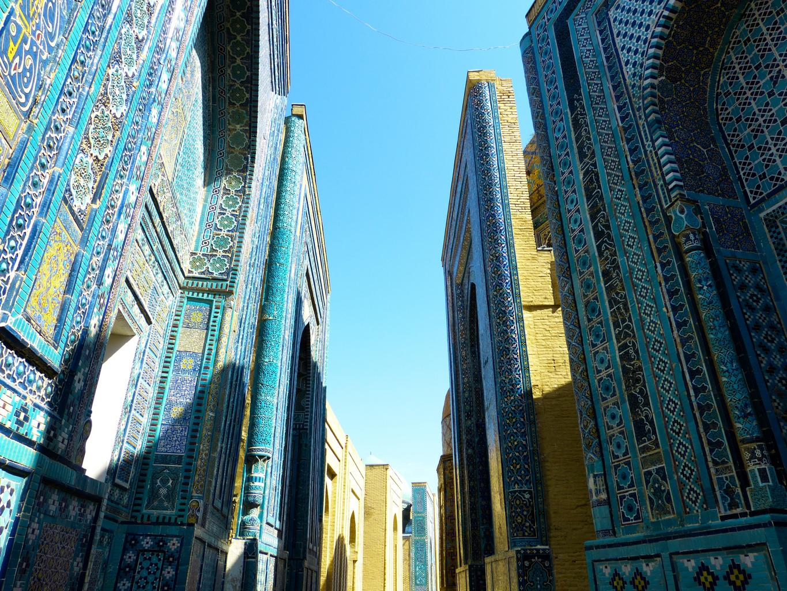

    <h2 class="section-title">{}</h2>
    <ul class="rule-list">
        <li>No hay Street View oficial, por lo que aún no aparece en GeoGuessr.</li>
        <li>El dominio del país es .uz.</li>
    </ul>

{}
{}
{}
Las mezquitas y madrasas lucen las famosas baldosas azul turquesa conocidas como “Samarkand Blue”{}{}.
{}

{}
En muchas ventanas, arcos y puertas se emplean tonos azul claro{}. Los patios suelen quedar ocultos tras altos muros, por lo que no se ven desde la calle{}.
{}

Por <a href="//commons.wikimedia.org/wiki/User:Ymblanter" title="User:Ymblanter">Ymblanter</a> - Obra propia, <a href="https://creativecommons.org/licenses/by-sa/4.0" title="Creative Commons Attribution-Share Alike 4.0">CC BY-SA 4.0</a>, <a href="https://commons.wikimedia.org/w/index.php?curid=98801499">enlace</a>

{}
{}
