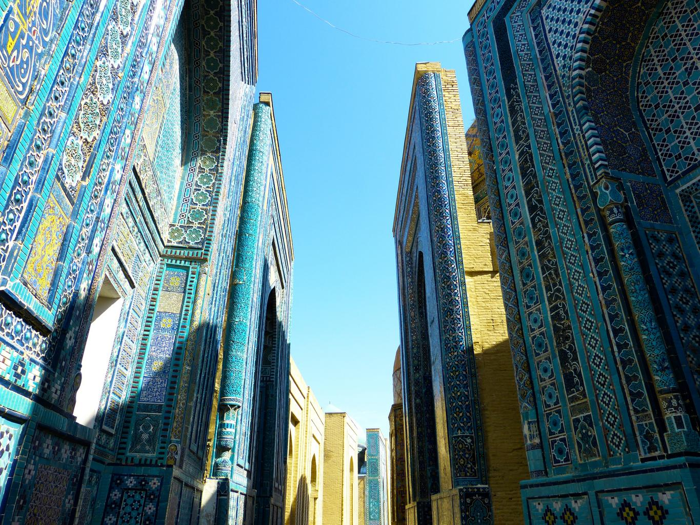

    <h2 class="section-title">{}</h2>
    <ul class="rule-list">
        <li>現在公式のストリートビューが無くGeoguessrでは出題されない</li>
        <li>ドメインは.uz</li>
    </ul>

{}
{}
{}
サマルカンド・ブルーと呼ばれる鮮やかな青色タイルで作られた建築物が見つかる{}{}。
{}

{}
窓・カーテン・扉に水色や青色が使われていることが多い気がする{}。庭は高い塀の内側にあり、通りから見通すことはできない{}。
{}

By <a href="//commons.wikimedia.org/wiki/User:Ymblanter" title="User:Ymblanter">Ymblanter</a> - Own work, <a href="https://creativecommons.org/licenses/by-sa/4.0" title="Creative Commons Attribution-Share Alike 4.0">CC BY-SA 4.0</a>, <a href="https://commons.wikimedia.org/w/index.php?curid=98801499">Link</a>

{}
{}