

    <h2 class="section-title">{}</h2>
    <ul class="rule-list">
        <li>ドメインは.vn</li>
        <li>道路は右側通行</li>
        <li>赤い国旗が掲揚されている</li>
        <li>標識のポールが赤白のストライプになっている</li>
        <li>赤白のボラードがある</li>
    </ul>

{}
{}
{}
家の前や通りに赤い国旗が掲揚されている{}。道路は右側通行</li>だ。
{}

By trungydang, <a href="https://creativecommons.org/licenses/by/3.0" title="Creative Commons Attribution 3.0">CC BY 3.0</a>, <a href="https://commons.wikimedia.org/w/index.php?curid=60015169">Link</a>

{}
ベトナム語はラテン文字で構成されている{}ため、{}や{}との見分けは難しくない。
{}

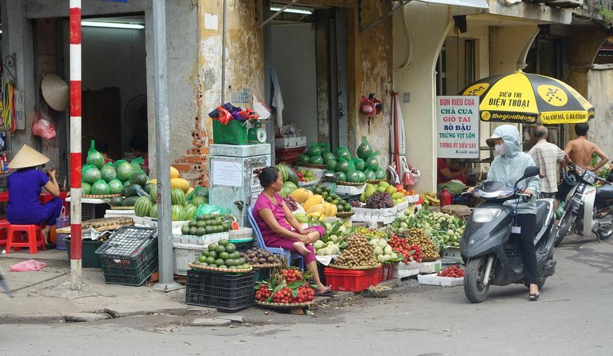

{}
赤白のボラードがある{}。また、標識のポールが赤白のストライプになっている{}。
{}

By <a href="//commons.wikimedia.org/w/index.php?title=User:Y_Kpia_Mlo&amp;amp;action=edit&amp;amp;redlink=1" class="new" title="User:Y Kpia Mlo (page does not exist)">Y Kpia Mlo</a> - Own work, <a href="https://creativecommons.org/licenses/by-sa/3.0" title="Creative Commons Attribution-Share Alike 3.0">CC BY-SA 3.0</a>, <a href="https://commons.wikimedia.org/w/index.php?curid=10847824">Link</a>

{}
円筒状の普通の電柱の他に、穴の開いた電柱が見つかる{}。
{}

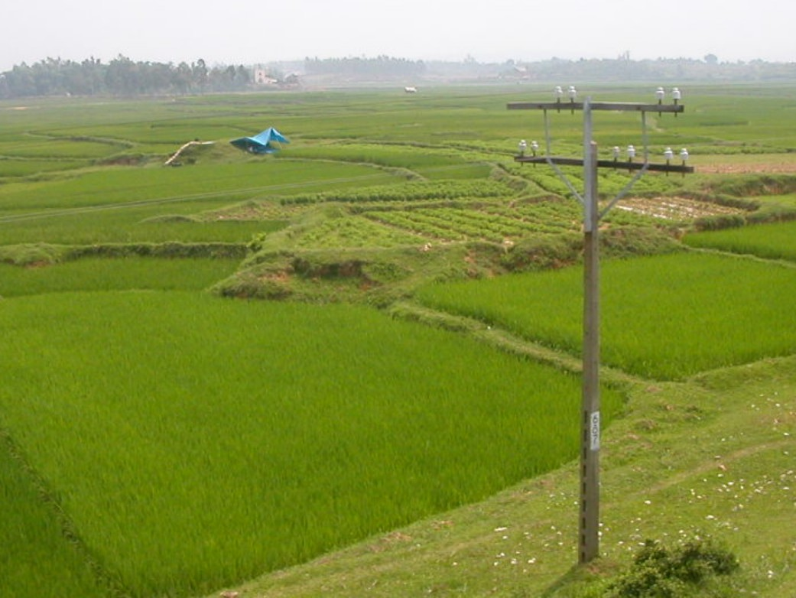

{}
{}

    <h2 class="section-title">{}</h2>
    <h4 class="section-title">地形</h4>
    <ul class="rule-list">
        <li>国境付近には山脈が伸びており、メコン川流域は平坦な平野になっている</li>
        <li>北部と中部の特定のエリアではカルスト地形が広がっている
            <ul>
                <li>Bố Trạch県（中部）{}</li>
                <li>Sơn La省（北部）{}</li>
                <li>Bắc Kạn省（北部）{}</li>
            </ul>
        </li>
        <li>メコンデルタと紅河デルタでは農業と漁業が盛んで水路が細かく広がっている
            <ul>
                <li>メコンデルタ{}</li>
                <li>紅河デルタ{}</li>
            </ul>
        </li>
        <li>テイグイエンとよばれる標高700m前後の高原が中央に広がっている。コーヒーや胡椒の産地。</li>
    </ul>

{}
{}
{}
国境沿いにアンナン山脈が伸びている。
{}

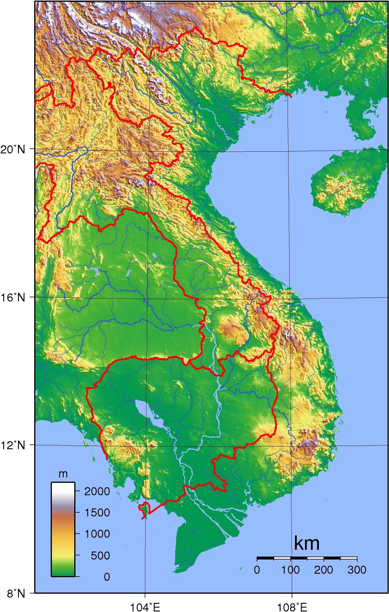

{}
{}
{}
以下の黒いエリアにはカルスト地形が広がっていると思われる{}。下の写真のような不規則に尖った小さな山が多く見つかる。
{}

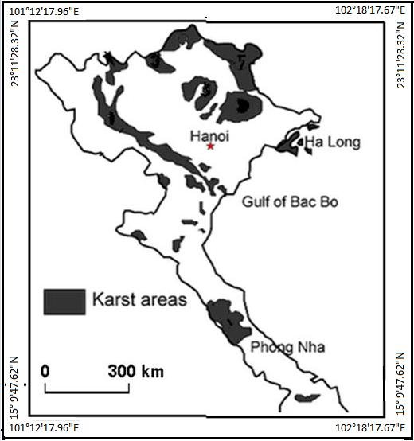

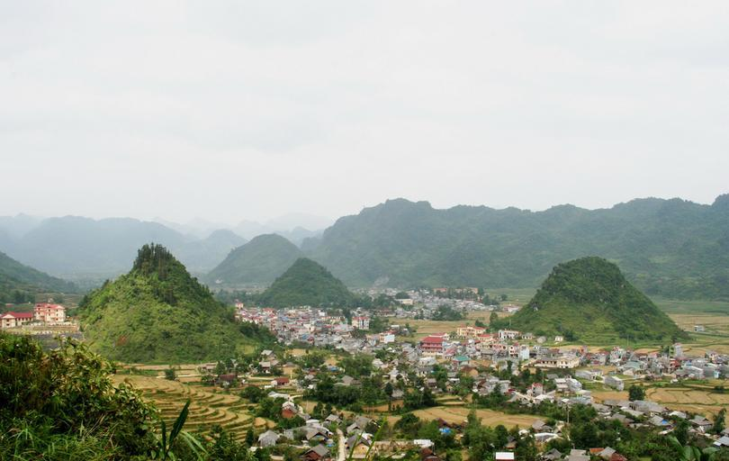

{}
{}
{}
水路が網の目のように広がっており、小さい橋もしばしば見かける{}。地盤の関係か、Mỹ Tho市より西側のメコンデルタには鉄道は一切存在せずバスや河川運輸がメインの交通手段となっている。ほとんどの水路の周りは木やヤシが生えている{}。鉄の欄干がある橋＋木の生い茂った水路＋逆▽の電柱で確定できる（例{}）？。
{}

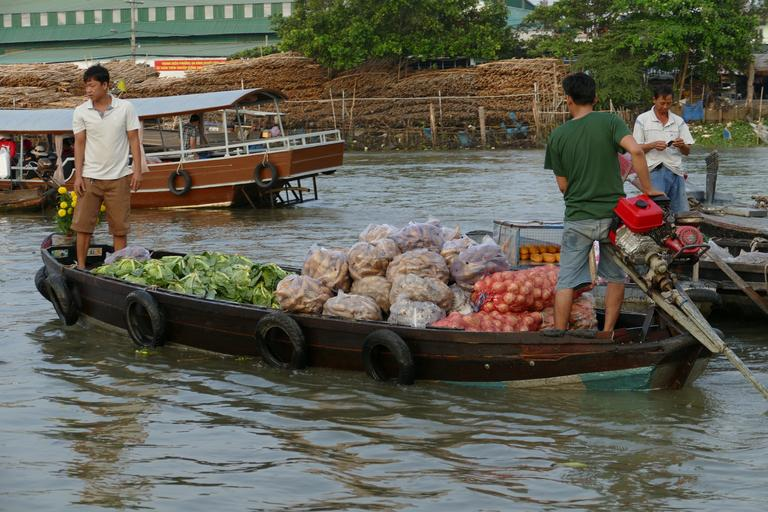

{}
{}
{}
メコンデルタと同様に三角州には水田と水路が広がる{}。国内で最も人口密度の高い地域。水路のちかくは木がそこまで多く生えていない{}。
{}

By An Nguyễn Hải, <a href="https://creativecommons.org/licenses/by-sa/3.0" title="Creative Commons Attribution-Share Alike 3.0">CC BY-SA 3.0</a>, <a href="https://commons.wikimedia.org/w/index.php?curid=60550416">Link</a>

{}
{}
{}
メコンデルタのような細かい水路網はなく{}、コーヒーやキャベツといったいろいろな農作物の栽培地となっている{{% ref "https://de.wikipedia.org/wiki/T%C3%A2y_Nguy%C3%AAn" "Tây Nguyên" %}}。
{}

By <a href="//commons.wikimedia.org/w/index.php?title=User:DXLINH&amp;action=edit&amp;redlink=1" class="new" title="User:DXLINH (page does not exist)">DXLINH</a> - Own work, <a href="https://creativecommons.org/licenses/by-sa/3.0" title="Creative Commons Attribution-Share Alike 3.0">CC BY-SA 3.0</a>, <a href="https://commons.wikimedia.org/w/index.php?curid=3777906">Link</a>

{}
{}

    <h4 class="section-title">建物</h4>
    <ul class="rule-list">
        <li>店の看板などに割と住所が書いてある</li>
        <li>地域ごとに配電を担当する業者が異なり、電柱や装置もそれに伴って異なる可能性がある{}
            <ul>
                <li>EVN NPC(北部)：上部まで穴が空いた電柱{}（かなり確実に北部）</li>
                <li>EVN CPC(中部)：『山+△』の形{}</li>
                <li>EVN SPC(南部)：『山+▽』の形{}、平行して低い電柱（光ファイバー線）も並んで立っていることが多い{}
                    <ul>
                        <li>『山+▽』の▽の下がとがっていない場合{}や上部まで穴が空いた電柱がある場合{}は北部の紅河デルタを考えてみる</li>
                    <ul>
                </li>
            </ul>
        </li>
    </ul>

{}
{}
{}
2025年に大規模な再編があり6中央直轄市57省を統廃合して6市28省となる予定なので、Google Map上では表示が変わる可能性がある点に注意。下のマップは再編前の地図（拡大して確認してください）。
{}

Public Domain, <a href="https://commons.wikimedia.org/w/index.php?curid=168696994">Link</a>

{}
{}
{}
末尾ほど大きな地区名となる{}（ただし大都市の場合は都市・省名をスキップしている場合あり）。画像は Đống Đa 地区の Khâm Thiên 区と読み取ることができる。
{}

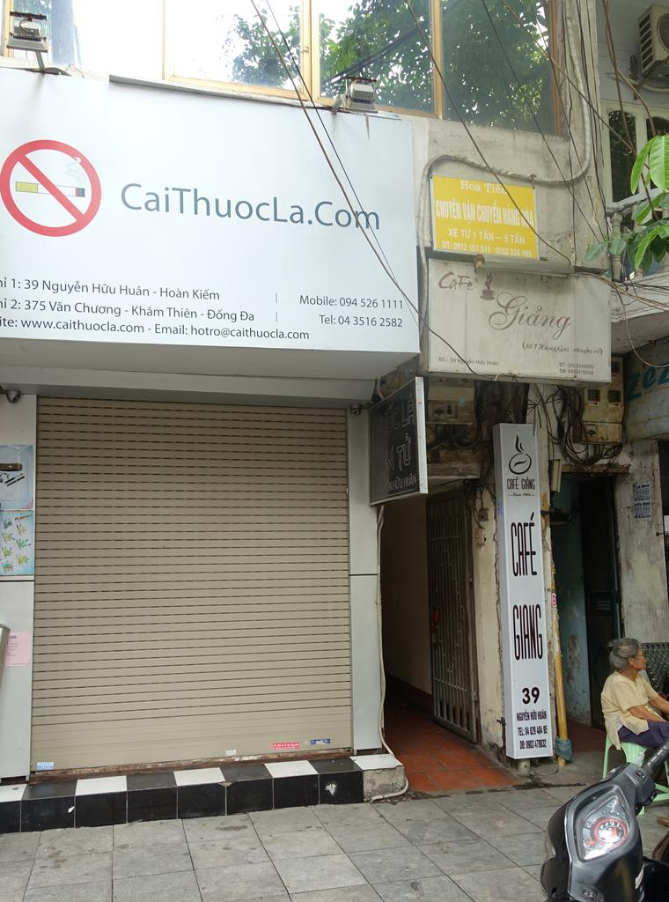

{}
{}
{}
国営の電力会社が地域ごとの配電を担当しており、電柱などのインフラが異なるかもしれない{}。
{}

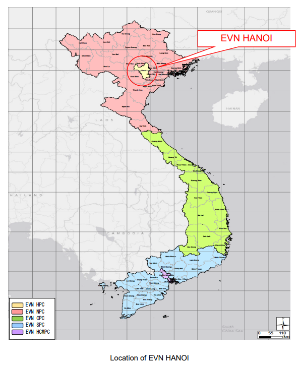

{}
{}

    <h4 class="section-title">農業</h4>
    <ul class="rule-list">
        <li>田んぼは南部のメコンデルタに多く分布する
            <ul>
                <li>メコンデルタ{}</li>
                <li>紅河デルタ{}</li>
                <li>北部の山間部では棚田が見つかる{}</li>
            </ul>
        </li>
        <li>内陸ではゴムのプランテーションが多く見つかる
            <ul>
                <li>Gia Lai省{}</li>
                <li>Tây Ninh省{}、衛星写真から大規模なプランテーションが見える</li>
                <li>Bình Dương省{}</li>
            </ul>
        </li>
        <li>北部と中部の山岳地帯には茶畑が分布している
            <ul>
                <li>Phu Tho省{}</li>
                <li>Cao Bằng省{}</li>
                <li>Lâm Đồng省、生産は多いがストリートビューが通っている地域が少ないかも
            </ul>
        </li>
        <li>コーヒーの生産はテイグイエン周辺の省が多い{}
            <ul>
                <li>Đắk Nông省{}</li>
            </ul>
        </li>
        <li>こしょう
            <ul>
                <li>Đắk Nông省{}</li>
                <li>Đắk Lắk省{}</li>
            </ul>
        </li>
        <li>Quảng Nam・Quảng Ngãi・ビンディンなど中部ではアカシアのプランテーションがたまに見つかる
            <ul>
                <li>Quảng Nam省{}</li>
                <li>Quảng Ngãi省{}</li>
                <li>Bình Định省{}</li>
            </ul>
        </li>
    </ul>

{}
{}
{}
メコン川流域が生産の半分超を占めている{}が、北部の平野にもある程度存在する{}。紅河デルタもメコンデルタよりエリアは小さいが田んぼが多くある{}。
{}

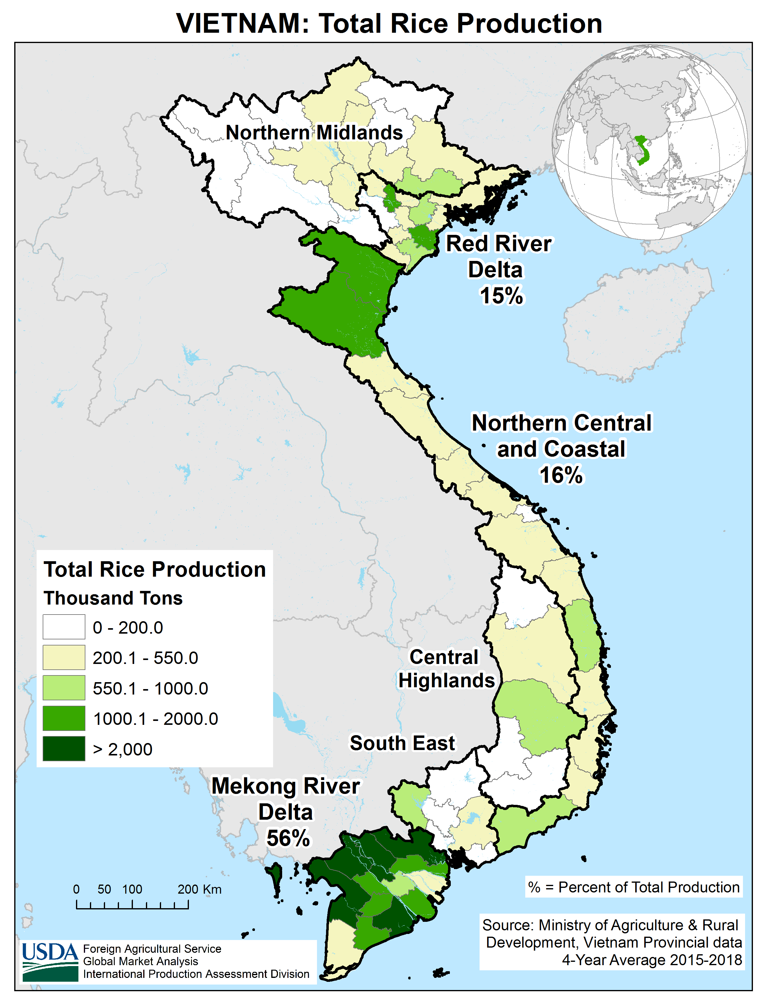

{}
{}
{}
生産量は多くないものの山間部の農業は茶と米が中心であり、棚田を見つけることができる{}{{% ref "https://vi.wikipedia.org/wiki/Ngh%C4%A9a_L%E1%BB%99_(x%C3%A3),_Ngh%C4%A9a_L%E1%BB%99" "Nghĩa Lộ (xã), Nghĩa Lộ" %}}。
{}

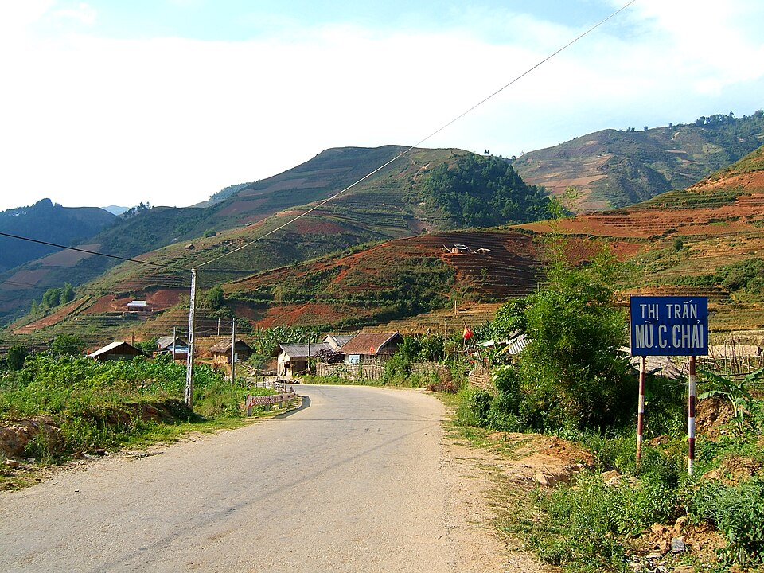

{}
{}
{}
内陸ではゴムのプランテーションが多く見つかる{}。記録によるとGia Lai省とTây Ninh省の周りが多い{}が、出典によって若干分布が異なる。
{}

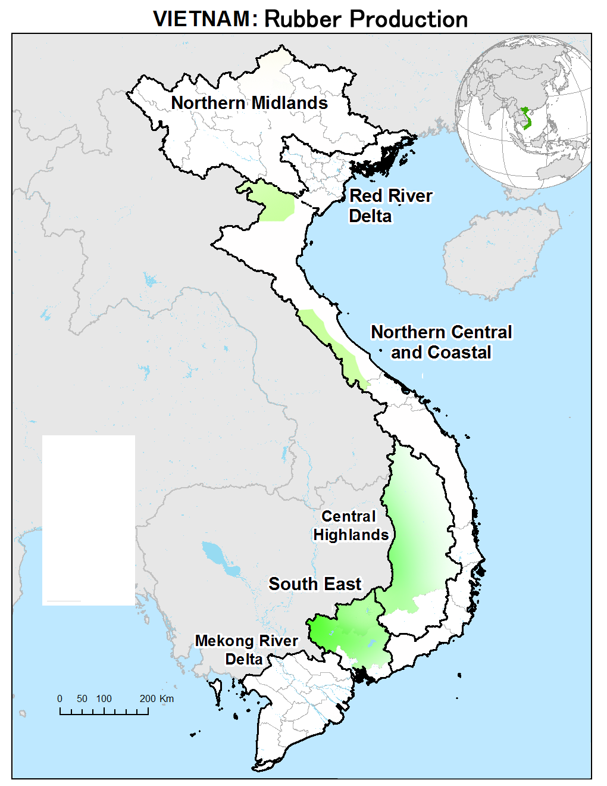

{}
{}
{}
山岳地帯の一部ではお茶畑が分布している{}{}。
{}

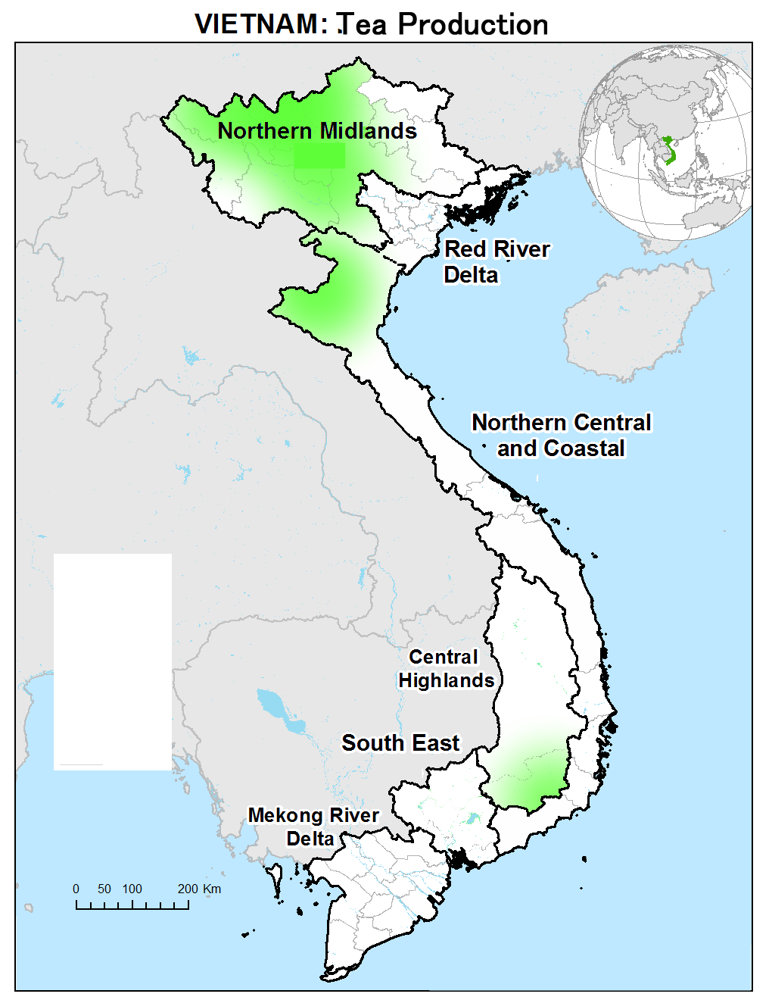

{}
{}
{}5
標高が少し高い地域ではコーヒーの生産が盛ん{}{}。
{}

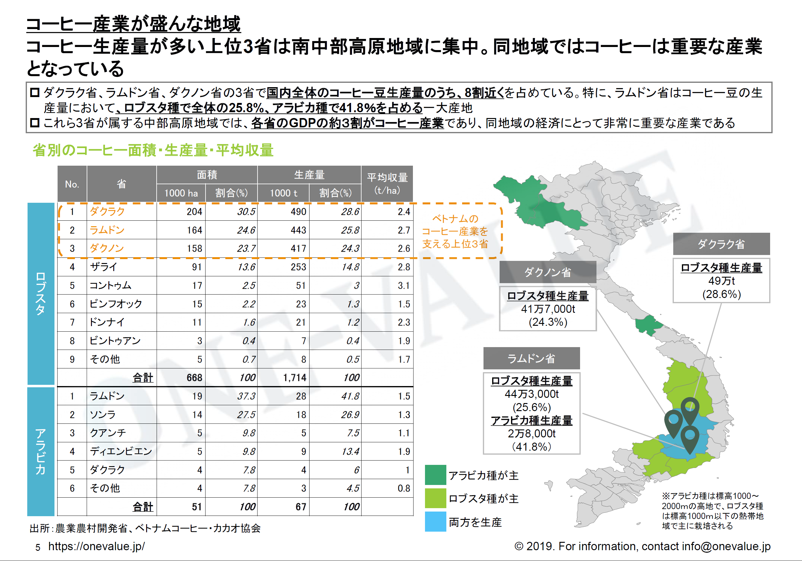

{}
{}
{}
詳しい分布は不明だが、コーヒーと近い分布であり北部にはほぼ存在しないという{}。
{}

By <a href="//commons.wikimedia.org/wiki/User:Tonbi_ko" title="User:Tonbi ko">Tonbi ko</a> - Own work, <a href="https://creativecommons.org/licenses/by-sa/4.0" title="Creative Commons Attribution-Share Alike 4.0">CC BY-SA 4.0</a>, <a href="https://commons.wikimedia.org/w/index.php?curid=40786447">Link</a>

{}
{}
{}
中部ではベトナム政府が30年前に実施した大規模な植林プロジェクトの影響でアカシアの植林地が見つかる{}。アカシア栽培面積は世界最大でありフローリングの材料として重要な素材。
{}

{}
{}

    <h2 class="section-title">{}</h2>
    <ul class="rule-list">
        <li>都市ごとのロゴが通り名についていることがあり、都市が判断できる</li>
        <li>ĐT651沿いはリゾート地であり道路わきにも白い砂浜が広がっている</li>
        <li>ハロン湾には沈水カルスト地形が広がっている</li>
    </ul>

{}
{}
{}
都市ごとのロゴが通り名についていることがあり、都市が判断できる。画像はハノイ市{{% ref "https://ja.wikipedia.org/wiki/%E3%83%8F%E3%83%8E%E3%82%A4" "ハノイ" %}}。
{}

By <a rel="nofollow" class="external text" href="https://www.flickr.com/people/41894171246@N01">Nam-ho Park</a> - <a href="//commons.wikimedia.org/wiki/Flickr" class="mw-redirect" title="Flickr">Flickr</a>: <a rel="nofollow" class="external text" href="https://www.flickr.com/photos/41894171246@N01/3390169458">IMG_5176</a>, <a href="https://creativecommons.org/licenses/by/2.0" title="Creative Commons Attribution 2.0">CC BY 2.0</a>, <a href="https://commons.wikimedia.org/w/index.php?curid=17514899">Link</a>

<blockquote class="reddit-embed-bq" style="height:500px" data-embed-height="718"><a href="https://www.reddit.com/r/geoguessr/comments/wjvrpe/i_know_vietnam_isnt_common_but_here_are_some/">I know Vietnam isn't common, but here are some symbols to look out for.</a>  by<a href="https://www.reddit.com/user/Analbaby1/">u/Analbaby1</a> in<a href="https://www.reddit.com/r/geoguessr/">geoguessr</a></blockquote>

{}
{}
{}
道路わきに白い砂浜が広がっている{}
{}

{}
{}
{}
海沿いの道は必ずしも多くないものの、海沿いには石灰岩の岩峰が屹立するカルスト地形が沈水することでできた珍しい地形が広がっている{}{}。
{}

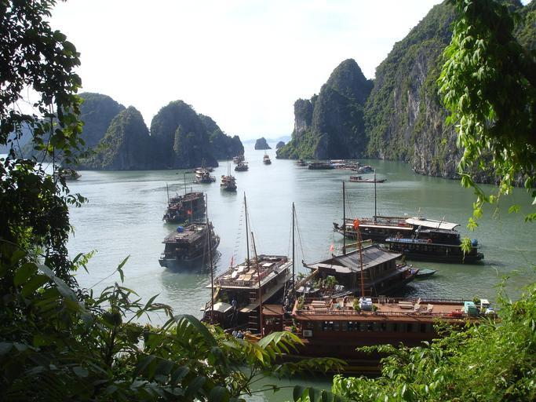

{}
{}

    <ul class="rule-list">
        <li>Phú Quốc島というカンボジア側の離島にもカバレッジがある</li>
        <li>Móng Cáiは中国との貿易が盛んな都市であり北京語や広東語の話者もいる</li>
    </ul>

{}
{}
{}
最南部に離島がある。未舗装の赤い土の道路{}か中央に大き目の分離帯がある4車線の道{}が多い。
{}

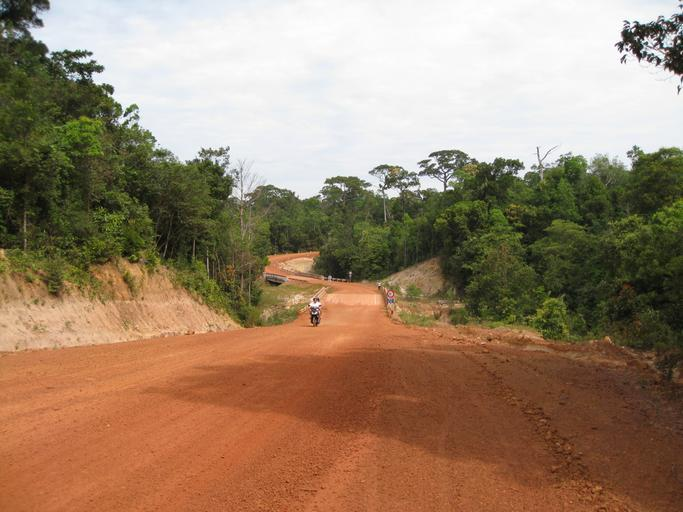

{}
{}
{}
中国系の言語の表記や免税店が見つかる{}。ただ、看板にたいてい住所も書いてあるのでそれを見た方が早い。
{}

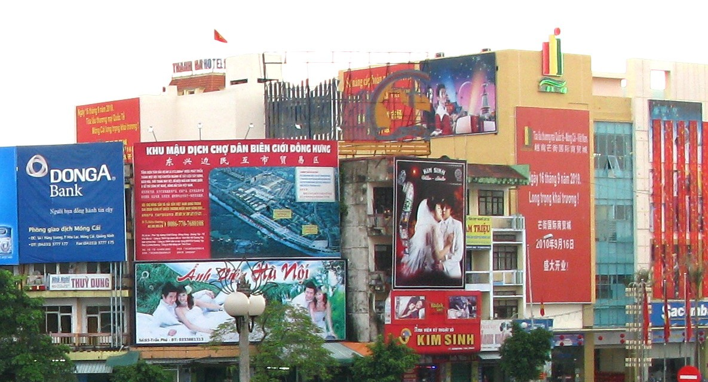

{}
{}