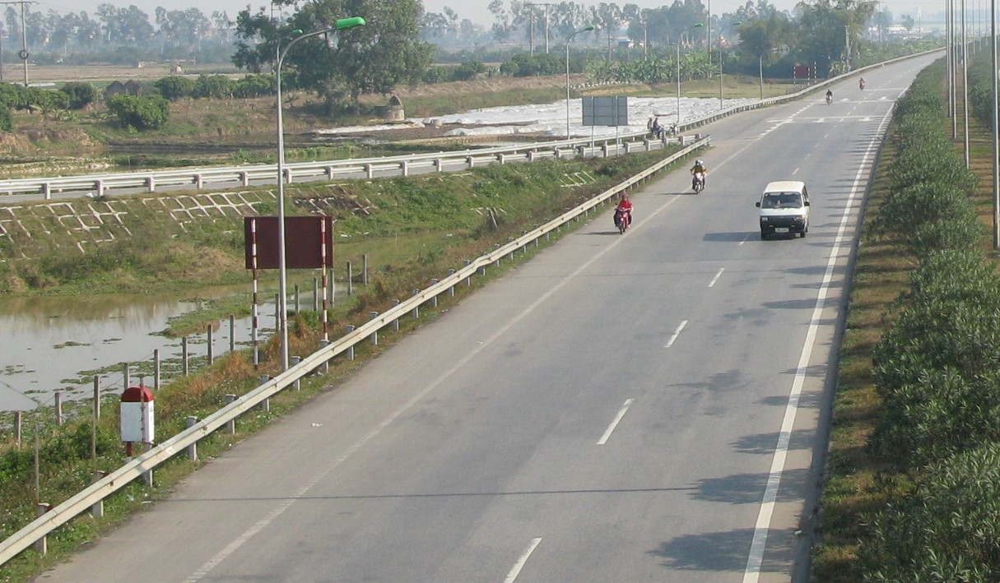

    <h2 class="section-title">{}</h2>
    <ul class="rule-list">
        <li style="font-weight:bold;">現在公式のストリートビューが無くGeoguessrでは出題されない</li>
        <li>ドメインは.vn</li>
        <li>道路は右側通行</li>
        <li>標識のポールが赤白のストライプになっている</li>
        <li>赤白のボラードがある</li>
        <li>Vinamilk{{% by "https://ja.wikipedia.org/wiki/%E3%83%93%E3%83%8A%E3%83%9F%E3%83%AB%E3%82%AF" "wiki" "ビナミルク" %}}が売られている</li>
    </ul>

{}
{}
{}
標識のポールが赤白のストライプになっている{}。道路は右側通行</li>だ。
{}

{}
ベトナム語はラテン文字で構成されているため、{}や{}との見分けは難しくない。
{}

{}
赤白のボラードがある{}
{}

By <a href="//commons.wikimedia.org/w/index.php?title=User:Y_Kpia_Mlo&amp;amp;action=edit&amp;amp;redlink=1" class="new" title="User:Y Kpia Mlo (page does not exist)">Y Kpia Mlo</a> - Own work, <a href="https://creativecommons.org/licenses/by-sa/3.0" title="Creative Commons Attribution-Share Alike 3.0">CC BY-SA 3.0</a>, <a href="https://commons.wikimedia.org/w/index.php?curid=10847824">Link</a>

{}
参考映像
{}

<iframe width="560" height="315" src="https://www.youtube.com/embed/MxzOykG9MQg?si=o6alWcD2iXPBjq5R" title="YouTube video player" frameborder="0" allow="accelerometer; autoplay; clipboard-write; encrypted-media; gyroscope; picture-in-picture; web-share" referrerpolicy="strict-origin-when-cross-origin" allowfullscreen></iframe>

{}
{}