

    <h2 class="section-title">{}</h2>
    <ul class="rule-list">
        <li>言語はスペイン語</li>
        <li>ドメインは.ar</li>
        <li>ナンバープレートはモザイクがかかった時に真ん中が黒っぽくなる</li>
        <li>ガソリンスタンドにアルゼンチンの国有石油会社であるYPFの青色のロゴがある</li>
        <li>Google Carが黒色{}</li>
    </ul>
    {}
    {}

{}
{}
{}
ナンバープレートはモザイクがかかった時に真ん中が黒っぽくなる{}。
{}

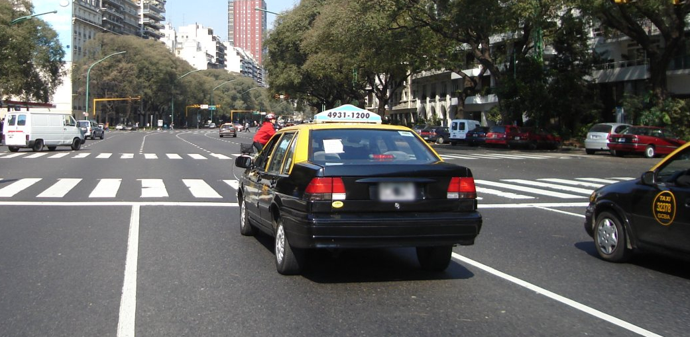

{}

By Quilmeño89 - Own work, <a href="https://creativecommons.org/licenses/by-sa/4.0/deed.ja">CC BY-SA 4.0</a>, <a href="https://commons.wikimedia.org/w/index.php?curid=41806860">Wikimedia Commons</a>
{}

{}
2016年以降に撮影されたものは黒ナンバーでない可能性がある{}。南米南部共同市場に加盟している国では青色のナンバープレートが共通してみられる{}。
{}

{}
Google Carが黒色{}の時がある。南米でGoogle Carが黒色なのはアルゼンチン・{}・{}が多い。
{}

<iframe src="https://www.google.com/maps/embed?pb=!4v1690704372717!6m8!1m7!1s1hpbawvlNEnp5cZVoWQckw!2m2!1d-49.63118633707697!2d-69.44449948838371!3f120.31252016988394!4f-31.67891953122966!5f2.8590369400489437" width="600" height="400" style="border:0;" allowfullscreen="" loading="lazy" referrerpolicy="no-referrer-when-downgrade"></iframe>

{}
アルゼンチンや{}にありそうな通り名看板。
{}

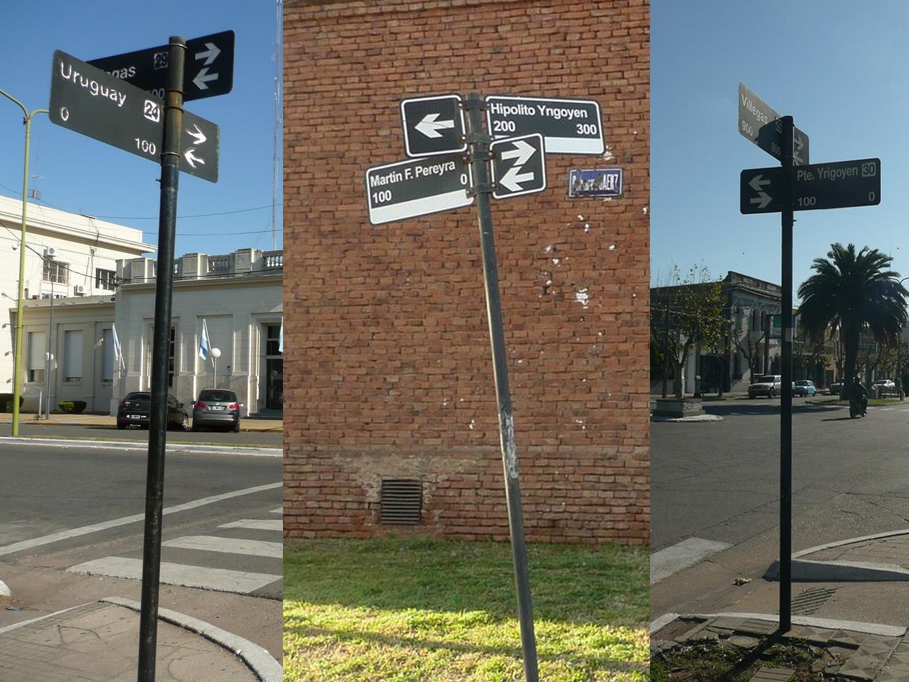

{}
道端に道路番号が書かれた小さい看板があるかも{}。
{}

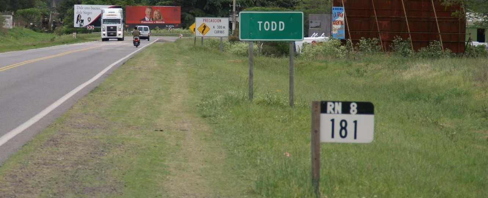

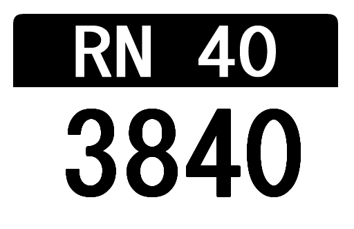

{}
アルゼンチン内で多くのシェール油田を保有するYPF（ヤシミエントス・ペトロリフェロス・フィスカレス）のガソリンスタンド。青い看板{}やドラム缶{}が目印。
{}

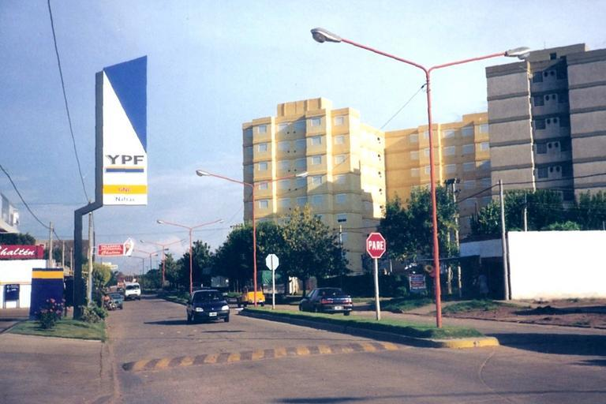

{}
{}
{}
アルゼンチンで見ることができる電柱。穴あき電柱{}やオーストラリアっぽい電柱も稀にある。
{}

<iframe src="https://www.google.com/maps/embed?pb=!4v1686861875714!6m8!1m7!1s4hRqrWRh-yXvwGuSRXTBYQ!2m2!1d-26.74627600416227!2d-65.16441350002685!3f313.3235749790858!4f32.468871465170395!5f3.325193203789971" width="295" height="295" style="border:0;" allowfullscreen="" loading="lazy" referrerpolicy="no-referrer-when-downgrade"></iframe>
<iframe src="https://www.google.com/maps/embed?pb=!4v1681307974607!6m8!1m7!1sk3pg6PtzLZk7rDk7nRqPcQ!2m2!1d-35.78649077446561!2d-63.71380972493835!3f183.62173532592433!4f5.182801860182508!5f3.325193203789971" width="295" height="295" style="border:0;" allowfullscreen="" loading="lazy" referrerpolicy="no-referrer-when-downgrade"></iframe>
<iframe src="https://www.google.com/maps/embed?pb=!4v1681308058546!6m8!1m7!1sErkQhnNig6YCAMr4HYd5IQ!2m2!1d-35.78495773091147!2d-63.7145655930146!3f261.2328437577821!4f11.558862341190277!5f1.7438225313974298" width="295" height="295" style="border:0;" allowfullscreen="" loading="lazy" referrerpolicy="no-referrer-when-downgrade"></iframe>
<iframe src="https://www.google.com/maps/embed?pb=!4v1683132354977!6m8!1m7!1sBvVHim4tKcmaLtg6z1YIGw!2m2!1d-40.8067417265152!2d-63.00686275203125!3f101.81726267490271!4f9.368904176268913!5f3.268473291118386" width="295" height="295" style="border:0;" allowfullscreen="" loading="lazy" referrerpolicy="no-referrer-when-downgrade"></iframe>
<iframe src="https://www.google.com/maps/embed?pb=!4v1683132408446!6m8!1m7!1s75g06zhiTRZMluuTaK0vlQ!2m2!1d-49.30554394571375!2d-67.73377208631163!3f277.39150996678796!4f18.30409245034636!5f3.325193203789971" width="295" height="295" style="border:0;" allowfullscreen="" loading="lazy" referrerpolicy="no-referrer-when-downgrade"></iframe>

{}
{}

<iframe src="https://www.google.com/maps/embed?pb=!4v1679243916537!6m8!1m7!1skXH0ZX2YufIDFeblQjT7lg!2m2!1d-34.61168366232381!2d-58.39474927434688!3f173.2486401138486!4f-20.419799619250938!5f2.9561148475182564" width="295" height="295" style="border:0;" allowfullscreen="" loading="lazy" referrerpolicy="no-referrer-when-downgrade"></iframe>

{}
{}

    <h2 class="section-title">{}</h2>
    <ul class="rule-list">
        <li>アルゼンチンの最も北東の角と最も北西の角はブラジルっぽい</li>
        <li>最も農業が盛んな地域はCordoba州</li>
    </ul>

{}
{}

By <a href="//commons.wikimedia.org/w/index.php?title=User:Someone83&amp;amp;action=edit&amp;amp;redlink=1" class="new" title="User:Someone83 (page does not exist)">Someone83</a> - Own work, <a href="https://creativecommons.org/licenses/by-sa/4.0" title="Creative Commons Attribution-Share Alike 4.0">CC BY-SA 4.0</a>, <a href="https://commons.wikimedia.org/w/index.php?curid=4560348">Link</a>

{}
{}

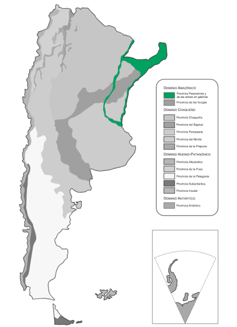

<iframe src="https://www.google.com/maps/embed?pb=!4v1688026210276!6m8!1m7!1syVGw6km5sYPb2ZoI-NmLNA!2m2!1d-22.19959572732366!2d-63.65727912927424!3f266.3008796403948!4f0.3376384477199821!5f0.7820865974627469" width="295" height="295" style="border:0;" allowfullscreen="" loading="lazy" referrerpolicy="no-referrer-when-downgrade"></iframe>
<iframe src="https://www.google.com/maps/embed?pb=!4v1688026231569!6m8!1m7!1srf2TnRyJlxILs8ceAblHfQ!2m2!1d-27.01061822806514!2d-54.52182362922331!3f244.9897857196307!4f2.6680916931539542!5f0.7820865974627469" width="295" height="295" style="border:0;" allowfullscreen="" loading="lazy" referrerpolicy="no-referrer-when-downgrade"></iframe>

{}
{}

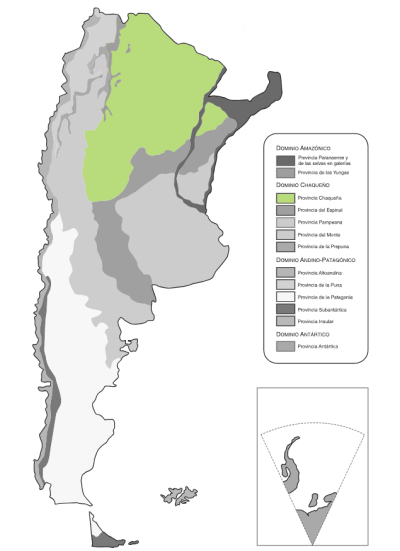

<iframe src="https://www.google.com/maps/embed?pb=!4v1695475196557!6m8!1m7!1suWa8hF8lmQblkExdc1Ky8Q!2m2!1d-24.09681080488632!2d-61.45661006359634!3f126.26750005653528!4f5.704118236355768!5f0.7820865974627469" width="295" height="295" style="border:0;" allowfullscreen="" loading="lazy" referrerpolicy="no-referrer-when-downgrade"></iframe>
<iframe src="https://www.google.com/maps/embed?pb=!4v1695475157315!6m8!1m7!1sx-j2NIOt19LcJEL6ZSboVQ!2m2!1d-29.34660581743527!2d-62.43280514858617!3f317.90422036742865!4f8.260574035554725!5f0.7820865974627469" width="295" height="295" style="border:0;" allowfullscreen="" loading="lazy" referrerpolicy="no-referrer-when-downgrade"></iframe>

{}
{}

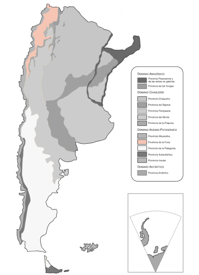

<iframe src="https://www.google.com/maps/embed?pb=!4v1695475442860!6m8!1m7!1st8VQzqEZyN6rNG9fYYFjWg!2m2!1d-22.03299319359667!2d-65.97434696450324!3f298.222961832195!4f1.0039284252522407!5f0.4000000000000002" width="295" height="295" style="border:0;" allowfullscreen="" loading="lazy" referrerpolicy="no-referrer-when-downgrade"></iframe>
<iframe src="https://www.google.com/maps/embed?pb=!4v1695475495018!6m8!1m7!1s4F0Y8wkDOgmTLM3wxCL5qA!2m2!1d-23.39978561081391!2d-66.36767999875447!3f187.1212325368053!4f13.349579303691144!5f0.7820865974627469" width="295" height="295" style="border:0;" allowfullscreen="" loading="lazy" referrerpolicy="no-referrer-when-downgrade"></iframe>

{}
{}

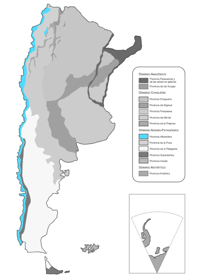

<iframe src="https://www.google.com/maps/embed?pb=!4v1695475608668!6m8!1m7!1scWvLMaBf-LC5CVh4WUqPlA!2m2!1d-39.60571822989126!2d-71.38286578206605!3f61.01008167757068!4f10.466885624953122!5f0.4000000000000002" width="295" height="295" style="border:0;" allowfullscreen="" loading="lazy" referrerpolicy="no-referrer-when-downgrade"></iframe>
<iframe src="https://www.google.com/maps/embed?pb=!4v1695475670183!6m8!1m7!1sQ_5nVnavQaIRRsSdSJWA1A!2m2!1d-49.9134308419014!2d-72.73941443319791!3f271.38269978778465!4f2.527335192403129!5f0.7820865974627469" width="295" height="295" style="border:0;" allowfullscreen="" loading="lazy" referrerpolicy="no-referrer-when-downgrade"></iframe>

{}
{}

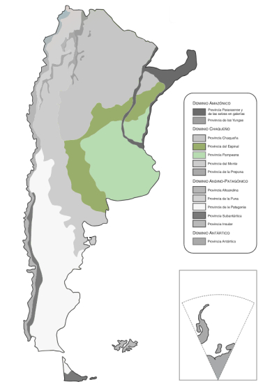

<iframe src="https://www.google.com/maps/embed?pb=!4v1695475831091!6m8!1m7!1sx0zBpq6GGsFwDc6dgrQYuA!2m2!1d-38.7166518222373!2d-61.19218644166997!3f265.54400651548406!4f5.961209459531432!5f0.7820865974627469" width="295" height="295" style="border:0;" allowfullscreen="" loading="lazy" referrerpolicy="no-referrer-when-downgrade"></iframe>
<iframe src="https://www.google.com/maps/embed?pb=!4v1695475870506!6m8!1m7!1syWPo8CFFGSshcFtSKwBT0g!2m2!1d-34.38072972397562!2d-60.01292180428341!3f288.91771789593065!4f4.38912086817065!5f0.7820865974627469" width="295" height="295" style="border:0;" allowfullscreen="" loading="lazy" referrerpolicy="no-referrer-when-downgrade"></iframe>

{}
{}

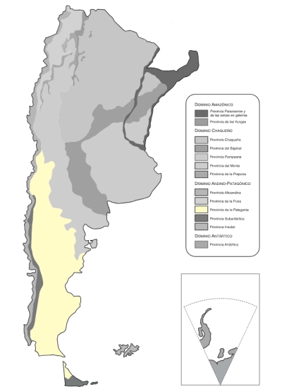

<iframe src="https://www.google.com/maps/embed?pb=!4v1695475732528!6m8!1m7!1s7S-uHmT6vqNnZKu6sMS3tw!2m2!1d-48.86692615804154!2d-70.90883213540693!3f55.47476742623165!4f11.350618516393695!5f0.7820865974627469" width="295" height="295" style="border:0;" allowfullscreen="" loading="lazy" referrerpolicy="no-referrer-when-downgrade"></iframe>
<iframe src="https://www.google.com/maps/embed?pb=!4v1695475702606!6m8!1m7!1sIMXlMnzorgVfFb-RydDBOw!2m2!1d-50.28256326664331!2d-69.16584827063312!3f222.00459833535876!4f10.728831160398471!5f0.7820865974627469" width="295" height="295" style="border:0;" allowfullscreen="" loading="lazy" referrerpolicy="no-referrer-when-downgrade"></iframe>

{}
{}

{}以下はコーンが生産されている地域のマップ{}

{}
{}

    <h2 class="section-title">{}</h2>
    <ul class="rule-list">
        <li>アルゼンチンの最南端にBiblioteca Península Haushという図書館がある</li>
        <li>ブエノスアイレスで「GCBA（Gobierno de la Ciudad de Buenos Aires＝ブエノスアイレス市政府？）」と書かれた紺色と黄色のタクシーが走っている{}
            <ul>
                <li>一覧が{}ので他はそれを見る</li>
            </ul>
        </li>
    </ul>

{}
{}
{}外すと大ダメージ確定なので景色だけ覚えておく{}。2022年時点では周辺には隠者が数人住んでいるだけらしい{}。{}

<iframe width="560" height="315" src="https://www.youtube.com/embed/0iQ6CiRKCmA?si=4t_OQOspdeiDqH73&amp;start=726" title="YouTube video player" frameborder="0" allow="accelerometer; autoplay; clipboard-write; encrypted-media; gyroscope; picture-in-picture; web-share" referrerpolicy="strict-origin-when-cross-origin" allowfullscreen></iframe>

{}
{}

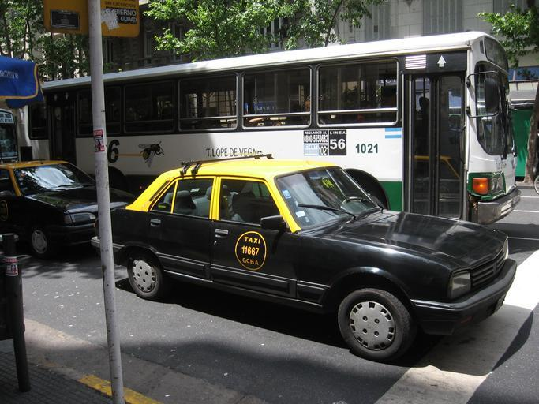

{}
{}

    <h4 class="mb-4">代表的な企業の説明</h4>
    <table class="table table-striped table-bordered">
        <thead class="table-light">
            <tr>
                <th scope="col" class="col-width-2">企業名</th>
                <th scope="col" class="col-width-1">コード</th>
                <th scope="col" class="col-width-6">説明</th>
                <th scope="col" class="col-width-05">決算</th>
                <th scope="col" class="col-width-05">配当履歴</th>
            </tr>
        </thead>
        <tbody class="corp-desc">
            <tr>
                <td>Yacimientos Petroliferos Fiscales(YPF)</td>
                <td>{}</td>
                <td>アルゼンチンの国有石油会社。</td>
                <td>{}</td>
                <td>{}</td>
            </tr>
            <tr>
                <td>Loma Negra</td>
                <td>{}</td>
                <td>アルゼンチン最大のセメント・コンクリート製造業者。</td>
                <td>{}</td>
                <td>{}</td>
            </tr>
            <tr>
                <td>Grupo Financiero Galicia</td>
                <td>{}</td>
                <td>アルゼンチン最大の民間商用銀行。国内銀行業ではおそらく5番目の規模。</td>
                <td>{}</td>
                <td>{}</td>
            </tr>
        </tbody>
    </table>

