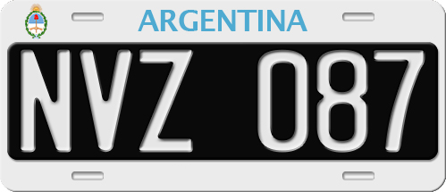

    <h2 class="section-title">{}</h2>
    <ul class="rule-list">
        <li>言語はスペイン語</li>
        <li>ドメインは.ar</li>
        <li>ナンバープレートはモザイクがかかった時に真ん中が黒っぽくなる</li>
        <li>ガソリンスタンドにYPF（ヤシミエントス・ペトロリフェロス・フィスカレス、青色のロゴでアルゼンチンの国有石油会社）のものがある</li>
        <li>遠くが見えないくらいまっすぐな道が多い</li>
    </ul>

{}
{}
{}
ナンバープレートはモザイクがかかった時に真ん中が黒っぽくなる。
{}

<iframe src="https://www.google.com/maps/embed?pb=!4v1681051978952!6m8!1m7!1soZxpXPspMb6iOXVTNGkt9w!2m2!1d-24.18440598366025!2d-65.30833899932463!3f180.20830277081086!4f-7.987064287665206!5f3.325193203789971" width="295" height="295" style="border:0;" allowfullscreen="" loading="lazy" referrerpolicy="no-referrer-when-downgrade"></iframe>
<iframe src="https://www.google.com/maps/embed?pb=!4v1679243916537!6m8!1m7!1skXH0ZX2YufIDFeblQjT7lg!2m2!1d-34.61168366232381!2d-58.39474927434688!3f173.2486401138486!4f-20.419799619250938!5f2.9561148475182564" width="295" height="295" style="border:0;" allowfullscreen="" loading="lazy" referrerpolicy="no-referrer-when-downgrade"></iframe>

{}

By Quilmeño89 - Own work, CC BY-SA 4.0, https://commons.wikimedia.org/w/index.php?curid=41806860
{}

{}
アルゼンチン内で多くのシェール油田を保有するYPF（ヤシミエントス・ペトロリフェロス・フィスカレス）のガソリンスタンド。名前が長すぎて逆に覚えられるかも。
{}

<iframe src="https://www.google.com/maps/embed?pb=!4v1681051942452!6m8!1m7!1soZxpXPspMb6iOXVTNGkt9w!2m2!1d-24.18440598366025!2d-65.30833899932463!3f305.54814078943605!4f10.80630977906469!5f3.325193203789971" width="295" height="295" style="border:0;" allowfullscreen="" loading="lazy" referrerpolicy="no-referrer-when-downgrade"></iframe>
<iframe src="https://www.google.com/maps/embed?pb=!4v1679244135665!6m8!1m7!1s31HwtGkcb8i-reXo5SdIMw!2m2!1d-34.58693112431686!2d-58.37221917961278!3f259.8517612996338!4f11.104060482651036!5f0.7820865974627469" width="295" height="295" style="border:0;" allowfullscreen="" loading="lazy" referrerpolicy="no-referrer-when-downgrade"></iframe>

{}
まっすぐな道
{}

<iframe src="https://www.google.com/maps/embed?pb=!4v1681308145769!6m8!1m7!1sfApCKRpDOKXqeTUlkpjXYw!2m2!1d-37.00094192414552!2d-63.66678962361176!3f173.36811843486183!4f-7.40867201815955!5f0.7929884876831526" width="191" height="450" style="border:0;" allowfullscreen="" loading="lazy" referrerpolicy="no-referrer-when-downgrade"></iframe>
<iframe src="https://www.google.com/maps/embed?pb=!4v1681308183021!6m8!1m7!1sREC5Fn_ht3PkmGxBwWswqw!2m2!1d-43.48679060841175!2d-65.41795612087964!3f208.14761246508428!4f-2.1900262014030147!5f0.4000000000000002" width="191" height="450" style="border:0;" allowfullscreen="" loading="lazy" referrerpolicy="no-referrer-when-downgrade"></iframe>
<iframe src="https://www.google.com/maps/embed?pb=!4v1681308263098!6m8!1m7!1sREC5Fn_ht3PkmGxBwWswqw!2m2!1d-43.48679060841175!2d-65.41795612087964!3f32.98842378837944!4f-4.975349512993489!5f1.3228429615490531" width="191" height="450" style="border:0;" allowfullscreen="" loading="lazy" referrerpolicy="no-referrer-when-downgrade"></iframe>

{}
{}

{}
上
{}

<iframe src="https://www.google.com/maps/embed?pb=!4v1681307974607!6m8!1m7!1sk3pg6PtzLZk7rDk7nRqPcQ!2m2!1d-35.78649077446561!2d-63.71380972493835!3f183.62173532592433!4f5.182801860182508!5f3.325193203789971" width="295" height="295" style="border:0;" allowfullscreen="" loading="lazy" referrerpolicy="no-referrer-when-downgrade"></iframe>
<iframe src="https://www.google.com/maps/embed?pb=!4v1681308102802!6m8!1m7!1sfApCKRpDOKXqeTUlkpjXYw!2m2!1d-37.00094192414552!2d-63.66678962361176!3f15.588290753224085!4f3.632810557579191!5f3.325193203789971" width="295" height="295" style="border:0;" allowfullscreen="" loading="lazy" referrerpolicy="no-referrer-when-downgrade"></iframe>

<iframe src="https://www.google.com/maps/embed?pb=!4v1681308058546!6m8!1m7!1sErkQhnNig6YCAMr4HYd5IQ!2m2!1d-35.78495773091147!2d-63.7145655930146!3f261.2328437577821!4f11.558862341190277!5f1.7438225313974298" width="295" height="295" style="border:0;" allowfullscreen="" loading="lazy" referrerpolicy="no-referrer-when-downgrade"></iframe>
<iframe src="https://www.google.com/maps/embed?pb=!4v1681300058879!6m8!1m7!1sFDXwAgbDbsuahLrHCYG6Hw!2m2!1d-35.78893243795982!2d-63.71259992644372!3f190.54967400534534!4f-9.973109350019143!5f3.324656374180121" width="295" height="295" style="border:0;" allowfullscreen="" loading="lazy" referrerpolicy="no-referrer-when-downgrade"></iframe>
<iframe src="https://www.google.com/maps/embed?pb=!4v1679243304194!6m8!1m7!1shWuhk2-R4aDvj4hjeUfY3w!2m2!1d-38.71909109560899!2d-62.2653046444285!3f88.68167530712972!4f-6.3520060640904035!5f2.8919908027706724" width="295" height="295" style="border:0;" allowfullscreen="" loading="lazy" referrerpolicy="no-referrer-when-downgrade"></iframe>

{}
{}

<iframe src="https://www.google.com/maps/embed?pb=!4v1679243916537!6m8!1m7!1skXH0ZX2YufIDFeblQjT7lg!2m2!1d-34.61168366232381!2d-58.39474927434688!3f173.2486401138486!4f-20.419799619250938!5f2.9561148475182564" width="295" height="295" style="border:0;" allowfullscreen="" loading="lazy" referrerpolicy="no-referrer-when-downgrade"></iframe>

{}
{}

<iframe src="https://www.google.com/maps/embed?pb=!4v1680529064474!6m8!1m7!1saPMvKgCc9OmM5HAXoPwLNA!2m2!1d-53.77122290856554!2d-67.71722495908014!3f324.8442442724678!4f-16.01627294364232!5f3.325193203789971" width="295" height="295" style="border:0;" allowfullscreen="" loading="lazy" referrerpolicy="no-referrer-when-downgrade"></iframe>
<iframe src="https://www.google.com/maps/embed?pb=!4v1680529286306!6m8!1m7!1sE9P-HF05ZiHXeqvV678Zvg!2m2!1d-53.76913621437513!2d-67.71755235315504!3f91.44711067428264!4f-10.417192332125452!5f2.9292566646559166" width="295" height="295" style="border:0;" allowfullscreen="" loading="lazy" referrerpolicy="no-referrer-when-downgrade"></iframe>

{}
{}

<iframe src="https://www.google.com/maps/embed?pb=!4v1679244135665!6m8!1m7!1s31HwtGkcb8i-reXo5SdIMw!2m2!1d-34.58693112431686!2d-58.37221917961278!3f259.8517612996338!4f11.104060482651036!5f0.7820865974627469" width="295" height="295" style="border:0;" allowfullscreen="" loading="lazy" referrerpolicy="no-referrer-when-downgrade"></iframe>
<iframe src="https://www.google.com/maps/embed?pb=!4v1679244259499!6m8!1m7!1s7YOnLDg-9zIPrUYAi_cOGw!2m2!1d-34.65176397847728!2d-58.50271265420312!3f266.7517338860435!4f2.96974439297459!5f3.0364993777746148" width="295" height="295" style="border:0;" allowfullscreen="" loading="lazy" referrerpolicy="no-referrer-when-downgrade"></iframe>

{}
{}
