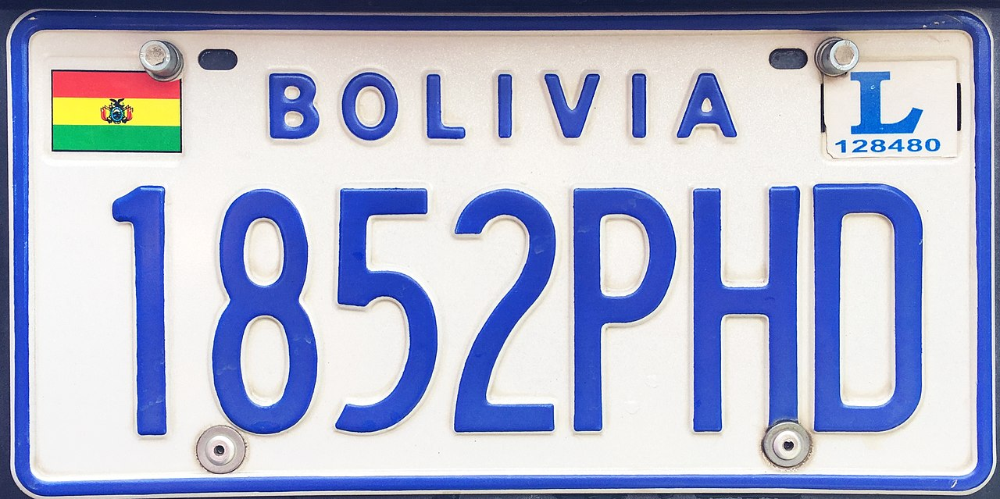
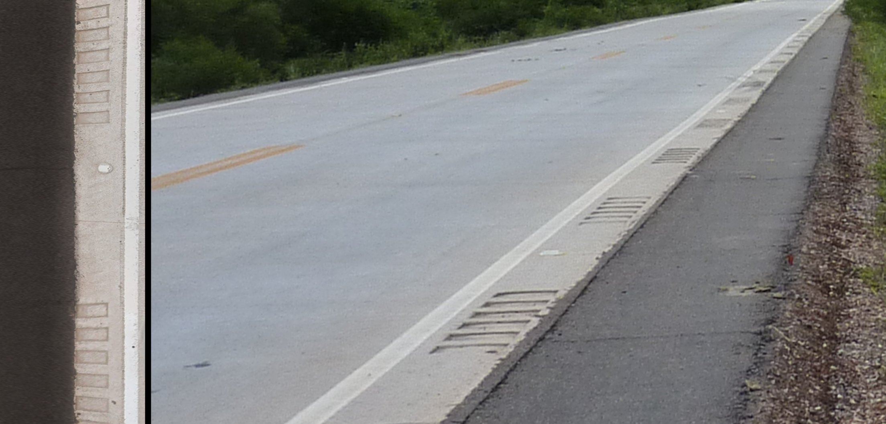

    <h2 class="section-title">{}</h2>
    <ul class="rule-list">
        <li>ドメインは.bo</li>
        <li>標識を立てる棒が四角い製材（？）のようなぱっと見でよくわからない素材でできている。ペルーは標識の棒が白黒のストライプの時が多い。</li>
        <li>ボリビアは木造住宅がほとんどなくレンガとセメントでできている</li>
        <li>ほとんどの車はナンバープレートがうっすらと青色に見える</li>
    </ul>
    {}

{}
{}
{}
ボリビアは木造住宅がほとんどなく、レンガとセメントでできている。ただし色が違う地域や建物がほぼ無い地域もある。
{}

{}
標識の棒が木（いつも四角い？）でできていることが多い{}。
{}

<iframe src="https://www.google.com/maps/embed?pb=!4v1692146804574!6m8!1m7!1s3zEEQWLDevyVIy_djhbT1g!2m2!1d-17.84582091422054!2d-60.7186226828565!3f103.57525907010798!4f-3.6784987817571846!5f3.325193203789971" width="295" height="295" style="border:0;" allowfullscreen="" loading="lazy" referrerpolicy="no-referrer-when-downgrade"></iframe>
<iframe src="https://www.google.com/maps/embed?pb=!4v1692146694686!6m8!1m7!1sXnzEf7FrmX1a05VCjdNm1g!2m2!1d-20.13407612568305!2d-66.30037406860966!3f107.86431653858813!4f-5.540462812632825!5f1.7957222405339484" width="295" height="295" style="border:0;" allowfullscreen="" loading="lazy" referrerpolicy="no-referrer-when-downgrade"></iframe>

{}
ほとんどの車はナンバープレートが白色かうっすらと青色に見える。
{}

{}

By EEJCC - Own work, <a href="https://creativecommons.org/licenses/by-sa/4.0/deed.ja">CC BY-SA 4.0</a>, <a href="https://commons.wikimedia.org/w/index.php?curid=61768590">Wikimedia Commons(Link)</a>
{}

{}
{}
{}
左がボリビア、右がペルー。
{}

<iframe src="https://www.google.com/maps/embed?pb=!4v1683845680428!6m8!1m7!1s5-gox7x0_EYAeGhOt4aHYw!2m2!1d-16.51322100294571!2d-68.15693131501548!3f348.0640235857518!4f50.037343677761186!5f1.7414182948674855" width="295" height="295"style="border:0;" allowfullscreen="" loading="lazy" referrerpolicy="no-referrer-when-downgrade"></iframe>
<iframe src="https://www.google.com/maps/embed?pb=!4v1683845709482!6m8!1m7!1saQoGq6TQk0KqXWkmlYQbXg!2m2!1d-18.01084314474321!2d-70.24990259977868!3f319.222788507541!4f14.222415822223638!5f3.325193203789971" width="295" height="295"style="border:0;" allowfullscreen="" loading="lazy" referrerpolicy="no-referrer-when-downgrade"></iframe>

{}
{}

<iframe src="https://www.google.com/maps/embed?pb=!4v1679683485088!6m8!1m7!1sNG6sO-1cHTa0GlS_2uJneA!2m2!1d-16.53816045576946!2d-68.160514917469!3f216.51915282146342!4f5.2207183296746535!5f3.0914199858140696" width="295" height="295" style="border:0;" allowfullscreen="" loading="lazy" referrerpolicy="no-referrer-when-downgrade"></iframe>
<iframe src="https://www.google.com/maps/embed?pb=!4v1679480359158!6m8!1m7!1sAGAD5R6_7G-M_4yNGRDstw!2m2!1d-17.74191350835184!2d-63.15618182467038!3f81.55340430449235!4f1.8284055251925935!5f3.0954258680931925" width="295" height="295" style="border:0;" allowfullscreen="" loading="lazy" referrerpolicy="no-referrer-when-downgrade"></iframe>

{}
{}

<iframe src="https://www.google.com/maps/embed?pb=!4v1690950653550!6m8!1m7!1sMKAfnNhiu5MErBEOWy6iVg!2m2!1d-18.22299960360435!2d-67.46592076207261!3f254.55778961686912!4f-14.860009177622445!5f3.325193203789971"width="295" height="295" style="border:0;" allowfullscreen="" loading="lazy" referrerpolicy="no-referrer-when-downgrade"></iframe>
<iframe src="https://www.google.com/maps/embed?pb=!4v1692146912222!6m8!1m7!1sMIgZCqzzVPLJPdyeyCfodg!2m2!1d-18.04905447549599!2d-67.18229814475399!3f241.00829859732468!4f-1.6955006042338425!5f3.1283258822188063" width="295" height="295" style="border:0;" allowfullscreen="" loading="lazy" referrerpolicy="no-referrer-when-downgrade"></iframe>

{}
{}

<iframe src="https://www.google.com/maps/embed?pb=!4v1681109923932!6m8!1m7!1s1Ce8WameoVUd_Et1o5fVzw!2m2!1d-16.54057404768015!2d-68.15979677760222!3f292.75122118350356!4f-22.155410825187232!5f3.325193203789971" width="295" height="295" style="border:0;" allowfullscreen="" loading="lazy" referrerpolicy="no-referrer-when-downgrade"></iframe>

{}
{}

    <h2 class="section-title">{}</h2>
    <ul class="rule-list">
        <li>RN4道路のサンタ・クルスの東側の道路は舗装が特徴的</li>
        <li>RN6・RN9道路の舗装も近いRN4に近い景色で、赤と白のボラード・路側帯付近に反射板がある</li>
        <li>標高が低い場所は家の壁にセメントで色を付ける文化があるらしい（<a href="https://trip-s.world/bolivia-house">出典</a>）</li>
        <li>標高が高いほどシンプルなレンガ造りが多い</li>
        <li>木が無くて周りが山で家がまばらだとチチカカ湖付近かも{}</li>
    </ul>

{}
{}
{}
範囲はかなり狭いけれど何回か出て毎回どこかわからなかったのでメモ{}。Ruta 12も景色は異なるけれど似たような舗装{}。
{}

By <a rel="nofollow" class="external text" href="https://www.flickr.com/people/8105696@N05">Jim McIntosh</a> - <a href="//commons.wikimedia.org/wiki/Flickr" class="mw-redirect" title="Flickr">Flickr</a>: <a rel="nofollow" class="external text" href="https://www.flickr.com/photos/8105696@N05/4510284037">On the Road from Puerto Suarez to SCZ</a>, <a href="https://creativecommons.org/licenses/by/2.0" title="Creative Commons Attribution 2.0">CC BY 2.0</a>, <a href="https://commons.wikimedia.org/w/index.php?curid=12622550">Link</a>, 加工あり

{}
{}

{}
ボリビアのラパス周辺とは全く違った景色なので注意。赤と白のボラード・路側帯付近に反射板・中央線はオレンジ{}。
{}

By <a href="//commons.wikimedia.org/wiki/User:Grullab" title="User:Grullab">Grullab</a> - Own work, <a href="https://creativecommons.org/licenses/by-sa/4.0" title="Creative Commons Attribution-Share Alike 4.0">CC BY-SA 4.0</a>, <a href="https://commons.wikimedia.org/w/index.php?curid=99513764">Link</a>

{}
{}

<iframe src="https://www.google.com/maps/embed?pb=!4v1679813951600!6m8!1m7!1sQJGqwFtDGPzUKSqwJ1QVQA!2m2!1d-17.77139549244364!2d-63.11097934771753!3f253.7606520157439!4f-10.953950473285772!5f1.6485012874313432" width="295" height="295" style="border:0;" allowfullscreen="" loading="lazy" referrerpolicy="no-referrer-when-downgrade"></iframe>
<iframe src="https://www.google.com/maps/embed?pb=!4v1679814081593!6m8!1m7!1sZQr3C-bNtD-rL_lC2hXnSg!2m2!1d-17.79584406502019!2d-63.17419938666396!3f116.44482324171602!4f-8.400050107833763!5f0.7820865974627469" width="295" height="295" style="border:0;" allowfullscreen="" loading="lazy" referrerpolicy="no-referrer-when-downgrade"></iframe>

{}
{}

<iframe src="https://www.google.com/maps/embed?pb=!4v1681046598224!6m8!1m7!1s-hLLISV3sspOi0imUwUtTQ!2m2!1d-19.58438204900572!2d-65.74568086085463!3f23.825621356209467!4f-5.491415703211672!5f0.7820865974627469" width="295" height="295" style="border:0;" allowfullscreen="" loading="lazy" referrerpolicy="no-referrer-when-downgrade"></iframe>
<iframe src="https://www.google.com/maps/embed?pb=!4v1679814032711!6m8!1m7!1sFSki3TR90NUS-SYIVfx1eg!2m2!1d-16.50206580841095!2d-68.19699580026527!3f97.8139935632015!4f1.9383141508718467!5f1.5592948283649846" width="295" height="295" style="border:0;" allowfullscreen="" loading="lazy" referrerpolicy="no-referrer-when-downgrade"></iframe>

{}
{}
{}
{}

<iframe src="https://www.google.com/maps/embed?pb=!4v1680005632153!6m8!1m7!1s_1IeDm7vG92oHcloIaycPw!2m2!1d-16.29897607926427!2d-68.50236327814967!3f0!4f0!5f0.7820865974627469" width="295" height="295" style="border:0;" allowfullscreen="" loading="lazy" referrerpolicy="no-referrer-when-downgrade"></iframe>
<iframe src="https://www.google.com/maps/embed?pb=!4v1681046560295!6m8!1m7!1sVw-4cks2I0ZvMgb4e5KRPQ!2m2!1d-17.07892566464851!2d-68.4636347028358!3f330.9684410577023!4f1.4459819110156502!5f0.7820865974627469" width="295" height="295" style="border:0;" allowfullscreen="" loading="lazy" referrerpolicy="no-referrer-when-downgrade"></iframe>

{}
{}

    <h2 class="section-title">{}</h2>
    <ul class="rule-list">
        <li>スクレの特定地域のみ条例によって壁を白くすることが義務付けられている</li>
        <li>ラパスでは電柱にグレーの服を来た人形（？）が吊られていることがあるが、これは泥棒に対するメッセージらしい（参考：<a href="https://www.ganas.or.jp/20121220bolivia/">『ボリビア・アイマラ族の「泥棒を殺す習慣」、違法とならない理由』</a>）。遠くで少しぼやけていたりモザイクがかかっていたりすると本物の人間に見えるので配信する時は要注意。</li>
        <li>サハマ国立公園ではGoogle Carが見える</li>
        <li>列車の墓場に徒歩で歩く場所がある{}</li>
    </ul>

{}
{}

<iframe src="https://www.google.com/maps/embed?pb=!4v1679814195427!6m8!1m7!1sqVq9ioJYAgRYmFLoRyqkoA!2m2!1d-19.04399405020461!2d-65.26165030496426!3f277.81409401247646!4f-1.528780717322391!5f0.7820865974627469" width="295" height="295" style="border:0;" allowfullscreen="" loading="lazy" referrerpolicy="no-referrer-when-downgrade"></iframe>

{}
{}
{}
{}

<iframe src="https://www.google.com/maps/embed?pb=!4v1681109731885!6m8!1m7!1ssrvcioJMLOUynM77-JzrrQ!2m2!1d-16.53542582994066!2d-68.15984708559827!3f133.39102220908285!4f2.9204123647894704!5f1.9952253012677987" width="295" height="295" style="border:0;" allowfullscreen="" loading="lazy" referrerpolicy="no-referrer-when-downgrade"></iframe>
<iframe src="https://www.google.com/maps/embed?pb=!4v1681109654621!6m8!1m7!1sW3spRtpdkhSJWqhNTC45iw!2m2!1d-16.5362588718002!2d-68.15809312899177!3f291.10751381163004!4f3.214739203112188!5f3.325193203789971" width="295" height="295" style="border:0;" allowfullscreen="" loading="lazy" referrerpolicy="no-referrer-when-downgrade"></iframe>

{}
{}
{}
{}

<iframe src="https://www.google.com/maps/embed?pb=!4v1690950945936!6m8!1m7!1sUvSxlwAciOFl061i6nukRQ!2m2!1d-18.02373946727298!2d-68.86927020749451!3f236.1966662827813!4f-19.410384200029867!5f0.4000000000000002"width="295" height="295" style="border:0;" allowfullscreen="" loading="lazy" referrerpolicy="no-referrer-when-downgrade"></iframe>
<iframe src="https://www.google.com/maps/embed?pb=!4v1690950854463!6m8!1m7!1seBn3MtOB1GrRv29X5zu1Hw!2m2!1d-18.04740964397054!2d-68.93421804302564!3f265.6203827246685!4f-55.52318026121894!5f0.4000000000000002"width="295" height="295" style="border:0;" allowfullscreen="" loading="lazy" referrerpolicy="no-referrer-when-downgrade"></iframe>

{}
{}
{}
{}

<iframe src="https://www.google.com/maps/embed?pb=!4v1690951135822!6m8!1m7!1s1Dp-H-8Zx8WltcIOJAsLnQ!2m2!1d-20.4817219334578!2d-66.83781490586628!3f58.461437537922116!4f-5.574524061122403!5f0.7862468789425522" width="600" height="400" style="border:0;" allowfullscreen="" loading="lazy" referrerpolicy="no-referrer-when-downgrade"></iframe>

{}
{}