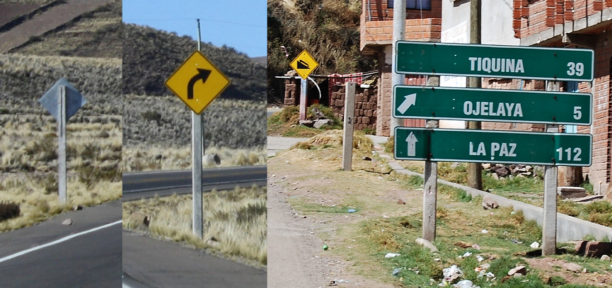
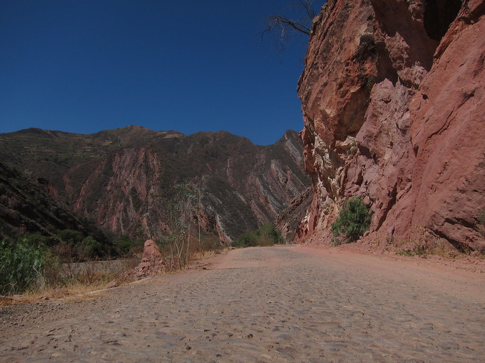
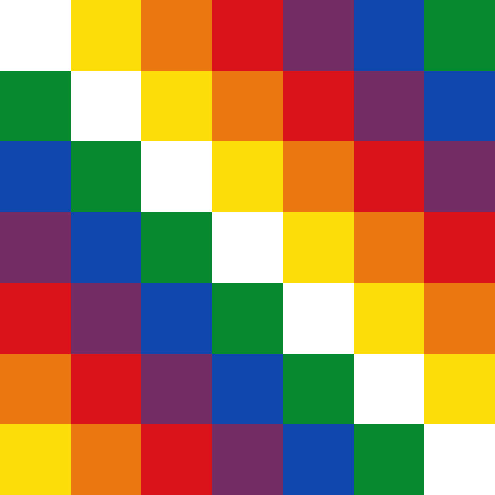
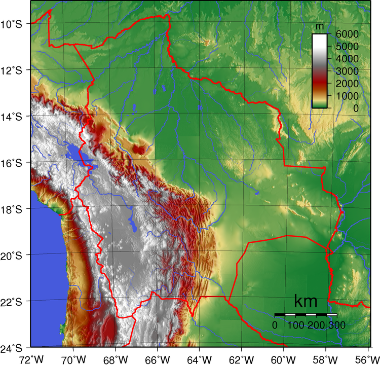
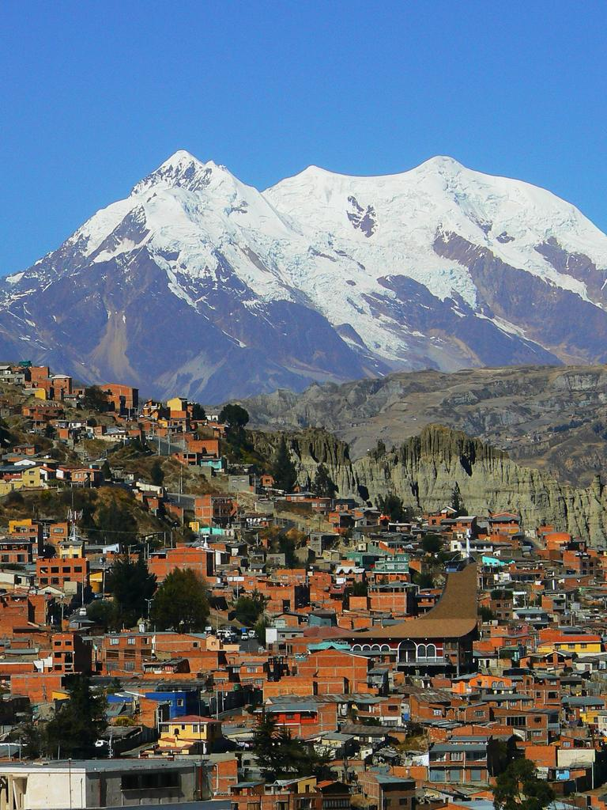
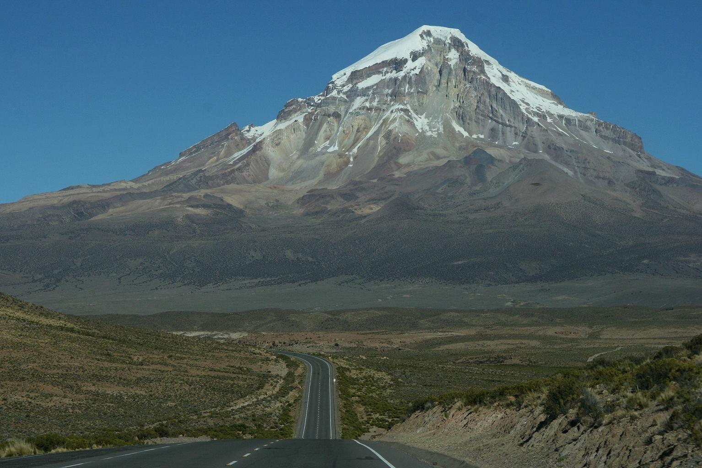
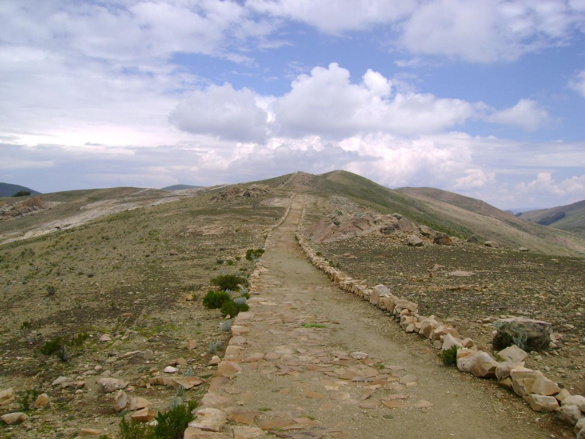
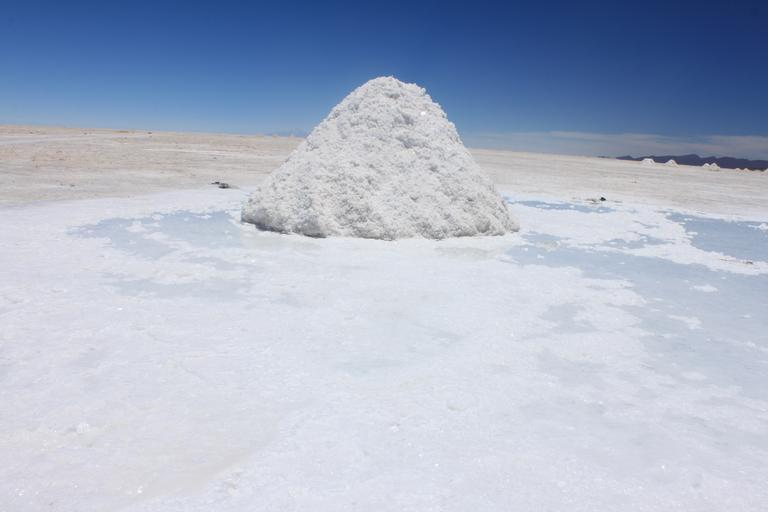

    <h2 class="section-title">{}</h2>
    <ul class="rule-list">
        <li>ドメインは.bo</li>
        <li>標識を立てる棒が四角い製材のようなぱっと見でよくわからない素材でできている</li>
        <li>ボリビアは木造住宅がほとんどなくレンガとセメントでできている</li>
        <li>ほとんどの車はナンバープレートがうっすらと青色に見える</li>
        <li>ウィファラと呼ばれるカラフルな旗がある</li>
    </ul>
    {}

{}
{}
{}
ボリビアは木造住宅がほとんどなく、レンガとセメントでできている{}。ただし色が違う地域や建物がほぼ無い地域もある。
{}

{}
標識の棒が太くて四角い棒でできていることが多い{}。金属製の棒もたまにはある{}。
{}

By Pavel Špindler, <a href="https://creativecommons.org/licenses/by/3.0" title="Creative Commons Attribution 3.0">CC BY 3.0</a>, <a href="https://commons.wikimedia.org/w/index.php?curid=54417023">Link</a>

{}
ほとんどの車はナンバープレートが白色かうっすらと青色に見える{}。
{}

{}

By EEJCC - Own work, <a href="https://creativecommons.org/licenses/by-sa/4.0/deed.ja">CC BY-SA 4.0</a>, <a href="https://commons.wikimedia.org/w/index.php?curid=61768590">Wikimedia Commons(Link)</a>
{}

{}
大きめの石が敷かれた道{}。また、Google Carは常に白い。
{}

{}
ボリビアの社会主義政党の旗のカラーリング（黒・白・青や白・青）が街中で見つかることがあり{}、政党名を省略したMAS IPSPという文字列も見受けられる{}{}。ボリビア国営の通信会社entelの建物も道端でよく見かける{}。ともに似た色なので青・白のペイントがされた建物を見たらボリビアを考えてみる。
{}

{}
{}

{}
ウィファラの旗やロゴがある{}{{% ref "https://ja.wikipedia.org/wiki/%E3%82%A6%E3%82%A3%E3%83%95%E3%82%A1%E3%83%A9" "ウィファラ - Wikimedia" %}}。
{}

{}
{}

<iframe src="https://www.google.com/maps/embed?pb=!4v1690950653550!6m8!1m7!1sMKAfnNhiu5MErBEOWy6iVg!2m2!1d-18.22299960360435!2d-67.46592076207261!3f254.55778961686912!4f-14.860009177622445!5f3.325193203789971"width="295" height="295" style="border:0;" allowfullscreen="" loading="lazy" referrerpolicy="no-referrer-when-downgrade"></iframe>
<iframe src="https://www.google.com/maps/embed?pb=!4v1692146912222!6m8!1m7!1sMIgZCqzzVPLJPdyeyCfodg!2m2!1d-18.04905447549599!2d-67.18229814475399!3f241.00829859732468!4f-1.6955006042338425!5f3.1283258822188063" width="295" height="295" style="border:0;" allowfullscreen="" loading="lazy" referrerpolicy="no-referrer-when-downgrade"></iframe>

{}
{}
{}
ボリビアの大手通信会社で、道を歩いているとわりと定期的にある建物{}。
{}

{}
Yacimientos Petrolíferos Fiscales Bolivianos (YPFB) は資源の探索と生産をするボリビア最大級の企業{}。よく見るとたまにひし形のロゴが見つかる{}。
{}

{}
{}

    <h2 class="section-title">{}</h2>
    <ul class="rule-list">
        <li>西ほど標高が高く、東は平地が広がっている</li>
        <li>標高が低い場所は家の壁にセメントで色を付ける文化があるらしい（<a href="https://trip-s.world/bolivia-house">出典</a>）</li>
        <li>標高が高いほどシンプルなレンガ造りが多い</li>
        <li>木が無くて周りが山で家がまばらだとチチカカ湖付近かも{}</li>
    </ul>

{}
{}

{}
{}

<iframe src="https://www.google.com/maps/embed?pb=!4v1679813951600!6m8!1m7!1sQJGqwFtDGPzUKSqwJ1QVQA!2m2!1d-17.77139549244364!2d-63.11097934771753!3f253.7606520157439!4f-10.953950473285772!5f1.6485012874313432" width="295" height="295" style="border:0;" allowfullscreen="" loading="lazy" referrerpolicy="no-referrer-when-downgrade"></iframe>
<iframe src="https://www.google.com/maps/embed?pb=!4v1679814081593!6m8!1m7!1sZQr3C-bNtD-rL_lC2hXnSg!2m2!1d-17.79584406502019!2d-63.17419938666396!3f116.44482324171602!4f-8.400050107833763!5f0.7820865974627469" width="295" height="295" style="border:0;" allowfullscreen="" loading="lazy" referrerpolicy="no-referrer-when-downgrade"></iframe>

{}
{}

<iframe src="https://www.google.com/maps/embed?pb=!4v1681046598224!6m8!1m7!1s-hLLISV3sspOi0imUwUtTQ!2m2!1d-19.58438204900572!2d-65.74568086085463!3f23.825621356209467!4f-5.491415703211672!5f0.7820865974627469" width="295" height="295" style="border:0;" allowfullscreen="" loading="lazy" referrerpolicy="no-referrer-when-downgrade"></iframe>
<iframe src="https://www.google.com/maps/embed?pb=!4v1679814032711!6m8!1m7!1sFSki3TR90NUS-SYIVfx1eg!2m2!1d-16.50206580841095!2d-68.19699580026527!3f97.8139935632015!4f1.9383141508718467!5f1.5592948283649846" width="295" height="295" style="border:0;" allowfullscreen="" loading="lazy" referrerpolicy="no-referrer-when-downgrade"></iframe>

{}
{}
{}
{}

<iframe src="https://www.google.com/maps/embed?pb=!4v1680005632153!6m8!1m7!1s_1IeDm7vG92oHcloIaycPw!2m2!1d-16.29897607926427!2d-68.50236327814967!3f0!4f0!5f0.7820865974627469" width="295" height="295" style="border:0;" allowfullscreen="" loading="lazy" referrerpolicy="no-referrer-when-downgrade"></iframe>
<iframe src="https://www.google.com/maps/embed?pb=!4v1681046560295!6m8!1m7!1sVw-4cks2I0ZvMgb4e5KRPQ!2m2!1d-17.07892566464851!2d-68.4636347028358!3f330.9684410577023!4f1.4459819110156502!5f0.7820865974627469" width="295" height="295" style="border:0;" allowfullscreen="" loading="lazy" referrerpolicy="no-referrer-when-downgrade"></iframe>

{}
{}

    <ul class="rule-list">
        <li>RN3はかなり険しい山の間を通る</li>
        <li>RN4道路（サンタ・クルス周辺）の東側の道路は舗装が特徴的</li>
        <li>RN7はRN4と同じく緑が多いが山がちなエリア</li>
        <li>RN9は緑が多く道路が<b>南北</b>方向に伸びている</li>
    </ul>

{}
{}
{}
ラパスから北東へと延びる道。かなり険しい山の間を通る道{}。周りの道は霧がすごい{}。
{}

By <a href="//commons.wikimedia.org/w/index.php?title=User:Dr._Vladimir_Iv%C3%A1n&amp;action=edit&amp;redlink=1" class="new" title="User:Dr. Vladimir Iván (page does not exist)">Dr. Vladimir Iván</a> - Own work, <a href="https://creativecommons.org/licenses/by-sa/3.0" title="Creative Commons Attribution-Share Alike 3.0">CC BY-SA 3.0</a>, <a href="https://commons.wikimedia.org/w/index.php?curid=33690151">Link</a>

{}
{}
{}
サンタ・クルス周辺は緑が多く平坦な場所が多め{}。Ruta 12も景色は異なるけれど似たような舗装{}。
{}

By <a rel="nofollow" class="external text" href="https://www.flickr.com/people/8105696@N05">Jim McIntosh</a> - <a href="//commons.wikimedia.org/wiki/Flickr" class="mw-redirect" title="Flickr">Flickr</a>: <a rel="nofollow" class="external text" href="https://www.flickr.com/photos/8105696@N05/4510284037">On the Road from Puerto Suarez to SCZ</a>, <a href="https://creativecommons.org/licenses/by/2.0" title="Creative Commons Attribution 2.0">CC BY 2.0</a>, <a href="https://commons.wikimedia.org/w/index.php?curid=12622550">Link</a>, 加工あり

{}
{}
{}
緑が多いがRN4よりも山がちなエリアが多い{}。RN7はカメラがバグっていることもある{}。
{}

By vozachudo2004, <a href="https://creativecommons.org/licenses/by-sa/3.0" title="Creative Commons Attribution-Share Alike 3.0">CC BY-SA 3.0</a>, <a href="https://commons.wikimedia.org/w/index.php?curid=52911602">Link</a>

{}
{}

{}
ボリビアのラパス周辺とは全く違った景色なので注意。赤と白のボラード・路側帯付近に反射板・中央線はオレンジ{}。道路が南北方向のときは検討してみる。
{}

By <a href="//commons.wikimedia.org/wiki/User:Grullab" title="User:Grullab">Grullab</a> - Own work, <a href="https://creativecommons.org/licenses/by-sa/4.0" title="Creative Commons Attribution-Share Alike 4.0">CC BY-SA 4.0</a>, <a href="https://commons.wikimedia.org/w/index.php?curid=99513764">Link</a>

{}
{}

    <h2 class="section-title">{}</h2>
    <ul class="rule-list">
        <li>ラパス
            <ul>
                <li>すり鉢状の地形であり断崖が見えることも{}</li>
                <li>電柱にグレーの服を来た人形が吊られていることがあるがこれは泥棒に対するメッセージらしい{}</li>
            </ul>
        </li>
        <li>スクレの特定地域のみ条例によって壁を白くすることが義務付けられている{}</li>
    </ul>

{}
{}
{}
{}

{}
{}
{}
{}

<iframe src="https://www.google.com/maps/embed?pb=!4v1681109731885!6m8!1m7!1ssrvcioJMLOUynM77-JzrrQ!2m2!1d-16.53542582994066!2d-68.15984708559827!3f133.39102220908285!4f2.9204123647894704!5f1.9952253012677987" width="295" height="295" style="border:0;" allowfullscreen="" loading="lazy" referrerpolicy="no-referrer-when-downgrade"></iframe>
<iframe src="https://www.google.com/maps/embed?pb=!4v1681109654621!6m8!1m7!1sW3spRtpdkhSJWqhNTC45iw!2m2!1d-16.5362588718002!2d-68.15809312899177!3f291.10751381163004!4f3.214739203112188!5f3.325193203789971" width="295" height="295" style="border:0;" allowfullscreen="" loading="lazy" referrerpolicy="no-referrer-when-downgrade"></iframe>

{}
{}

By <a rel="nofollow" class="external text" href="https://www.flickr.com/people/120935793@N02">Diego Tirira</a> from Quito, Ecuador - <a rel="nofollow" class="external text" href="https://www.flickr.com/photos/diegotirira/17202714556/">BO Sucre 1207 (19)</a>, <a href="https://creativecommons.org/licenses/by-sa/2.0" title="Creative Commons Attribution-Share Alike 2.0">CC BY-SA 2.0</a>, <a href="https://commons.wikimedia.org/w/index.php?curid=126285368">Link</a>

{}
{}

    <ul class="rule-list">
        <li>サハマ国立公園ではサハマ山が見えてなおかつGoogle Carが見える</li>
        <li>インカ帝国の発祥の地と言われる太陽の島がある{}{}</li>
        <li>列車の墓場を徒歩で歩いている{}{}</li>
        <li>Ojos del Salarという塩原の中にストリートビューがある{}</li>
    </ul>

{}
{}
{}
GoogleCarが特徴的{}。山もかなり特徴的。
{}

{}
{}
{}
インカ時代の遺跡がたくさんある。
{}

{}
{}
{}
{}

{}
{}
{}
ストリートビューがあるが出題されたことはない{}。
{}

{}
{}