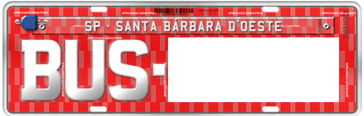

---

title: "Brasil"
date: 2023-02-26
lastmod: 2023-04-19
weight: 2
draft: false
keywords: [""]
sections: [""]
bg: "bg/city.jpg"
flag: "BR.svg"
jetro_detail: true
jogmec_detail: true
plonkit: true
map_title: "mapa de práctica"
maps: [
    ["https://www.geoguessr.com/maps/61df8477a94f5d0001ef9f2c", "A Balanced Brazil"],
    ]
sc_title: "Áreas que son fáciles de confundir"
sc: [
    ["../colombia/", "Columbia"],
    ["../argentina/", "norte argentino"],
    ["../../asia/cambodia/", "Camboya"],
    ["../../asia/indonesia/", "Indonesia"],
    ["../../asia/thai/", "Tailandia"],
    ]
---

    <h2 class="section-title">{}</h2>
    <ul class="rule-list">
        <li>El dominio es .br</li>
        <li>el idioma es Portugal Es una palabra”Automóvil club británico”es distintivo.</li>
        <li>la parte de atrás del cartel negro hay muchas cosas</li>
        <li>La antena de la casa es distintiva.transparente Hay muchas antenas parabólicas.</li>
        <li>La parte superior de la matrícula.azul Hay momentos en que{}</li>
        <li>Matrículas de camiones, autobuses y taxis.rojo color</li>
        <li>Una partición en la ranura de un poste de servicios públicos.ser usando postes telefónicos</li>
    </ul>
    {}
    {}

{}
{}

{}
el idioma es Portugal Es una palabra”Automóvil club británico”es distintivo.
{}

{}
la parte de atrás del cartel negro Hay muchas cosas (la imagen de fondo es<a href="https://commons.wikimedia.org/w/index.php?curid=57310907">aquí</a>usa el de, <a href="https://creativecommons.org/licenses/by/3.0" title="Creative Commons Attribution 3.0">CC POR 3.0</a>).
{}

{}
La antena de la casa es distintiva.transparente Utilice una antena parabólica{}.Sin embargo, esto por sí solo no puede ser seguro.
{}

{}
Matrículas de camiones, autobuses y taxis.era rojo Los personajes son rojo Es caro.
{}

{}

Por Olympiobr - Trabajo propio, <a href="https://creativecommons.org/licenses/by-sa/3.0/deed.ja">CC BY-SA 3.0</a>, <a href="https://commons.wikimedia.org/w/index.php?curid=20547078">Wikimedia Commons</a>
{}

{}
Tiene el logo de Petrobras, la petrolera más grande de Sudamérica.{}{}.
{}

{}
Hay un tanque con Fortlev escrito en él.{}.Hay varios colores diferentes, pero cada uno tiene una forma única.Puedo ver que está en el techo.
{}

{}
Los postes telefónicos en Brasil tienen tabiques en las ranuras.ser{}.por otro lado{}Hay una partición Ninguno solo hay uno{}.También puedes ver postes circulares de servicios públicos.También puede ver señales que dicen BR al costado de la carretera.
{}

{}
Se encuentra un galón amarillo sobre un fondo negro.
{}

{}
Como país donde se pueden encontrar galones del mismo color{}{}o{}Hay.Tenga en cuenta que en Camboya y Tailandia el color del suelo y la vegetación son similares en algunos lugares, por lo que es posible cometer un error.
{}

Por <a rel="nofollow" class="external text" href="https://www.flickr.com/people/51889924@N04">Agencia CNT de Noticias</a> - <a rel="nofollow" class="external text" href="https://www.flickr.com/photos/agenciacnt/8102621957/">Santa Catarina - SC-303 (ponto crítico)</a>, <a href="https://creativecommons.org/licenses/by/2.0" title="Creative Commons Attribution 2.0">CC POR 2.0</a>, <a href="https://commons.wikimedia.org/w/index.php?curid=64221741">Enlace</a>

{}
{}

<iframe width="560" height="315" src="https://www.youtube.com/embed/kges-ekKMI4" title="YouTube video player" frameborder="0" allow="accelerometer; autoplay; clipboard-write; encrypted-media; gyroscope; picture-in-picture; web-share" allowfullscreen></iframe>

<iframe width="560" height="315" src="https://www.youtube.com/embed/n9PebEV7j3Y" title="YouTube video player" frameborder="0" allow="accelerometer; autoplay; clipboard-write; encrypted-media; gyroscope; picture-in-picture; web-share" allowfullscreen></iframe>

{}
{}

{}
Banco Itaú, el banco más grande de Sudamérica signo naranja Hay muchos.a la gasolinera La petrolera más grande de Sudamérica, Petrobras (logotipo verde) Hay muchas cosas.
{}

{}
{}

    <ul class="rule-list-none">
        <li>{}</li>
    </ul>

{}
{}

    <h2 class="section-title">{}</h2>
    <ul class="rule-list">
        <li>Puede limitar el rango por código de área.</li>
        <li>Al costado de la carretera hay un letrero con el número de la carretera escrito como "BR XX".</li>
        <li>Florianópolis{}centrado alrededor{}Se puede observar arquitectura de estilo europeo influenciada por inmigrantes de</li>
    </ul>

{}
{}

{}
1 en Sao Paulo y 2 en Río de Janeiro.Básicamente, las cifras aumentan de este a oeste.
{}

Por Magno Brasil - Trabajo propio, <a href="https://creativecommons.org/licenses/by-sa/4.0/deed.ja">CC BY-SA 4.0</a>, <a href="https://commons.wikimedia.org/w/index.php?curid=61641585">Wikimedia Commons (enlace)</a>

{}
{}

{}
Es bastante difícil encontrar el número de la carretera de inmediato, así que intente limitar el área según la atmósfera circundante.
{}

{}
{}

{}
durante la construcción{}Debido a la gran cantidad de portugueses que se establecieron aquí, la mayoría de los ciudadanos tienen ascendencia de inmigrantes europeos.{{% ref "https://ja.wikipedia.org/wiki/%E3%83%95%E3%83%AD%E3%83%AA%E3%82%A2%E3%83%8E%E3%83%BC%E3%83%9D%E3%83%AA%E3%82%B9" "florianópolis" %}}.Hay muchos inmigrantes alemanes e italianos y la arquitectura suele ser de estilo europeo.
{}

Por dnsilva1, <a href="https://creativecommons.org/licenses/by-sa/3.0" title="Creative Commons Attribution-Share Alike 3.0">CC BY-SA 3.0</a>, <a href="https://commons.wikimedia.org/w/index.php?curid=53785493">Enlace</a>

{}
{}

    <h4 class="section-title">vegetación</h4>
    <ul class="rule-list">
        <li>Los colores de la vegetación y el suelo varían según la región.
            <ul>
                <li>Amazonia: clima ecuatorial húmedo con bosques amazónicos</li>
                <li>Cerrado: Es difícil distinguir porque hay zonas con muchos campos y zonas con muchos árboles.</li>
                <li>Mata Atlántica: un bosque que se extiende por 15 estados a lo largo de la costa atlántica de Brasil</li>
                <li>Caatinga: Suelo seco, que suele contener tierra blanquecina.</li>
                <li>Pampa: Tiene un ambiente similar al Uruguay y cuenta con zonas agrícolas y de pastoreo.</li>
                <li>Pantanal: Llanura aluvial formada por ríos en el norte de Paraguay, pero casi no hay carreteras.</li>
            </ul>
        </li>
    </ul>

{}
{}

Fuente de la imagen: Por Brazil Travel, <a href="https://creativecommons.org/licenses/by-sa/4.0/deed.ja">CC BY-SA 4.0</a>, <a href="https://commons.wikimedia.org/w/index.php?curid=53887697">Wikimedia Commons</a>

{}
{}

<iframe src="https://www.google.com/maps/embed?pb=!4v1682559206378!6m8!1m7!1snECoHmCIn8H4i4jKaqG30A!2m2!1d3.690005481394581!2d-61.70034552882197!3f303.12705986159517!4f-6.649236407431545!5f0.7820865974627469" width="295" height="295" style="border:0;" allowfullscreen="" loading="lazy" referrerpolicy="no-referrer-when-downgrade"></iframe>
<iframe src="https://www.google.com/maps/embed?pb=!4v1682558624818!6m8!1m7!1sBIoAJhz54UC94nW5FQJgUQ!2m2!1d3.360432252131066!2d-51.67337002057713!3f314.391452254387!4f-7.744641660505394!5f0.7820865974627469" width="295" height="295" style="border:0;" allowfullscreen="" loading="lazy" referrerpolicy="no-referrer-when-downgrade"></iframe>

{}
{}

<iframe src="https://www.google.com/maps/embed?pb=!4v1682558848930!6m8!1m7!1sM2GjbU_HquLSsO2JwHis8w!2m2!1d-16.40290145846666!2d-50.40739402454159!3f204.87821931998835!4f-4.8153556383479525!5f1.6369705511924675" width="295" height="295" style="border:0;" allowfullscreen="" loading="lazy" referrerpolicy="no-referrer-when-downgrade"></iframe>
<iframe src="https://www.google.com/maps/embed?pb=!4v1682558918394!6m8!1m7!1sIN5hwMuiUer-EE8lQx3n1A!2m2!1d-18.36066707210302!2d-45.77849523104562!3f43.417439846579754!4f9.076290026625571!5f0.7820865974627469" width="295" height="295" style="border:0;" allowfullscreen="" loading="lazy" referrerpolicy="no-referrer-when-downgrade"></iframe>

{}
{}

<iframe src="https://www.google.com/maps/embed?pb=!4v1682559737817!6m8!1m7!1svvKhW2qiFBOP2bBrL8m4ng!2m2!1d-4.98516390409495!2d-37.31726763464727!3f93.42795566482673!4f-6.246105023247111!5f2.5799526629061464" width="295" height="295" style="border:0;" allowfullscreen="" loading="lazy" referrerpolicy="no-referrer-when-downgrade"></iframe>
<iframe src="https://www.google.com/maps/embed?pb=!4v1682559662442!6m8!1m7!1sukGcTr9M-csVMN0rymRoFg!2m2!1d-6.539873595640429!2d-37.50937460537717!3f191.185849265598!4f-14.12474621815224!5f1.568316941340889" width="295" height="295" style="border:0;" allowfullscreen="" loading="lazy" referrerpolicy="no-referrer-when-downgrade"></iframe>

{}
{}

{}
Las plantas varían según la región.Afectada por vientos húmedos provenientes del mar.El bosque se ve diferente de otras áreas.Siento que a veces puedo ver cosas como palmeras y pinos.{}.
{}

<iframe src="https://www.google.com/maps/embed?pb=!4v1682560156122!6m8!1m7!1swa_zmjlH2gqBQ2oabyLhSA!2m2!1d-22.0252523845475!2d-41.07132487765809!3f264.15454414488715!4f-1.6958916170852945!5f1.5378273234838713" width="295" height="295" style="border:0;" allowfullscreen="" loading="lazy" referrerpolicy="no-referrer-when-downgrade"></iframe>
<iframe src="https://www.google.com/maps/embed?pb=!4v1682559846434!6m8!1m7!1sEZrg2IvmS_Dpo40Li5NgwA!2m2!1d-12.27769993257875!2d-37.8820651128763!3f359.89142704476234!4f4.171539727133862!5f1.5135439780731126" width="295" height="295" style="border:0;" allowfullscreen="" loading="lazy" referrerpolicy="no-referrer-when-downgrade"></iframe>

{}
{}

<iframe src="https://www.google.com/maps/embed?pb=!4v1682560746237!6m8!1m7!1s9dhF35gqnNfT06exQSZq8A!2m2!1d-29.97944047612433!2d-56.54452566178293!3f66.06010993564273!4f-2.148703313678041!5f2.8062917746442597" width="295" height="295" style="border:0;" allowfullscreen="" loading="lazy" referrerpolicy="no-referrer-when-downgrade"></iframe>
<iframe src="https://www.google.com/maps/embed?pb=!4v1682560839626!6m8!1m7!1szmXGuOU-85y4w39NLD_xMg!2m2!1d-31.76440676809355!2d-54.15591499962603!3f222.87300769244834!4f-3.5749410915477!5f2.9377560244887877" width="295" height="295" style="border:0;" allowfullscreen="" loading="lazy" referrerpolicy="no-referrer-when-downgrade"></iframe>

{}
{}

<iframe src="https://www.google.com/maps/embed?pb=!4v1682639619124!6m8!1m7!1s3p5OupPwhc2DiKhsj27uPw!2m2!1d-19.01679467617658!2d-57.53193554803059!3f158.0077363936258!4f-23.38418793810321!5f1.7410521314355352" width="295" height="295" style="border:0;" allowfullscreen="" loading="lazy" referrerpolicy="no-referrer-when-downgrade"></iframe>
<iframe src="https://www.google.com/maps/embed?pb=!4v1682639577855!6m8!1m7!1sCmml6mgQBChhNysXhxcEyA!2m2!1d-19.36288315842267!2d-57.55096809136056!3f219.91708888805192!4f-13.84361818284306!5f2.956808514492435" width="295" height="295" style="border:0;" allowfullscreen="" loading="lazy" referrerpolicy="no-referrer-when-downgrade"></iframe>

{}
{}

    <h4 class="section-title">plantas distintivas</h4>
    <ul class="rule-list">
        <li>Árboles que identifican regiones o estados específicos.
            <ul>
                <li>Pino Paraná: Pino Paraná{}dientes paraná alrededor del estado{}</li>
                <li>Palma de cera brasileña:cear Región noreste centrada en el estado.</li>
                <li>Árbol de babasú: estado de Piauí y maranhao estado{}, se puede ver en toda la zona sur del país.</li>
            </ul>
        </li>
    </ul>

{}
{}

{}
este arbol es paraná alrededor del estado{}
{}
{}
{}

Por <a href="//commons.wikimedia.org/wiki/User:Tacarijus" title="User:Tacarijus">Tacarijús</a> - propio trabajo, <a href="https://creativecommons.org/licenses/by/2.5" title="Creative Commons Attribution 2.5">CC POR 2.5</a>, <a href="https://commons.wikimedia.org/w/index.php?curid=2493694">Enlace</a>

{}
este arbol es cear alrededor del estado
{}
{}
{}

{}
con el estado de Piauímaranhao estado{}Se encuentra en toda la parte sur del país.
{}
{}
{}

Por Foto de David J. Stang - fuente: David Stang. Publicado por primera vez en ZipcodeZoo.com, <a href="https://creativecommons.org/licenses/by-sa/4.0" title="Creative Commons Attribution-Share Alike 4.0">CC BY-SA 4.0</a>, <a href="https://commons.wikimedia.org/w/index.php?curid=61163295">Enlace</a>

{}
Syagrus coronata es un árbol que se puede observar en el este de Brasil, distribuyéndose desde la parte sur del estado de Pernambuco hasta el estado de Bahía.Probablemente mucha Bahía.
{}
{}
{}

Por <a rel="nofollow" class="external text" href="https://www.flickr.com/people/92252798@N07">Dick Culbert</a> de Gibsons, B.C., Canadá - <a rel="nofollow" class="external text" href="https://www.flickr.com/photos/92252798@N07/19866677541/">Euterpe precatoria</a>, <a href="https://creativecommons.org/licenses/by/2.0" title="Creative Commons Attribution 2.0">CC POR 2.0</a>, <a href="https://commons.wikimedia.org/w/index.php?curid=50113767">Enlace</a>

{}
Açaizeiro es común en el estado de Pará.{}.Parece ser especialmente común en la cuenca del río Amazonas y alrededor de la isla de Marajó.{}.
{}
{}
{}

Por <a href="//commons.wikimedia.org/wiki/User:Poyt448" title="User:Poyt448">Poyt448 Peter Woodard</a> - propio trabajo, <a href="https://creativecommons.org/licenses/by-sa/3.0" title="Creative Commons Attribution-Share Alike 3.0">CC BY-SA 3.0</a>, <a href="https://commons.wikimedia.org/w/index.php?curid=15235273">Enlace</a>

{}
Distribuido escasamente principalmente en áreas cercanas a la costa de los estados de Sao Paulo y Rio Grande do Sul{}.
{}
{}
{}

    <h2 class="section-title">{}</h2>
    <ul class="rule-list">
        <li>Vila do Abraão tiene una montaña distintiva que muestra la cabeza de un excursionista</li>
        <li>Hay una isla remota llamada Fernando de Noronha.{}</li>
    </ul>

{}
{}
{}
Puedo ver una montaña afilada{}.También hay un tramo en el que vas montado en un buggy azul.{}.
{}

{}
{}
{}
Hay un agujero en el poste telefónico.Hay muchas zonas rocosas y hay lugares donde se puede coger un barco.Hay algunas rocas muy distintivas, por lo que es posible que puedas distinguirlas por eso.{}.
{}

{}
{}

{}
<li>De la siguiente imagen solo se extrae la segunda imagen del poste telefónico desde la izquierda.</li>
<li>　Por <a href="https://www.wikidata.org/wiki/Q57979330" class="extiw" title="d:Q57979330">Paul R. Burley</a> - propio trabajo, <a href="https://creativecommons.org/licenses/by-sa/4.0" title="Creative Commons Attribution-Share Alike 4.0">CC BY-SA 4.0</a>, <a href="https://commons.wikimedia.org/w/index.php?curid=74494644">Enlace</a></li>
{}

    <h4 class="mb-4">Descripción de empresas representativas</h4>
    <table class="table table-striped table-bordered">
        <thead class="table-light">
            <tr>
                <th scope="col" class="col-width-2">Nombre de empresa</th>
                <th scope="col" class="col-width-1">código</th>
                <th scope="col" class="col-width-7">explicación</th>
                <th scope="col" class="col-width-05">liquidación de cuentas</th>
                <th scope="col" class="col-width-05">Historial de dividendos</th>
            </tr>
        </thead>
        <tbody class="corp-desc">
            <tr>
                <td>Petróleo Brasileiro</td>
                <td>{}</td>
                <td>La mayor empresa de perforación petrolera del hemisferio sur.</td>
                <td>{}</td>
                <td>{}</td>
            </tr>
            <tr>
                <td>Valle</td>
                <td>{}</td>
                <td>Uno de los tres principales productores de mineral de hierro.También produce bauxita, cobre y oro.</td>
                <td>{}</td>
                <td>{}</td>
            </tr>
            <tr>
                <td>Holding Itaú Unibanco</td>
                <td>{}</td>
                <td>El banco más grande de América Latina.{}.Se trata de una empresa poco común que paga un dividendo mensual (normalmente una vez cada trimestre y, en Sudáfrica, una vez cada seis meses).</td>
                <td>{}</td>
                <td>{}</td>
            </tr>
        </tbody>
    </table>

