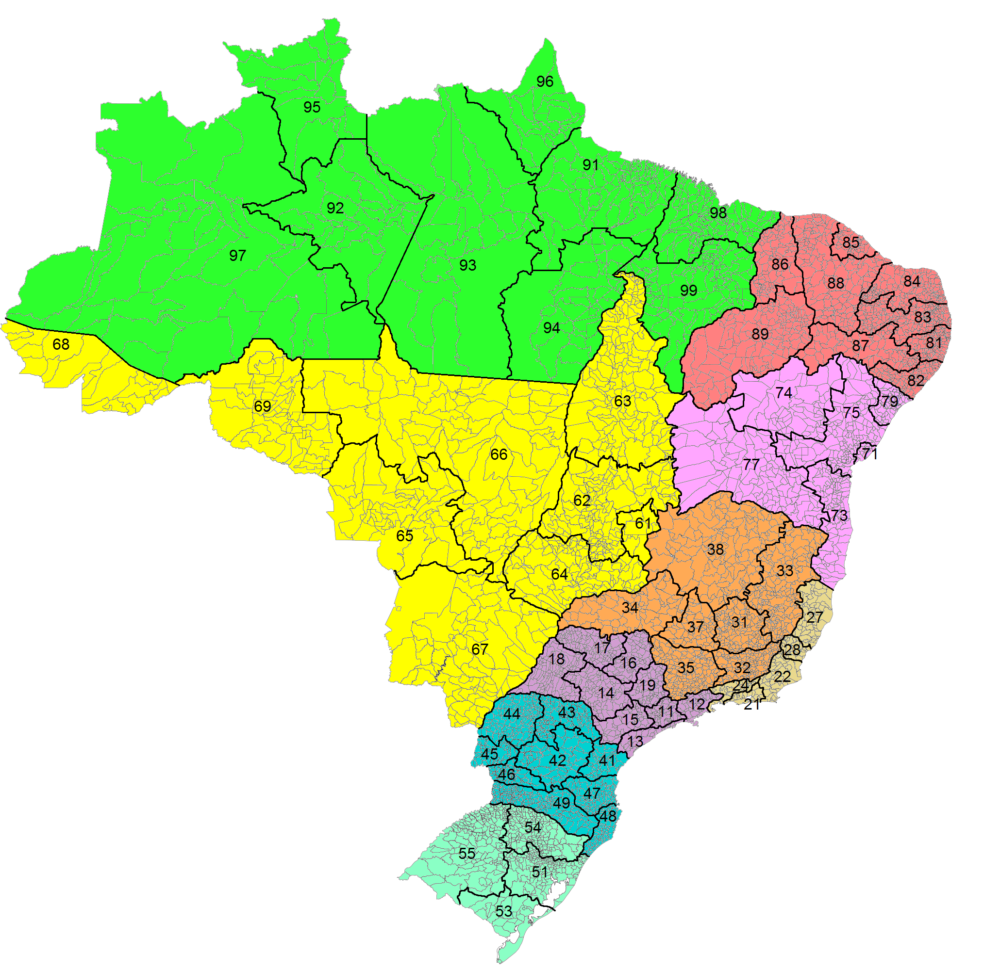
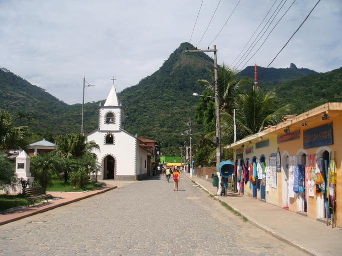

    <h2 class="section-title">{}</h2>
    <ul class="rule-list">
        <li>Domainnya adalah .br</li>
        <li>Bahasa utamanya adalah Portugis, dengan karakteristik huruf Ã・ã</li>
        <li>Bagian belakang rambu lalu lintas sering berwarna hitam</li>
        <li>Antena rumah sering berbentuk parabola transparan</li>
        <li>Plat nomor kendaraan pribadi kadang memiliki bagian atas berwarna biru {}</li>
        <li>Plat nomor truk, bus, atau taksi sering berwarna merah atau memiliki huruf merah</li>
        <li>Tiang listrik menggunakan model dengan pembagi pada alurnya</li>
    </ul>
    {}

{}
{}

{}
Bahasa utamanya adalah Portugis, dengan karakteristik huruf Ã・ã
{}

{}
Bagian belakang rambu lalu lintas sering berwarna hitam (gambar latar berasal dari <a href="https://commons.wikimedia.org/w/index.php?curid=57310907">sumber ini</a>, <a href="https://creativecommons.org/licenses/by/3.0" title="Creative Commons Attribution 3.0">CC BY 3.0</a>).
{}

{}
Antena rumah sering berbentuk parabola transparan {}, tetapi ini saja tidak cukup sebagai penanda.
{}

{}
Plat nomor kendaraan truk, bus, atau taksi sering berwarna merah atau memiliki huruf merah.
{}

{}

By Olympiobr - Own work, <a href="https://creativecommons.org/licenses/by-sa/3.0/deed.ja">CC BY-SA 3.0</a>, <a href="https://commons.wikimedia.org/w/index.php?curid=20547078">Wikimedia Commons</a>
{}

{}
Logo Petrobras, perusahaan minyak terbesar di Amerika Selatan, sering ditemukan {}{}.
{}

{}
Tangki air dengan tulisan "Fortlev" sering terlihat di atap rumah {}. Bentuknya khas meskipun warnanya beragam.
{}

{}
Tiang listrik di Brasil memiliki pembagi pada alurnya {}. Sebaliknya, {} biasanya memiliki alur tanpa pembagi atau hanya satu {}. Tiang listrik berbentuk bulat juga sering ditemukan. Selain itu, di pinggir jalan terdapat rambu dengan tulisan "BR".
{}

{}
Chevron kuning-hitam dengan latar belakang hitam sering ditemukan.
{}

{}
Negara lain seperti {}{} dan {} juga memiliki Chevron serupa. Perhatikan tanah dan vegetasi karena Kamboja atau Thailand bisa terlihat mirip.
{}

By <a rel="nofollow" class="external text" href="https://www.flickr.com/people/51889924@N04">Agencia CNT de Noticias</a> - <a rel="nofollow" class="external text" href="https://www.flickr.com/photos/agenciacnt/8102621957/">Santa Catarina - SC-303 (ponto crítico)</a>, <a href="https://creativecommons.org/licenses/by/2.0" title="Creative Commons Attribution 2.0">CC BY 2.0</a>, <a href="https://commons.wikimedia.org/w/index.php?curid=64221741">Link</a>

{}
{}

<iframe width="560" height="315" src="https://www.youtube.com/embed/kges-ekKMI4" title="YouTube video player" frameborder="0" allow="accelerometer; autoplay; clipboard-write; encrypted-media; gyroscope; picture-in-picture; web-share" allowfullscreen></iframe>

<iframe width="560" height="315" src="https://www.youtube.com/embed/n9PebEV7j3Y" title="YouTube video player" frameborder="0" allow="accelerometer; autoplay; clipboard-write; encrypted-media; gyroscope; picture-in-picture; web-share" allowfullscreen></iframe>

{}
{}

{}
Banco Itaú, salah satu bank terbesar di Amerika Selatan, memiliki banyak papan tanda oranye. SPBU sering menggunakan logo Petrobras (berwarna hijau), perusahaan minyak terbesar di Amerika Selatan.
{}

{}
{}

    <ul class="rule-list-none">
        <li>{}</li>
    </ul>

{}
{}

    <h2 class="section-title">{}</h2>
    <ul class="rule-list">
        <li>Area dapat dipersempit menggunakan kode area pada nomor telepon</li>
        <li>Papan jalan dengan nomor jalan bertuliskan "BR XX" sering ditemukan di pinggir jalan</li>
        <li>Di sekitar Florianópolis {}, terdapat pengaruh arsitektur Eropa dari imigran Azores {}</li>
    </ul>

{}
{}

{}
Angka 1 untuk São Paulo, angka 2 untuk Rio de Janeiro. Secara umum, angka semakin besar saat bergerak dari timur ke barat.
{}

By Magno Brasil - Own work, <a href="https://creativecommons.org/licenses/by-sa/4.0/deed.ja">CC BY-SA 4.0</a>, <a href="https://commons.wikimedia.org/w/index.php?curid=61641585">Wikimedia Commons(Link)</a>

{}
{}

{}
Mencari langsung nomor jalan sering sulit. Mulailah dengan mempersempit area berdasarkan karakteristik lingkungan sekitar.
{}

{}
{}

{}
Florianópolis memiliki banyak warga keturunan Eropa, termasuk dari {}, Portugal. Selain itu, terdapat banyak imigran keturunan Jerman dan Italia, sehingga arsitekturnya memiliki gaya Eropa {{% ref "https://ja.wikipedia.org/wiki/%E3%83%95%E3%83%AD%E3%83%AA%E3%82%A2%E3%83%8E%E3%83%BC%E3%83%9D%E3%83%AA%E3%82%B9" "Florianópolis" %}}.
{}

By dnsilva1, <a href="https://creativecommons.org/licenses/by-sa/3.0" title="Creative Commons Attribution-Share Alike 3.0">CC BY-SA 3.0</a>, <a href="https://commons.wikimedia.org/w/index.php?curid=53785493">Link</a>

{}
{}

    <h4 class="section-title">Vegetasi</h4>
    <ul class="rule-list">
        <li>Vegetasi dan warna tanah berbeda di tiap area
            <ul>
                <li>Amazônia: Hutan hujan dengan iklim tropis lembap</li>
                <li>Cerrado: Ada area pertanian dan area berhutan, sulit dibedakan</li>
                <li>Mata Atlântica: Hutan di sepanjang garis pantai Atlantik yang melintasi 15 negara bagian Brasil</li>
                <li>Caatinga: Tanah kering yang sering tampak berwarna putih</li>
                <li>Pampa: Padang rumput dan area pertanian dekat Uruguay</li>
                <li>Pantanal: Dataran banjir aluvial dekat Paraguay utara, hampir tidak memiliki jalan</li>
            </ul>
        </li>
    </ul>

{}
{}

Gambar oleh Brazil Travel, <a href="https://creativecommons.org/licenses/by-sa/4.0/deed.ja">CC BY-SA 4.0</a>, <a href="https://commons.wikimedia.org/w/index.php?curid=53887697">Wikimedia Commons</a>

{}
{}

<iframe src="https://www.google.com/maps/embed?pb=!4v1682559206378!6m8!1m7!1snECoHmCIn8H4i4jKaqG30A!2m2!1d3.690005481394581!2d-61.70034552882197!3f303.12705986159517!4f-6.649236407431545!5f0.7820865974627469" width="295" height="295" style="border:0;" allowfullscreen="" loading="lazy" referrerpolicy="no-referrer-when-downgrade"></iframe>
<iframe src="https://www.google.com/maps/embed?pb=!4v1682558624818!6m8!1m7!1sBIoAJhz54UC94nW5FQJgUQ!2m2!1d3.360432252131066!2d-51.67337002057713!3f314.391452254387!4f-7.744641660505394!5f0.7820865974627469" width="295" height="295" style="border:0;" allowfullscreen="" loading="lazy" referrerpolicy="no-referrer-when-downgrade"></iframe>

{}
{}

<iframe src="https://www.google.com/maps/embed?pb=!4v1682558848930!6m8!1m7!1sM2GjbU_HquLSsO2JwHis8w!2m2!1d-16.40290145846666!2d-50.40739402454159!3f204.87821931998835!4f-4.8153556383479525!5f1.6369705511924675" width="295" height="295" style="border:0;" allowfullscreen="" loading="lazy" referrerpolicy="no-referrer-when-downgrade"></iframe>
<iframe src="https://www.google.com/maps/embed?pb=!4v1682558918394!6m8!1m7!1sIN5hwMuiUer-EE8lQx3n1A!2m2!1d-18.36066707210302!2d-45.77849523104562!3f43.417439846579754!4f9.076290026625571!5f0.7820865974627469" width="295" height="295" style="border:0;" allowfullscreen="" loading="lazy" referrerpolicy="no-referrer-when-downgrade"></iframe>

{}
{}

<iframe src="https://www.google.com/maps/embed?pb=!4v1682559737817!6m8!1m7!1svvKhW2qiFBOP2bBrL8m4ng!2m2!1d-4.98516390409495!2d-37.31726763464727!3f93.42795566482673!4f-6.246105023247111!5f2.5799526629061464" width="295" height="295" style="border:0;" allowfullscreen="" loading="lazy" referrerpolicy="no-referrer-when-downgrade"></iframe>
<iframe src="https://www.google.com/maps/embed?pb=!4v1682559662442!6m8!1m7!1sukGcTr9M-csVMN0rymRoFg!2m2!1d-6.539873595640429!2d-37.50937460537717!3f191.185849265598!4f-14.12474621815224!5f1.568316941340889" width="295" height="295" style="border:0;" allowfullscreen="" loading="lazy" referrerpolicy="no-referrer-when-downgrade"></iframe>

{}
{}

{}
Vegetasi bervariasi tergantung lokasi. Terpengaruh oleh angin lembap dari laut, sehingga berbeda dari area lain. Kadang terlihat pohon kelapa atau pinus {}.
{}

<iframe src="https://www.google.com/maps/embed?pb=!4v1682560156122!6m8!1m7!1swa_zmjlH2gqBQ2oabyLhSA!2m2!1d-22.0252523845475!2d-41.07132487765809!3f264.15454414488715!4f-1.6958916170852945!5f1.5378273234838713" width="295" height="295" style="border:0;" allowfullscreen="" loading="lazy" referrerpolicy="no-referrer-when-downgrade"></iframe>
<iframe src="https://www.google.com/maps/embed?pb=!4v1682559846434!6m8!1m7!1sEZrg2IvmS_Dpo40Li5NgwA!2m2!1d-12.27769993257875!2d-37.8820651128763!3f359.89142704476234!4f4.171539727133862!5f1.5135439780731126" width="295" height="295" style="border:0;" allowfullscreen="" loading="lazy" referrerpolicy="no-referrer-when-downgrade"></iframe>

{}
{}

<iframe src="https://www.google.com/maps/embed?pb=!4v1682560746237!6m8!1m7!1s9dhF35gqnNfT06exQSZq8A!2m2!1d-29.97944047612433!2d-56.54452566178293!3f66.06010993564273!4f-2.148703313678041!5f2.8062917746442597" width="295" height="295" style="border:0;" allowfullscreen="" loading="lazy" referrerpolicy="no-referrer-when-downgrade"></iframe>
<iframe src="https://www.google.com/maps/embed?pb=!4v1682560839626!6m8!1m7!1szmXGuOU-85y4w39NLD_xMg!2m2!1d-31.76440676809355!2d-54.15591499962603!3f222.87300769244834!4f-3.5749410915477!5f2.9377560244887877" width="295" height="295" style="border:0;" allowfullscreen="" loading="lazy" referrerpolicy="no-referrer-when-downgrade"></iframe>

{}
{}

<iframe src="https://www.google.com/maps/embed?pb=!4v1682639619124!6m8!1m7!1s3p5OupPwhc2DiKhsj27uPw!2m2!1d-19.01679467617658!2d-57.53193554803059!3f158.0077363936258!4f-23.38418793810321!5f1.7410521314355352" width="295" height="295" style="border:0;" allowfullscreen="" loading="lazy" referrerpolicy="no-referrer-when-downgrade"></iframe>
<iframe src="https://www.google.com/maps/embed?pb=!4v1682639577855!6m8!1m7!1sCmml6mgQBChhNysXhxcEyA!2m2!1d-19.36288315842267!2d-57.55096809136056!3f219.91708888805192!4f-13.84361818284306!5f2.956808514492435" width="295" height="295" style="border:0;" allowfullscreen="" loading="lazy" referrerpolicy="no-referrer-when-downgrade"></iframe>

{}
{}

    <h4 class="section-title">Pohon Khas</h4>
    <ul class="rule-list">
        <li>Pohon yang dapat menentukan lokasi tertentu:
            <ul>
                <li>Araucária (Pinus Paraná): Terutama di negara bagian Paraná {}</li>
                <li>Karnauba (Brazil Wax Palm): Terutama di wilayah timur laut, sekitar negara bagian Ceará</li>
                <li>Babassu Palm: Terutama di negara bagian Piauí dan Maranhão, tetapi juga ditemukan di wilayah selatan {}</li>
            </ul>
        </li>
    </ul>

{}
{}

{}
Pohon ini banyak ditemukan di sekitar negara bagian Paraná {}
{}
{}
{}

By <a href="//commons.wikimedia.org/wiki/User:Tacarijus" title="User:Tacarijus">Tacarijus</a> - Own work, <a href="https://creativecommons.org/licenses/by/2.5" title="Creative Commons Attribution 2.5">CC BY 2.5</a>, <a href="https://commons.wikimedia.org/w/index.php?curid=2493694">Link</a>

{}
Pohon ini banyak ditemukan di sekitar negara bagian Ceará.
{}
{}
{}

{}
Banyak ditemukan di negara bagian Piauí dan Maranhão {} tetapi juga dapat ditemukan di wilayah selatan Brasil.
{}
{}
{}

By Photo by David J. Stang - source: David Stang. First published at ZipcodeZoo.com, <a href="https://creativecommons.org/licenses/by-sa/4.0" title="Creative Commons Attribution-Share Alike 4.0">CC BY-SA 4.0</a>, <a href="https://commons.wikimedia.org/w/index.php?curid=61163295">Link</a>

{}
Syagrus coronata ditemukan di Brasil bagian timur, terutama di selatan negara bagian Pernambuco hingga negara bagian Bahia.
{}
{}
{}

By <a rel="nofollow" class="external text" href="https://www.flickr.com/people/92252798@N07">Dick Culbert</a> from Gibsons, B.C., Canada - <a rel="nofollow" class="external text" href="https://www.flickr.com/photos/92252798@N07/19866677541/">Euterpe precatoria</a>, <a href="https://creativecommons.org/licenses/by/2.0" title="Creative Commons Attribution 2.0">CC BY 2.0</a>, <a href="https://commons.wikimedia.org/w/index.php?curid=50113767">Link</a>

{}
Açaí palm (açaizeiro) banyak ditemukan di negara bagian Pará, terutama di sekitar lembah Sungai Amazon dan Pulau Marajó {} {}.
{}
{}
{}

By <a href="//commons.wikimedia.org/wiki/User:Poyt448" title="User:Poyt448">Poyt448 Peter Woodard</a> - Own work, <a href="https://creativecommons.org/licenses/by-sa/3.0" title="Creative Commons Attribution-Share Alike 3.0">CC BY-SA 3.0</a>, <a href="https://commons.wikimedia.org/w/index.php?curid=15235273">Link</a>

{}
Eucalyptus grandis tersebar di sepanjang garis pantai dari São Paulo hingga Rio Grande do Sul {}.
{}
{}
{}

    <h2 class="section-title">{}</h2>
    <ul class="rule-list">
        <li>Vila do Abraão memiliki gunung khas dan kepala pejalan kaki dengan ransel sering terlihat</li>
        <li>Terdapat pulau terpencil bernama Fernando de Noronha {}</li>
    </ul>

{}
{}
{}
Gunung berbentuk khas terlihat jelas {}. Beberapa area menunjukkan kendaraan buggy biru {}.
{}

{}
{}
{}
Tiang listrik memiliki lubang, banyak bebatuan, dan pelabuhan kapal. Batu karang yang sangat khas dapat digunakan untuk identifikasi lokasi {}.
{}

{}
{}

{}
<li>Gambar tiang listrik kedua dari kiri diambil dari sumber berikut:</li>
<li>By <a href="https://www.wikidata.org/wiki/Q57979330" class="extiw" title="d:Q57979330">Paul R. Burley</a> - Own work, <a href="https://creativecommons.org/licenses/by-sa/4.0" title="Creative Commons Attribution-Share Alike 4.0">CC BY-SA 4.0</a>, <a href="https://commons.wikimedia.org/w/index.php?curid=74494644">Link</a></li>
{}
