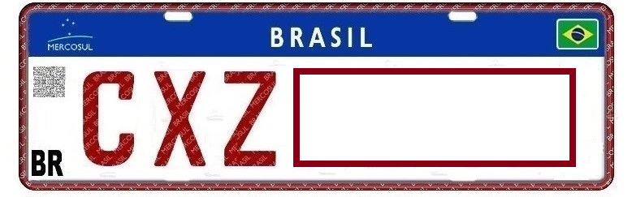

    <h2 class="section-title">{}</h2>
    <ul class="rule-list">
        <li>ナンバープレートの上側が青色の時がある{}</li>
        <li>ドメインは.br</li>
        <li>家のアンテナが特徴的、透明なパラボラアンテナ、タイなどにも似たようなものがある</li>
        <li>標識の裏側が黒いものが多い</li>
        <li>トラック・バス・タクシーの車両のナンバープレートが赤かったり、文字が赤かったりする。最近の車ほど上が青いことが多い。</li>
    </ul>

{}
{}
{}
BR＝ブラジル国道、他の記号＝州の名前を表している。
{}

<iframe src="https://www.google.com/maps/embed?pb=!4v1679346036684!6m8!1m7!1ssS7fc0aZdkd5U_qPGGSyVg!2m2!1d-5.093068168242144!2d-39.71072825091151!3f83.11515931234229!4f-3.8813157179055224!5f3.325193203789971" width="295" height="295" style="border:0;" allowfullscreen="" loading="lazy" referrerpolicy="no-referrer-when-downgrade"></iframe>

{}
家のアンテナが特徴的、透明なパラボラアンテナ、ただしこれだけでは特定できないと思う
{}

<iframe src="https://www.google.com/maps/embed?pb=!4v1681050515831!6m8!1m7!1sR4yRqn1b6KjOTq2N3d71yg!2m2!1d-23.85584902304706!2d-50.19166538759058!3f18.826192035204055!4f11.51661489691665!5f3.325193203789971" width="295" height="295" style="border:0;" allowfullscreen="" loading="lazy" referrerpolicy="no-referrer-when-downgrade"></iframe>
<iframe src="https://www.google.com/maps/embed?pb=!4v1680562511215!6m8!1m7!1sZw0Wa2bHwrVo4G0talSJBg!2m2!1d-4.575281620209909!2d-44.65465530257557!3f114.024883564455!4f-2.6355661063917495!5f3.325193203789971" width="295" height="295" style="border:0;" allowfullscreen="" loading="lazy" referrerpolicy="no-referrer-when-downgrade"></iframe>

{}
標識の裏側が黒いものが多い
{}

<iframe src="https://www.google.com/maps/embed?pb=!4v1679345733355!6m8!1m7!1saXaImge9nJr-0Rhjkc0LNg!2m2!1d-23.28528423081526!2d-47.18912282227104!3f207.86566128400275!4f-3.5040994452348855!5f3.325193203789971" width="295" height="295" style="border:0;" allowfullscreen="" loading="lazy" referrerpolicy="no-referrer-when-downgrade"></iframe>

{}
トラック・バス・タクシーの車両のナンバープレートが赤かったり、文字が赤かったりする。最近の車ほど上が青いことが多い。画像は一部加工あり。
{}

<iframe src="https://www.google.com/maps/embed?pb=!4v1681829518321!6m8!1m7!1sJfu3TVGFyyeyUBI2xa-ITA!2m2!1d-5.128418221425581!2d-39.73171069715569!3f307.6402477371886!4f-11.449488560528394!5f3.325193203789971" width="295" height="295" style="border:0;" allowfullscreen="" loading="lazy" referrerpolicy="no-referrer-when-downgrade"></iframe>
<iframe src="https://www.google.com/maps/embed?pb=!4v1681829554360!6m8!1m7!1sBlWZSVkCmjnTYeD7wJYx3Q!2m2!1d-23.51352684671102!2d-46.62496679242141!3f31.11382004459029!4f-7.635798052599199!5f3.325193203789971" width="295" height="295" style="border:0;" allowfullscreen="" loading="lazy" referrerpolicy="no-referrer-when-downgrade"></iframe>

{}

By Olympiobr - Own work, CC BY-SA 3.0, https://commons.wikimedia.org/w/index.php?curid=20547078

By Fasouzafreitas - Own work, CC BY-SA 4.0, https://commons.wikimedia.org/w/index.php?curid=123112729

{}
{}
{}

<iframe src="https://www.google.com/maps/embed?pb=!4v1679345733355!6m8!1m7!1saXaImge9nJr-0Rhjkc0LNg!2m2!1d-23.28528423081526!2d-47.18912282227104!3f207.86566128400275!4f-3.5040994452348855!5f3.325193203789971" width="295" height="295" style="border:0;" allowfullscreen="" loading="lazy" referrerpolicy="no-referrer-when-downgrade"></iframe>
<iframe src="https://www.google.com/maps/embed?pb=!4v1679345555292!6m8!1m7!1sRCX-AjIP6mALMZEXJxOjyw!2m2!1d-23.51248882433141!2d-46.4333177309273!3f119.28300192646884!4f-3.503916504146261!5f3.2981730514139986" width="295" height="295" style="border:0;" allowfullscreen="" loading="lazy" referrerpolicy="no-referrer-when-downgrade"></iframe>
<iframe src="https://www.google.com/maps/embed?pb=!4v1681050536046!6m8!1m7!1smRMyoKfd6IY0l0DIEdotBQ!2m2!1d-23.85497722588457!2d-50.19267091975536!3f193.23191091540886!4f-4.371754820035051!5f3.325193203789971" width="295" height="295" style="border:0;" allowfullscreen="" loading="lazy" referrerpolicy="no-referrer-when-downgrade"></iframe>

{}
{}

<iframe src="https://www.google.com/maps/embed?pb=!4v1679346398289!6m8!1m7!1sxNACA2DxVTxFWRXLNevw6Q!2m2!1d-23.64273615107642!2d-46.73722452008128!3f265.21915958244955!4f-6.108065482019114!5f3.325193203789971" width="295" height="295" style="border:0;" allowfullscreen="" loading="lazy" referrerpolicy="no-referrer-when-downgrade"></iframe>

{}
{}

<iframe src="https://www.google.com/maps/embed?pb=!4v1681050497695!6m8!1m7!1sR4yRqn1b6KjOTq2N3d71yg!2m2!1d-23.85584902304706!2d-50.19166538759058!3f350.203753617388!4f3.5766795897566936!5f3.325193203789971" width="295" height="295" style="border:0;" allowfullscreen="" loading="lazy" referrerpolicy="no-referrer-when-downgrade"></iframe>
<iframe src="https://www.google.com/maps/embed?pb=!4v1680637937577!6m8!1m7!1sZKmsbK58HOTmE1bnj7hBrQ!2m2!1d-23.09485554905553!2d-46.70334116256849!3f91.89474014812524!4f-8.60513111838037!5f1.7817833542507593" width="295" height="295" style="border:0;" allowfullscreen="" loading="lazy" referrerpolicy="no-referrer-when-downgrade"></iframe>

{}
{}

{}
南米最大規模の銀行、Banco Itaúのオレンジ色の看板がたくさんある。ガソリンスタンドに南米石油最大手ペトロブラス（緑色のロゴ）のものが多い。
{}

<iframe src="https://www.google.com/maps/embed?pb=!4v1679345629548!6m8!1m7!1syoDx9M6ChX3eRjwCBaD6oQ!2m2!1d-23.54380237546741!2d-46.64851786115438!3f192.00678710870207!4f8.10194060615342!5f1.3206394100668946" width="295" height="295" style="border:0;" allowfullscreen="" loading="lazy" referrerpolicy="no-referrer-when-downgrade"></iframe>
<iframe src="https://www.google.com/maps/embed?pb=!4v1679461245782!6m8!1m7!1sd9-lA_bvuBlj__yNbzrreg!2m2!1d-15.82481714082121!2d-47.91748284148251!3f11.314792930822987!4f7.602114101704018!5f1.795700616901987" width="295" height="295" style="border:0;" allowfullscreen="" loading="lazy" referrerpolicy="no-referrer-when-downgrade"></iframe>

{}
{}

<iframe src="https://www.google.com/maps/embed?pb=!4v1679380170608!6m8!1m7!1sAYtt3IP648Vi5g_NEuFhBA!2m2!1d-3.974791767668313!2d-60.53822827895701!3f140.31076529019026!4f-17.67432116537232!5f3.2647986142842362" width="295" height="295" style="border:0;" allowfullscreen="" loading="lazy" referrerpolicy="no-referrer-when-downgrade"></iframe>
<iframe src="https://www.google.com/maps/embed?pb=!4v1681050378082!6m8!1m7!1sZw0Wa2bHwrVo4G0talSJBg!2m2!1d-4.575281620209909!2d-44.65465530257557!3f295.3962809890767!4f1.710183901296503!5f0.7019836349035464" width="295" height="295" style="border:0;" allowfullscreen="" loading="lazy" referrerpolicy="no-referrer-when-downgrade"></iframe>

{}
{}

    <h2 class="section-title">州・地域の絞り込み</h2>
    <ul class="rule-list">
        <li>BR-XXXはブラジル国道</li>
        <li>BAでないものは州の名前かも。州名はマップをズームアウトすると確認できる。</li>
        <li class="no-evidence">電柱にブラジルの電力会社名が書かれていることがある。ニューヨーク証券取引所に上場しているある程度有名（？）な会社は以下３つ。
            <ul>
                <li>ブラジル電力(Eletrobras)→ブラジル全域どころかアフリカにまで進出している</li>
                <li>パラナ電力(COPEL)→パラナ州</li>
                <li><a href="https://ri.cemig.com.br/en">ミナスジェライス電力</a>(CEMIG)→ミナスジェライス州</li>
            </ul>
        </li>
    </ul>

{}
{}

<iframe src="https://www.google.com/maps/embed?pb=!4v1679346036684!6m8!1m7!1ssS7fc0aZdkd5U_qPGGSyVg!2m2!1d-5.093068168242144!2d-39.71072825091151!3f83.11515931234229!4f-3.8813157179055224!5f3.325193203789971" width="295" height="295" style="border:0;" allowfullscreen="" loading="lazy" referrerpolicy="no-referrer-when-downgrade"></iframe>
<iframe src="https://www.google.com/maps/embed?pb=!4v1679346281332!6m8!1m7!1sljLmOPodH_kyNI2rzjnC0A!2m2!1d-12.48580994913519!2d-55.68068354862751!3f54.859726474329456!4f-7.921535112165444!5f3.0982113734503045" width="295" height="295" style="border:0;" allowfullscreen="" loading="lazy" referrerpolicy="no-referrer-when-downgrade"></iframe>

{}
{}

<iframe src="https://www.google.com/maps/embed?pb=!4v1681706413823!6m8!1m7!1s5m1586Xm_Ggnr6D_uzB4hg!2m2!1d-25.55162364193545!2d-49.29453003972265!3f124.95765800905457!4f-7.026184858347619!5f3.325193203789971" width="295" height="295" style="border:0;" allowfullscreen="" loading="lazy" referrerpolicy="no-referrer-when-downgrade"></iframe>

COPEL=パラナ電力の文字がうっすらと刻まれている

<iframe src="https://www.google.com/maps/embed?pb=!4v1681706584402!6m8!1m7!1sKRPJZSznYCA08XGBnX1KgA!2m2!1d-18.92351924835988!2d-48.28486276559771!3f42.54269421184829!4f-6.044292890950359!5f3.325193203789971" width="295" height="295" style="border:0;" allowfullscreen="" loading="lazy" referrerpolicy="no-referrer-when-downgrade"></iframe>

CEMIG=ミナスジェライス電力の文字がパイプに書かれている

{}
{}
