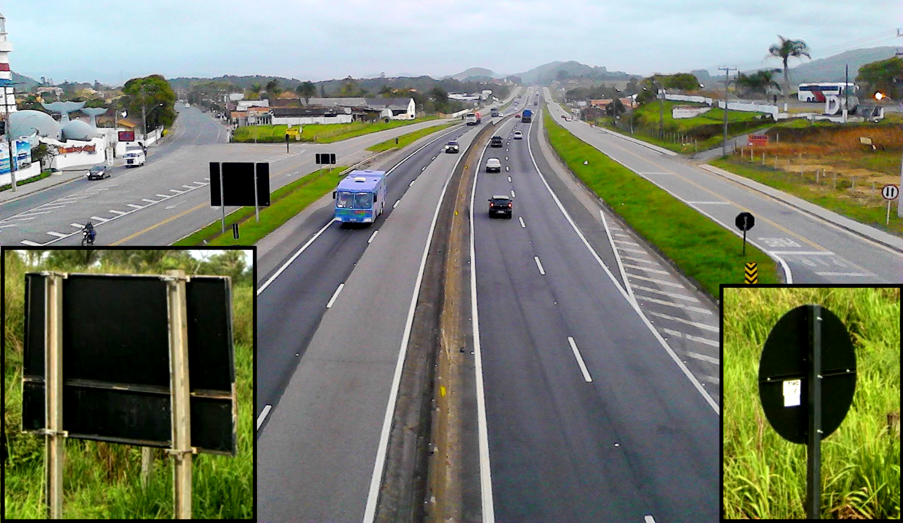
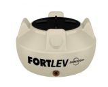
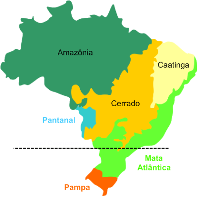
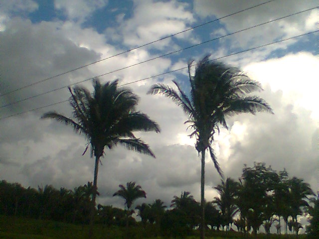
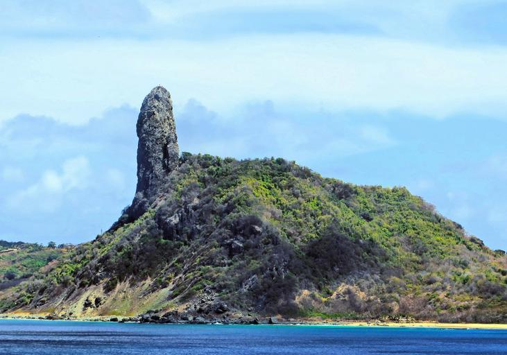

    <h2 class="section-title">{}</h2>
    <ul class="rule-list">
        <li>ドメインは.br</li>
        <li>言語はポルトガル語であり「Ã・ã」の文字が特徴的</li>
        <li>標識の裏側が黒いものが多い</li>
        <li>家のアンテナが特徴的で透明なパラボラアンテナが多い</li>
        <li>ナンバープレートの上側が青色の時がある{}</li>
        <li>トラック・バス・タクシーの車両のナンバープレートが赤色</li>
        <li>電柱の溝に仕切りがある電柱を使っている</li>
    </ul>
    {}

{}
{}

{}
言語はポルトガル語であり「Ã・ã」の文字が特徴的
{}

{}
標識の裏側が黒いものが多い（背景画像は<a href="https://commons.wikimedia.org/w/index.php?curid=57310907">こちら</a>のものを使用, <a href="https://creativecommons.org/licenses/by/3.0" title="Creative Commons Attribution 3.0">CC BY 3.0</a>）。
{}

{}
家のアンテナが特徴的で透明なパラボラアンテナを使う{}。ただしこれだけでは確定できない。
{}

{}
トラック・バス・タクシーの車両のナンバープレートが赤かったり文字が赤かったりする。
{}

{}

By Olympiobr - Own work, <a href="https://creativecommons.org/licenses/by-sa/3.0/deed.ja">CC BY-SA 3.0</a>, <a href="https://commons.wikimedia.org/w/index.php?curid=20547078">Wikimedia Commons</a>
{}

{}
南米石油最大手ペトロブラスのロゴがある{}{}。
{}

{}
Fortlevと書かれたタンクがある{}。色はいくつか種類があるが形が特徴的。屋根の上に乗っているのがわかる。
{}

{}
ブラジルの電柱は溝に仕切りがある{}。一方で{}は仕切りが無いかひとつだけある{}。円形の電柱も見られる。また、道端にBRと書かれた看板も見られる。
{}

{}
{}

<iframe width="560" height="315" src="https://www.youtube.com/embed/kges-ekKMI4" title="YouTube video player" frameborder="0" allow="accelerometer; autoplay; clipboard-write; encrypted-media; gyroscope; picture-in-picture; web-share" allowfullscreen></iframe>

<iframe width="560" height="315" src="https://www.youtube.com/embed/n9PebEV7j3Y" title="YouTube video player" frameborder="0" allow="accelerometer; autoplay; clipboard-write; encrypted-media; gyroscope; picture-in-picture; web-share" allowfullscreen></iframe>

{}
{}

{}
南米最大規模の銀行、Banco Itaúのオレンジ色の看板がたくさんある。ガソリンスタンドに南米石油最大手ペトロブラス（緑色のロゴ）のものが多い。
{}

{}
{}

    <ul class="rule-list-none">
        <li>{}</li>
    </ul>

{}
{}

    <h2 class="section-title">{}</h2>
    <ul class="rule-list">
        <li>市外局番のエリアコードで範囲を絞ることができる</li>
        <li>「BR XX」と道路番号が書かれた看板が道端に立っている</li>
        <li>Florianópolis{}を中心に{}からの移民の影響を受けたヨーロッパ風の建築が見られる</li>
    </ul>

{}
{}

{}
1がサンパウロ、2がリオデジャネイロ。基本的に東から西へと数字が大きくなる。
{}

By Magno Brasil - Own work, <a href="https://creativecommons.org/licenses/by-sa/4.0/deed.ja">CC BY-SA 4.0</a>, <a href="https://commons.wikimedia.org/w/index.php?curid=61641585">Wikimedia Commons(Link)</a>

{}
{}

{}
いきなり道路番号を探すのはかなり難しいので周りの雰囲気から地域を絞り込んだ上で探してみる。
{}

{}
{}

{}
建設時に{}出身のポルトガル人が多く入植した影響でヨーロッパ系移民を先祖に持つ市民が多くを占めている{{% ref "https://ja.wikipedia.org/wiki/%E3%83%95%E3%83%AD%E3%83%AA%E3%82%A2%E3%83%8E%E3%83%BC%E3%83%9D%E3%83%AA%E3%82%B9" "フロリアノーポリス" %}}。ドイツ系とイタリア系の移民が多く、建築もヨーロッパ風のものが多い。
{}

By dnsilva1, <a href="https://creativecommons.org/licenses/by-sa/3.0" title="Creative Commons Attribution-Share Alike 3.0">CC BY-SA 3.0</a>, <a href="https://commons.wikimedia.org/w/index.php?curid=53785493">Link</a>

{}
{}

    <h4 class="section-title">植生</h4>
    <ul class="rule-list">
        <li>地域ごとに植生と土の色が異なる
            <ul>
                <li>Amazônia：湿度の高い赤道気候でアマゾンの森林が存在する</li>
                <li>Cerrado：畑が多い地域も木がたくさんある地域もあり判別が難しい</li>
                <li>Mata Atlântica：ブラジルの大西洋の海岸線15州以上に広がって分布する森林</li>
                <li>Caatinga：乾燥した土壌であり白っぽい土壌が含まれることが多い</li>
                <li>Pampa：ウルグアイに近い雰囲気で農牧地がある</li>
                <li>Pantanal：パラグアイ北部の河川による沖積平野だが道がほとんど無い</li>
            </ul>
        </li>
    </ul>

{}
{}

画像出典：By Brazil Travel, <a href="https://creativecommons.org/licenses/by-sa/4.0/deed.ja">CC BY-SA 4.0</a>, <a href="https://commons.wikimedia.org/w/index.php?curid=53887697">Wikimedia Commons</a>

{}
{}

<iframe src="https://www.google.com/maps/embed?pb=!4v1682559206378!6m8!1m7!1snECoHmCIn8H4i4jKaqG30A!2m2!1d3.690005481394581!2d-61.70034552882197!3f303.12705986159517!4f-6.649236407431545!5f0.7820865974627469" width="295" height="295" style="border:0;" allowfullscreen="" loading="lazy" referrerpolicy="no-referrer-when-downgrade"></iframe>
<iframe src="https://www.google.com/maps/embed?pb=!4v1682558624818!6m8!1m7!1sBIoAJhz54UC94nW5FQJgUQ!2m2!1d3.360432252131066!2d-51.67337002057713!3f314.391452254387!4f-7.744641660505394!5f0.7820865974627469" width="295" height="295" style="border:0;" allowfullscreen="" loading="lazy" referrerpolicy="no-referrer-when-downgrade"></iframe>

{}
{}

<iframe src="https://www.google.com/maps/embed?pb=!4v1682558848930!6m8!1m7!1sM2GjbU_HquLSsO2JwHis8w!2m2!1d-16.40290145846666!2d-50.40739402454159!3f204.87821931998835!4f-4.8153556383479525!5f1.6369705511924675" width="295" height="295" style="border:0;" allowfullscreen="" loading="lazy" referrerpolicy="no-referrer-when-downgrade"></iframe>
<iframe src="https://www.google.com/maps/embed?pb=!4v1682558918394!6m8!1m7!1sIN5hwMuiUer-EE8lQx3n1A!2m2!1d-18.36066707210302!2d-45.77849523104562!3f43.417439846579754!4f9.076290026625571!5f0.7820865974627469" width="295" height="295" style="border:0;" allowfullscreen="" loading="lazy" referrerpolicy="no-referrer-when-downgrade"></iframe>

{}
{}

<iframe src="https://www.google.com/maps/embed?pb=!4v1682559737817!6m8!1m7!1svvKhW2qiFBOP2bBrL8m4ng!2m2!1d-4.98516390409495!2d-37.31726763464727!3f93.42795566482673!4f-6.246105023247111!5f2.5799526629061464" width="295" height="295" style="border:0;" allowfullscreen="" loading="lazy" referrerpolicy="no-referrer-when-downgrade"></iframe>
<iframe src="https://www.google.com/maps/embed?pb=!4v1682559662442!6m8!1m7!1sukGcTr9M-csVMN0rymRoFg!2m2!1d-6.539873595640429!2d-37.50937460537717!3f191.185849265598!4f-14.12474621815224!5f1.568316941340889" width="295" height="295" style="border:0;" allowfullscreen="" loading="lazy" referrerpolicy="no-referrer-when-downgrade"></iframe>

{}
{}

{}
地域ごとに植物も異なる。海から吹く湿った風の影響を受ける。他の地域とは森の見た目が異なる。ヤシや松のようなものが見える時がある気がする。{}。
{}

<iframe src="https://www.google.com/maps/embed?pb=!4v1682560156122!6m8!1m7!1swa_zmjlH2gqBQ2oabyLhSA!2m2!1d-22.0252523845475!2d-41.07132487765809!3f264.15454414488715!4f-1.6958916170852945!5f1.5378273234838713" width="295" height="295" style="border:0;" allowfullscreen="" loading="lazy" referrerpolicy="no-referrer-when-downgrade"></iframe>
<iframe src="https://www.google.com/maps/embed?pb=!4v1682559846434!6m8!1m7!1sEZrg2IvmS_Dpo40Li5NgwA!2m2!1d-12.27769993257875!2d-37.8820651128763!3f359.89142704476234!4f4.171539727133862!5f1.5135439780731126" width="295" height="295" style="border:0;" allowfullscreen="" loading="lazy" referrerpolicy="no-referrer-when-downgrade"></iframe>

{}
{}

<iframe src="https://www.google.com/maps/embed?pb=!4v1682560746237!6m8!1m7!1s9dhF35gqnNfT06exQSZq8A!2m2!1d-29.97944047612433!2d-56.54452566178293!3f66.06010993564273!4f-2.148703313678041!5f2.8062917746442597" width="295" height="295" style="border:0;" allowfullscreen="" loading="lazy" referrerpolicy="no-referrer-when-downgrade"></iframe>
<iframe src="https://www.google.com/maps/embed?pb=!4v1682560839626!6m8!1m7!1szmXGuOU-85y4w39NLD_xMg!2m2!1d-31.76440676809355!2d-54.15591499962603!3f222.87300769244834!4f-3.5749410915477!5f2.9377560244887877" width="295" height="295" style="border:0;" allowfullscreen="" loading="lazy" referrerpolicy="no-referrer-when-downgrade"></iframe>

{}
{}

<iframe src="https://www.google.com/maps/embed?pb=!4v1682639619124!6m8!1m7!1s3p5OupPwhc2DiKhsj27uPw!2m2!1d-19.01679467617658!2d-57.53193554803059!3f158.0077363936258!4f-23.38418793810321!5f1.7410521314355352" width="295" height="295" style="border:0;" allowfullscreen="" loading="lazy" referrerpolicy="no-referrer-when-downgrade"></iframe>
<iframe src="https://www.google.com/maps/embed?pb=!4v1682639577855!6m8!1m7!1sCmml6mgQBChhNysXhxcEyA!2m2!1d-19.36288315842267!2d-57.55096809136056!3f219.91708888805192!4f-13.84361818284306!5f2.956808514492435" width="295" height="295" style="border:0;" allowfullscreen="" loading="lazy" referrerpolicy="no-referrer-when-downgrade"></iframe>

{}
{}

    <h4 class="section-title">特徴的な植物</h4>
    <ul class="rule-list">
        <li>特定の地域や州が分かる木
            <ul>
                <li>パラナ松：パラナ松{}はパラナ州周辺{}</li>
                <li>ブラジルロウヤシ：セアラー州を中心とした北東部</li>
                <li>ババスの木：ピアウイ州とマラニョン州{}、それ以外でも南側全域で見られる</li>
            </ul>
        </li>
    </ul>

{}
{}

{}
この木はパラナ州周辺{}
{}
{}
{}

By <a href="//commons.wikimedia.org/wiki/User:Tacarijus" title="User:Tacarijus">Tacarijus</a> - Own work, <a href="https://creativecommons.org/licenses/by/2.5" title="Creative Commons Attribution 2.5">CC BY 2.5</a>, <a href="https://commons.wikimedia.org/w/index.php?curid=2493694">Link</a>

{}
この木はセアラー州周辺
{}
{}
{}

{}
ピアウイ州とマラニョン州{}に多く、それ以外でも南側全域で見られる
{}
{}
{}

By Photo by David J. Stang - source: David Stang. First published at ZipcodeZoo.com, <a href="https://creativecommons.org/licenses/by-sa/4.0" title="Creative Commons Attribution-Share Alike 4.0">CC BY-SA 4.0</a>, <a href="https://commons.wikimedia.org/w/index.php?curid=61163295">Link</a>

{}
Syagrus coronataはペルナンブコ州の南部からバイーア州に分布する、ブラジル東部で見ることができる木。バイーアが多いかも。
{}
{}
{}

By <a rel="nofollow" class="external text" href="https://www.flickr.com/people/92252798@N07">Dick Culbert</a> from Gibsons, B.C., Canada - <a rel="nofollow" class="external text" href="https://www.flickr.com/photos/92252798@N07/19866677541/">Euterpe precatoria</a>, <a href="https://creativecommons.org/licenses/by/2.0" title="Creative Commons Attribution 2.0">CC BY 2.0</a>, <a href="https://commons.wikimedia.org/w/index.php?curid=50113767">Link</a>

{}
アサイゼイロ(açaizeiro)はパラ―州に多い{}。特にアマゾン川流域やマラジョー島の周りに多いらしい{}。
{}
{}
{}

By <a href="//commons.wikimedia.org/wiki/User:Poyt448" title="User:Poyt448">Poyt448 Peter Woodard</a> - Own work, <a href="https://creativecommons.org/licenses/by-sa/3.0" title="Creative Commons Attribution-Share Alike 3.0">CC BY-SA 3.0</a>, <a href="https://commons.wikimedia.org/w/index.php?curid=15235273">Link</a>

{}
サンパウロ～リオグランデ・ド・スル州の沿岸付近の地域を中心にまばらに分布している{}。
{}
{}
{}

    <h2 class="section-title">{}</h2>
    <ul class="rule-list">
        <li>フェルナンド・デ・ノローニャという離島がある{}</li>
        <li>ロカス環礁にストリートビューがあり灯台の跡やサンゴ礁が見える{}</li>
    </ul>

{}
{}
{}
電柱に穴が開いている。岩場が多く船に乗る場所もある。凄く特徴的な岩があるのでそれで分かるかも{}。
{}

{}
{}
{}
世界遺産{}。道が無いためピンポイントで当てるのは難しい。
{}

By <a href="//commons.wikimedia.org/w/index.php?title=User:Rodrigonavy&amp;amp;action=edit&amp;amp;redlink=1" class="new" title="User:Rodrigonavy (page does not exist)">Rodrigo Pereira Barbosa</a> - Own work, <a href="https://creativecommons.org/licenses/by-sa/4.0" title="Creative Commons Attribution-Share Alike 4.0">CC BY-SA 4.0</a>, <a href="https://commons.wikimedia.org/w/index.php?curid=60490963">Link</a>

{}
{}

{}
<li>左から二番目の電柱画像のみ以下の画像から抜粋しています</li>
<li>　By <a href="https://www.wikidata.org/wiki/Q57979330" class="extiw" title="d:Q57979330">Paul R. Burley</a> - Own work, <a href="https://creativecommons.org/licenses/by-sa/4.0" title="Creative Commons Attribution-Share Alike 4.0">CC BY-SA 4.0</a>, <a href="https://commons.wikimedia.org/w/index.php?curid=74494644">Link</a></li>
{}