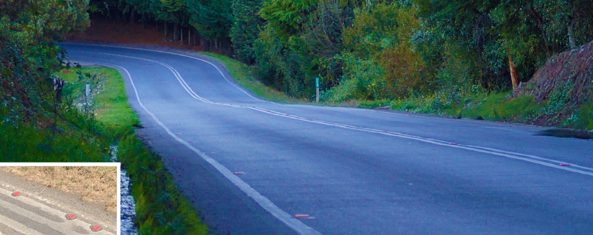
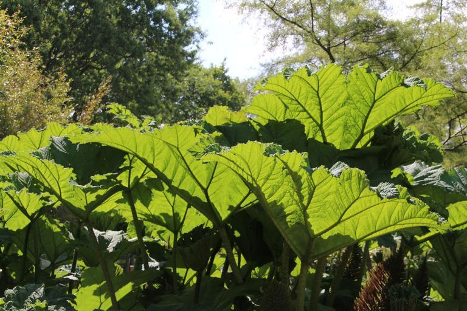

    <h2 class="section-title">{}</h2>
    <ul class="rule-list">
        <li>言語はスペイン語</li>
        <li>ドメインは.cl</li>
        <li>電柱の真ん中がへこんでる領域が長く区切りがない{}</li>
        <li>標識の棒に溝がある {}</li>
        <li>ルピナス属の紫色や白色の花が道沿いに生えていることがある{{% ref "https://ja.wikipedia.org/wiki/%E3%83%AB%E3%83%94%E3%83%8A%E3%82%B9%E5%B1%9E" "ルピナス属" %}}</li>
    </ul>
    {}

{}
{}

{}
電柱のへこんでいる領域に区切りがない電柱が多く{}たまにひとつかふたつ区切りがある{}。同じような仕切りのない電柱が{}や稀に{}・{}にもあるけれど、これらは左側通行で景色も大きく異なるので間違える心配は少ないはず。
{}

左側画像：By <a rel="nofollow" class="external text" href="https://www.panoramio.com/user/jorgebarrios">Jorge Barrios</a> - Own work, <a href="https://creativecommons.org/licenses/by-sa/3.0" title="Creative Commons Attribution-Share Alike 3.0">CC BY-SA 3.0</a>, <a href="https://commons.wikimedia.org/w/index.php?curid=9625972">Link</a>より, 一部加工あり.

{}
標識の棒にも電柱のような感じの溝がある（コメントで教えてもらいました）{}
{}

{}
ルピナス属の植物が道沿いに生えていることがある。紫色や白の花{}{{% ref "https://ja.wikipedia.org/wiki/%E3%83%AB%E3%83%94%E3%83%8A%E3%82%B9%E5%B1%9E" "ルピナス属" %}}。こういう黄色のコンクリ道路はかなり南のイメージ。
{}

{}
そして道路に赤い反射板がある{}。
{}

By [-_-] JORGE - <a rel="nofollow" class="external free" href="https://www.flickr.com/photos/graficmedia/27486177645/">https://www.flickr.com/photos/graficmedia/27486177645/</a>, <a href="https://creativecommons.org/licenses/by/2.0" title="Creative Commons Attribution 2.0">CC BY 2.0</a>, <a href="https://commons.wikimedia.org/w/index.php?curid=100162985">Link</a>

{}
チリの大手商用銀行、Banco de Chile。
{}

{}
{}
{}
道路に赤い反射板がある
{}

<iframe src="https://www.google.com/maps/embed?pb=!4v1685263976721!6m8!1m7!1sQGpNknTcuFVD8u9JUTPXPA!2m2!1d-33.92383950201787!2d-71.2492240456672!3f335.5104874503583!4f-56.182447229729505!5f1.566519561426944" width="295" height="295" style="border:0;" allowfullscreen="" loading="lazy" referrerpolicy="no-referrer-when-downgrade"></iframe>
<iframe src="https://www.google.com/maps/embed?pb=!4v1683907472964!6m8!1m7!1sLyylaQ3ia5rR7gh2FHmq0w!2m2!1d-42.74865133810841!2d-73.64731447604524!3f322.39507274537885!4f-16.69615091295745!5f3.325193203789971" width="295" height="295"style="border:0;" allowfullscreen="" loading="lazy" referrerpolicy="no-referrer-when-downgrade"></iframe>

{}
{}
{}
タクシーのナンバープレートの色がオレンジか赤のような色。しかし白・赤・オレンジ・緑など複数の色があるのでナンバー単体では判別しにくい。
{}

<iframe src="https://www.google.com/maps/embed?pb=!4v1692166749202!6m8!1m7!1sIdhZ8ACciZIxpVULvNV1FQ!2m2!1d-53.12382706737735!2d-70.89607506801812!3f223.1374297210024!4f-4.946093561937602!5f1.8943177283881312" width="600" height="400" style="border:0;" allowfullscreen="" loading="lazy" referrerpolicy="no-referrer-when-downgrade"></iframe>

{}

By <a href="//commons.wikimedia.org/w/index.php?title=User:Apino&amp;amp;action=edit&amp;amp;redlink=1" class="new" title="User:Apino (page does not exist)">Apino</a> - Own work, <a href="https://creativecommons.org/licenses/by-sa/4.0" title="Creative Commons Attribution-Share Alike 4.0">CC BY-SA 4.0</a>, <a href="https://commons.wikimedia.org/w/index.php?curid=4404415">Link</a>, 画像はオリジナルから加工しています
{}

{}
{}
{}
リチウム関連企業（Sociedad Química y Minera de Chile；いわゆるSOQUIMICH・SQM、Albemarle）や銅関連の企業の施設があるかも。でも都会には拠点が無いのでストリートビューで行くことができる場所は限定されている。
{}

<iframe src="https://www.google.com/maps/embed?pb=!4v1681566698923!6m8!1m7!1sxaOu6D3hWt1iN_ZoESdjGg!2m2!1d-23.76015486133888!2d-70.31000667891672!3f271.6616207675847!4f-3.6711590364433846!5f3.325193203789971" width="295" height="295" style="border:0;" allowfullscreen="" loading="lazy" referrerpolicy="no-referrer-when-downgrade"></iframe>

{}
{}

<iframe src="https://www.google.com/maps/embed?pb=!4v1689596428727!6m8!1m7!1s-0TcU12wSJ298X8KfERlKg!2m2!1d-26.76299323362851!2d-70.74143127543985!3f8.62858392710753!4f-12.305980848488176!5f3.325193203789971"width="295" height="295" style="border:0;" allowfullscreen="" loading="lazy" referrerpolicy="no-referrer-when-downgrade"></iframe>

{}
{}

<iframe src="https://www.google.com/maps/embed?pb=!4v1680528791187!6m8!1m7!1s1rHB8stDQ66Sas8taI_BWQ!2m2!1d-54.93519505315864!2d-67.60323955353884!3f286.7245678587484!4f-14.221568029275005!5f3.0118685857498058" width="295" height="295" style="border:0;" allowfullscreen="" loading="lazy" referrerpolicy="no-referrer-when-downgrade"></iframe>

{}
{}

    <h2 class="section-title">{}</h2>
    <ul class="rule-list">
        <li>特徴的な植物がたくさんあるので植物をみたら南北の位置がわかるかも
            <ul>
                <li>Chilean rhubarbが生えている地域が限定されている{}</li>
                <li>{}</li>
            </ul>
        </li>
        <li class="no-evidence">クリコ{}より北では雪山はほぼ無い</li>
    </ul>

{}
{}
{}
分布はplonkitなどを参照{}{}
{}

{}
{}
{}
E-375道路がある緯度付近。
{}

<iframe src="https://www.google.com/maps/embed?pb=!4v1692168171171!6m8!1m7!1sFhtFCCbsa6vMRFRUmvkjRw!2m2!1d-32.31163704925859!2d-70.80982020342161!3f313.85445377340886!4f9.51749813098266!5f1.6672674510265906" width="600" height="350" style="border:0;" allowfullscreen="" loading="lazy" referrerpolicy="no-referrer-when-downgrade"></iframe>

{}
{}

    <h2 class="section-title">{}</h2>
    <ul class="rule-list">
        <li>サンティアゴ付近の山が特徴的なので覚えておくと役に立つかも</li>
        <li>雪が積もっている地域と海が北に見える＝<a href="https://ja.wikipedia.org/wiki/%E3%83%97%E3%82%A8%E3%83%AB%E3%83%88%E3%83%BB%E3%82%A6%E3%82%A3%E3%83%AA%E3%82%A2%E3%83%A0%E3%82%BA">プエルト・ウィリアムズ</a></li>
    </ul>

{}
{}
{}
サンティアゴ・デ・チレ付近にある木や草がまばらに生えた山が印象的
{}

<iframe src="https://www.google.com/maps/embed?pb=!4v1682319020365!6m8!1m7!1sWaYu1VBEoWqDCyuPq7vSyg!2m2!1d-32.95547998959191!2d-70.82215045009526!3f271.5435062159679!4f11.257439414295973!5f2.1783148187435164" width="590" height="250" style="border:0;" allowfullscreen="" loading="lazy" referrerpolicy="no-referrer-when-downgrade"></iframe>

{}
{}
{}
雪が積もっている地域と海が北に見える＝<a href="https://ja.wikipedia.org/wiki/%E3%83%97%E3%82%A8%E3%83%AB%E3%83%88%E3%83%BB%E3%82%A6%E3%82%A3%E3%83%AA%E3%82%A2%E3%83%A0%E3%82%BA">プエルト・ウィリアムズ</a>。稀にトラックのような車が見えることもある。
{}

<iframe src="https://www.google.com/maps/embed?pb=!4v1680528610024!6m8!1m7!1senXCQJxObSJCvy4a4nZO3w!2m2!1d-54.93243233821228!2d-67.59691137517112!3f349.08918895182273!4f3.715111457463024!5f3.325193203789971" width="590" height="250" style="border:0;" allowfullscreen="" loading="lazy" referrerpolicy="no-referrer-when-downgrade"></iframe>

{}
{}