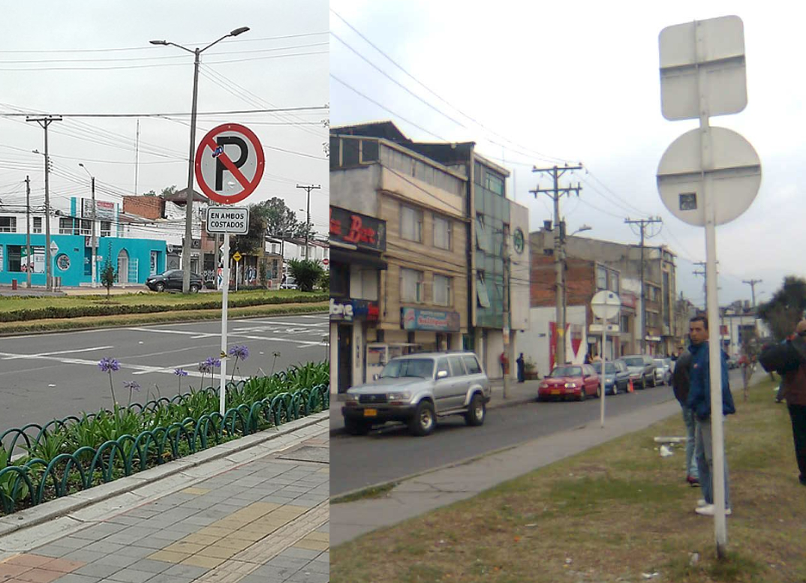
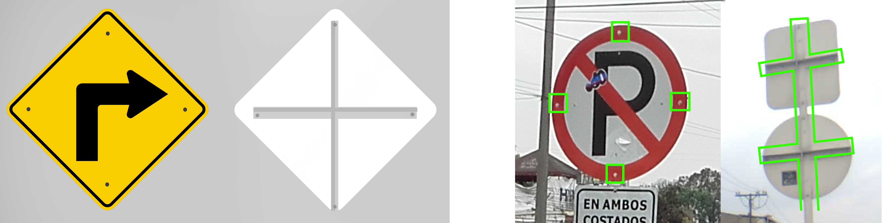
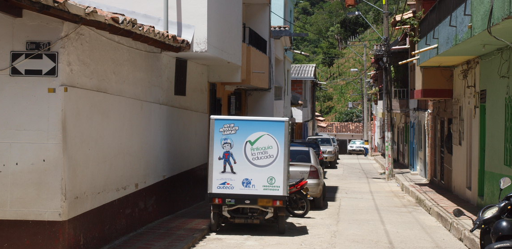
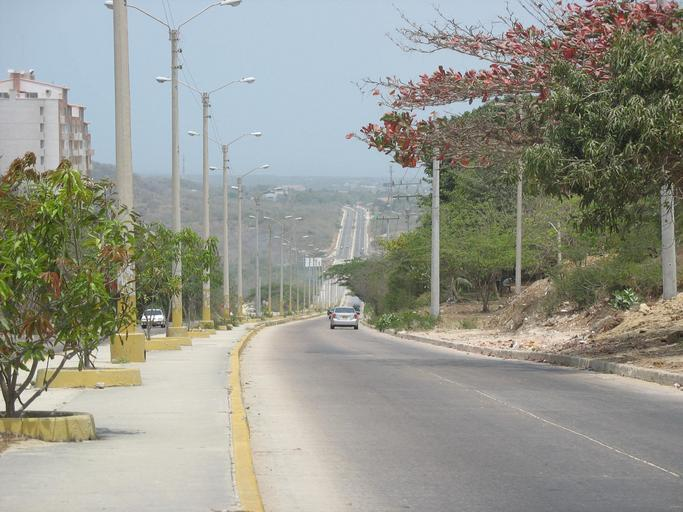
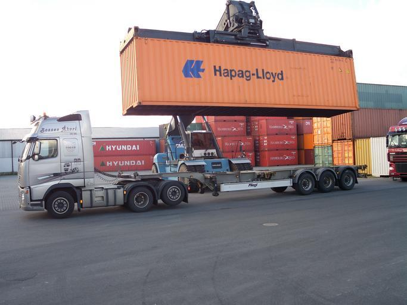

    <h2 class="section-title">{}</h2>
    <ul class="rule-list">
        <li>Domainnya adalah .co</li>
        <li>Bahasanya adalah Spanyol</li>
        <li>Pembatas jalan berwarna putih dengan garis tengah berwarna kuning</li>
        <li>Plat nomor berwarna kuning di depan dan belakang</li>
        <li>Bagian belakang rambu jalan memiliki salib {}</li>
    </ul>
    {}

{}
{}
{}
Bagian belakang rambu jalan memiliki salib (yang dikenal sebagai Kolombian Cross). Dari belakang, salib ini terlihat jelas {}, sementara dari depan terlihat empat sekrup {}{}. Tiang dan bagian belakangnya biasanya berwarna putih. Kadang-kadang, tanda yang mirip salib juga ditemukan di {} sehingga perlu diperhatikan {}.
{}

{}
Plat nomor berwarna kuning di depan dan belakang {} atau putih. Pada motor, plat nomor di belakang juga berwarna kuning {}. Di {} juga ditemukan plat kuning, namun di Kolombia warnanya cenderung lebih mendekati jingga.
{}

{}

Buatan sendiri
{}

{}
Pagar kayu di tepi jalan yang dilapisi kawat berduri juga sering terlihat {}.
{}

{}
{}

<iframe src="https://www.google.com/maps/embed?pb=!4v1679138005508!6m8!1m7!1sIS7P4fzaicRfinbA0j5TRw!2m2!1d3.396441393668646!2d-76.52339001433994!3f136.71002847658113!4f-4.691034225921541!5f2.908818923327662" width="295" height="295" style="border:0;" allowfullscreen="" loading="lazy" referrerpolicy="no-referrer-when-downgrade"></iframe>
<iframe src="https://www.google.com/maps/embed?pb=!4v1679137921739!6m8!1m7!1sTVla3KChW9nZzIzHjNIHlA!2m2!1d2.516340478781876!2d-76.50260350297357!3f38.38964881780703!4f2.329973697644803!5f3.325193203789971" width="295" height="295" style="border:0;" allowfullscreen="" loading="lazy" referrerpolicy="no-referrer-when-downgrade"></iframe>

{}
{}

<iframe src="https://www.google.com/maps/embed?pb=!4v1679138121122!6m8!1m7!1s8SXbik_yGaQLNRhtJ09C9w!2m2!1d3.409759690878096!2d-76.34769438237707!3f257.9149055646081!4f-17.67114175853544!5f3.310312940442755" width="295" height="295" style="border:0;" allowfullscreen="" loading="lazy" referrerpolicy="no-referrer-when-downgrade"></iframe>
<iframe src="https://www.google.com/maps/embed?pb=!4v1679813576129!6m8!1m7!1slrDq90ex1FOkTtQRvay6uQ!2m2!1d2.457006309841755!2d-76.59672523907327!3f38.54073997962945!4f-8.688211803202734!5f3.325193203789971" width="295" height="295" style="border:0;" allowfullscreen="" loading="lazy" referrerpolicy="no-referrer-when-downgrade"></iframe>

{}
{}

<iframe width="300" height="533" src="https://www.youtube.com/embed/HPA9Df2Pt5k" title="Dapatkah Anda Menebak Negara Tanpa Bergerak? Bagian 3 #geoguesser #ジオゲッサー" frameborder="0" allow="accelerometer; autoplay; clipboard-write; encrypted-media; gyroscope; picture-in-picture; web-share" allowfullscreen></iframe>

{}
{}

    <h2 class="section-title">{}</h2>
    <ul class="rule-list">
        <li>Penyebaran vegetasi
            <ul>
                <li>Wilayah sekitar Sungai Meta hingga Tenggara{}Mendekati Amazon, tanah menjadi merah{}</li>
                <li>Pedalaman Timur Laut{}Utara Sungai Meta memiliki tanah dengan sedikit nutrisi{}. Wilayahnya datar dengan lanskap seperti savana. Pohon tinggi jarang tumbuh{}.</li>
                <li>Pesisir Utara Paling Jauh{}Wilayah ini memiliki area gurun{}</li>
                <li>Pesisir Utara{}Terkadang pasir putih terlihat atau pasir menumpuk di sudut jalan perkotaan{}
            </ul>
        </li>
    </ul>

{}
{}

{}{}
{}

{}
{}

<iframe src="https://www.google.com/maps/embed?pb=!4v1724643610859!6m8!1m7!1sBIcNt4xsnUfokjXCybOgHg!2m2!1d4.602275365601597!2d-71.32989609669042!3f286.654692572383!4f0.7336775861570146!5f0.7820865974627469" width="50%" height="350" style="border:0;" allowfullscreen="" loading="lazy" referrerpolicy="no-referrer-when-downgrade"></iframe>
<iframe src="https://www.google.com/maps/embed?pb=!4v1724643692274!6m8!1m7!1sVt5r5LBc2uuz28unKhKePw!2m2!1d5.142917721291913!2d-70.85523539217012!3f64.50154964757415!4f-6.841048431238178!5f0.7820865974627469" width="50%" height="350" style="border:0;" allowfullscreen="" loading="lazy" referrerpolicy="no-referrer-when-downgrade"></iframe>

{}
{}

{}Sebelah timur Pegunungan Andes. Wilayah datar terbentang, tanah di sepanjang Sungai Meta miskin nutrisi, dan tumbuhan jarang tumbuh.
{}

<iframe src="https://www.google.com/maps/embed?pb=!4v1698477978676!6m8!1m7!1sJ7PxXLjpjpVyDVlXzarldg!2m2!1d5.83751805366215!2d-71.56842506393753!3f96.78577479284539!4f-4.90967899975233!5f0.4000000000000002" width="50%" height="300" style="border:0;" allowfullscreen="" loading="lazy" referrerpolicy="no-referrer-when-downgrade"></iframe>
<iframe src="https://www.google.com/maps/embed?pb=!4v1695093011695!6m8!1m7!1sYS6llO69H9wDnK4lXZMVjg!2m2!1d4.62827564681296!2d-71.51255306646532!3f98.38560507105616!4f9.95777762781087!5f0.7820865974627469" width="50%" height="300" style="border:0;" allowfullscreen="" loading="lazy" referrerpolicy="no-referrer-when-downgrade"></iframe>

{}Mengacu pada wilayah datar di sebelah timur pada peta di bawah.
{}

By <a href="//commons.wikimedia.org/wiki/User:Milenioscuro" title="User:Milenioscuro">Milenioscuro</a> - Own work<a rel="nofollow" class="external text" href="http://www.demis.nl/home/pages/Gallery/examples.htm">Demis</a><a rel="nofollow" class="external text" href="http://mapascolombia.igac.gov.co/wps/portal/mapasdecolombia/">Instituto Geográfico Agustín Codazzi</a> - <a rel="nofollow" class="external text" href="http://190.254.22.44/mapas_de_colombia/IGAC/Oficial_F2004.pdf">Mapa oficial de la República de Colombia</a><a rel="nofollow" class="external text" href="https://web.archive.org/web/20090419184417/http://www.state.gov/g/oes/ocns/opa/convention/c16065.htm">U.S. Department of State</a> - <a rel="nofollow" class="external text" href="http://www.law.fsu.edu/library/collection/LimitsinSeas/numerical.html">Limits in the Seas</a><a rel="nofollow" class="external text" href="http://www.lablaa.org/blaavirtual/geografia/ctemc/ctemc02.htm">Biblioteca Luis Ángel Arango - La territorialización del Mar Caribe</a><a rel="nofollow" class="external text" href="http://www.armada.mil.co/index.php?idcategoria=17895">Armada Nacional de Colombia - Tratados Limítrofes Marítimos de la República de Colombia</a>, <a href="https://creativecommons.org/licenses/by-sa/3.0" title="Creative Commons Attribution-Share Alike 3.0">CC BY-SA 3.0</a>, <a href="https://commons.wikimedia.org/w/index.php?curid=5996689">Link</a>

{}
{}

{}Tanah di wilayah ini mendekati gurun.
{}

<iframe src="https://www.google.com/maps/embed?pb=!4v1698478231917!6m8!1m7!1sXYa1y5q7TWzM83XW_5REOQ!2m2!1d12.22138283185131!2d-72.00399523440888!3f159.2251834180408!4f8.102522936338175!5f0.4466155912658266" width="50%" height="300" style="border:0;" allowfullscreen="" loading="lazy" referrerpolicy="no-referrer-when-downgrade"></iframe>
<iframe src="https://www.google.com/maps/embed?pb=!4v1698478274621!6m8!1m7!1s7UcHWQsa0hieX278UgxqWQ!2m2!1d11.99291092021987!2d-72.13943591872511!3f198.742220149102!4f-0.7741004515764303!5f0.7820865974627469" width="50%" height="300" style="border:0;" allowfullscreen="" loading="lazy" referrerpolicy="no-referrer-when-downgrade"></iframe>

{}
{}
{}Foto ini kemungkinan menunjukkan jalan di sekitar Barranquilla{}.
{}

{}
{}

    <ul class="rule-list">
        <li>Jalan menuju Buenaventura sering terlihat banyak truk yang membawa kontainer</li>
        <li>Tiang listrik dengan garis hitam dan kuning mungkin menandakan wilayah Provinsi Antioquia</li>
        <li>Nomor jalan tertulis pada bollard{}</li>
        <li>{} memiliki Google Car yang khas</li>
    </ul>

{}
{}
{}Buenaventura adalah pelabuhan utama Kolombia dan menangani sekitar 60% ekspor-impor laut negara itu. Oleh karena itu, jalan menuju pelabuhan ini sering dipenuhi truk kontainer{}. Kontainer dari {} juga dapat ditemukan{}.
{}

{}
{}
{}Di daerah sekitar Medellín, beberapa tiang listrik memiliki garis hitam dan kuning{}.
{}

{}
{}
{}Nomor jalan tertulis pada bollard{}.
{}

{}
{}

    <h2 class="section-title">{}</h2>
    <ul class="rule-list">
        <li>Taksi atau truk memiliki stiker atau papan di atap atau sisi yang mencantumkan nama kota</li>
        <li>Berjalan di kota Bocachica di Pulau Tierra Bomba{}</li>
        <li>Kota Leticia di dekat perbatasan {} dan {} memiliki Google Car yang dapat terlihat{}</li>
        <li>Berjalan di Pulau Gorgona</li>
        <li>Kota Santa Rosalía, yang terpisah dari kota lain, memiliki sebagian kecil tampilan Street View</li>
    </ul>

{}
{}
{}Stiker bertuliskan CARTAGENA dapat ditemukan. Terkadang juga ada pada atap atau sisi truk{}.
{}

{}
{}
{}Berjalan di kota terpencil di pulau dengan benteng. Kadang ada orang yang berjalan bersama{}.
{}

By <a href="//commons.wikimedia.org/w/index.php?title=User:Zandcee&amp;amp;action=edit&amp;amp;redlink=1" class="new" title="User:Zandcee (page does not exist)">Zandcee</a> - Own work, <a href="https://creativecommons.org/licenses/by-sa/4.0" title="Creative Commons Attribution-Share Alike 4.0">CC BY-SA 4.0</a>, <a href="https://commons.wikimedia.org/w/index.php?curid=97982081">Link</a>

{}
{}
{}Terhubung secara darat dengan Tabatinga di Brasil dan memiliki hubungan ekonomi yang erat{}. Tiang listrik menyerupai yang ada di Brasil dapat ditemukan{}. Sebagai destinasi wisata, banyak taksi dan wisatawan terlihat. Google Car yang khas juga dapat ditemukan{}.
{}

By Sascha Grabow <a rel="nofollow" class="external text" href="http://www.saschagrabow.com">www.saschagrabow.com</a> - Own work, <a href="https://creativecommons.org/licenses/by-sa/3.0" title="Creative Commons Attribution-Share Alike 3.0">CC BY-SA 3.0</a>, <a href="https://commons.wikimedia.org/w/index.php?curid=14129358">Link</a>

{}
{}
{}Pulau terpencil bernama Pulau Gorgona{}.
{}

{}
{}

<iframe src="https://www.google.com/maps/embed?pb=!4v1722605929321!6m8!1m7!1sN34ZpOe8i46jyOiU0yY-sA!2m2!1d5.141897815010507!2d-70.85717884186371!3f252.56210245552822!4f-1.7194538988717767!5f0.4000000000000002" width="600" height="400" style="border:0;" allowfullscreen="" loading="lazy" referrerpolicy="no-referrer-when-downgrade"></iframe>

{}
{}

{}
<li>◆ Keduanya telah diedit, hanya memotong bagian tanda</li>
<li>By <a href="//commons.wikimedia.org/wiki/User:EEIM" title="User:EEIM">EEIM</a> - Own work, <a href="https://creativecommons.org/licenses/by-sa/3.0" title="Creative Commons Attribution 3.0">CC BY-SA 3.0</a>, <a href="https://commons.wikimedia.org/w/index.php?curid=63840438">Link</a></li>
<li>By hfb21, <a href="https://creativecommons.org/licenses/by/3.0" title="Creative Commons Attribution 3.0">CC BY 3.0</a>, <a href="https://commons.wikimedia.org/w/index.php?curid=52811696">Link</a></li>
{}
