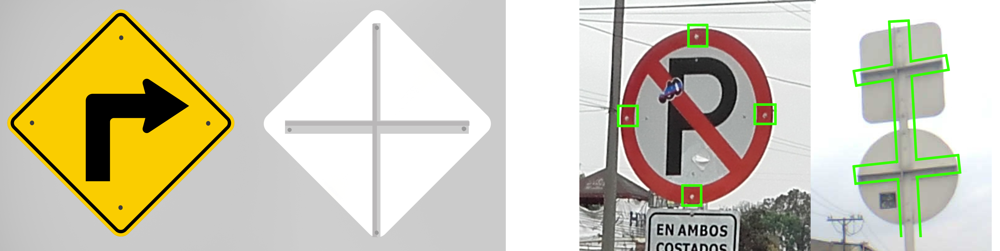
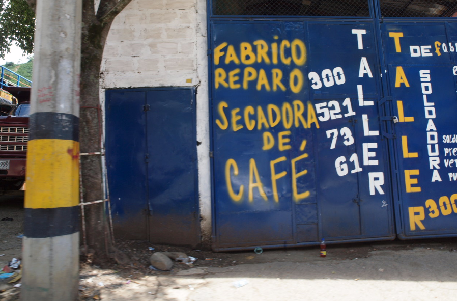
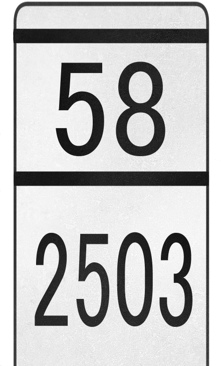

    <h2 class="section-title">{}</h2>
    <ul class="rule-list">
        <li>ドメインは.co</li>
        <li>言語はスペイン語</li>
        <li>路側帯は白で中央線は黄色</li>
        <li>ナンバープレートは前後共に黄色</li>
        <li>標識の背面にはクロスが存在する{}</li>
    </ul>
    {}

{}
{}
{}
標識の背面にはクロスが存在する。後ろから見るとはっきりとクロスが見えて{}、前から見るとネジが４つ見える{}{}。ポールや裏面は白が多い印象。
{}

{}
ナンバープレートは前後共に黄色{}。{}にも黄色いものがあるがコロンビアはすこしオレンジ色に近い。道端の有刺鉄線が張られた木の柵も多く見られる{}。
{}

{}

自作
{}

{}
{}

<iframe src="https://www.google.com/maps/embed?pb=!4v1679138005508!6m8!1m7!1sIS7P4fzaicRfinbA0j5TRw!2m2!1d3.396441393668646!2d-76.52339001433994!3f136.71002847658113!4f-4.691034225921541!5f2.908818923327662" width="295" height="295" style="border:0;" allowfullscreen="" loading="lazy" referrerpolicy="no-referrer-when-downgrade"></iframe>
<iframe src="https://www.google.com/maps/embed?pb=!4v1679137921739!6m8!1m7!1sTVla3KChW9nZzIzHjNIHlA!2m2!1d2.516340478781876!2d-76.50260350297357!3f38.38964881780703!4f2.329973697644803!5f3.325193203789971" width="295" height="295" style="border:0;" allowfullscreen="" loading="lazy" referrerpolicy="no-referrer-when-downgrade"></iframe>

{}
{}

<iframe src="https://www.google.com/maps/embed?pb=!4v1679138121122!6m8!1m7!1s8SXbik_yGaQLNRhtJ09C9w!2m2!1d3.409759690878096!2d-76.34769438237707!3f257.9149055646081!4f-17.67114175853544!5f3.310312940442755" width="295" height="295" style="border:0;" allowfullscreen="" loading="lazy" referrerpolicy="no-referrer-when-downgrade"></iframe>
<iframe src="https://www.google.com/maps/embed?pb=!4v1679813576129!6m8!1m7!1slrDq90ex1FOkTtQRvay6uQ!2m2!1d2.457006309841755!2d-76.59672523907327!3f38.54073997962945!4f-8.688211803202734!5f3.325193203789971" width="295" height="295" style="border:0;" allowfullscreen="" loading="lazy" referrerpolicy="no-referrer-when-downgrade"></iframe>

{}
{}

<iframe src="https://www.google.com/maps/embed?pb=!4v1681486519765!6m8!1m7!1sRdSnVHywaNxJmMR2PtEvRg!2m2!1d3.524667352372753!2d-76.60049993454764!3f311.83240210590753!4f-36.121808799917574!5f3.325193203789971" width="295" height="295" style="border:0;" allowfullscreen="" loading="lazy" referrerpolicy="no-referrer-when-downgrade"></iframe>

{}
{}

    <h2 class="section-title">{}</h2>
    <ul class="rule-list">
        <li>電柱に黄色と黒のラインがあるとアンティオキアかも{}</li>
        <li>{}はGoogle Carが特徴的</li>
    </ul>

{}
{}
{}メデジンを中心とした場所に電柱に黄色と黒のラインがある{}
{}

{}
{}

    <h2 class="section-title">{}</h2>
    <ul class="rule-list">
        <li>ボラードに道路番号が書かれている{}。</li>
        <li>タクシーとトラックの屋根または側面にサイドプレートがあり、ナンバーと都市名が書いてある</li>
        <li>ゴルゴナ島という離島がある</li>
    </ul>

{}
{}
{}ボラードに道路番号が書かれている{}。
{}

{}
{}
{}ステッカーにPOPAYANと書かれている
{}

<iframe src="https://www.google.com/maps/embed?pb=!4v1679137969933!6m8!1m7!1sXD5mn8ENTU36E8wY6oVgOw!2m2!1d2.459939005594445!2d-76.59373969920176!3f264.4511955614134!4f-29.74845254312335!5f1.9483907551121744" width="295" height="295" style="border:0;" allowfullscreen="" loading="lazy" referrerpolicy="no-referrer-when-downgrade"></iframe>

{}
{}
{}ゴルゴナ島という離島がある、車や標識はなく知らなければ置くのは難しい。
{}

<iframe src="https://www.google.com/maps/embed?pb=!4v1691324544096!6m8!1m7!1sva7Z7ZrXNwu3BHfEkplsaw!2m2!1d2.964943901338966!2d-78.17279365172386!3f327.48204039154035!4f3.629358793575335!5f0.7626066508291676"width="295" height="295" style="border:0;" allowfullscreen="" loading="lazy" referrerpolicy="no-referrer-when-downgrade"></iframe>

{}
{}

{}
<li>◆ともに加工あり・標識部分のみ切り出し</li>
<li>By <a href="//commons.wikimedia.org/wiki/User:EEIM" title="User:EEIM">EEIM</a> - Own work, <a href="https://creativecommons.org/licenses/by-sa/3.0" title="Creative Commons Attribution-Share Alike 3.0">CC BY-SA 3.0</a>, <a href="https://commons.wikimedia.org/w/index.php?curid=63840438">Link</a></li>
<li>By hfb21, <a href="https://creativecommons.org/licenses/by/3.0" title="Creative Commons Attribution 3.0">CC BY 3.0</a>, <a href="https://commons.wikimedia.org/w/index.php?curid=52811696">Link</a></li>
{}