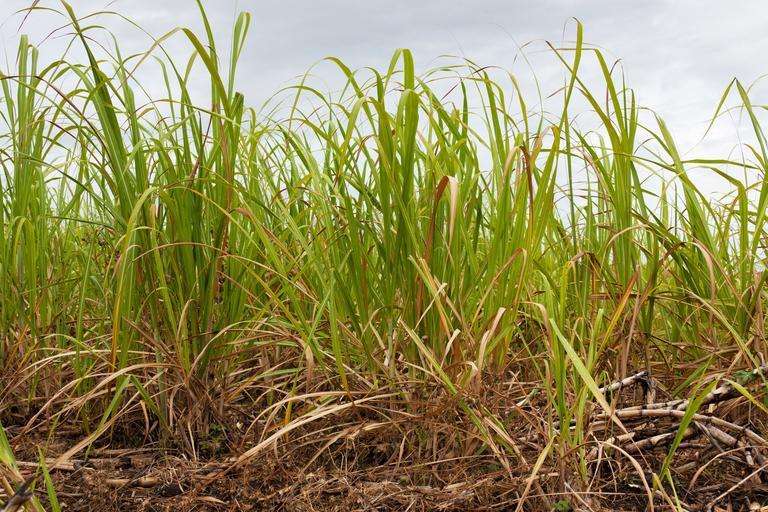
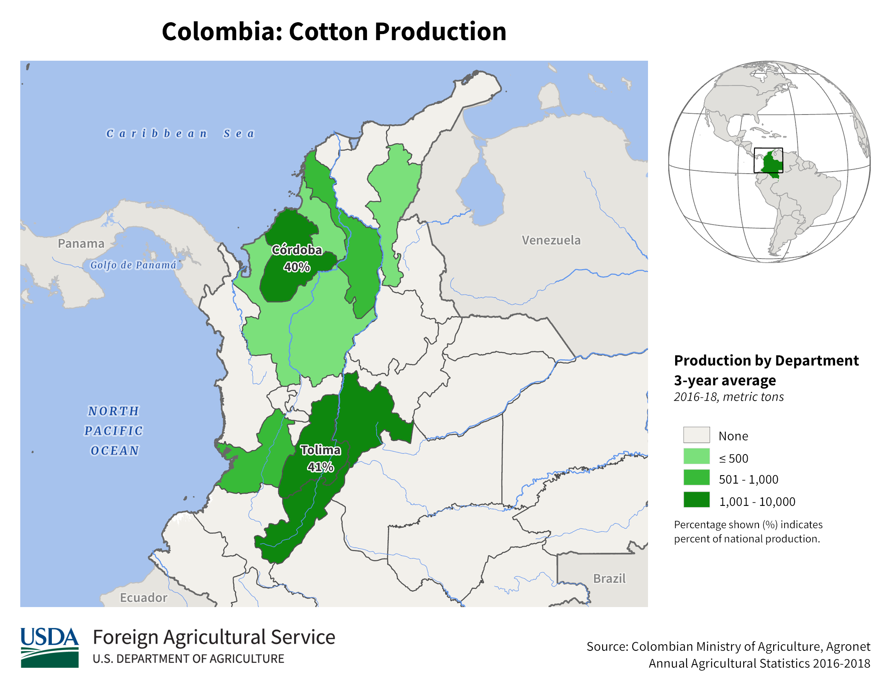
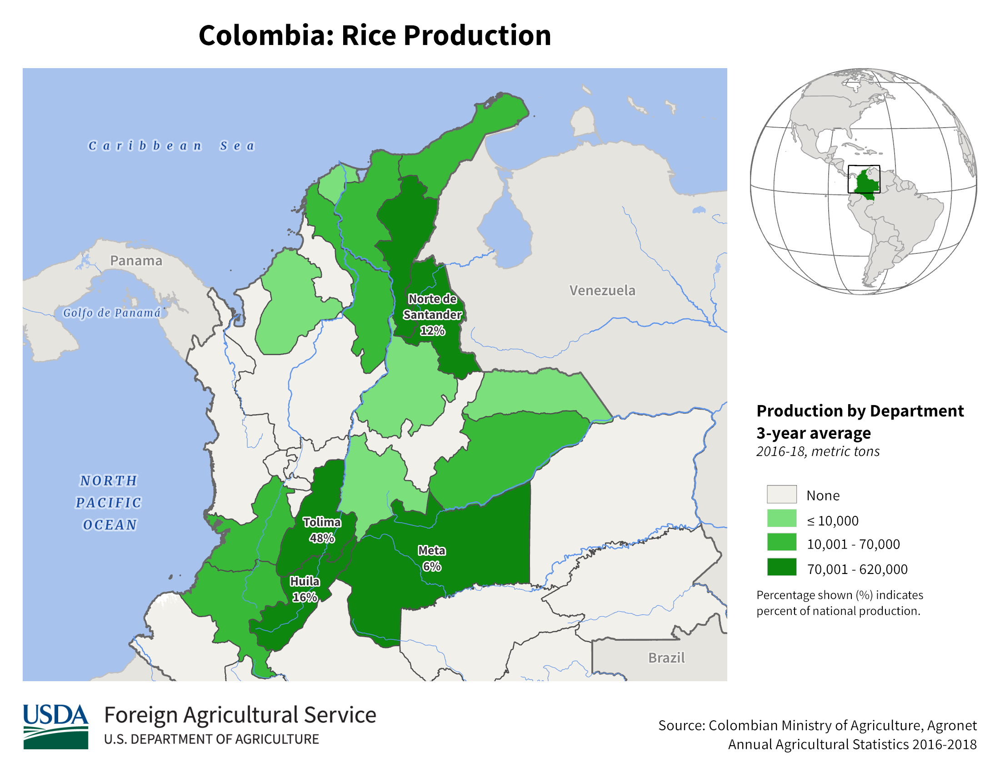

    <h2 class="section-title">{}</h2>
    <ul class="rule-list">
        <li>ドメインは.co</li>
        <li>言語はスペイン語</li>
        <li>路側帯は白で中央線は黄色</li>
        <li>ナンバープレートは前後共に黄色</li>
        <li>標識の背面にはクロスが存在する{}</li>
    </ul>
    {}
    {}

{}
{}
{}
標識の背面にはクロス（いわゆるコロンビアンクロス）が存在する。後ろから見るとはっきりとクロスが見えて{}、前から見るとネジが４つ見える{}{}。ポールや裏面は白が多い印象。稀にクロスっぽいものが{}にもある点のみ注意{}。
{}

{}
ナンバープレートは前後共に黄色{}か白色。バイクも後ろに黄色ナンバーが付いている{}。{}にも黄色いものがあるがコロンビアはすこしオレンジ色に近い。
{}

{}

自作
{}

{}
道端の有刺鉄線が張られた木の柵も多く見られる{}。
{}

{}
{}

<iframe src="https://www.google.com/maps/embed?pb=!4v1679138005508!6m8!1m7!1sIS7P4fzaicRfinbA0j5TRw!2m2!1d3.396441393668646!2d-76.52339001433994!3f136.71002847658113!4f-4.691034225921541!5f2.908818923327662" width="295" height="295" style="border:0;" allowfullscreen="" loading="lazy" referrerpolicy="no-referrer-when-downgrade"></iframe>
<iframe src="https://www.google.com/maps/embed?pb=!4v1679137921739!6m8!1m7!1sTVla3KChW9nZzIzHjNIHlA!2m2!1d2.516340478781876!2d-76.50260350297357!3f38.38964881780703!4f2.329973697644803!5f3.325193203789971" width="295" height="295" style="border:0;" allowfullscreen="" loading="lazy" referrerpolicy="no-referrer-when-downgrade"></iframe>

{}
{}

<iframe src="https://www.google.com/maps/embed?pb=!4v1679138121122!6m8!1m7!1s8SXbik_yGaQLNRhtJ09C9w!2m2!1d3.409759690878096!2d-76.34769438237707!3f257.9149055646081!4f-17.67114175853544!5f3.310312940442755" width="295" height="295" style="border:0;" allowfullscreen="" loading="lazy" referrerpolicy="no-referrer-when-downgrade"></iframe>
<iframe src="https://www.google.com/maps/embed?pb=!4v1679813576129!6m8!1m7!1slrDq90ex1FOkTtQRvay6uQ!2m2!1d2.457006309841755!2d-76.59672523907327!3f38.54073997962945!4f-8.688211803202734!5f3.325193203789971" width="295" height="295" style="border:0;" allowfullscreen="" loading="lazy" referrerpolicy="no-referrer-when-downgrade"></iframe>

{}
{}

<iframe width="300" height="533" src="https://www.youtube.com/embed/HPA9Df2Pt5k" title="移動せずに国を当てられる？パート3 #geoguesser #ジオゲッサー" frameborder="0" allow="accelerometer; autoplay; clipboard-write; encrypted-media; gyroscope; picture-in-picture; web-share" allowfullscreen></iframe>

{}
{}

    <h2 class="section-title">{}</h2>
    <ul class="rule-list">
        <li>植生の分布
            <ul>
                <li>メタ川流域～南東のエリア{}アマゾンに近くなり土も赤くなる{}</li>
                <li>北東の内陸{}メタ川より北は栄養が少ない土壌{}。全体的に平坦でありサバンナのような地域もある。背の高い木は育たない{}。</li>
                <li>最北の海沿い{}砂漠があるエリア{}</li>
                <li>北の海沿い{}白い砂が見えたり街中の道路の角に砂がたまっていることがある{}
            </ul>
        </li>
    </ul>

{}
{}

{}{}
{}

{}
{}

<iframe src="https://www.google.com/maps/embed?pb=!4v1724643610859!6m8!1m7!1sBIcNt4xsnUfokjXCybOgHg!2m2!1d4.602275365601597!2d-71.32989609669042!3f286.654692572383!4f0.7336775861570146!5f0.7820865974627469" width="50%" height="350" style="border:0;" allowfullscreen="" loading="lazy" referrerpolicy="no-referrer-when-downgrade"></iframe>
<iframe src="https://www.google.com/maps/embed?pb=!4v1724643692274!6m8!1m7!1sVt5r5LBc2uuz28unKhKePw!2m2!1d5.142917721291913!2d-70.85523539217012!3f64.50154964757415!4f-6.841048431238178!5f0.7820865974627469" width="50%" height="350" style="border:0;" allowfullscreen="" loading="lazy" referrerpolicy="no-referrer-when-downgrade"></iframe>

{}
{}

{}アンデス東山脈の東側。平坦な土地が広がっていて、メタ川沿いは栄養が少ない土壌で植物も少ない。
{}

<iframe src="https://www.google.com/maps/embed?pb=!4v1698477978676!6m8!1m7!1sJ7PxXLjpjpVyDVlXzarldg!2m2!1d5.83751805366215!2d-71.56842506393753!3f96.78577479284539!4f-4.90967899975233!5f0.4000000000000002" width="50%" height="300" style="border:0;" allowfullscreen="" loading="lazy" referrerpolicy="no-referrer-when-downgrade"></iframe>
<iframe src="https://www.google.com/maps/embed?pb=!4v1695093011695!6m8!1m7!1sYS6llO69H9wDnK4lXZMVjg!2m2!1d4.62827564681296!2d-71.51255306646532!3f98.38560507105616!4f9.95777762781087!5f0.7820865974627469" width="50%" height="300" style="border:0;" allowfullscreen="" loading="lazy" referrerpolicy="no-referrer-when-downgrade"></iframe>

{}下の図の東の平坦なエリアを指している
{}

By <a href="//commons.wikimedia.org/wiki/User:Milenioscuro" title="User:Milenioscuro">Milenioscuro</a> - Own work<a rel="nofollow" class="external text" href="http://www.demis.nl/home/pages/Gallery/examples.htm">Demis</a><a rel="nofollow" class="external text" href="http://mapascolombia.igac.gov.co/wps/portal/mapasdecolombia/">Instituto Geográfico Agustín Codazzi</a> - <a rel="nofollow" class="external text" href="http://190.254.22.44/mapas_de_colombia/IGAC/Oficial_F2004.pdf">Mapa oficial de la República de Colombia</a><a rel="nofollow" class="external text" href="https://web.archive.org/web/20090419184417/http://www.state.gov/g/oes/ocns/opa/convention/c16065.htm">U.S. Department of State</a> - <a rel="nofollow" class="external text" href="http://www.law.fsu.edu/library/collection/LimitsinSeas/numerical.html">Limits in the Seas</a><a rel="nofollow" class="external text" href="http://www.lablaa.org/blaavirtual/geografia/ctemc/ctemc02.htm">Biblioteca Luis Ángel Arango - La territorialización del Mar Caribe</a><a rel="nofollow" class="external text" href="http://www.armada.mil.co/index.php?idcategoria=17895">Armada Nacional de Colombia - Tratados Limítrofes Marítimos de la República de Colombia</a>, <a href="https://creativecommons.org/licenses/by-sa/3.0" title="Creative Commons Attribution-Share Alike 3.0">CC BY-SA 3.0</a>, <a href="https://commons.wikimedia.org/w/index.php?curid=5996689">Link</a>

{}
{}

{}砂漠に近い土壌が広がっている。
{}

<iframe src="https://www.google.com/maps/embed?pb=!4v1698478231917!6m8!1m7!1sXYa1y5q7TWzM83XW_5REOQ!2m2!1d12.22138283185131!2d-72.00399523440888!3f159.2251834180408!4f8.102522936338175!5f0.4466155912658266" width="50%" height="300" style="border:0;" allowfullscreen="" loading="lazy" referrerpolicy="no-referrer-when-downgrade"></iframe>
<iframe src="https://www.google.com/maps/embed?pb=!4v1698478274621!6m8!1m7!1s7UcHWQsa0hieX278UgxqWQ!2m2!1d11.99291092021987!2d-72.13943591872511!3f198.742220149102!4f-0.7741004515764303!5f0.7820865974627469" width="50%" height="300" style="border:0;" allowfullscreen="" loading="lazy" referrerpolicy="no-referrer-when-downgrade"></iframe>

{}
{}
{}写真は恐らくバランキージャ周辺の道路{{% ref "https://ja.wikipedia.org/wiki/%E3%83%90%E3%83%A9%E3%83%B3%E3%82%AD%E3%83%BC%E3%82%B8%E3%83%A3" "バランキージャ" %}}。
{}

{}
{}

    <h4 class="section-title">農業</h4>
    <ul class="rule-list">
        <li>平坦な地域ならば農業をしているが平坦な地域が少ないので役に立つタイミングはそこまで多くない{}</li>
            </ul>
        </li>
    </ul>

{}
{}
{}
{}

{}
赤●が多いMeta県{}やSantander県北部{}などに人工的なプランテーションがある。例外もある{}。
{}

{}
{}

{}
Valle del Cauca県周りの平坦なエリア{}。コロンビアはサトウキビを用いたバイオエタノールの生産で有名であり、サトウキビの80%はValle del Cauca県産だ{}。
{}

{}
{}

{}
見たことないけど、見つけたならTolima{}かCordoba{}。
{}

{}
{}

{}
約50%がTolima{}だけど田んぼ自体レア。南側に多いが北東のNorte de Santander県に流れる川沿いの平坦なエリアでもあり得る{}。
{}

{}
{}

    <ul class="rule-list">
        <li>Buenaventuraへの道はコンテナを積んだトラックが多く見られる</li>
        <li>電柱に黄色と黒のラインがあるとAntioquia県かも</li>
        <li>ボラードに道路番号が書かれている{}</li>
        <li>{}はGoogle Carが特徴的</li>
    </ul>

{}
{}
{}Buenaventuraはコロンビアの主要港でありコロンビアにおける海上輸出入の約60％を占めている。そのため港へ続く道はコンテナを積んだトラックが多い印象{}。{}のコンテナも見つかる{}。
{}

{}
{}
{}Medellínを中心とした場所に電柱に黄色と黒のラインがある{}
{}

{}
{}
{}ボラードに道路番号が書かれている{}。
{}

{}
{}

    <h2 class="section-title">{}</h2>
    <ul class="rule-list">
        <li>タクシーやトラックの屋根または側面にサイドプレートがあり都市名が書いてある</li>
        <li>Tierra Bomba島のBocachicaという町を歩いている{}</li>
        <li>{}と{}の国境付近にLeticiaという町がありGoogle Carが見える{}</li>
        <li>Gorgona島を歩いている</li>
        <li>他の町がら離れた場所にあるSanta Rosalíaという町にわずかにストリートビューがある</li>
    </ul>

{}
{}
{}ステッカーにCARTAGENAと書かれている。トラックの屋根の上や側面にも書いてあるかも{}。
{}

{}
{}
{}要塞のある離島にある町を歩いている。一緒に歩いてくれる人がいる{}。
{}

By <a href="//commons.wikimedia.org/w/index.php?title=User:Zandcee&amp;amp;action=edit&amp;amp;redlink=1" class="new" title="User:Zandcee (page does not exist)">Zandcee</a> - Own work, <a href="https://creativecommons.org/licenses/by-sa/4.0" title="Creative Commons Attribution-Share Alike 4.0">CC BY-SA 4.0</a>, <a href="https://commons.wikimedia.org/w/index.php?curid=97982081">Link</a>

{}
{}
{}
陸路でつながっているブラジルのTabatingaと経済的な結び付きが強い{}。電柱もブラジルにあるような仕切りのある電柱が見られる{}。観光地として栄えておりタクシーや観光客が多く見つかる。特徴的なGoogle Carが見られる{}。
{}

By Sascha Grabow <a rel="nofollow" class="external text" href="http://www.saschagrabow.com">www.saschagrabow.com</a> - Own work, <a href="https://creativecommons.org/licenses/by-sa/3.0" title="Creative Commons Attribution-Share Alike 3.0">CC BY-SA 3.0</a>, <a href="https://commons.wikimedia.org/w/index.php?curid=14129358">Link</a>

{}
{}
{}ゴルゴナ島という離島がある{}。
{}

{}
{}

<iframe src="https://www.google.com/maps/embed?pb=!4v1722605929321!6m8!1m7!1sN34ZpOe8i46jyOiU0yY-sA!2m2!1d5.141897815010507!2d-70.85717884186371!3f252.56210245552822!4f-1.7194538988717767!5f0.4000000000000002" width="600" height="400" style="border:0;" allowfullscreen="" loading="lazy" referrerpolicy="no-referrer-when-downgrade"></iframe>

{}
{}

{}
<li>◆ともに加工あり・標識部分のみ切り出し</li>
<li>By <a href="//commons.wikimedia.org/wiki/User:EEIM" title="User:EEIM">EEIM</a> - Own work, <a href="https://creativecommons.org/licenses/by-sa/3.0" title="Creative Commons Attribution-Share Alike 3.0">CC BY-SA 3.0</a>, <a href="https://commons.wikimedia.org/w/index.php?curid=63840438">Link</a></li>
<li>By hfb21, <a href="https://creativecommons.org/licenses/by/3.0" title="Creative Commons Attribution 3.0">CC BY 3.0</a>, <a href="https://commons.wikimedia.org/w/index.php?curid=52811696">Link</a></li>
{}

    <h4 class="mb-4">代表的な企業の説明</h4>
    <table class="table table-striped table-bordered">
        <thead class="table-light">
            <tr>
                <th scope="col" class="col-width-2">企業名</th>
                <th scope="col" class="col-width-1">コード</th>
                <th scope="col" class="col-width-7">説明</th>
                <th scope="col" class="col-width-05">決算</th>
                <th scope="col" class="col-width-05">配当履歴</th>
            </tr>
        </thead>
        <tbody class="corp-desc">
            <tr>
                <td>Ecopetrol</td>
                <td>{}</td>
                <td>コロンビア最大の石油会社。</td>
                <td>-</td>
                <td>{}</td>
            </tr>
            <tr>
                <td>Tecnoglass</td>
                <td>{}</td>
                <td>建築用ガラス・窓・アルミ製品メーカー。コロンビアの企業だが売上の９割近くはアメリカ市場による。</td>
                <td>{}</td>
                <td>{}</td>
            </tr>
            <tr>
                <td>Bancolombia</td>
                <td>{}</td>
                <td>コロンビアやペルー、グアテマラで事業をする銀行。</td>
                <td>-</td>
                <td>{}</td>
            </tr>
        </tbody>
    </table>

