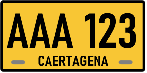
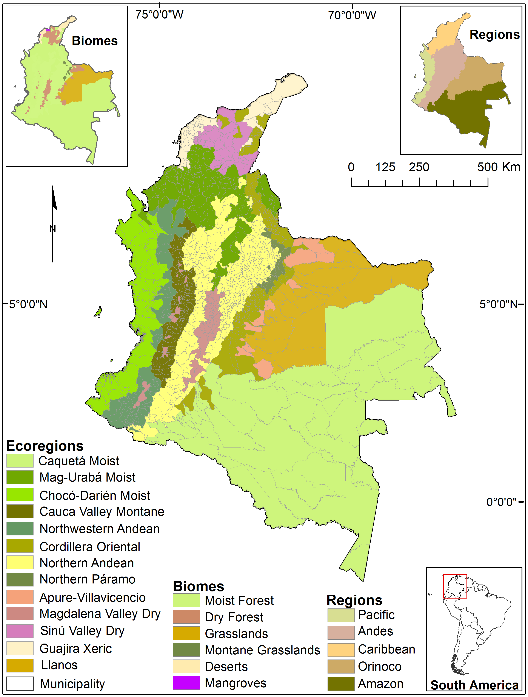

    <h2 class="section-title">{}</h2>
    <ul class="rule-list">
        <li>ドメインは.co</li>
        <li>言語はスペイン語</li>
        <li>路側帯は白で中央線は黄色</li>
        <li>ナンバープレートは前後共に黄色</li>
        <li>標識の背面にはクロスが存在する{}</li>
    </ul>
    {}

{}
{}
{}
標識の背面にはクロス（いわゆるコロンビアンクロス）が存在する。後ろから見るとはっきりとクロスが見えて{}、前から見るとネジが４つ見える{}{}。ポールや裏面は白が多い印象。稀にクロスっぽいものが{}にもある点のみ注意{}。
{}

{}
ナンバープレートは前後共に黄色{}でバイクも後ろに黄色ナンバーが付いている{}。{}にも黄色いものがあるがコロンビアはすこしオレンジ色に近い。道端の有刺鉄線が張られた木の柵も多く見られる{}。
{}

{}

自作
{}

{}
{}

<iframe src="https://www.google.com/maps/embed?pb=!4v1679138005508!6m8!1m7!1sIS7P4fzaicRfinbA0j5TRw!2m2!1d3.396441393668646!2d-76.52339001433994!3f136.71002847658113!4f-4.691034225921541!5f2.908818923327662" width="295" height="295" style="border:0;" allowfullscreen="" loading="lazy" referrerpolicy="no-referrer-when-downgrade"></iframe>
<iframe src="https://www.google.com/maps/embed?pb=!4v1679137921739!6m8!1m7!1sTVla3KChW9nZzIzHjNIHlA!2m2!1d2.516340478781876!2d-76.50260350297357!3f38.38964881780703!4f2.329973697644803!5f3.325193203789971" width="295" height="295" style="border:0;" allowfullscreen="" loading="lazy" referrerpolicy="no-referrer-when-downgrade"></iframe>

{}
{}

<iframe src="https://www.google.com/maps/embed?pb=!4v1679138121122!6m8!1m7!1s8SXbik_yGaQLNRhtJ09C9w!2m2!1d3.409759690878096!2d-76.34769438237707!3f257.9149055646081!4f-17.67114175853544!5f3.310312940442755" width="295" height="295" style="border:0;" allowfullscreen="" loading="lazy" referrerpolicy="no-referrer-when-downgrade"></iframe>
<iframe src="https://www.google.com/maps/embed?pb=!4v1679813576129!6m8!1m7!1slrDq90ex1FOkTtQRvay6uQ!2m2!1d2.457006309841755!2d-76.59672523907327!3f38.54073997962945!4f-8.688211803202734!5f3.325193203789971" width="295" height="295" style="border:0;" allowfullscreen="" loading="lazy" referrerpolicy="no-referrer-when-downgrade"></iframe>

{}
{}

<iframe src="https://www.google.com/maps/embed?pb=!4v1681486519765!6m8!1m7!1sRdSnVHywaNxJmMR2PtEvRg!2m2!1d3.524667352372753!2d-76.60049993454764!3f311.83240210590753!4f-36.121808799917574!5f3.325193203789971" width="295" height="295" style="border:0;" allowfullscreen="" loading="lazy" referrerpolicy="no-referrer-when-downgrade"></iframe>

{}
{}

    <h2 class="section-title">{}</h2>
    <ul class="rule-list">
        <li>ボラードに道路番号が書かれている{}</li>
        <li>植生の分布
            <ul>
                <li>北東の内陸{}メタ側沿いは栄養が少ない土壌{}。全体的に平坦でありサバンナのような地域もある。背の高い木は育たない{}。</li>
                <li>最北の海沿い{}砂漠があるエリア{}</li>
                <li>北の海沿い{}白い砂が見えたり街中の道路の角に砂がたまっていることがある{}
            </ul>
        </li>
        <li>{}はGoogle Carが特徴的</li>
    </ul>

{}
{}
{}ボラードに道路番号が書かれている{}。
{}

{}
{}

{}{}
{}

{}
{}

<iframe src="https://www.google.com/maps/embed?pb=!4v1698477978676!6m8!1m7!1sJ7PxXLjpjpVyDVlXzarldg!2m2!1d5.83751805366215!2d-71.56842506393753!3f96.78577479284539!4f-4.90967899975233!5f0.4000000000000002" width="50%" height="300" style="border:0;" allowfullscreen="" loading="lazy" referrerpolicy="no-referrer-when-downgrade"></iframe>
<iframe src="https://www.google.com/maps/embed?pb=!4v1695093011695!6m8!1m7!1sYS6llO69H9wDnK4lXZMVjg!2m2!1d4.62827564681296!2d-71.51255306646532!3f98.38560507105616!4f9.95777762781087!5f0.7820865974627469" width="50%" height="300" style="border:0;" allowfullscreen="" loading="lazy" referrerpolicy="no-referrer-when-downgrade"></iframe>

{}同じく平坦な場所が西の10番道路沿いに広がっているけれど、10番道路沿いは気候が異なり雨が多く振る。木の密度は全然違う{}。
{}

{}
{}

<iframe src="https://www.google.com/maps/embed?pb=!4v1698478231917!6m8!1m7!1sXYa1y5q7TWzM83XW_5REOQ!2m2!1d12.22138283185131!2d-72.00399523440888!3f159.2251834180408!4f8.102522936338175!5f0.4466155912658266" width="50%" height="300" style="border:0;" allowfullscreen="" loading="lazy" referrerpolicy="no-referrer-when-downgrade"></iframe>
<iframe src="https://www.google.com/maps/embed?pb=!4v1698478274621!6m8!1m7!1s7UcHWQsa0hieX278UgxqWQ!2m2!1d11.99291092021987!2d-72.13943591872511!3f198.742220149102!4f-0.7741004515764303!5f0.7820865974627469" width="50%" height="300" style="border:0;" allowfullscreen="" loading="lazy" referrerpolicy="no-referrer-when-downgrade"></iframe>

{}
{}

{}写真は恐らくバランキージャ周辺の道路{{% ref "https://ja.wikipedia.org/wiki/%E3%83%90%E3%83%A9%E3%83%B3%E3%82%AD%E3%83%BC%E3%82%B8%E3%83%A3" "バランキージャ" %}}。
{}

{}
{}

    <h2 class="section-title">{}</h2>
    <ul class="rule-list">
        <li>電柱に黄色と黒のラインがあるとアンティオキアかも{}</li>
        <li>ゴルゴナ島という離島がある{}</li>
        <li>{}と{}の国境付近にLeticiaという町がありGoogle Carが見える{}</li>
    </ul>

{}
{}
{}メデジンを中心とした場所に電柱に黄色と黒のラインがある{}
{}

{}
{}
{}ゴルゴナ島という離島がある{}。車や標識はなく知らなければ置くのは難しい。
{}

{}
{}
{}
陸路でつながっているブラジルのTabatingaと経済的な結び付きが強い{}。電柱もブラジルにあるような仕切りのある電柱が見られる{}。観光地として栄えておりタクシーや観光客が多く見つかる。特徴的なGoogle Carが見られる{}。
{}

By Sascha Grabow <a rel="nofollow" class="external text" href="http://www.saschagrabow.com">www.saschagrabow.com</a> - Own work, <a href="https://creativecommons.org/licenses/by-sa/3.0" title="Creative Commons Attribution-Share Alike 3.0">CC BY-SA 3.0</a>, <a href="https://commons.wikimedia.org/w/index.php?curid=14129358">Link</a>

{}
{}

    <ul class="rule-list">
        <li>タクシーとトラックの屋根または側面にサイドプレートがあり都市名が書いてある</li>
    </ul>

{}
{}
{}ステッカーにCARTAGENAと書かれている
{}

{}
{}

{}
<li>◆ともに加工あり・標識部分のみ切り出し</li>
<li>By <a href="//commons.wikimedia.org/wiki/User:EEIM" title="User:EEIM">EEIM</a> - Own work, <a href="https://creativecommons.org/licenses/by-sa/3.0" title="Creative Commons Attribution-Share Alike 3.0">CC BY-SA 3.0</a>, <a href="https://commons.wikimedia.org/w/index.php?curid=63840438">Link</a></li>
<li>By hfb21, <a href="https://creativecommons.org/licenses/by/3.0" title="Creative Commons Attribution 3.0">CC BY 3.0</a>, <a href="https://commons.wikimedia.org/w/index.php?curid=52811696">Link</a></li>
{}