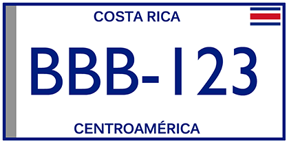

    <h2 class="section-title">{}</h2>
    <ul class="rule-list">
        <li>ドメインは.co.cr</li>
        <li>後ろのナンバープレートが白背景に青文字</li>
        <li>徒歩のカバレッジしかない</li>
    </ul>

{}
{}

{}
後ろのナンバープレートが白背景に青文字が多い
{}

<iframe src="https://www.google.com/maps/embed?pb=!4v1683473242501!6m8!1m7!1s-l14hEozEW4XbgR1iRjiJg!2m2!1d9.93861012011926!2d-84.05332299756108!3f222.66308981840044!4f-8.527545045709047!5f3.322991764740751" width="295" height="295" style="border:0;" allowfullscreen="" loading="lazy" referrerpolicy="no-referrer-when-downgrade"></iframe>
<iframe src="https://www.google.com/maps/embed?pb=!4v1683473418926!6m8!1m7!1sC1vUIUhR1yfi_xpRB6GaaA!2m2!1d9.936497147946236!2d-84.05415914176896!3f231.74213196001486!4f-17.543890324728594!5f3.0934274439057368" width="295" height="295" style="border:0;" allowfullscreen="" loading="lazy" referrerpolicy="no-referrer-when-downgrade"></iframe>

{}

By Zcarstvnz - This file has been extracted from another file, CC BY-SA 4.0, <a href="https://commons.wikimedia.org/w/index.php?curid=92156353">Wikimedia Commons(Link)</a>
{}
{}
{}