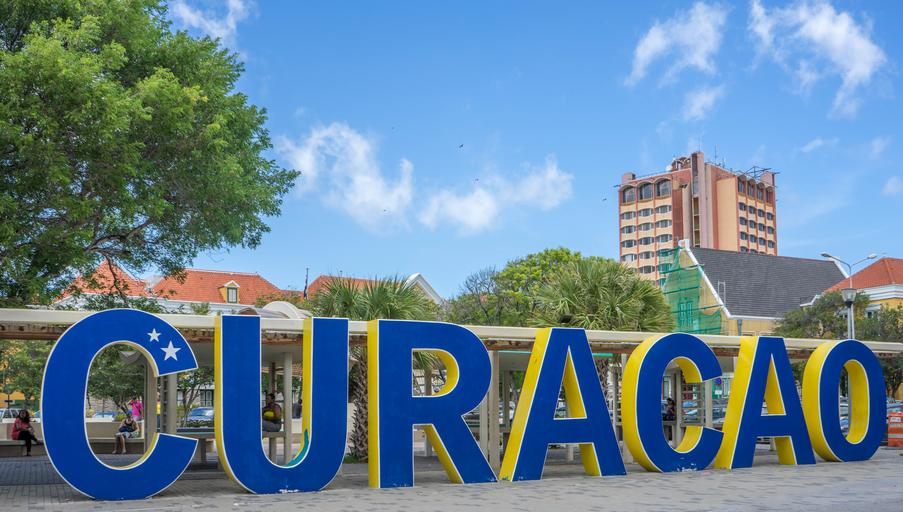
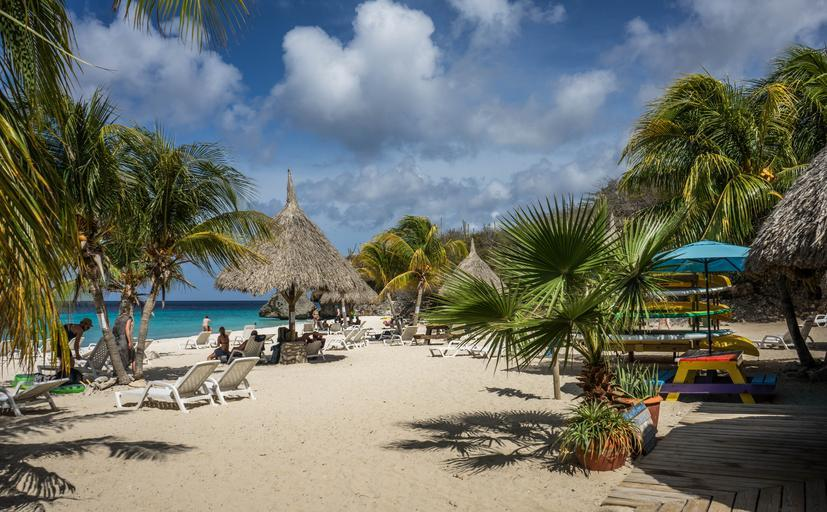

    <h2 class="section-title">{}</h2>
    <ul class="rule-list">
        <li>ドメインは.cw</cw></li>
        <li>Google Carが特徴的で黒い車体やバーが見える</li>
        <li>{}との共通点がある</li>
    </ul>

{}
{}

{}
『Curacao』と書かれた看板がある
{}

{}
Google Carが特徴的で黒い車体やバーが見える{}
{}

<iframe src="https://www.google.com/maps/embed?pb=!4v1697191993295!6m8!1m7!1s8GTiYuK9tcUWb9c2BroPZw!2m2!1d12.13275059710606!2d-68.89906008491423!3f355.5673252515921!4f-56.327811134298955!5f0.4000000000000002" width="600" height="400" style="border:0;" allowfullscreen="" loading="lazy" referrerpolicy="no-referrer-when-downgrade"></iframe>

{}
藁でできたパラソルがビーチにある{}
{}

{}
{}