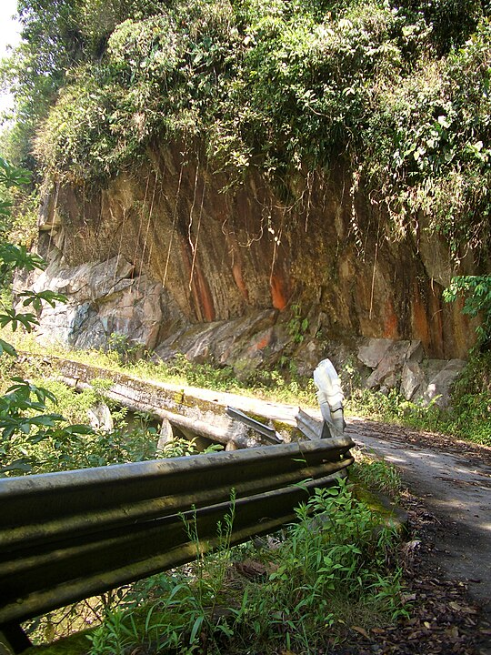
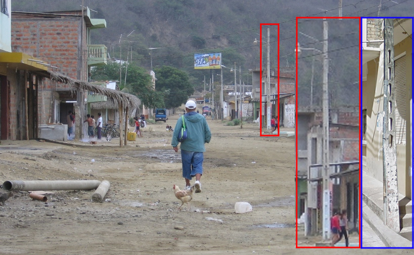
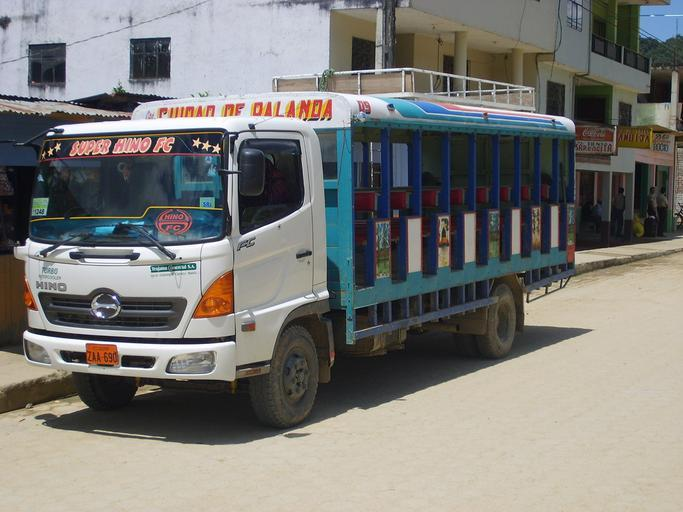
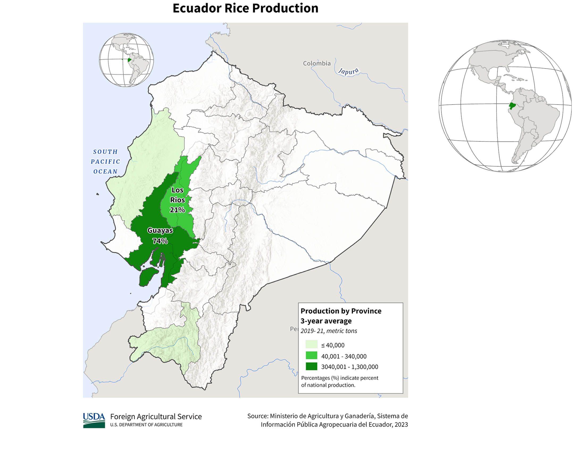
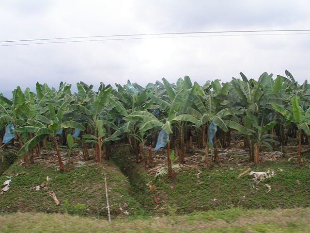
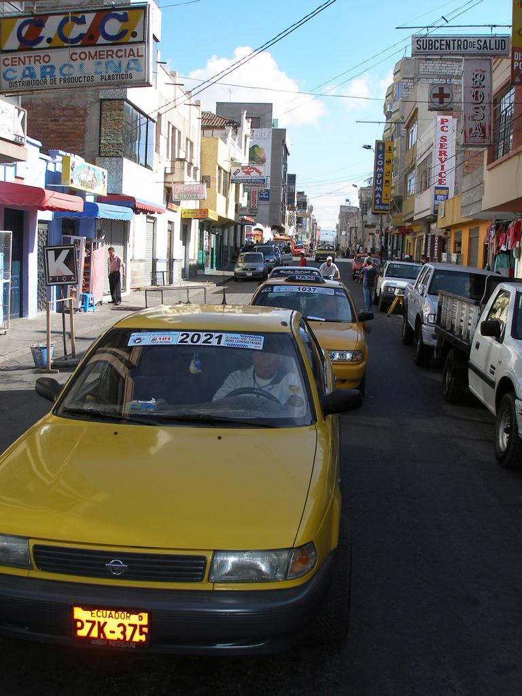
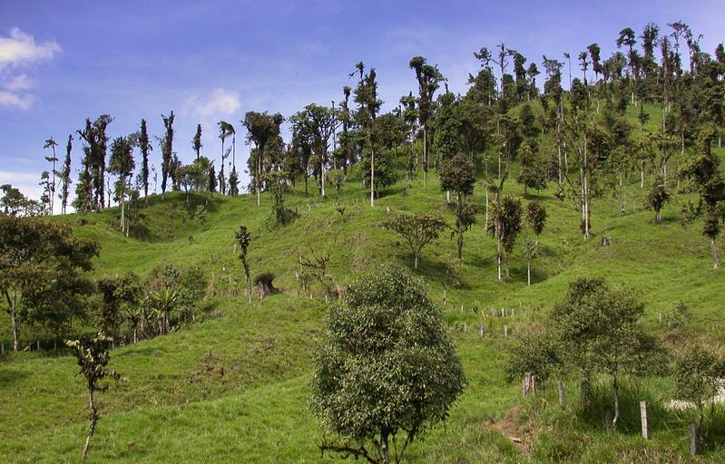

    <h2 class="section-title">{}</h2>
    <ul class="rule-list">
        <li>ドメインは.ec</li>
        <li>言語はスペイン語</li>
        <li>標識の裏が凹凸のないフラットな感じのものが多い{}</li>
        <li>タクシーやバスのような商業車はナンバーの全体か上部がオレンジ色</li>
        <li class="no-evidence">ボラードに２つ反射板が巻かれている・２つ反射板が付いている</li>
    </ul>
    {}

{}
{}
{}
ボラードはいろいろな種類があり一貫性がない。反射板がふたつ付いている見慣れない形のもの{}はエクアドルかも？
{}

By DIOHER_PAVAL, <a href="https://creativecommons.org/licenses/by/3.0" title="Creative Commons Attribution 3.0">CC BY 3.0</a>, <a href="https://commons.wikimedia.org/w/index.php?curid=60614574">Link</a>

{}
標識の裏が<b>フラットな感じ</b>{}{}でシンプルな□や○の形の鋼管{}や凹みのある鋼管{}を使って立てられている。
{}

{}
{}は白いポールで裏側に十字があり、{}は白黒ストライプの太い棒が多い。{}は太い製材が使われている。
{}

By Paulo JC Nogueira, <a href="https://creativecommons.org/licenses/by-sa/3.0" title="Creative Commons Attribution-Share Alike 3.0">CC BY-SA 3.0</a>, <a href="https://commons.wikimedia.org/w/index.php?curid=59638337">Link</a>, 画像加工あり

{}
エクアドルのガードレールは<b>二重になっている</b>ことが多い{}{}。
{}

{}
細かい仕切りや穴がある電柱は南米ではエクアドル以外ほとんど見かけない{}。
{}

{}
タクシーやトラックのような商業車はナンバーの全体か上部がオレンジ色{}。ちなみにタクシーに緑色のステッカーがあるとキト{}。
{}

{}

By <a href="//commons.wikimedia.org/wiki/User:Zcarstvnz" title="User:Zcarstvnz">Zcarstvnz</a> - Own work, <a href="https://creativecommons.org/licenses/by-sa/4.0" title="Creative Commons Attribution-Share Alike 4.0">CC BY-SA 4.0</a>, <a href="https://commons.wikimedia.org/w/index.php?curid=72312390">Link</a>
{}

{}
建物の側面などに灰色のコンクリートブロックが見えがち{}。
{}

By <a href="//commons.wikimedia.org/w/index.php?title=User:Juanjo_guaman&amp;action=edit&amp;redlink=1" class="new" title="User:Juanjo guaman (page does not exist)">Juanjo guaman</a> - Own work, <a href="https://creativecommons.org/licenses/by-sa/3.0" title="Creative Commons Attribution-Share Alike 3.0">CC BY-SA 3.0</a>, <a href="https://commons.wikimedia.org/w/index.php?curid=19496831">Link</a>

{}
{}
{}
シェブロン＞＜
{}

<iframe src="https://www.google.com/maps/embed?pb=!4v1682819900218!6m8!1m7!1svPGkvywZLkfsLfGZ3NF-NA!2m2!1d-0.1863655275116668!2d-79.20092795534029!3f58.20714407058763!4f-3.4386814217635617!5f2.9597408896438306" width="295" height="295" style="border:0;" allowfullscreen="" loading="lazy" referrerpolicy="no-referrer-when-downgrade"></iframe>
<iframe src="https://www.google.com/maps/embed?pb=!4v1688830096697!6m8!1m7!1sh_ePbw0-JgFQ3kNLvLp0rA!2m2!1d-1.593389265546191!2d-77.86196299354462!3f221.96955632470147!4f-9.625053183363818!5f2.9562547951755676" width="295" height="295" style="border:0;" allowfullscreen="" loading="lazy" referrerpolicy="no-referrer-when-downgrade"></iframe>

{}
{}
{}
ボラードは色々なものがあるが丸くて見たことが無い感じのボラードはエクアドルかも？
{}

<iframe src="https://www.google.com/maps/embed?pb=!4v1680195134637!6m8!1m7!1szWqUn-DOUFv4lGlyMa1MPw!2m2!1d-3.798946696320828!2d-78.75864702816678!3f61.33480726794366!4f-29.352329151883943!5f3.325193203789971" width="295" height="295" style="border:0;" allowfullscreen="" loading="lazy" referrerpolicy="no-referrer-when-downgrade"></iframe>
<iframe src="https://www.google.com/maps/embed?pb=!4v1680195196270!6m8!1m7!1svtwMPkjHFvS6XpjnAsY6Dg!2m2!1d-0.332809350620797!2d-78.20154205749002!3f141.7641883233853!4f-10.418206871649673!5f3.325193203789971" width="295" height="295" style="border:0;" allowfullscreen="" loading="lazy" referrerpolicy="no-referrer-when-downgrade"></iframe>
<iframe src="https://www.google.com/maps/embed?pb=!4v1680195243205!6m8!1m7!1sXLKz6wP93UFe2YDt-MAmIw!2m2!1d-0.02970552552317805!2d-78.75886554902458!3f342.9268428942793!4f-10.588056665345405!5f3.325193203789971" width="295" height="295" style="border:0;" allowfullscreen="" loading="lazy" referrerpolicy="no-referrer-when-downgrade"></iframe>
<iframe src="https://www.google.com/maps/embed?pb=!4v1682819356117!6m8!1m7!1sbDWW7_m7JikpU0tXyfYT4A!2m2!1d-0.1851809444121328!2d-79.2016505031237!3f63.95128590678875!4f-11.298108485216616!5f3.323547605148729" width="295" height="295" style="border:0;" allowfullscreen="" loading="lazy" referrerpolicy="no-referrer-when-downgrade"></iframe>
<iframe src="https://www.google.com/maps/embed?pb=!4v1688829859128!6m8!1m7!1s9eX9rIO8mrszxmDFDZROzQ!2m2!1d-0.2555755127413128!2d-80.2917374954958!3f166.07825354074004!4f-18.22402579755061!5f3.2783501803562594" width="295" height="295" style="border:0;" allowfullscreen="" loading="lazy" referrerpolicy="no-referrer-when-downgrade"></iframe>
<iframe src="https://www.google.com/maps/embed?pb=!4v1688554857213!6m8!1m7!1sQINqKYFmaWIBxPkbHg1EVA!2m2!1d-2.780357066564007!2d-79.22983423827924!3f116.23847544825263!4f-15.115099249889852!5f3.325193203789971" width="295" height="295" style="border:0;" allowfullscreen="" loading="lazy" referrerpolicy="no-referrer-when-downgrade"></iframe>

{}
{}

{}
いろいろな電柱がある
{}

<iframe src="https://www.google.com/maps/embed?pb=!4v1691661123114!6m8!1m7!1s2_dOhWgaNkyXHsHpIHJaeQ!2m2!1d-0.8777083116457083!2d-77.75222161426548!3f46.3772863707097!4f10.942318336843329!5f1.674384299632421"width="295" height="295" style="border:0;" allowfullscreen="" loading="lazy" referrerpolicy="no-referrer-when-downgrade"></iframe>
<iframe src="https://www.google.com/maps/embed?pb=!4v1691661680705!6m8!1m7!1sED-w-mnYhm8EnkN4TeQZpA!2m2!1d-1.965576244689675!2d-79.78130534272393!3f130.69418924095467!4f4.335944244635783!5f1.5867020340990017"width="295" height="295" style="border:0;" allowfullscreen="" loading="lazy" referrerpolicy="no-referrer-when-downgrade"></iframe>

{}
{}

<iframe width="560" height="315" src="https://www.youtube.com/embed/5TC7FQe1yE8?si=OaM0NZPCnSa598Yf" title="YouTube video player" frameborder="0" allow="accelerometer; autoplay; clipboard-write; encrypted-media; gyroscope; picture-in-picture; web-share" allowfullscreen></iframe>

{}
{}

    <h2 class="section-title">{}</h2>
    <ul class="rule-list">
        <li>アブラヤシのプランテーションがあるのは北の方に限られる{}</li>
        <li class="no-evidence">田んぼはグアヤキルに流れ込む川沿いに多い{}{}</li>
        <li>バナナの生産はLos Ríos・Guayas・El Oroで多い</li>
        <li>ナンバープレートの頭文字から県が分かる{}
            <ul>
                <li>Sが先頭の県以外は頭文字 or 2文字目以降のどこかで覚えておくとある程度あてられる</li>
                <li>例外のGalápagos（W）・Orellana（Q）・Cañar（U）は町が少ないので覚えるのをあきらめる←自分の覚え方です</li>
                <li>キトのあるPichincha（P）ナンバーはどこにでもいるので注意する</li>
                <li><b>S</b>anto Domingo de los Tsáchilas→J</li>
                <li><b>S</b>anta Elena→Y</li>
                <li><b>S</b>ucumbíos→K</li>
                <li>Morona <b>S</b>antiago→V</li>
            </ul>
        </li>
        <li>{}が出ることがある</li>
    </ul>

{}
{}
{}
赤い丸の箇所にはアブラヤシのプランテーションがある。特にコロンビア国境付近の道{}やE20の道路{}は木が多い。{}
{}

{}
{}
{}
田んぼはグアヤキル付近のババアヨ川などの流域に多い{}{}。
{}

{}
{}
{}
平地の多い地域でバナナのプランテーションが見つかる{}{}。Los Ríos (37.14%)・Guayas (32.25%)・El Oro (24,12%)の割合。
{}

{}
{}
{}
以下の写真は『P』が頭文字なのでPichinchaだと推定できる。
{}

{}

{}

    <h2 class="section-title">{}</h2>
    <ul class="rule-list">
        <li>キトの北東にエクアドル内ではかなり高い山であるカヤンベ山への道がある{}</li>
    </ul>

{}
{}
{}
こんな感じの木が生えているイメージ{}。標高が高くなると木も生えなくなる{}。
{}

{}
{}
