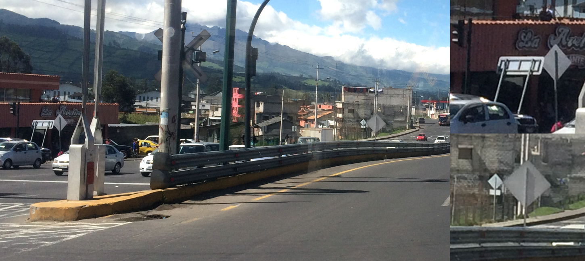
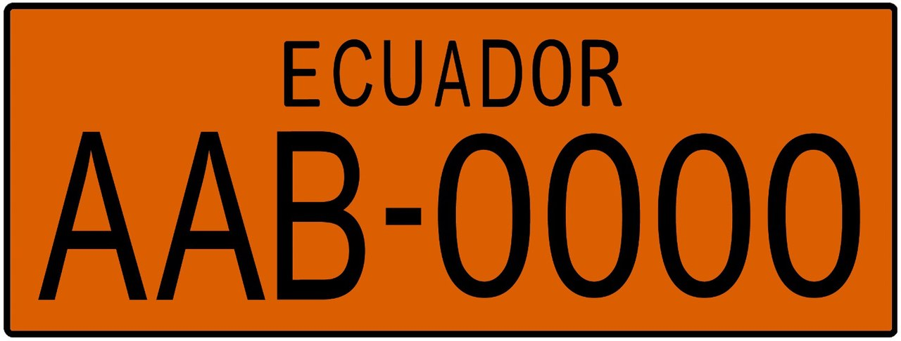
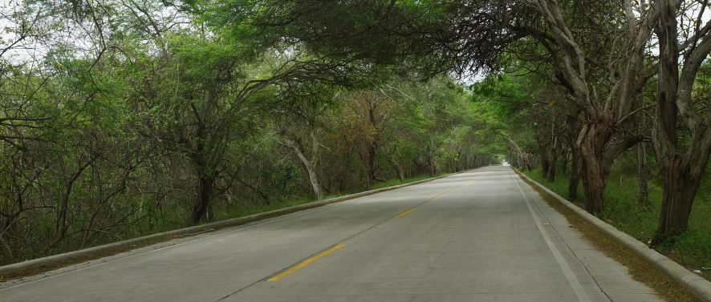
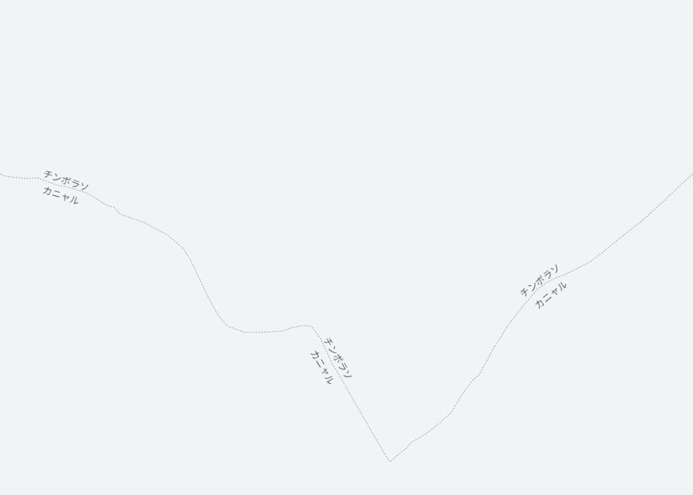
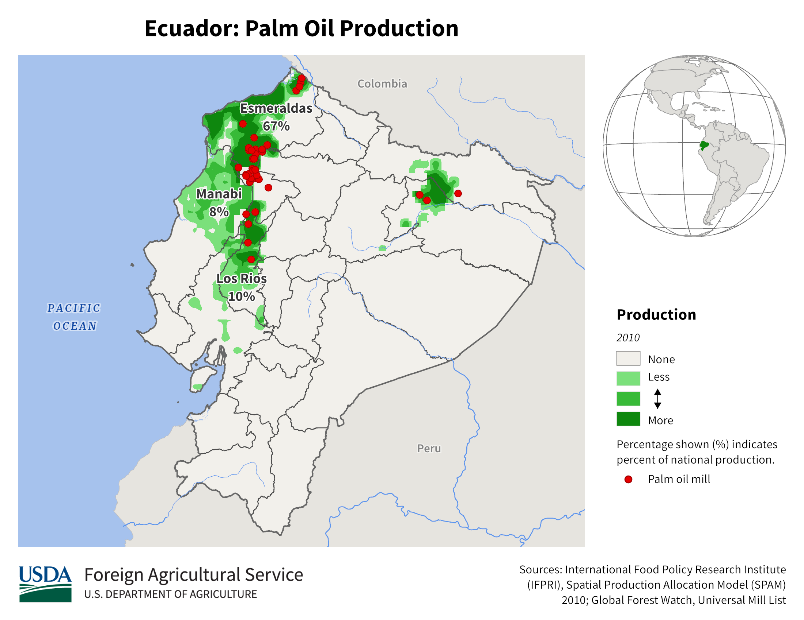

    <h2 class="section-title">{}</h2>
    <ul class="rule-list">
        <li>ドメインは.ec</li>
        <li>言語はスペイン語</li>
        <li>標識の裏が凹凸のないフラットな感じのものが多い{}</li>
        <li>タクシーやバスのような商業車はナンバーの全体か上部がオレンジ色</li>
        <li class="no-evidence">ボラードに２つ反射板が巻かれている・２つ反射板が付いているならエクアドルかも</li>
    </ul>
    {}

{}
{}
{}
ボラードはいろいろな種類があり一貫性がない。反射板が付いている見慣れない形のものはエクアドルかも？
{}

<iframe src="https://www.google.com/maps/embed?pb=!4v1682819743188!6m8!1m7!1soEsqfwy9dg1wyJv25NaW2A!2m2!1d-0.1870776588134144!2d-79.20063605961644!3f129.86151527941817!4f-4.46110271071808!5f3.325193203789971" width="295" height="295" style="border:0;" allowfullscreen="" loading="lazy" referrerpolicy="no-referrer-when-downgrade"></iframe>
<iframe src="https://www.google.com/maps/embed?pb=!4v1682819722721!6m8!1m7!1sFYmTuXWCsTDkTu4RxpEy0Q!2m2!1d-3.471245261520406!2d-79.15938137617697!3f267.14150262468917!4f-3.4847043387237306!5f3.325193203789971" width="295" height="295" style="border:0;" allowfullscreen="" loading="lazy" referrerpolicy="no-referrer-when-downgrade"></iframe>

{}
標識の裏が<b>フラットな感じ</b>{}{}でシンプルな□や○の形の鋼管{}や凹みのある鋼管{}を使って立てられている。{}は白いポールで裏側に十字があり、{}は白黒ストライプの太い棒が多い。{}は太い製材が使われている。また、エクアドルのガードレールは<b>二重になっている</b>ことが多い{}{}。
{}

By Paulo JC Nogueira, <a href="https://creativecommons.org/licenses/by-sa/3.0" title="Creative Commons Attribution-Share Alike 3.0">CC BY-SA 3.0</a>, <a href="https://commons.wikimedia.org/w/index.php?curid=59638337">Link</a>, 画像加工あり

{}
タクシーやバスのような商業車はナンバーの全体か上部がオレンジ色。緑色のステッカーがあるとキト{}。
{}

{}

By <a href="//commons.wikimedia.org/wiki/User:Zcarstvnz" title="User:Zcarstvnz">Zcarstvnz</a> - Own work, <a href="https://creativecommons.org/licenses/by-sa/4.0" title="Creative Commons Attribution-Share Alike 4.0">CC BY-SA 4.0</a>, <a href="https://commons.wikimedia.org/w/index.php?curid=72312390">Link</a>
{}

{}
{}

{}
コンクリート製の道路も比較的多く見られる{}{}。しかし{}など他の国でもコンクリートの道路はたまにある{}のでコンクリート→エクアドルと判断してはいけない。
{}

{}
シェブロン＞＜
{}

<iframe src="https://www.google.com/maps/embed?pb=!4v1682819900218!6m8!1m7!1svPGkvywZLkfsLfGZ3NF-NA!2m2!1d-0.1863655275116668!2d-79.20092795534029!3f58.20714407058763!4f-3.4386814217635617!5f2.9597408896438306" width="295" height="295" style="border:0;" allowfullscreen="" loading="lazy" referrerpolicy="no-referrer-when-downgrade"></iframe>
<iframe src="https://www.google.com/maps/embed?pb=!4v1688830096697!6m8!1m7!1sh_ePbw0-JgFQ3kNLvLp0rA!2m2!1d-1.593389265546191!2d-77.86196299354462!3f221.96955632470147!4f-9.625053183363818!5f2.9562547951755676" width="295" height="295" style="border:0;" allowfullscreen="" loading="lazy" referrerpolicy="no-referrer-when-downgrade"></iframe>

{}
{}
{}
ボラードは色々なものがあるが丸くて見たことが無い感じのボラードはエクアドルかも？
{}

<iframe src="https://www.google.com/maps/embed?pb=!4v1680195134637!6m8!1m7!1szWqUn-DOUFv4lGlyMa1MPw!2m2!1d-3.798946696320828!2d-78.75864702816678!3f61.33480726794366!4f-29.352329151883943!5f3.325193203789971" width="295" height="295" style="border:0;" allowfullscreen="" loading="lazy" referrerpolicy="no-referrer-when-downgrade"></iframe>
<iframe src="https://www.google.com/maps/embed?pb=!4v1680195196270!6m8!1m7!1svtwMPkjHFvS6XpjnAsY6Dg!2m2!1d-0.332809350620797!2d-78.20154205749002!3f141.7641883233853!4f-10.418206871649673!5f3.325193203789971" width="295" height="295" style="border:0;" allowfullscreen="" loading="lazy" referrerpolicy="no-referrer-when-downgrade"></iframe>
<iframe src="https://www.google.com/maps/embed?pb=!4v1680195243205!6m8!1m7!1sXLKz6wP93UFe2YDt-MAmIw!2m2!1d-0.02970552552317805!2d-78.75886554902458!3f342.9268428942793!4f-10.588056665345405!5f3.325193203789971" width="295" height="295" style="border:0;" allowfullscreen="" loading="lazy" referrerpolicy="no-referrer-when-downgrade"></iframe>
<iframe src="https://www.google.com/maps/embed?pb=!4v1682819356117!6m8!1m7!1sbDWW7_m7JikpU0tXyfYT4A!2m2!1d-0.1851809444121328!2d-79.2016505031237!3f63.95128590678875!4f-11.298108485216616!5f3.323547605148729" width="295" height="295" style="border:0;" allowfullscreen="" loading="lazy" referrerpolicy="no-referrer-when-downgrade"></iframe>
<iframe src="https://www.google.com/maps/embed?pb=!4v1688829859128!6m8!1m7!1s9eX9rIO8mrszxmDFDZROzQ!2m2!1d-0.2555755127413128!2d-80.2917374954958!3f166.07825354074004!4f-18.22402579755061!5f3.2783501803562594" width="295" height="295" style="border:0;" allowfullscreen="" loading="lazy" referrerpolicy="no-referrer-when-downgrade"></iframe>
<iframe src="https://www.google.com/maps/embed?pb=!4v1688554857213!6m8!1m7!1sQINqKYFmaWIBxPkbHg1EVA!2m2!1d-2.780357066564007!2d-79.22983423827924!3f116.23847544825263!4f-15.115099249889852!5f3.325193203789971" width="295" height="295" style="border:0;" allowfullscreen="" loading="lazy" referrerpolicy="no-referrer-when-downgrade"></iframe>

{}
{}

{}
いろいろな電柱がある
{}

<iframe src="https://www.google.com/maps/embed?pb=!4v1691661123114!6m8!1m7!1s2_dOhWgaNkyXHsHpIHJaeQ!2m2!1d-0.8777083116457083!2d-77.75222161426548!3f46.3772863707097!4f10.942318336843329!5f1.674384299632421"width="295" height="295" style="border:0;" allowfullscreen="" loading="lazy" referrerpolicy="no-referrer-when-downgrade"></iframe>
<iframe src="https://www.google.com/maps/embed?pb=!4v1691661680705!6m8!1m7!1sED-w-mnYhm8EnkN4TeQZpA!2m2!1d-1.965576244689675!2d-79.78130534272393!3f130.69418924095467!4f4.335944244635783!5f1.5867020340990017"width="295" height="295" style="border:0;" allowfullscreen="" loading="lazy" referrerpolicy="no-referrer-when-downgrade"></iframe>

{}
{}
{}
赤や白のぼかしにアンテナがちょっと見える。
{}

<iframe src="https://www.google.com/maps/embed?pb=!4v1680194683604!6m8!1m7!1sMtvT_41CB0goCdpzCRdhXg!2m2!1d-0.1714598883614303!2d-78.48973907581545!3f101.51991125706458!4f-33.7065829871796!5f3.325193203789971" width="295" height="295" style="border:0;" allowfullscreen="" loading="lazy" referrerpolicy="no-referrer-when-downgrade"></iframe>
<iframe src="https://www.google.com/maps/embed?pb=!4v1688829681459!6m8!1m7!1sQYt95CAnpw3B_HsOIe4l3g!2m2!1d-3.770267940009595!2d-78.73940872974077!3f229.7554627436984!4f-32.261134461991354!5f3.325193203789971" width="295" height="295" style="border:0;" allowfullscreen="" loading="lazy" referrerpolicy="no-referrer-when-downgrade"></iframe>
<iframe src="https://www.google.com/maps/embed?pb=!4v1688829813109!6m8!1m7!1szqCFrptSmdrg3vyvWCfqPQ!2m2!1d0.2375373675010081!2d-78.34631228360985!3f189.40816902643556!4f-36.76574430592228!5f3.325193203789971" width="295" height="295" style="border:0;" allowfullscreen="" loading="lazy" referrerpolicy="no-referrer-when-downgrade"></iframe>
<iframe src="https://www.google.com/maps/embed?pb=!4v1688829875622!6m8!1m7!1s9eX9rIO8mrszxmDFDZROzQ!2m2!1d-0.2555755127413128!2d-80.2917374954958!3f223.2545471736234!4f-33.08495663102262!5f3.325193203789971" width="295" height="295" style="border:0;" allowfullscreen="" loading="lazy" referrerpolicy="no-referrer-when-downgrade"></iframe>

{}
{}

    <ul class="rule-list-none">
        <li>{}</li>
    </ul>

{}
{}

    <h2 class="section-title">{}</h2>
    <ul class="rule-list">
        <li>ズームすると県境に県名が表示される</li>
        <li>アブラヤシのプランテーションがあるのは北の方に限られる{}</li>
        <li>ガラパゴス諸島が出ることがある・亀が山の上に居たら{}</li>
        <li class="no-evidence">田んぼはグアヤキルに流れ込む川沿いに多い{}{}</li>
    </ul>

{}
{}
{}
看板などから県名が見つかったら県名で場所を絞り込めるかも。たまに県名が書かれた看板がある{}。
{}

画像出典：<a href="https://www.google.com/maps/@-2.409844,-78.918238,15.25z">©2023 Google Map, 2023/4/28に利用</a>, <a href="https://www.google.com/intl/ja/permissions/geoguidelines/">Google マップ 一般的なガイドライン</a>

{}
{}
{}
赤い丸の箇所にはアブラヤシのプランテーションがある。特にコロンビア国境付近の道{}やE20の道路{}は木が多い。{}
{}

<iframe src="https://www.google.com/maps/embed?pb=!4v1684783638204!6m8!1m7!1sDA2RicV2JwheAUEG73JZZg!2m2!1d1.256459675985798!2d-78.74124942090808!3f150.86690501682244!4f-0.1798337100882037!5f2.748077413619822" width="550" height="250" style="border:0;" allowfullscreen="" loading="lazy" referrerpolicy="no-referrer-when-downgrade"></iframe>

{}
{}
{}
田んぼはグアヤキル付近のババアヨ川などの流域に多い{}。
{}

<iframe src="https://www.google.com/maps/embed?pb=!4v1692719967982!6m8!1m7!1sRjN-isIfvuIRa2x5GTUTgA!2m2!1d-1.932792645599542!2d-79.57847241999976!3f234.46984036457994!4f-2.7189998492245167!5f0.7820865974627469" width="295" height="295" style="border:0;" allowfullscreen="" loading="lazy" referrerpolicy="no-referrer-when-downgrade"></iframe>
<iframe src="https://www.google.com/maps/embed?pb=!4v1692720076805!6m8!1m7!1sPGAX8ECHF1sA2VeTpehmJg!2m2!1d-1.926990012630441!2d-80.00626544396032!3f229.5363084482948!4f-2.385672741419924!5f1.6960280271771726" width="295" height="295" style="border:0;" allowfullscreen="" loading="lazy" referrerpolicy="no-referrer-when-downgrade"></iframe>

{}
{}

    <h2 class="section-title">{}</h2>
    <ul class="rule-list">
        <li>タクシーに緑色のステッカーがあるとキトかも{}</li>
    </ul>

