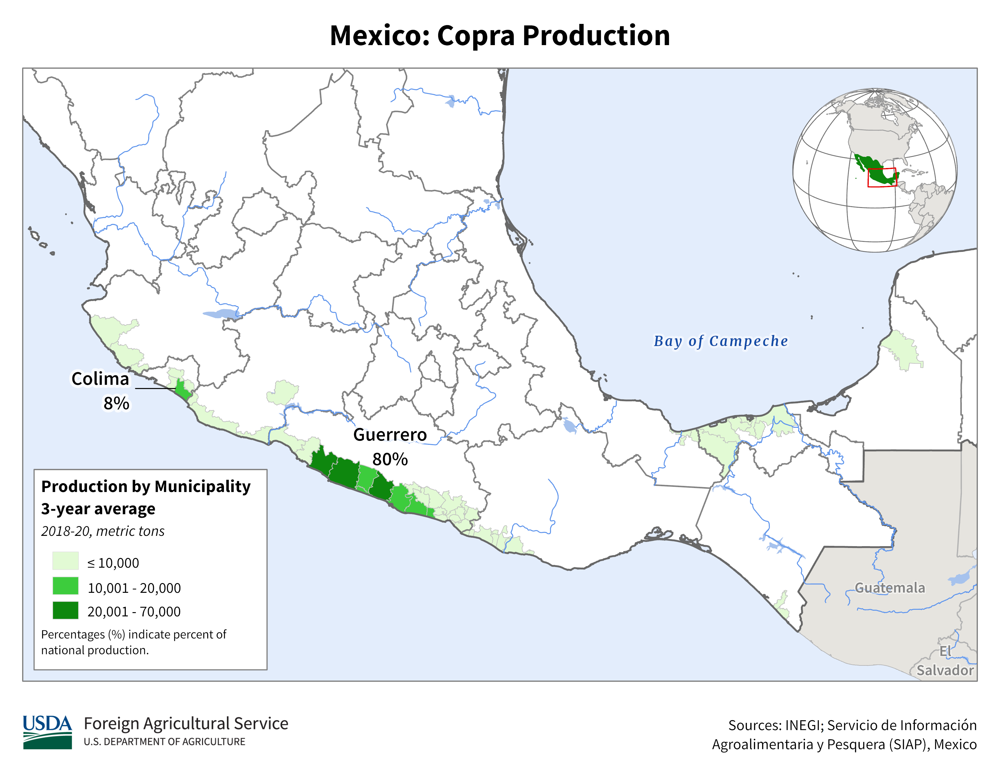

    <h2 class="section-title">{}</h2>
    <ul class="rule-list">
        <li>ドメインは.mx</li>
        <li>言語はスペイン語</li>
        <li>OXXOはメキシコのコンビニ</li>
        <li>電柱は8角形のものが多い</li>
        <li>メキシコの大手企業は～MEXや～MXと名前が付いていることが多い（石油大手PEMEX、セメント大手CEMEX、映画館CINEMEX等）</li>
        <li>VeTVと書いてある青色のアンテナが家に付いていることがある</li>
    </ul>
    {}

{}
{}

{}
～MEXと名の付く会社はメキシコの大手企業に多い。OXXOはメキシコの大手コンビニ（ただしチリなどにも多く存在する）。
{}

<iframe src="https://www.google.com/maps/embed?pb=!4v1681001692977!6m8!1m7!1sy3XV10a3ClWydhJOF04n1A!2m2!1d27.44458230172642!2d-99.52181982329259!3f236.9881189121672!4f14.192127047255482!5f2.8609201218789653" width="295" height="295" style="border:0;" allowfullscreen="" loading="lazy" referrerpolicy="no-referrer-when-downgrade"></iframe>
<iframe src="https://www.google.com/maps/embed?pb=!4v1681001565385!6m8!1m7!1sJYAXaPd2tz8uN_dGZz8Z2Q!2m2!1d27.44986791939745!2d-99.51879027561925!3f347.80626742005916!4f13.635629480031909!5f3.325193203789971" width="295" height="295" style="border:0;" allowfullscreen="" loading="lazy" referrerpolicy="no-referrer-when-downgrade"></iframe>

{}
8角形の電柱が特徴的、ただしこれだけでは100%確定しないので周りの雰囲気も合わせてメキシコと判断する。停まれはALTO。
{}

<iframe src="https://www.google.com/maps/embed?pb=!4v1681001887650!6m8!1m7!1sm37ENm7cZoTUk_9QmdELmg!2m2!1d27.44392882621393!2d-99.52223275917264!3f200.2997580111676!4f-7.532300258326686!5f1.208598839741584" width="295" height="295" style="border:0;" allowfullscreen="" loading="lazy" referrerpolicy="no-referrer-when-downgrade"></iframe>
<iframe src="https://www.google.com/maps/embed?pb=!4v1679459072284!6m8!1m7!1s8PmLY24JPH4SftL8hA2CZA!2m2!1d25.75251926645027!2d-100.3004127618978!3f93.71490274714154!4f-1.98958654281806!5f3.2793573082848697" width="295" height="295" style="border:0;" allowfullscreen="" loading="lazy" referrerpolicy="no-referrer-when-downgrade"></iframe>

{}
{}

<iframe src="https://www.google.com/maps/embed?pb=!4v1681038190947!6m8!1m7!1s9nAl0N31Ju0CBkdr4voz_A!2m2!1d21.87217575161593!2d-102.3095089272366!3f242.0139138779507!4f-14.54817443941107!5f1.606254004703728" width="295" height="295" style="border:0;" allowfullscreen="" loading="lazy" referrerpolicy="no-referrer-when-downgrade"></iframe>
<iframe src="https://www.google.com/maps/embed?pb=!4v1679459072284!6m8!1m7!1s8PmLY24JPH4SftL8hA2CZA!2m2!1d25.75251926645027!2d-100.3004127618978!3f93.71490274714154!4f-1.98958654281806!5f3.2793573082848697" width="295" height="295" style="border:0;" allowfullscreen="" loading="lazy" referrerpolicy="no-referrer-when-downgrade"></iframe>
<iframe src="https://www.google.com/maps/embed?pb=!4v1681001959331!6m8!1m7!1sxAM4-ZNdAtGAwJFYsrGxRQ!2m2!1d27.43836612238844!2d-99.49859360331283!3f213.0166319742502!4f-6.839769541205769!5f3.314171391274682" width="295" height="295" style="border:0;" allowfullscreen="" loading="lazy" referrerpolicy="no-referrer-when-downgrade"></iframe>
<iframe src="https://www.google.com/maps/embed?pb=!4v1681001887650!6m8!1m7!1sm37ENm7cZoTUk_9QmdELmg!2m2!1d27.44392882621393!2d-99.52223275917264!3f200.2997580111676!4f-7.532300258326686!5f1.208598839741584" width="295" height="295" style="border:0;" allowfullscreen="" loading="lazy" referrerpolicy="no-referrer-when-downgrade"></iframe>

{}
{}
{}
薄い青のアンテナでVeTVと書いてあることが多い
{}

<iframe src="https://www.google.com/maps/embed?pb=!4v1684040103096!6m8!1m7!1sJVizNVDgcV900kZKyIHKsg!2m2!1d17.51239783750989!2d-91.99159441195232!3f299.8752202123155!4f4.119409984765227!5f3.2932924915878594" width="295" height="295" style="border:0;" allowfullscreen="" loading="lazy" referrerpolicy="no-referrer-when-downgrade"></iframe>
<iframe src="https://www.google.com/maps/embed?pb=!4v1684040292000!6m8!1m7!1sEmKGN7ptKtolUzxaKbIQxw!2m2!1d25.68334074243041!2d-100.3154806771452!3f249.51757455387454!4f8.032419984405948!5f3.325193203789971" width="295" height="295" style="border:0;" allowfullscreen="" loading="lazy" referrerpolicy="no-referrer-when-downgrade"></iframe>

{}
{}

<iframe src="https://www.google.com/maps/embed?pb=!4v1681939768408!6m8!1m7!1sTjIIPhxmYopEa6ZkghhcNQ!2m2!1d25.02755830611226!2d-100.5520773206742!3f196.9516418201439!4f-31.383141622281663!5f3.1991076698735967" width="295" height="295" style="border:0;" allowfullscreen="" loading="lazy" referrerpolicy="no-referrer-when-downgrade"></iframe>
<iframe src="https://www.google.com/maps/embed?pb=!4v1679326979706!6m8!1m7!1sTnKtDpcSLRQ4RjMe4Sjd4g!2m2!1d25.54072681401005!2d-103.6382544135941!3f127.84925597748136!4f-19.074318903338067!5f3.2440693678505452" width="295" height="295" style="border:0;" allowfullscreen="" loading="lazy" referrerpolicy="no-referrer-when-downgrade"></iframe>

{}
{}
{}
～MEXと名の付く会社はメキシコの大手企業に多い
{}

<iframe src="https://www.google.com/maps/embed?pb=!4v1681001582971!6m8!1m7!1stum5t4nmHLXc9ze0BzAiog!2m2!1d27.44889898098879!2d-99.51935115950234!3f70.82730241772708!4f-16.24011429841073!5f3.2238639420880415" width="295" height="295" style="border:0;" allowfullscreen="" loading="lazy" referrerpolicy="no-referrer-when-downgrade"></iframe>
<iframe src="https://www.google.com/maps/embed?pb=!4v1681521750363!6m8!1m7!1sPcpR6tpcU1sgf9sNo_4PeQ!2m2!1d18.7015081507322!2d-88.38674114610056!3f263.8729299527826!4f-18.094240210637224!5f0.8164310715774429" width="295" height="295" style="border:0;" allowfullscreen="" loading="lazy" referrerpolicy="no-referrer-when-downgrade"></iframe>

{}
{}

<iframe src="https://www.google.com/maps/embed?pb=!4v1679676346295!6m8!1m7!1sptDPEUGadZCel8Vwz0khJA!2m2!1d18.25720171037926!2d-97.54428259097156!3f113.29189671981759!4f4.696430976423443!5f3.325193203789971" width="295" height="295" style="border:0;" allowfullscreen="" loading="lazy" referrerpolicy="no-referrer-when-downgrade"></iframe>

{}
{}

    <h2 class="section-title">{}</h2>
    <ul class="rule-list">
        <li>州の名前を覚えておくと絞り込みの役に立つ（<a href="https://ja.wikipedia.org/wiki/%E3%83%A1%E3%82%AD%E3%82%B7%E3%82%B3">Wiki</a>）</li>
        <li>State Highway(白色の盾のようなマーク)の標識に道路番号と州の名前が書いてあるかも</li>
        <li>電話番号の先頭の数字でおよその地域が特定できる(2~9)、偶数は上・奇数は下のイメージ</li>
        <li class="no-evidence">アメリカに近いエリアの電話番号は 000-000-0000 の表記かも{}</li>
    </ul>

<blockquote class="twitter-tweet">
画像１枚で国１こ覚えたい。 <a href="https://twitter.com/hashtag/GeoGuessr?src=hash&amp;ref_src=twsrc%5Etfw">#GeoGuessr</a>  その③　メキシコ <a href="https://t.co/KeTRiY67Lj">pic.twitter.com/KeTRiY67Lj</a>
&mdash; Μείνε (@meine_geo) <a href="https://twitter.com/meine_geo/status/1636192764026310656?ref_src=twsrc%5Etfw">March 16, 2023</a></blockquote> 

    <ul class="rule-list">
        <li>Guerreroの海沿いにはココヤシのプランテーションが存在する</li>
        <li>ナンバープレートの色で町が分かることがある</li>
    </ul>

{}
{}

{}
Guerreroの海沿いにのみココヤシのプランテーションが存在する。（データ提供元：<a href="https://ipad.fas.usda.gov/countrysummary/default.aspx?id=MX">FAS Home / IPAD Home / Country Summary Mexico(U.S. Department of Agriculture)</a>）
{}

<iframe src="https://www.google.com/maps/embed?pb=!4v1682944891203!6m8!1m7!1sQTSgniwWjFDeK5aKmKl1XA!2m2!1d16.99165953045512!2d-100.1237792495057!3f86.65871881903603!4f12.885509653288338!5f0.9042402409955568" width="590" height="250" style="border:0;" allowfullscreen="" loading="lazy" referrerpolicy="no-referrer-when-downgrade"></iframe>

{}
{}
{}

{}

<iframe src="https://www.google.com/maps/embed?pb=!4v1681719067854!6m8!1m7!1sgylLmuJ3IZfTXZ7RMW36sA!2m2!1d21.5163933518265!2d-104.9006927575845!3f48.83007536049431!4f-9.816624964845346!5f3.325193203789971" width="295" height="295" style="border:0;" allowfullscreen="" loading="lazy" referrerpolicy="no-referrer-when-downgrade"></iframe>

右下が赤いナンバープレートはNayarit周辺に多い

{}
{}
{}

Public Domain
{}

<iframe src="https://www.google.com/maps/embed?pb=!4v1681719352208!6m8!1m7!1spn0dOi8NviCruhvOcfFU6Q!2m2!1d20.66214401084474!2d-103.3539136619186!3f275.4124592924797!4f-6.463612869127061!5f3.325193203789971" width="295" height="295" style="border:0;" allowfullscreen="" loading="lazy" referrerpolicy="no-referrer-when-downgrade"></iframe>

上が黄色で下が水色、ただ他の町にも結構走っている？

{}
{}

    <ul class="rule-list">
        <li>タクシーにヒントがある
            <ul>
                <li>メキシコシティのタクシーにはCDMXと書いてありピンク色</li>
                <li class="no-evidence">ソノラのタクシーは白色で横にSONOLAと書いてある</li>
                <li class="no-evidence">モンテレイのタクシーは黄色</li>
            </ul>
        </li>
    </ul>

{}
{}

{}
{}

<iframe src="https://www.google.com/maps/embed?pb=!4v1679458863603!6m8!1m7!1s4RycP9oyVHyyfykYBqOxWw!2m2!1d29.09357410608328!2d-110.984242537779!3f304.3327860034546!4f-17.309773440110092!5f2.8989011536707783" width="295" height="295" style="border:0;" allowfullscreen="" loading="lazy" referrerpolicy="no-referrer-when-downgrade"></iframe>

{}
{}

<iframe src="https://www.google.com/maps/embed?pb=!4v1679459246412!6m8!1m7!1sT-JobBKxcKUJd3JlEPU0UA!2m2!1d25.67772911259084!2d-100.3180719930014!3f74.89862641189546!4f-9.062797298225789!5f3.325193203789971" width="295" height="295" style="border:0;" allowfullscreen="" loading="lazy" referrerpolicy="no-referrer-when-downgrade"></iframe>
<iframe src="https://www.google.com/maps/embed?pb=!4v1679459308499!6m8!1m7!1sNucgw5wKbsBiOUwNE9B3Yw!2m2!1d25.74495341159165!2d-100.3066423200428!3f214.26809021321327!4f-6.221660791867066!5f3.325193203789971" width="295" height="295" style="border:0;" allowfullscreen="" loading="lazy" referrerpolicy="no-referrer-when-downgrade"></iframe>

{}
{}
{}
アメリカ人が飛行機で観光に来るためこの町付近は英語表記が多いと思われる。周りの木が特徴的。
{}

<iframe src="https://www.google.com/maps/embed?pb=!4v1681522088884!6m8!1m7!1s8m38-qAvewkTHd25Tt0RrQ!2m2!1d19.58042244884665!2d-88.04444830736489!3f51.22711437413797!4f-32.35609661970913!5f2.6641871236477472" width="295" height="295" style="border:0;" allowfullscreen="" loading="lazy" referrerpolicy="no-referrer-when-downgrade"></iframe>
<iframe src="https://www.google.com/maps/embed?pb=!4v1681518865295!6m8!1m7!1sbFiTf-JIQTrv5HAA6ZKI6A!2m2!1d19.58023131640169!2d-88.04407947938945!3f250.2737280606325!4f-6.794132456995868!5f3.325193203789971" width="295" height="295" style="border:0;" allowfullscreen="" loading="lazy" referrerpolicy="no-referrer-when-downgrade"></iframe>

{}
{}

<iframe src="https://www.google.com/maps/embed?pb=!4v1681521880152!6m8!1m7!1sL1iqlazUA4hIFyyhVOjL4A!2m2!1d21.16288078148741!2d-86.85248546837562!3f184.74123425153283!4f-10.372636751105972!5f3.0837205458794528" width="295" height="295" style="border:0;" allowfullscreen="" loading="lazy" referrerpolicy="no-referrer-when-downgrade"></iframe>

{}
{}