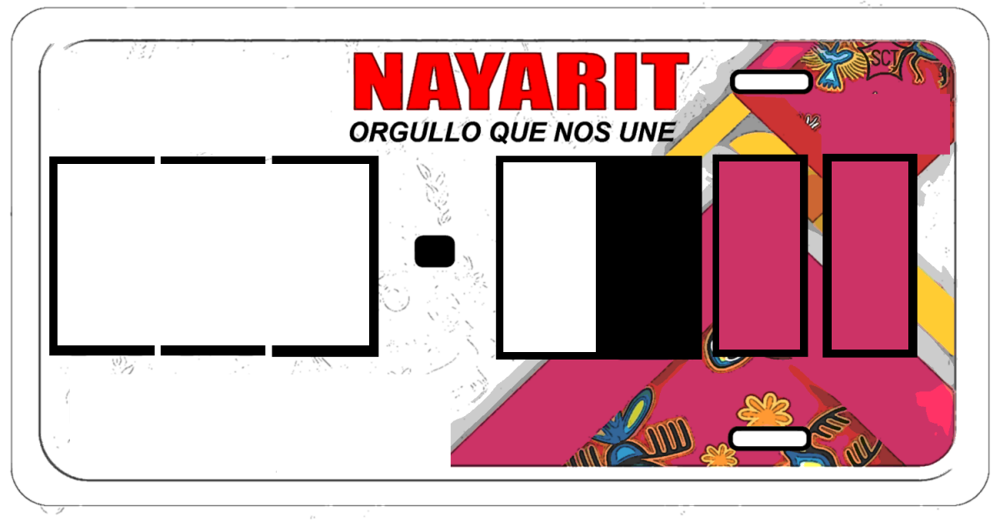
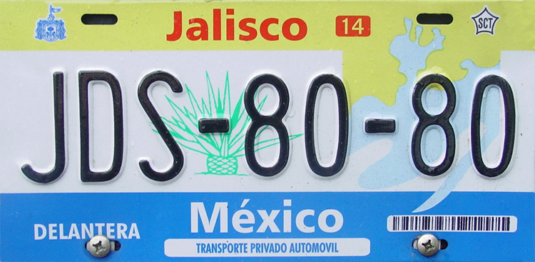

    <h2 class="section-title">{}</h2>
    <ul class="rule-list">
        <li>OXXOはメキシコのコンビニ</li>
        <li>メキシコの大手企業は～MEXや～MXと名前が付いていることが多い（石油大手PEMEX、セメント大手CEMEX、映画館CINEMEX等）</li>
        <li>ドメインは.mx</li>
        <li>電柱は8角形のものが多い</li>
    </ul>

{}
{}

{}
～MEXと名の付く会社はメキシコの大手企業に多い。OXXOはメキシコの大手コンビニ（ただしチリなどにも多く存在する）。
{}

<iframe src="https://www.google.com/maps/embed?pb=!4v1681001692977!6m8!1m7!1sy3XV10a3ClWydhJOF04n1A!2m2!1d27.44458230172642!2d-99.52181982329259!3f236.9881189121672!4f14.192127047255482!5f2.8609201218789653" width="295" height="295" style="border:0;" allowfullscreen="" loading="lazy" referrerpolicy="no-referrer-when-downgrade"></iframe>
<iframe src="https://www.google.com/maps/embed?pb=!4v1681001565385!6m8!1m7!1sJYAXaPd2tz8uN_dGZz8Z2Q!2m2!1d27.44986791939745!2d-99.51879027561925!3f347.80626742005916!4f13.635629480031909!5f3.325193203789971" width="295" height="295" style="border:0;" allowfullscreen="" loading="lazy" referrerpolicy="no-referrer-when-downgrade"></iframe>
<iframe src="https://www.google.com/maps/embed?pb=!4v1681001582971!6m8!1m7!1stum5t4nmHLXc9ze0BzAiog!2m2!1d27.44889898098879!2d-99.51935115950234!3f70.82730241772708!4f-16.24011429841073!5f3.2238639420880415" width="295" height="295" style="border:0;" allowfullscreen="" loading="lazy" referrerpolicy="no-referrer-when-downgrade"></iframe>
<iframe src="https://www.google.com/maps/embed?pb=!4v1681521750363!6m8!1m7!1sPcpR6tpcU1sgf9sNo_4PeQ!2m2!1d18.7015081507322!2d-88.38674114610056!3f263.8729299527826!4f-18.094240210637224!5f0.8164310715774429" width="295" height="295" style="border:0;" allowfullscreen="" loading="lazy" referrerpolicy="no-referrer-when-downgrade"></iframe>

{}
8角形の電柱が特徴的。停まれはALTO。
{}

<iframe src="https://www.google.com/maps/embed?pb=!4v1681001887650!6m8!1m7!1sm37ENm7cZoTUk_9QmdELmg!2m2!1d27.44392882621393!2d-99.52223275917264!3f200.2997580111676!4f-7.532300258326686!5f1.208598839741584" width="295" height="295" style="border:0;" allowfullscreen="" loading="lazy" referrerpolicy="no-referrer-when-downgrade"></iframe>
<iframe src="https://www.google.com/maps/embed?pb=!4v1679459072284!6m8!1m7!1s8PmLY24JPH4SftL8hA2CZA!2m2!1d25.75251926645027!2d-100.3004127618978!3f93.71490274714154!4f-1.98958654281806!5f3.2793573082848697" width="295" height="295" style="border:0;" allowfullscreen="" loading="lazy" referrerpolicy="no-referrer-when-downgrade"></iframe>

{}
{}

<iframe src="https://www.google.com/maps/embed?pb=!4v1681038190947!6m8!1m7!1s9nAl0N31Ju0CBkdr4voz_A!2m2!1d21.87217575161593!2d-102.3095089272366!3f242.0139138779507!4f-14.54817443941107!5f1.606254004703728" width="295" height="295" style="border:0;" allowfullscreen="" loading="lazy" referrerpolicy="no-referrer-when-downgrade"></iframe>
<iframe src="https://www.google.com/maps/embed?pb=!4v1679459072284!6m8!1m7!1s8PmLY24JPH4SftL8hA2CZA!2m2!1d25.75251926645027!2d-100.3004127618978!3f93.71490274714154!4f-1.98958654281806!5f3.2793573082848697" width="295" height="295" style="border:0;" allowfullscreen="" loading="lazy" referrerpolicy="no-referrer-when-downgrade"></iframe>
<iframe src="https://www.google.com/maps/embed?pb=!4v1681001959331!6m8!1m7!1sxAM4-ZNdAtGAwJFYsrGxRQ!2m2!1d27.43836612238844!2d-99.49859360331283!3f213.0166319742502!4f-6.839769541205769!5f3.314171391274682" width="295" height="295" style="border:0;" allowfullscreen="" loading="lazy" referrerpolicy="no-referrer-when-downgrade"></iframe>
<iframe src="https://www.google.com/maps/embed?pb=!4v1681001887650!6m8!1m7!1sm37ENm7cZoTUk_9QmdELmg!2m2!1d27.44392882621393!2d-99.52223275917264!3f200.2997580111676!4f-7.532300258326686!5f1.208598839741584" width="295" height="295" style="border:0;" allowfullscreen="" loading="lazy" referrerpolicy="no-referrer-when-downgrade"></iframe>

{}
{}

<iframe src="https://www.google.com/maps/embed?pb=!4v1679326979706!6m8!1m7!1sTnKtDpcSLRQ4RjMe4Sjd4g!2m2!1d25.54072681401005!2d-103.6382544135941!3f127.84925597748136!4f-19.074318903338067!5f3.2440693678505452" width="295" height="295" style="border:0;" allowfullscreen="" loading="lazy" referrerpolicy="no-referrer-when-downgrade"></iframe>

{}
{}

<iframe src="https://www.google.com/maps/embed?pb=!4v1679676346295!6m8!1m7!1sptDPEUGadZCel8Vwz0khJA!2m2!1d18.25720171037926!2d-97.54428259097156!3f113.29189671981759!4f4.696430976423443!5f3.325193203789971" width="295" height="295" style="border:0;" allowfullscreen="" loading="lazy" referrerpolicy="no-referrer-when-downgrade"></iframe>

{}
{}

    <h2 class="section-title">州・地域の絞り込み</h2>
    <ul class="rule-list">
        <li>州の名前を覚えておくと絞り込みの役に立つ（<a href="https://ja.wikipedia.org/wiki/%E3%83%A1%E3%82%AD%E3%82%B7%E3%82%B3">Wiki</a>）</li>
        <li>State Highway(白色の盾のようなマーク)の看板に道路番号と州の名前が書いてあることがある</li>
        <li>アメリカに近いエリアの電話番号は 000-000-0000 の表記かも（100%ではない）{}</li>
        <li>電話番号の先頭の数字でおよその地域が特定できる(2~9)、偶数は上・奇数は下のイメージ</li>
    </ul>

{}

    <h2 class="section-title">都市・町の絞り込み</h2>
    <ul class="rule-list">
        <li>ナンバープレートの色で町が分かることがある</li>
        <li>タクシーにヒントがある
            <ul>
                <li>メキシコシティのタクシーにはCDMXと書いてありピンク色</li>
                <li class="no-evidence">ソノラのタクシーには白色で横にSONOLAと書いてある</li>
                <li class="no-evidence">モンテレイのタクシーは黄色</li>
            </ul>
        </li>
    </ul>

{}
{}
{}

{}

<iframe src="https://www.google.com/maps/embed?pb=!4v1681719067854!6m8!1m7!1sgylLmuJ3IZfTXZ7RMW36sA!2m2!1d21.5163933518265!2d-104.9006927575845!3f48.83007536049431!4f-9.816624964845346!5f3.325193203789971" width="295" height="295" style="border:0;" allowfullscreen="" loading="lazy" referrerpolicy="no-referrer-when-downgrade"></iframe>

右下が赤いナンバープレートはNayarit周辺に多い

{}
{}
{}

Public Domain
{}

<iframe src="https://www.google.com/maps/embed?pb=!4v1681719352208!6m8!1m7!1spn0dOi8NviCruhvOcfFU6Q!2m2!1d20.66214401084474!2d-103.3539136619186!3f275.4124592924797!4f-6.463612869127061!5f3.325193203789971" width="295" height="295" style="border:0;" allowfullscreen="" loading="lazy" referrerpolicy="no-referrer-when-downgrade"></iframe>

上が黄色で下が水色、ただ他の町にも結構走っている？

{}
{}

{}
{}

<iframe src="https://www.google.com/maps/embed?pb=!4v1679458581944!6m8!1m7!1sofRx7y1WNAprPtaAhdmEqA!2m2!1d19.37148555541399!2d-99.1788575112147!3f153.15458392524835!4f-9.71562876312683!5f3.325193203789971" width="295" height="295" style="border:0;" allowfullscreen="" loading="lazy" referrerpolicy="no-referrer-when-downgrade"></iframe>
<iframe src="https://www.google.com/maps/embed?pb=!4v1679458676011!6m8!1m7!1skx4IwvjEl0zBgP-D61qSqA!2m2!1d19.37082017504024!2d-99.17625075855491!3f201.54969317592017!4f-15.039044125137536!5f3.260309308100377" width="295" height="295" style="border:0;" allowfullscreen="" loading="lazy" referrerpolicy="no-referrer-when-downgrade"></iframe>

{}
{}

<iframe src="https://www.google.com/maps/embed?pb=!4v1679458863603!6m8!1m7!1s4RycP9oyVHyyfykYBqOxWw!2m2!1d29.09357410608328!2d-110.984242537779!3f304.3327860034546!4f-17.309773440110092!5f2.8989011536707783" width="295" height="295" style="border:0;" allowfullscreen="" loading="lazy" referrerpolicy="no-referrer-when-downgrade"></iframe>

{}
{}

<iframe src="https://www.google.com/maps/embed?pb=!4v1679459246412!6m8!1m7!1sT-JobBKxcKUJd3JlEPU0UA!2m2!1d25.67772911259084!2d-100.3180719930014!3f74.89862641189546!4f-9.062797298225789!5f3.325193203789971" width="295" height="295" style="border:0;" allowfullscreen="" loading="lazy" referrerpolicy="no-referrer-when-downgrade"></iframe>
<iframe src="https://www.google.com/maps/embed?pb=!4v1679459308499!6m8!1m7!1sNucgw5wKbsBiOUwNE9B3Yw!2m2!1d25.74495341159165!2d-100.3066423200428!3f214.26809021321327!4f-6.221660791867066!5f3.325193203789971" width="295" height="295" style="border:0;" allowfullscreen="" loading="lazy" referrerpolicy="no-referrer-when-downgrade"></iframe>

{}
{}
{}
アメリカ人が飛行機で観光に来るためこの町付近は英語表記が多いと思われる。周りの木が特徴的。
{}

<iframe src="https://www.google.com/maps/embed?pb=!4v1681522088884!6m8!1m7!1s8m38-qAvewkTHd25Tt0RrQ!2m2!1d19.58042244884665!2d-88.04444830736489!3f51.22711437413797!4f-32.35609661970913!5f2.6641871236477472" width="295" height="295" style="border:0;" allowfullscreen="" loading="lazy" referrerpolicy="no-referrer-when-downgrade"></iframe>
<iframe src="https://www.google.com/maps/embed?pb=!4v1681518865295!6m8!1m7!1sbFiTf-JIQTrv5HAA6ZKI6A!2m2!1d19.58023131640169!2d-88.04407947938945!3f250.2737280606325!4f-6.794132456995868!5f3.325193203789971" width="295" height="295" style="border:0;" allowfullscreen="" loading="lazy" referrerpolicy="no-referrer-when-downgrade"></iframe>

{}
{}

<iframe src="https://www.google.com/maps/embed?pb=!4v1681521880152!6m8!1m7!1sL1iqlazUA4hIFyyhVOjL4A!2m2!1d21.16288078148741!2d-86.85248546837562!3f184.74123425153283!4f-10.372636751105972!5f3.0837205458794528" width="295" height="295" style="border:0;" allowfullscreen="" loading="lazy" referrerpolicy="no-referrer-when-downgrade"></iframe>

{}
{}