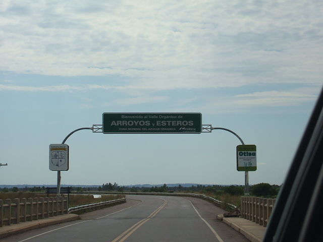

    <h2 class="section-title">{}</h2>
    <ul class="rule-list">
        <li>ドメインは.py</li>
        <li class="no-evidence">アスンシオンの通り看板は黒いことが多い</li>
        <li class="no-evidence">Google公式のカバレッジは国境ギリギリでパラグアイ側の道路を走った場合を除いて無い</li>
    </ul>

{}
{}

{}
こういった感じの道路にアーチ状に付けられた看板がある。
{}

{}
{}と同じく仕切りのある電柱が見つかる。
{}

By Diego Fernando Quint…, <a href="https://creativecommons.org/licenses/by-sa/3.0" title="Creative Commons Attribution-Share Alike 3.0">CC BY-SA 3.0</a>, <a href="https://commons.wikimedia.org/w/index.php?curid=57731220">Link</a>

{}
アスンシオンの通り看板は黒いことが多く赤白のポールが多い。看板の裏側も{}と同じく黒いことが多いように思う。
{}

{}
{}

{}
ブラジルとの国境付近でパラグアイ側に入る場所がたまにある。
{}

<iframe src="https://www.google.com/maps/embed?pb=!4v1687922020436!6m8!1m7!1sSVDJ3vfvRoHYrFTwyMWFgw!2m2!1d-22.53828353996352!2d-55.73145416857376!3f154.8663524677843!4f-11.101388746016667!5f0.7820865974627469" width="295" height="295" style="border:0;" allowfullscreen="" loading="lazy" referrerpolicy="no-referrer-when-downgrade"></iframe>
<iframe src="https://www.google.com/maps/embed?pb=!4v1683487192052!6m8!1m7!1sIRbpuu_Sa_eR0eKVHsykOw!2m2!1d-25.40866026457559!2d-54.58955083357984!3f270.35716398823723!4f8.433285000610212!5f1.4070310657499792" width="295" height="295" style="border:0;" allowfullscreen="" loading="lazy" referrerpolicy="no-referrer-when-downgrade"></iframe>

{}
{}