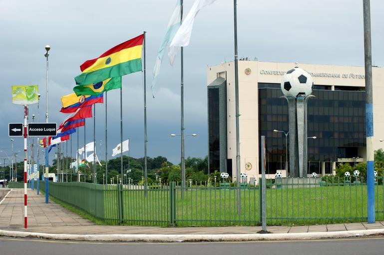
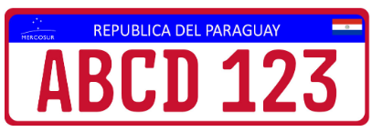
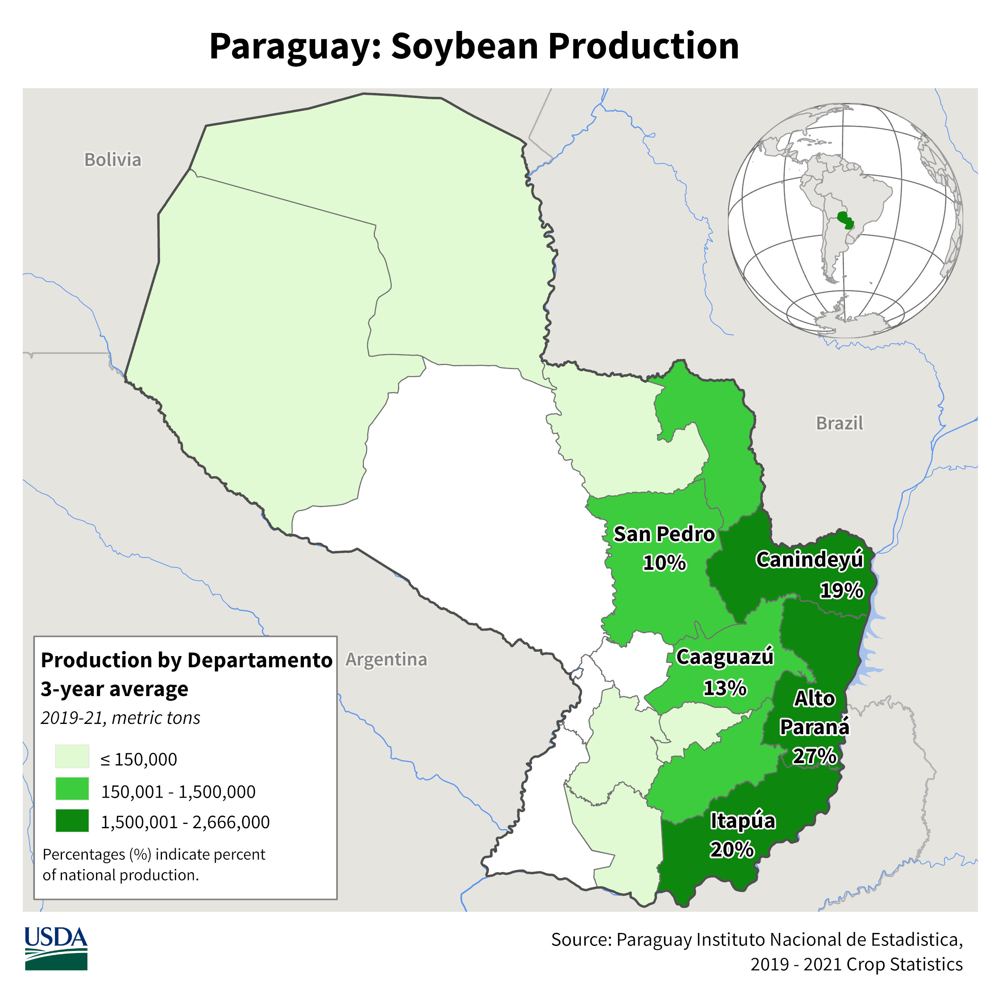
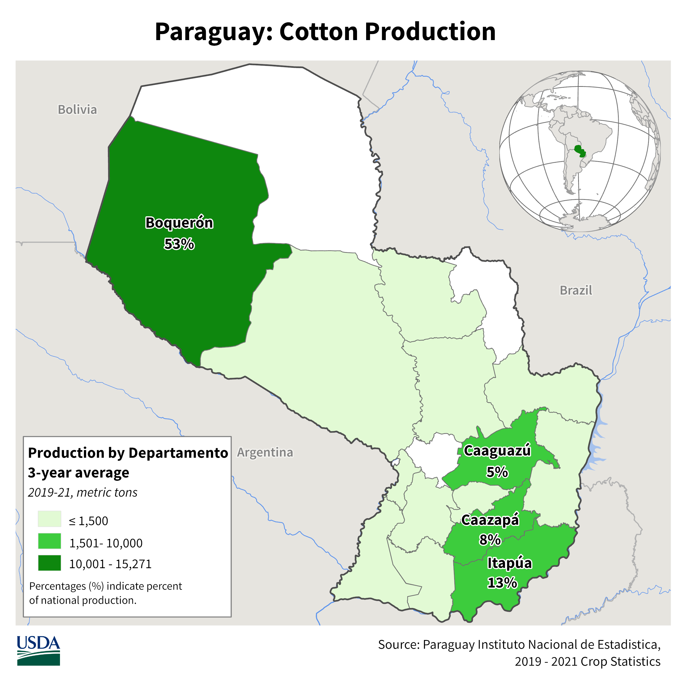

    <h2 class="section-title">{}</h2>
    <ul class="rule-list">
        <li>ドメインは.py</li>
        <li class="no-evidence">看板裏は黒いことが多い</li>
        <li>{}と同じく仕切りのある電柱が見つかる。</li>
        <li class="no-evidence">ナンバープレートは赤色に見える</li>
    </ul>

{}
{}

{}
{}と同じく仕切りのある電柱が見つかる{}。一方で、道路にかかるアーチ状の看板もパラグアイ以外はほとんど見かけない{}。
{}

By Diego Fernando Quint…, <a href="https://creativecommons.org/licenses/by-sa/3.0" title="Creative Commons Attribution-Share Alike 3.0">CC BY-SA 3.0</a>, <a href="https://commons.wikimedia.org/w/index.php?curid=57731220">Link</a>

{}
看板の裏側も{}と同じく黒いことが多いように思う{}。
{}

{}
ナンバープレートは少しだけ赤色に見える{}。
{}

{}

CC0
{}

{}
{}

    <h2>パラグアイ関連グッズ</h2>
    

        
        <!-- 
商品タイトル1
-->
    

    <h2 class="section-title">{}</h2>
    <ul class="rule-list">
        <li>北西ほど乾燥し、南東ほど雨量が多い{}
            <ul>
                <li>東の国境に近いほど大豆・コーン畑が多い{}</li>
            </ul>
        </li>
    </ul>

{}
{}

{}
雨量が多く、大豆・田んぼ・コーン畑が見られる。
{}
{}
{}

{}逆に北西は雨量が少なく、コットンやピーナッツ畑が見られる。しかしこの地域にはストリートビューは来ていない。
{}
{}
{}