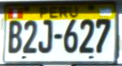
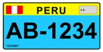
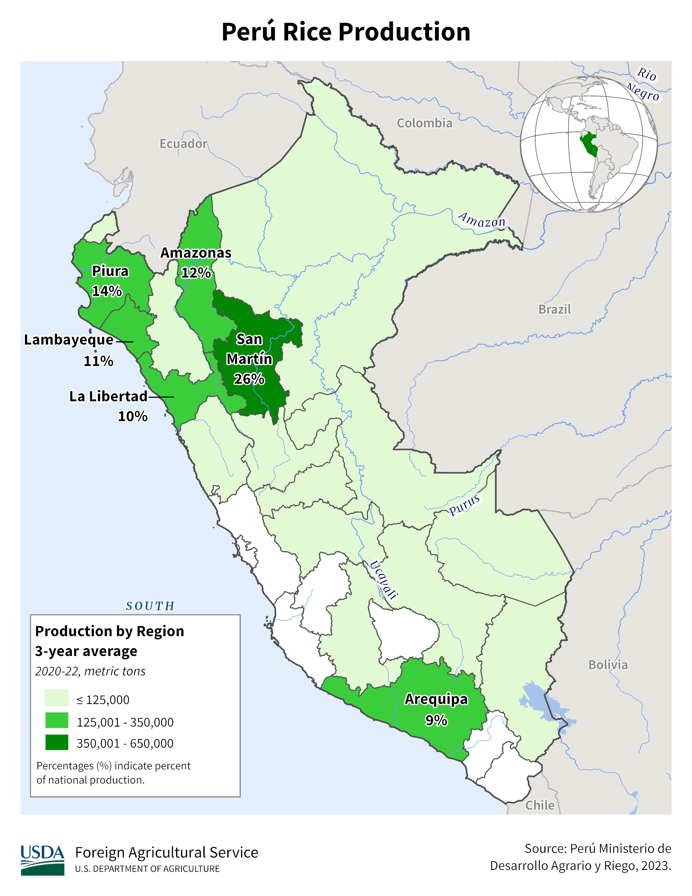

    <h2 class="section-title">{}</h2>
    <ul class="rule-list">
        <li>ドメインは.pe</li>
        <li>言語はスペイン語</li>
        <li>標識の棒が白黒のストライプの時が多い</li>
        <li>電柱は同じ向きに３本棒が付きだしている{}</li>
        <li>タクシーやトラックのナンバープレートが蛍光に近い黄色のときがある</li>
        <li>Google Carが黒色の時がある。南米では他に{}と{}も同じ色のGoogle Carを使う{}。</li>
        <li class="no-evidence">ボラードは黄色に塗られていることが多い</li>
        <li class="no-evidence">ガードレールに黄色と黒のストライプがある</li>
        <li class="no-evidence">細長い箱が家の壁に埋め込まれていたり外についていたりする</li>
    </ul>
    {}

{}
{}
{}
標識の棒が白黒のストライプ{}の時が多い。ボラードは黄色に塗られている。
{}

{}
根本をコンクリートで固めているパターンも良く見かける{}。
{}

{}
タクシーとトラックは黄色の蛍光色のナンバープレート{}・バスは上が緑色のナンバープレートをつけていることがある{}。白いもの多い。
{}

{}

CC0
{}

{}
バイクやトゥクトゥクに似た形の乗り物はナンバープレートが水色{}のことがある{}。
{}

By <a href="//commons.wikimedia.org/wiki/User:Bgag" title="User:Bgag">Bernard Gagnon</a> - Own work, <a href="https://creativecommons.org/licenses/by-sa/3.0" title="Creative Commons Attribution-Share Alike 3.0">CC BY-SA 3.0</a>, <a href="https://commons.wikimedia.org/w/index.php?curid=46911639">Link</a>

{}

By <a href=&quot;//commons.wikimedia.org/wiki/User:Zcarstvnz&quot; title=&quot;User:Zcarstvnz&quot;>Zcarstvnz</a> - Own work, <a href="https://creativecommons.org/licenses/by-sa/4.0" title="Creative Commons Attribution-Share Alike 4.0">CC BY-SA 4.0</a>, <a href="https://commons.wikimedia.org/w/index.php?curid=72974996">Link</a>
{}

{}
電柱は同じ向きに棒が付きだしているものがある{}{}
{}

<iframe width="560" height="315" src="https://www.youtube.com/embed/bmcAybbzBLo?start=204" title="YouTube video player" frameborder="0" allow="accelerometer; autoplay; clipboard-write; encrypted-media; gyroscope; picture-in-picture; web-share" allowfullscreen></iframe>

{}
道端に道路番号が書かれた白黒のボラードがある。黒い部分に道路番号が書かれていることがあるが、読みにくいので注意。これは『08B』の道。
{}

By <a href="//commons.wikimedia.org/wiki/User:Pitxiquin" title="User:Pitxiquin">Pitxiquin</a>- Own work, <a href="https://creativecommons.org/licenses/by-sa/4.0" title="Creative Commons Attribution-Share Alike 4.0">CC BY-SA 4.0</a>, <a href="https://commons.wikimedia.org/w/index.php?curid=59879412">Link</a>

{}
{}
{}
ガードレールの模様
{}

<iframe src="https://www.google.com/maps/embed?pb=!4v1685255945208!6m8!1m7!1spdaqZep_ne3-Y1gd2Jvhmg!2m2!1d-5.836518407748231!2d-77.99649735499301!3f335.977693587706!4f-12.960206817655376!5f1.742747712528216" width="295" height="295" style="border:0;" allowfullscreen="" loading="lazy" referrerpolicy="no-referrer-when-downgrade"></iframe>

{}
{}
{}
電柱は同じ方向に3本ほど棒が付きだしているものがある。
{}

<iframe src="https://www.google.com/maps/embed?pb=!4v1689063313770!6m8!1m7!1sHGPJVOJv-NSaqCyXlLh2CQ!2m2!1d-12.13578785884225!2d-76.8077639891435!3f81.28270024151131!4f33.197897697403874!5f3.3248611522391367" width="295" height="295" style="border:0;" allowfullscreen="" loading="lazy" referrerpolicy="no-referrer-when-downgrade"></iframe>

{}
{}

{}
ボラードには何個かバリエーションがあるものの、白色に黄色のペイントがされたデザインはペルー以外ではまず見ない。
{}

<iframe src="https://www.google.com/maps/embed?pb=!4v1680355234923!6m8!1m7!1sIOKZyXbBZvXeZImXH8GXmw!2m2!1d-15.57786080144935!2d-70.10120163690182!3f296.8561801891278!4f-21.206709910168087!5f3.098953353208563" width="295" height="295" style="border:0;" allowfullscreen="" loading="lazy" referrerpolicy="no-referrer-when-downgrade"></iframe>
<iframe src="https://www.google.com/maps/embed?pb=!4v1683805070363!6m8!1m7!1sJ8tkvxtMg35I7ZX48d63Iw!2m2!1d-16.73451805644685!2d-69.71085030545977!3f288.6545619316565!4f-15.673906824009407!5f2.9131358656875324" width="295" height="295" style="border:0;" allowfullscreen="" loading="lazy" referrerpolicy="no-referrer-when-downgrade"></iframe>
<iframe src="https://www.google.com/maps/embed?pb=!4v1685255452553!6m8!1m7!1sV_m0TM24-U1jJUfGnok18w!2m2!1d-11.55895048087308!2d-69.28771986328607!3f148.5534550784995!4f-10.90553675857818!5f3.325193203789971" width="295" height="295" style="border:0;" allowfullscreen="" loading="lazy" referrerpolicy="no-referrer-when-downgrade"></iframe>

{}
{}

{}
壁に埋め込まれた細長い箱？
{}

<iframe src="https://www.google.com/maps/embed?pb=!4v1687405941718!6m8!1m7!1sj2j2OmgVQ9liiXCPem0aPw!2m2!1d-11.99979523780639!2d-77.05149792975354!3f207.20135005809732!4f-13.403045634823357!5f3.325193203789971" width="295" height="295" style="border:0;" allowfullscreen="" loading="lazy" referrerpolicy="no-referrer-when-downgrade"></iframe>
<iframe src="https://www.google.com/maps/embed?pb=!4v1687406013160!6m8!1m7!1s8iaz3NzSwxLWgkgOYbLZ0Q!2m2!1d-17.64026220130956!2d-71.32706660113355!3f65.24242672393657!4f-7.735547419482401!5f3.325193203789971" width="295" height="295" style="border:0;" allowfullscreen="" loading="lazy" referrerpolicy="no-referrer-when-downgrade"></iframe>

{}
{}

{}
黒や白のGoogle Carが見られる。しかしアジアでも黒いGoogle Carを使うので色だけで南米に飛ぶと間違える時がある。右はペルーではなくインドネシア。
{}

<iframe src="https://www.google.com/maps/embed?pb=!4v1689164645139!6m8!1m7!1szQDgI-2g9EZX7W2bfK0a6Q!2m2!1d-4.917720938064438!2d-80.84123537673362!3f277.2642709679733!4f-31.950433040985388!5f2.5783706818300063"width="295" height="295" style="border:0;" allowfullscreen="" loading="lazy" referrerpolicy="no-referrer-when-downgrade"></iframe>
<iframe src="https://www.google.com/maps/embed?pb=!4v1689164856256!6m8!1m7!1s7XN7wrREmw-2ltuDbTCOEw!2m2!1d0.6767604395880494!2d120.0338201672312!3f175.91998162017126!4f-31.709438222891443!5f1.9526976194285344"width="295" height="295" style="border:0;" allowfullscreen="" loading="lazy" referrerpolicy="no-referrer-when-downgrade"></iframe>

{}
{}

    <h2 class="section-title">{}</h2>
    <ul class="rule-list">
        <li>アレキパは川沿いにのみ田んぼが存在する{}{}</li>
    </ul>

{}
{}

{}
図だとアレキパ全体でコメの生産があるように見えるが、実際は川沿いの水が得られる地域しか田んぼがない。見た目がかなり特徴的なのでわかりやすい。
{}

<iframe src="https://www.google.com/maps/embed?pb=!4v1687087013599!6m8!1m7!1szdThFhmkSMAXRLeHBqHITA!2m2!1d-16.28263616318466!2d-73.13247816266673!3f211.18179943152083!4f1.0585904043393555!5f0.4000000000000002" width="550" height="200" style="border:0;" allowfullscreen="" loading="lazy" referrerpolicy="no-referrer-when-downgrade"></iframe>

{}
{}