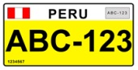

    <h2 class="section-title">{}</h2>
    <ul class="rule-list">
        <li>ドメインは.pe</li>
        <li>言語はスペイン語</li>
        <li>標識の棒が白黒のストライプの時が多い。ボリビアはシンプルな製材のことが多い。</li>
        <li>電柱は同じ向きに３本棒が付きだしている{}</li>
    </ul>
    {}

{}
{}
{}
標識の棒が白黒のストライプの時が多い。白黒の小さいボラードのようなものもありこれに「PE36」のような感じで道路番号が書いてあることもある。
{}

<iframe src="https://www.google.com/maps/embed?pb=!4v1680355324177!6m8!1m7!1sjMc4AIk2k4h4P5yyHFaYNA!2m2!1d-15.57276222126613!2d-70.10160266089457!3f34.08290224907924!4f-10.24587940681829!5f3.325193203789971" width="295" height="295" style="border:0;" allowfullscreen="" loading="lazy" referrerpolicy="no-referrer-when-downgrade"></iframe>
<iframe src="https://www.google.com/maps/embed?pb=!4v1683805154435!6m8!1m7!1snwKlkAXGmaC246unAYPSxg!2m2!1d-16.74899137785472!2d-69.71975581616286!3f163.28872844364196!4f-5.286252175117383!5f3.325193203789971" width="295" height="295" style="border:0;" allowfullscreen="" loading="lazy" referrerpolicy="no-referrer-when-downgrade"></iframe>

{}
蛍光に近い黄色のナンバープレートがある、色の塗られた範囲は上部だけ黄色、全体が黄色などバリエーションがある。
タクシーには側面にオレンジ色のステッカーが張ってあるがボリビアにも貼ってある。
{}

<iframe src="https://www.google.com/maps/embed?pb=!4v1682383349408!6m8!1m7!1sTCHMU4z6G8lQjE1fEjaatw!2m2!1d-11.94904797911199!2d-77.07034700589297!3f190.2118151613256!4f-9.601137434260238!5f3.2287431766290653" width="295" height="295" style="border:0;" allowfullscreen="" loading="lazy" referrerpolicy="no-referrer-when-downgrade"></iframe>
<iframe src="https://www.google.com/maps/embed?pb=!4v1682383519368!6m8!1m7!1sHtSGrg_0bRgnIoH1O4eGCw!2m2!1d-12.04659026982752!2d-77.00212976572396!3f116.78366614843557!4f-37.226187432899344!5f3.314246615600738" width="295" height="295" style="border:0;" allowfullscreen="" loading="lazy" referrerpolicy="no-referrer-when-downgrade"></iframe>

{}

By Zcarstvnz - Own work, <a href="https://creativecommons.org/licenses/by-sa/4.0/deed.ja">CC BY-SA 4.0</a>, <a href="https://commons.wikimedia.org/w/index.php?curid=72975002">Wikimedia Commons</a>
{}

{}
電柱は同じ向き（道路側？）に３本棒が付きだしているものがある{}
{}

<iframe width="560" height="315" src="https://www.youtube.com/embed/bmcAybbzBLo?start=204" title="YouTube video player" frameborder="0" allow="accelerometer; autoplay; clipboard-write; encrypted-media; gyroscope; picture-in-picture; web-share" allowfullscreen></iframe>

{}
{}
{}
ガードレールの模様
{}

<iframe src="https://www.google.com/maps/embed?pb=!4v1685255945208!6m8!1m7!1spdaqZep_ne3-Y1gd2Jvhmg!2m2!1d-5.836518407748231!2d-77.99649735499301!3f335.977693587706!4f-12.960206817655376!5f1.742747712528216" width="295" height="295" style="border:0;" allowfullscreen="" loading="lazy" referrerpolicy="no-referrer-when-downgrade"></iframe>

{}
{}
{}
電柱は道路側に３～４本棒が付きだしているものがある。
{}

<iframe src="https://www.google.com/maps/embed?pb=!4v1681039719461!6m8!1m7!1syuqvlXBKntGkqLZeKbx08Q!2m2!1d-7.164535948425311!2d-78.46482750393291!3f336.02564457472874!4f18.05477957444974!5f3.325193203789971" width="295" height="295" style="border:0;" allowfullscreen="" loading="lazy" referrerpolicy="no-referrer-when-downgrade"></iframe>
<iframe src="https://www.google.com/maps/embed?pb=!4v1681039465332!6m8!1m7!1sqNuqF7FFip7fwhpDk3PSZw!2m2!1d-16.42218377242603!2d-71.56894965143833!3f0.8364414154696647!4f17.91352206758674!5f3.3140961707687007" width="295" height="295" style="border:0;" allowfullscreen="" loading="lazy" referrerpolicy="no-referrer-when-downgrade"></iframe>

{}
{}

<iframe src="https://www.google.com/maps/embed?pb=!4v1680355234923!6m8!1m7!1sIOKZyXbBZvXeZImXH8GXmw!2m2!1d-15.57786080144935!2d-70.10120163690182!3f296.8561801891278!4f-21.206709910168087!5f3.098953353208563" width="295" height="295" style="border:0;" allowfullscreen="" loading="lazy" referrerpolicy="no-referrer-when-downgrade"></iframe>
<iframe src="https://www.google.com/maps/embed?pb=!4v1683805070363!6m8!1m7!1sJ8tkvxtMg35I7ZX48d63Iw!2m2!1d-16.73451805644685!2d-69.71085030545977!3f288.6545619316565!4f-15.673906824009407!5f2.9131358656875324" width="295" height="295" style="border:0;" allowfullscreen="" loading="lazy" referrerpolicy="no-referrer-when-downgrade"></iframe>
<iframe src="https://www.google.com/maps/embed?pb=!4v1685255452553!6m8!1m7!1sV_m0TM24-U1jJUfGnok18w!2m2!1d-11.55895048087308!2d-69.28771986328607!3f148.5534550784995!4f-10.90553675857818!5f3.325193203789971" width="295" height="295" style="border:0;" allowfullscreen="" loading="lazy" referrerpolicy="no-referrer-when-downgrade"></iframe>

{}
{}
