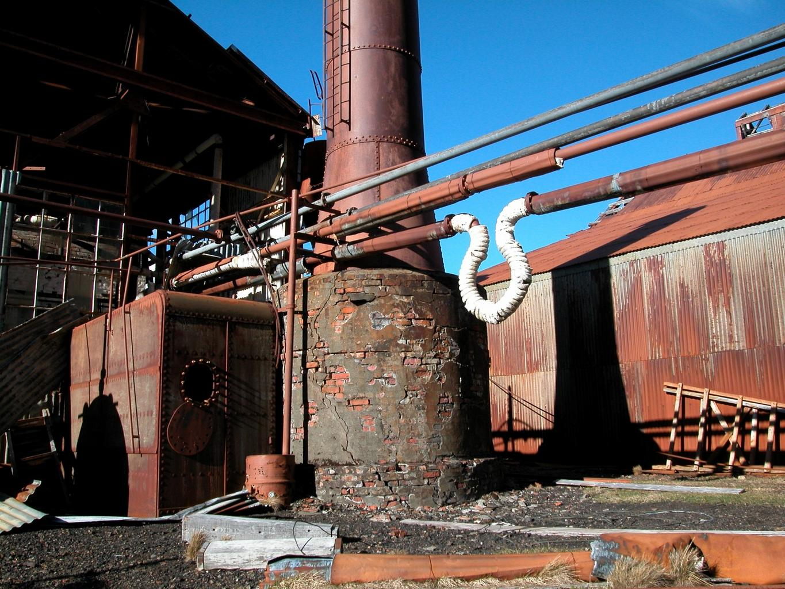
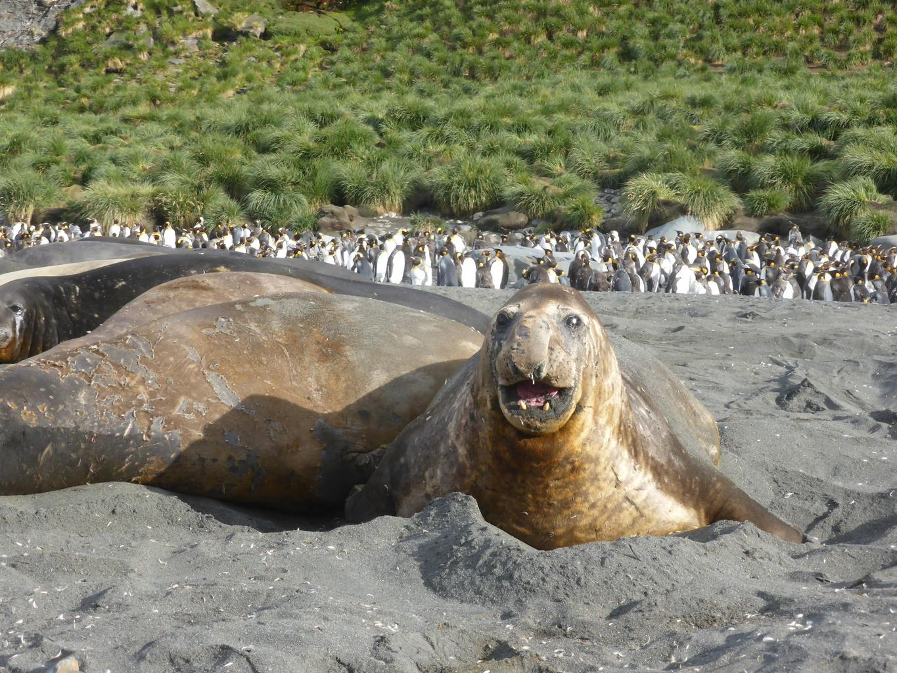

    <h2 class="section-title">{}</h2>
    <ul class="rule-list">
        <li>ドメインは.gs</li>
        <li>グリトビケンでは錆びた建物が見える</li>
        <li>アザラシかペンギンがいる</li>
        <li>Hercules Bayでは船に乗っている{}</li>
    </ul>

{}
{}

{}
かつて鯨油採取の拠点が存在した{{% ref "https://ja.wikipedia.org/wiki/%E3%82%B0%E3%83%AA%E3%83%88%E3%83%93%E3%82%B1%E3%83%B3" "グリトビケン" %}}。錆びついて放棄された建物が見える{}。
{}

{}
アザラシかペンギンがいる{}
{}

{}
{}
