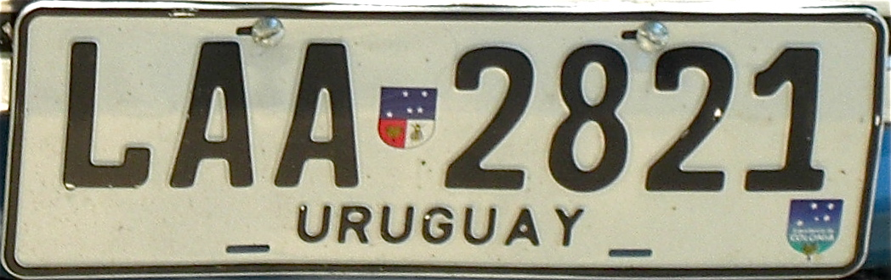

    <h2 class="section-title">{}</h2>
    <ul class="rule-list">
        <li>El dominio es .uy</li>
        <li>El idioma es el español</li>
        <li>Las matrículas son de color blanco</li>
        <li>Los postes de señales suelen ser tablones pintados de blanco; los bolardos también son mayoritariamente blancos.</li>
        <li>Casi todo el país es pampa: praderas donde se crían vacas y ovejas.</li>
        <li>El coche de Google se ve de color negro.</li>
        <li>A diferencia de Argentina, las matrículas no tienen el centro negro.</li>
        <li class="no-evidence">Se observan cortinas rompeviento o plantaciones con filas de árboles iguales.</li>
        <li class="no-evidence">Algunas carreteras tienen dos líneas amarillas con una línea blanca intermedia a intervalos regulares.</li>
    </ul>

{}
{}
{}
Las señales están montadas en tablones blancos con orificios cuadrados{}. Los bolardos también son mayoritariamente blancos; incluso cuando hay bolardos amarillos, los laterales siguen siendo blancos. Las matrículas uruguayas son casi blancas{}, mientras que en {} el centro se ve negro.
{}

{}

Por <a href="https://en.wikipedia.org/wiki/User:Qqqqqq" class="extiw" title="wikipedia:User:Qqqqqq">Qqqqqq</a> en Wikipedia en inglés, <a href="https://creativecommons.org/licenses/by-sa/3.0" title="Creative Commons Attribution-Share Alike 3.0">CC BY-SA 3.0</a>, <a href="https://commons.wikimedia.org/w/index.php?curid=12766727">Link</a>
{}

{}
La línea central de la carretera es característica{}. También hay plantaciones con filas de árboles idénticos{}. Uruguay es muy llano y sin montañas, por lo que estos árboles probablemente sirven como cortavientos o refugio para el ganado{}.
{}

Por <a href="//commons.wikimedia.org/wiki/User:CITY_MVD" title="User:CITY MVD">CITY MVD</a> - Obra propia, <a href="https://creativecommons.org/licenses/by-sa/4.0" title="Creative Commons Attribution-Share Alike 4.0">CC BY-SA 4.0</a>, <a href="https://commons.wikimedia.org/w/index.php?curid=98375088">Link</a>

{}
La petrolera estatal ANCAP controla la mayor parte del sector energético, por lo que sus gasolineras abundan{}. En {}, la empresa estatal es YPF.
{}

{}
El coche de Google suele verse negro. En Sudamérica, el vehículo negro es prácticamente exclusivo de Uruguay{}. No obstante, existen excepciones, así que confirma con otras pistas.
{}

<iframe src="https://www.google.com/maps/embed?pb=!4v1711016463606!6m8!1m7!1sn1GJWau6gMzh9XkD7RJTOw!2m2!1d-34.29498905020895!2d-57.31589321643528!3f128.1644098838366!4f-15.48074126859718!5f0.7820865974627469" width="95%" height="320" style="border:0;" allowfullscreen="" loading="lazy" referrerpolicy="no-referrer-when-downgrade"></iframe>

{}
Las rejas simples y los caminos de tierra también aparecen, pero son menos determinantes; prioriza el color del coche y las señales.
{}
{}
{}
{}
Casi la mitad de la producción de cebada y soja proviene de Soriano y Colonia en el suroeste{}. El maíz y la colza también se concentran en el oeste, así que un paisaje de campos extensos suele sugerir esa región{}.
{}

{}
{}

    <h2 class="section-title">{}</h2>
    <ul class="rule-list">
        <li>En torno a Cabo Polonio no se utilizan coches negros.</li>
        <li>Existe la Isla de Flores, con acceso a pie en Street View{}.</li>
    </ul>

{}
{}

{}
Ni en el poblado ni en el camino de acceso se usa el coche negro de Google{}. Evita confundirlo con otros países.
{}

{}
{}

{}
El recorrido es a pie y hay un gran faro{}.
{}

Por <a href="//commons.wikimedia.org/w/index.php?title=User:Matero_Uruguayo&amp;action=edit&amp;redlink=1" class="new" title="User:Matero Uruguayo (page does not exist)">Matero Uruguayo</a> - Obra propia, <a href="https://creativecommons.org/licenses/by-sa/3.0" title="Creative Commons Attribution-Share Alike 3.0">CC BY-SA 3.0</a>, <a href="https://commons.wikimedia.org/w/index.php?curid=40095338">Link</a>

{}
{}
