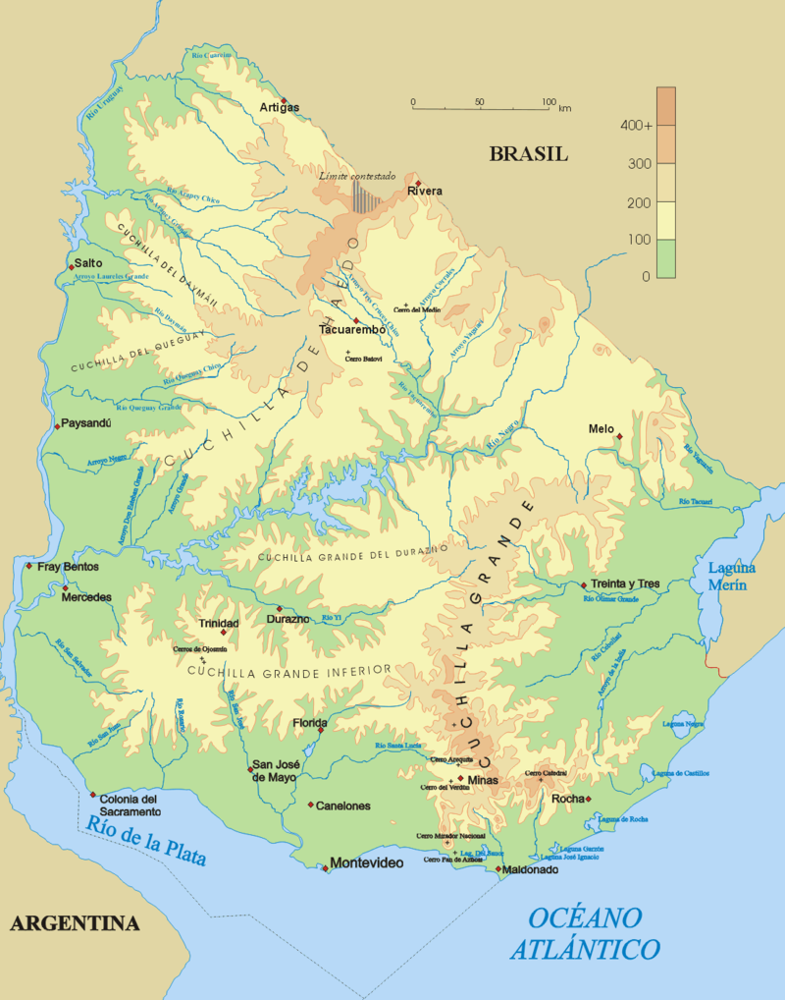

    <h2 class="section-title">{}</h2>
    <ul class="rule-list">
        <li>言語はスペイン語</li>
        <li>ドメインは.uy</li>
        <li>白色に塗られた製材で標識が立てられている、ボラードも同じく白色が多い</li>
        <li>国全域がパンパ（草原地帯）におおわれていて牛や羊の牧畜が行われている</li>
        <li>Google Carが黒色なのは南米ではウルグアイの他に{}と{}がありえる{}</li>
        <li>アルゼンチンと異なりナンバープレートは黒くない</li>
        <li class="no-evidence">防風林や植林地が散見され同一の種類の木がきれいに植えられていることがある</li>
        <li class="no-evidence">道路の中央線に黄色い二本の線があり間に白い線が等間隔である</li>
    </ul>

{}
{}
{}
白い色で塗られた製材にいくつか四角い穴が空けられた標識が多い。ボラードも白色が基調なものが多い、黄色いボラードもあるが側面は白色になっている。
{}

<iframe src="https://www.google.com/maps/embed?pb=!4v1682332868179!6m8!1m7!1s6LzB85dCHz0tTzPHTS1CBw!2m2!1d-31.30368508334028!2d-57.12221402603009!3f47.58188258636387!4f-12.841590975477217!5f2.93994943215001" width="295" height="295" style="border:0;" allowfullscreen="" loading="lazy" referrerpolicy="no-referrer-when-downgrade"></iframe>
<iframe src="https://www.google.com/maps/embed?pb=!4v1682333201827!6m8!1m7!1sDdXQEVplcHkEcmZx9V-dPQ!2m2!1d-33.74005485087628!2d-54.75259154103306!3f51.323777092984244!4f-21.72134758846643!5f1.3833405810897672" width="295" height="295" style="border:0;" allowfullscreen="" loading="lazy" referrerpolicy="no-referrer-when-downgrade"></iframe>

{}
同じ種類の木がまっすぐに植えられている植林地も存在する。ウルグアイは山がほぼ無いため風を遮るものが無く、防風林もしくは家畜避難林だと思われるが明確なソース無し。 "<i>牧場では時々来襲する暴風雨から家畜を守るため、放牧地内の所々に家畜避難林や防風林を設定している</i>{}"。道路の中央線も特徴的。
{}

<iframe src="https://www.google.com/maps/embed?pb=!4v1685254991409!6m8!1m7!1sUOiitP7qH6GBggTvmb0Wug!2m2!1d-34.12346065396341!2d-55.6720927660824!3f203.6559584591058!4f-11.775103413966363!5f1.5349753674630002" width="295" height="295" style="border:0;" allowfullscreen="" loading="lazy" referrerpolicy="no-referrer-when-downgrade"></iframe>
<iframe src="https://www.google.com/maps/embed?pb=!4v1685254826464!6m8!1m7!1srTqUqt0zOGgRLS7_W7mPRQ!2m2!1d-31.85590142097197!2d-54.71309876343062!3f306.72612449953994!4f0.14263049488664592!5f1.7616111927914884" width="295" height="295" style="border:0;" allowfullscreen="" loading="lazy" referrerpolicy="no-referrer-when-downgrade"></iframe>

{}
ウルグアイの国営企業ANCAPが街中にある{}。
{}

{}
🐑...！
{}

<iframe src="https://www.google.com/maps/embed?pb=!4v1682340986154!6m8!1m7!1si3SsW3QFf0nE5j_4K_fCMQ!2m2!1d-32.39305726837082!2d-55.29410752891511!3f235.91098298390824!4f-11.82168877494233!5f3.325193203789971" width="295" height="295" style="border:0;" allowfullscreen="" loading="lazy" referrerpolicy="no-referrer-when-downgrade"></iframe>

{}
{}

{}
白い色で塗られた製材にいくつか四角い穴が空けられた標識が多い。ボラードも白色が基調なものが多い。
{}

<iframe src="https://www.google.com/maps/embed?pb=!4v1682333023613!6m8!1m7!1shSKA102rEVKXuR-vek588A!2m2!1d-33.73973896244041!2d-54.75239398619735!3f182.8487739547804!4f-10.972025016473566!5f3.325193203789971" width="295" height="295" style="border:0;" allowfullscreen="" loading="lazy" referrerpolicy="no-referrer-when-downgrade"></iframe>
<iframe src="https://www.google.com/maps/embed?pb=!4v1682333168466!6m8!1m7!1seqnPNq4Bo11MprLmPYpjQA!2m2!1d-32.89795911070742!2d-57.4287392446015!3f144.63446825037616!4f-9.745212375406169!5f2.8916030077743624" width="295" height="295" style="border:0;" allowfullscreen="" loading="lazy" referrerpolicy="no-referrer-when-downgrade"></iframe>

{}
plonk itによるとこの山の形の電柱もウルグアイの特徴らしい{}。後ろの植林、遠くに見える牛と合わせればウルグアイと判断できるかも。
{}

<iframe src="https://www.google.com/maps/embed?pb=!4v1682393107016!6m8!1m7!1sb0KX-faerKx9c39KTrhVJw!2m2!1d-34.78055765762635!2d-56.24339614965749!3f138.80083826743012!4f11.008359688528614!5f3.325193203789971" width="295" height="295" style="border:0;" allowfullscreen="" loading="lazy" referrerpolicy="no-referrer-when-downgrade"></iframe>
<iframe src="https://www.google.com/maps/embed?pb=!4v1682393167861!6m8!1m7!1sKcUjle2YakromH-2-7BbKQ!2m2!1d-30.89713377546066!2d-56.82236620668786!3f138.70362867210025!4f3.150533778603318!5f3.325193203789971" width="295" height="295" style="border:0;" allowfullscreen="" loading="lazy" referrerpolicy="no-referrer-when-downgrade"></iframe>

{}
{}
{}
ほとんどの領域が標高0～300mの間であり、最高でも513m（パブリックドメインの画像より）。
{}

{}
{}