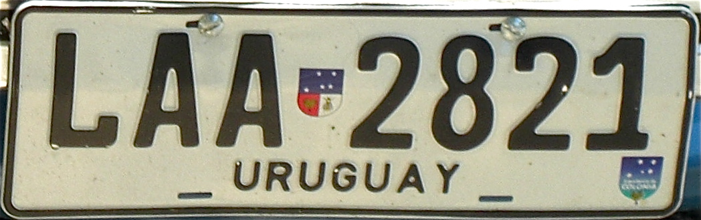
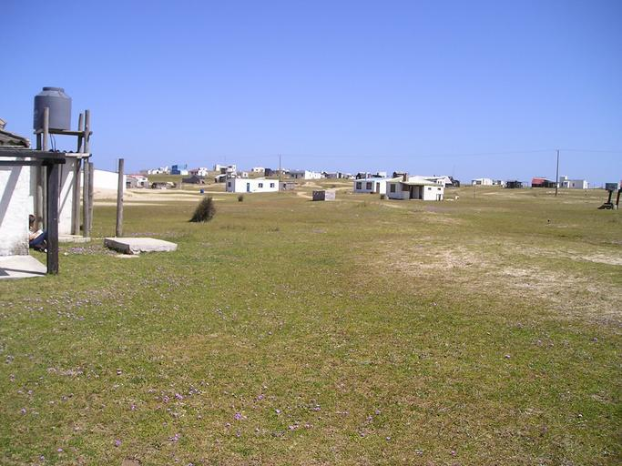

    <h2 class="section-title">{}</h2>
    <ul class="rule-list">
        <li>ドメインは.uy</li>
        <li>言語はスペイン語</li>
        <li>ナンバープレートは白色</li>
        <li>白色に塗られた製材で標識が立てられている、ボラードも同じく白色が多い</li>
        <li>国全域がパンパと呼ばれる草原地帯におおわれていて牛や羊の牧畜が行われている</li>
        <li>Google Carが黒く見える</li>
        <li>アルゼンチンと異なりナンバープレートは黒くない</li>
        <li class="no-evidence">防風林や植林地が散見され同一の種類の木がきれいに植えられていることがある</li>
        <li class="no-evidence">道路の中央線に黄色い二本の線があり間に白い線が等間隔である</li>
    </ul>

{}
{}
{}
白い色で塗られた製材にいくつか四角い穴が空けられた標識が多い{}。ボラードも白色が基調であるものが多い。黄色いボラードもあるが側面はやはり白色になっている。またウルグアイの車のナンバープレートは白色に近い{}が、{}は真ん中が黒く見える。
{}

{}

By <a href="https://en.wikipedia.org/wiki/User:Qqqqqq" class="extiw" title="wikipedia:User:Qqqqqq">Qqqqqq</a> at <a href="https://en.wikipedia.org/wiki/" class="extiw" title="wikipedia:">English Wikipedia</a>, <a href="https://creativecommons.org/licenses/by-sa/3.0" title="Creative Commons Attribution-Share Alike 3.0">CC BY-SA 3.0</a>, <a href="https://commons.wikimedia.org/w/index.php?curid=12766727">Link</a>
{}

{}
道路の中央線が特徴的{}。また同じ種類の木が植えられている植林地が点在する{}。ウルグアイは山がほぼ無い平坦な国なので風を遮るものが無い。これらは防風林もしくは家畜避難林だと思われる {}"。
{}

By <a href="//commons.wikimedia.org/wiki/User:CITY_MVD" title="User:CITY MVD">CITY MVD</a> - Own work, <a href="https://creativecommons.org/licenses/by-sa/4.0" title="Creative Commons Attribution-Share Alike 4.0">CC BY-SA 4.0</a>, <a href="https://commons.wikimedia.org/w/index.php?curid=98375088">Link</a>

{}
ウルグアイは石油産業のほとんどは国営のANCAPが管理している。そのためANCAPのガソリンスタンドが街中にある{}。一方で{}の国有石油会社はYPF。
{}

{}
Google Carが黒く見える。Google Carが黒色なのは南米ではウルグアイの他に{}と{}がありえる{}
{}

<iframe src="https://www.google.com/maps/embed?pb=!4v1715853321227!6m8!1m7!1s3uH4Pcsm3M9LAWPHxjlExw!2m2!1d-32.61145843008086!2d-55.85167500719937!3f308.35553243324136!4f-3.0350568080905447!5f0.4000000000000002" width="610" height="350" style="border:0;" allowfullscreen="" loading="lazy" referrerpolicy="no-referrer-when-downgrade"></iframe>

{}
{}

{}
白い色で塗られた製材にいくつか四角い穴が空けられた標識が多い。ボラードも白色が基調なものが多い。
{}

<iframe src="https://www.google.com/maps/embed?pb=!4v1682332868179!6m8!1m7!1s6LzB85dCHz0tTzPHTS1CBw!2m2!1d-31.30368508334028!2d-57.12221402603009!3f47.58188258636387!4f-12.841590975477217!5f2.93994943215001" width="295" height="295" style="border:0;" allowfullscreen="" loading="lazy" referrerpolicy="no-referrer-when-downgrade"></iframe>
<iframe src="https://www.google.com/maps/embed?pb=!4v1682333023613!6m8!1m7!1shSKA102rEVKXuR-vek588A!2m2!1d-33.73973896244041!2d-54.75239398619735!3f182.8487739547804!4f-10.972025016473566!5f3.325193203789971" width="295" height="295" style="border:0;" allowfullscreen="" loading="lazy" referrerpolicy="no-referrer-when-downgrade"></iframe>

{}
{}
{}
plonk itによるとこの山の形の電柱もウルグアイの特徴らしい{}。後ろの植林、遠くに見える牛と合わせればウルグアイと判断できるかも。
{}

<iframe src="https://www.google.com/maps/embed?pb=!4v1682393107016!6m8!1m7!1sb0KX-faerKx9c39KTrhVJw!2m2!1d-34.78055765762635!2d-56.24339614965749!3f138.80083826743012!4f11.008359688528614!5f3.325193203789971" width="295" height="295" style="border:0;" allowfullscreen="" loading="lazy" referrerpolicy="no-referrer-when-downgrade"></iframe>
<iframe src="https://www.google.com/maps/embed?pb=!4v1682393167861!6m8!1m7!1sKcUjle2YakromH-2-7BbKQ!2m2!1d-30.89713377546066!2d-56.82236620668786!3f138.70362867210025!4f3.150533778603318!5f3.325193203789971" width="295" height="295" style="border:0;" allowfullscreen="" loading="lazy" referrerpolicy="no-referrer-when-downgrade"></iframe>

{}
{}

<iframe src="https://www.google.com/maps/embed?pb=!4v1682333201827!6m8!1m7!1sDdXQEVplcHkEcmZx9V-dPQ!2m2!1d-33.74005485087628!2d-54.75259154103306!3f51.323777092984244!4f-21.72134758846643!5f1.3833405810897672" width="295" height="295" style="border:0;" allowfullscreen="" loading="lazy" referrerpolicy="no-referrer-when-downgrade"></iframe>
<iframe src="https://www.google.com/maps/embed?pb=!4v1682333168466!6m8!1m7!1seqnPNq4Bo11MprLmPYpjQA!2m2!1d-32.89795911070742!2d-57.4287392446015!3f144.63446825037616!4f-9.745212375406169!5f2.8916030077743624" width="295" height="295" style="border:0;" allowfullscreen="" loading="lazy" referrerpolicy="no-referrer-when-downgrade"></iframe>

{}
{}

    <h2 class="section-title">{}</h2>
    <ul class="rule-list">
        <li>起伏がある地域は北と南東の2か所しかない
            <ul>
                <li>北{}、舗装されていない地域が多い</li>
                <li>南東{}</li>
            </ul>
        </li>
        <li>農業は南西のエリアに集中している</li>
    </ul>

{}
{}
{}
ほとんどの領域が標高0～300mの間であり、最高でも513m（パブリックドメインの画像より）。
{}

{}
{}
{}
大麦や大豆の生産は南西のSoriano・Coloniaで半分近くを占めている{}。コーンや菜種も西に集中しているので畑が広がっていれば西に寄せる価値ありかも{}。
{}

{}
{}

    <h2 class="section-title">{}</h2>
    <ul class="rule-list">
        <li>Cabo Polonio周辺では黒い車が使われていない</li>
        <li>フローレス島という離島がある{}</li>
    </ul>

{}
{}

{}
Cabo Polonioの集落や集落までの途中の道は黒い車が使われていないのでウルグアイ以外に置かないように気を付ける{}。
{}

{}
{}

{}
徒歩での撮影であり大きな灯台がある{}
{}

By <a href="//commons.wikimedia.org/w/index.php?title=User:Matero_Uruguayo&amp;amp;action=edit&amp;amp;redlink=1" class="new" title="User:Matero Uruguayo (page does not exist)">Matero Uruguayo</a> - Own work, <a href="https://creativecommons.org/licenses/by-sa/3.0" title="Creative Commons Attribution-Share Alike 3.0">CC BY-SA 3.0</a>, <a href="https://commons.wikimedia.org/w/index.php?curid=40095338">Link</a>

{}
{}
