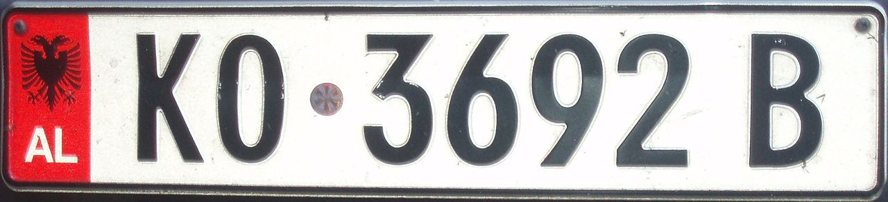
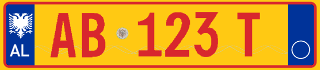

    <h2 class="section-title">{}</h2>
    <ul class="rule-list">
        <li>Domain menggunakan.al</li>
        <li>Bahasa resmi adalah Bahasa Albania (Shqip) dan tidak menggunakan huruf Kiriltidak</li>
        <li>Ada garis pada beberapa kamera{}</li>
        <li>Plat nomor kendaraan memilikigaris biru di kedua sisi, ada juga plat nomor yangmerah</li>
        <li>Negara yang menggunakan "Ë・ë" tidak banyak di sekitar sini
            <ul>
                <li>Selain Albania, bahasa yang menggunakan huruf ini adalah bahasa Prancis, Belanda, Hongaria, dan Luksemburg</li>
                <li>Referensi: 『<a href="https://ja.wikipedia.org/wiki/%C3%8B">Ë - Weblio辞書</a>』</li>
            </ul>
        </li>
        <li>Ada simbol chevron dengan latar belakang hitam dan panah berwarna putih</li>
        <li class="no-evidence">Di Albania, seringkali adatangki air di atap rumah</li>
        <li class="no-evidence">Tingkat kepemilikan mobil merek Jerman, seperti Mercedes-Benz, cukup tinggi{}</li>
    </ul>
    {}

{}
{}
{}
Di Albania, sering kali ada tangki air di atap rumah{}. Banyak rumah yang menempatkan tangki di atap dan menggunakan pompa untuk mengalirkan air{}.
{}

{}
Plat nomor kendaraan di Albania memiliki garis biru di kedua sisi{}. Ada juga plat nomor yang merah. Plat nomor yang memiliki garis merah atau kuning juga ditemukan. Selain itu, sekitar sepertiga mobil di Albania adalah merek Mercedes-Benz{}.
{}

{}

CC0, <a href="https://commons.wikimedia.org/w/index.php?curid=113059758">Wikimedia Commons</a>

Public Domain, <a href="https://commons.wikimedia.org/w/index.php?curid=10157339">Wikimedia Commons</a>
{}
{}

CC0
{}

{}
Albania memiliki banyak kesamaan dengan salah satu negara mitra dagangnya yang utama, yaitu {}. Seperti halnya Italia, plat nomor di Albania juga memiliki garis biru di kedua sisi, dan tanda jalan di Albania mirip dengan yang ada di Italia, termasuk tanda jalan berbentuk chevron, bolard, dan papan nama jalan yang bentuknya hampir serupa{}. Papan tanda di Albania sering kali memiliki latar belakang yang gelap, mirip dengan di Italia. Meskipun demikian, perbedaan bahasa dapat dengan mudah membedakan keduanya jika melihat tulisan pada papan nama jalan. Berikut adalah gambar papan jalan di Italia (kiri) dan Albania (kanan).
{}

{}
Albania pernah menjadi negara protektorat Italia{{% ref "https://ja.wikipedia.org/wiki/%E3%82%A2%E3%83%AB%E3%83%90%E3%83%8B%E3%82%A2" "Albania" %}}. Hingga saat ini, hampir separuh perdagangan Albania dilakukan dengan Italia{}.
{}

{}
{}

<iframe src="https://www.google.com/maps/embed?pb=!4v1683205004490!6m8!1m7!1sGViVJH9Mk8RpyMbkvs7MfA!2m2!1d42.26324816088299!2d19.42909205651487!3f51.75123322663632!4f-17.89478618479052!5f3.325193203789971" width="295" height="295" style="border:0;" allowfullscreen="" loading="lazy" referrerpolicy="no-referrer-when-downgrade"></iframe>
<iframe src="https://www.google.com/maps/embed?pb=!4v1690661057249!6m8!1m7!1scE_YYbCV04wQ1aUTD8DWxQ!2m2!1d40.87257770795425!2d19.66155468341949!3f245.35448796522053!4f-6.304448786104231!5f3.325193203789971"width="295" height="295" style="border:0;" allowfullscreen="" loading="lazy" referrerpolicy="no-referrer-when-downgrade"></iframe>
<iframe src="https://www.google.com/maps/embed?pb=!4v1690660934303!6m8!1m7!1swCZGJ0xFDkpmErtdJ3fkSQ!2m2!1d41.09912174476317!2d20.43879131148192!3f11.004761047728604!4f-15.207681810236508!5f3.325193203789971"width="295" height="295" style="border:0;" allowfullscreen="" loading="lazy" referrerpolicy="no-referrer-when-downgrade"></iframe>
<iframe src="https://www.google.com/maps/embed?pb=!4v1690660982616!6m8!1m7!1sVKrpT66tbw2o7-joLV705A!2m2!1d40.60891237431336!2d21.01763627538937!3f259.0676906079011!4f-13.73738535758558!5f3.325193203789971"width="295" height="295" style="border:0;" allowfullscreen="" loading="lazy" referrerpolicy="no-referrer-when-downgrade"></iframe>

{}
{}

{}

{}
