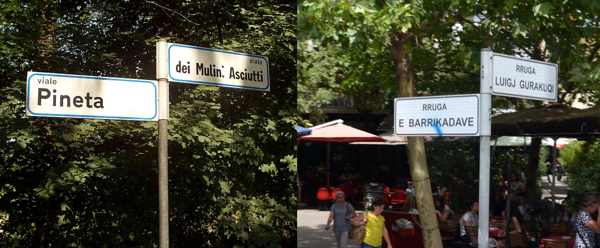
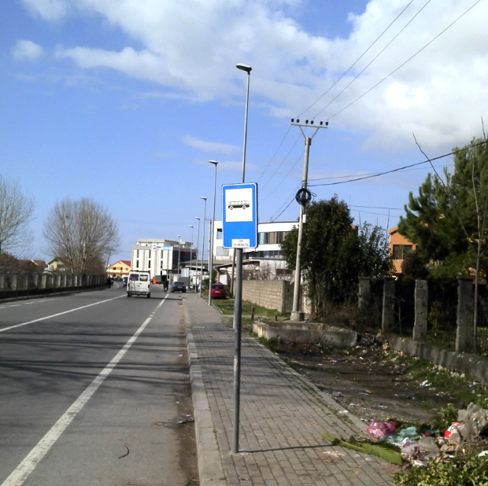

    <h2 class="section-title">{}</h2>
    <ul class="rule-list">
        <li>ドメインは.al</li>
        <li>公用語はアルバニア語（Shqip）でキリル文字を使用しない</li>
        <li>カメラに線が入っていることがある{}</li>
        <li>ナンバープレートの両側に青い線がある、赤いナンバープレートもある</li>
        <li>「Ë・ë」を使う国が近くにない
            <ul>
                <li>アルバニアの他はフランス語・オランダ語・ハンガリー語・ルクセンブルク語</li>
                <li>参考文献『<a href="https://ja.wikipedia.org/wiki/%C3%8B">Ë - Weblio辞書』</a></li>
            </ul>
        </li>
        <li>黒背景に白色の矢印のシェブロンがある</li>
        <li class="no-evidence">アルバニアでは貯水タンクが屋根の上にあることが多い</li>
        <li class="no-evidence">メルセデスベンツなどのドイツブランドの車の割合が高い{}</li>
    </ul>
    {}

{}
{}
{}
アルバニアでは貯水タンクが屋根の上にあることが多い。多くの家庭ではタンクを屋根に置いており、ポンプで揚水している{}。
{}

<iframe src="https://www.google.com/maps/embed?pb=!4v1682210765274!6m8!1m7!1sfPx3IVhFKkjgHGJeQD0-bw!2m2!1d41.10951712841936!2d20.08314737646181!3f96.7482075422779!4f21.3477726723369!5f2.784325315735024" width="295" height="295" style="border:0;" allowfullscreen="" loading="lazy" referrerpolicy="no-referrer-when-downgrade"></iframe>
<iframe src="https://www.google.com/maps/embed?pb=!4v1681574002141!6m8!1m7!1sY_u-CAKrWJi8w7aruEK-mg!2m2!1d40.07775582993001!2d20.13863329250565!3f23.309818986374466!4f-3.165257971056377!5f3.325193203789971" width="295" height="295" style="border:0;" allowfullscreen="" loading="lazy" referrerpolicy="no-referrer-when-downgrade"></iframe>

{}
アルバニアのナンバープレートは両側に青い線がある{}。赤いナンバープレートもある。両サイドが赤いものや黄色いものもある。また過去の歴史からアルバニアの車の1/3はメルセデス・ベンツになっている{}。
{}

{}

By BasilLeaf - CC0, <a href="https://commons.wikimedia.org/w/index.php?curid=113059758">Wikimedia Commons</a>

Public Domain, <a href="https://commons.wikimedia.org/w/index.php?curid=10157339">Wikimedia Commons</a>
{}

{}
アルバニアの主要な貿易相手国のひとつである{}と共通点が多い。イタリアと同じくナンバーが両サイドが青色・イタリアとそっくりな形の通り看板{}・ボラード{}・シェブロン{}を使っている{}。看板の裏側が黒っぽいことが多い{}のもイタリアと同じ。言語は明確に異なるので看板を見ればイタリアでないことは分かるはず。下の通り看板は左が<b>イタリア</b>、右が<b>アルバニア</b>。
{}

{}
カメラに亀裂が入っていることがある{}
{}

<iframe src="https://www.google.com/maps/embed?pb=!4v1681170588295!6m8!1m7!1segWVKwWr-SK3D17ZbM-wZA!2m2!1d41.16613852694356!2d20.20041411394961!3f311.52613228878727!4f48.98466247439279!5f1.92064061173707" width="495" height="295" style="border:0;" allowfullscreen="" loading="lazy" referrerpolicy="no-referrer-when-downgrade"></iframe>

{}
{}

<iframe src="https://www.google.com/maps/embed?pb=!4v1683205004490!6m8!1m7!1sGViVJH9Mk8RpyMbkvs7MfA!2m2!1d42.26324816088299!2d19.42909205651487!3f51.75123322663632!4f-17.89478618479052!5f3.325193203789971" width="295" height="295" style="border:0;" allowfullscreen="" loading="lazy" referrerpolicy="no-referrer-when-downgrade"></iframe>
<iframe src="https://www.google.com/maps/embed?pb=!4v1690661057249!6m8!1m7!1scE_YYbCV04wQ1aUTD8DWxQ!2m2!1d40.87257770795425!2d19.66155468341949!3f245.35448796522053!4f-6.304448786104231!5f3.325193203789971"width="295" height="295" style="border:0;" allowfullscreen="" loading="lazy" referrerpolicy="no-referrer-when-downgrade"></iframe>
<iframe src="https://www.google.com/maps/embed?pb=!4v1690660934303!6m8!1m7!1swCZGJ0xFDkpmErtdJ3fkSQ!2m2!1d41.09912174476317!2d20.43879131148192!3f11.004761047728604!4f-15.207681810236508!5f3.325193203789971"width="295" height="295" style="border:0;" allowfullscreen="" loading="lazy" referrerpolicy="no-referrer-when-downgrade"></iframe>
<iframe src="https://www.google.com/maps/embed?pb=!4v1690660982616!6m8!1m7!1sVKrpT66tbw2o7-joLV705A!2m2!1d40.60891237431336!2d21.01763627538937!3f259.0676906079011!4f-13.73738535758558!5f3.325193203789971"width="295" height="295" style="border:0;" allowfullscreen="" loading="lazy" referrerpolicy="no-referrer-when-downgrade"></iframe>

{}
{}

{}

{}

