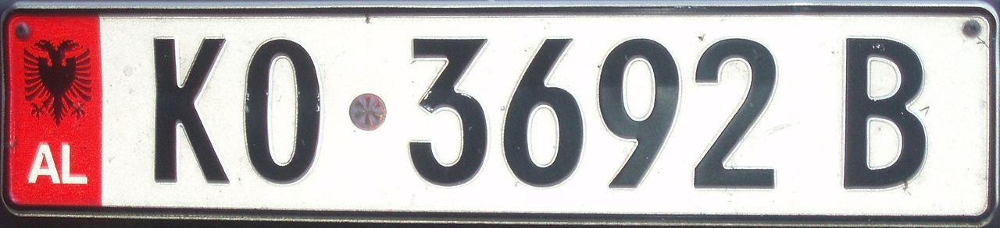

    <h2 class="section-title">{}</h2>
    <ul class="rule-list">
        <li>ドメインは.al</li>
        <li>公用語はアルバニア語（Shqip）でキリル文字を使用しない</li>
        <li>カメラに線が入っている</li>
        <li>ナンバープレートの両側に青い線がある、赤いナンバープレートもある</li>
        <li>「Ë・ë」を使う国が近くにない
            <ul>
                <li>アルバニアの他はフランス語・オランダ語・ハンガリー語・ルクセンブルク語</li>
                <li>参考文献『<a href="https://ja.wikipedia.org/wiki/%C3%8B">Ë - Weblio辞書』</a></li>
            </ul>
        </li>
        <li>黒背景に白色の矢印のシェブロンがある</li>
        <li class="no-evidence">アルバニアでは貯水タンクが屋根の上にあることが多い</li>
        <li class="no-evidence">メルセデスベンツなどのドイツブランドの車の割合が高い</li>
    </ul>
    {}

{}
{}
{}
アルバニアでは貯水タンクが屋根の上にあることが多い。多くの家庭ではタンクを屋根に置いており、ポンプで揚水している{}。
{}

<iframe src="https://www.google.com/maps/embed?pb=!4v1682210765274!6m8!1m7!1sfPx3IVhFKkjgHGJeQD0-bw!2m2!1d41.10951712841936!2d20.08314737646181!3f96.7482075422779!4f21.3477726723369!5f2.784325315735024" width="295" height="295" style="border:0;" allowfullscreen="" loading="lazy" referrerpolicy="no-referrer-when-downgrade"></iframe>
<iframe src="https://www.google.com/maps/embed?pb=!4v1681574002141!6m8!1m7!1sY_u-CAKrWJi8w7aruEK-mg!2m2!1d40.07775582993001!2d20.13863329250565!3f23.309818986374466!4f-3.165257971056377!5f3.325193203789971" width="295" height="295" style="border:0;" allowfullscreen="" loading="lazy" referrerpolicy="no-referrer-when-downgrade"></iframe>

{}
アルバニアのナンバープレートは両側に青い線がある。赤いナンバープレートもある。両サイドが赤いものや黄色いものもある。
{}

{}

By BasilLeaf - CC0, <a href="https://commons.wikimedia.org/w/index.php?curid=113059758">Wikimedia Commons</a>

Public Domain, <a href="https://commons.wikimedia.org/w/index.php?curid=10157339">Wikimedia Commons</a>
{}

{}
黒背景に白い矢印のシェブロンを使う。アルバニアに直接隣接している国ではギリシャだけが黒背景に白い矢印のシェブロンを使う{}。
{}

{}
ほとんどの地域でカメラに線が入っている。
{}

<iframe src="https://www.google.com/maps/embed?pb=!4v1681170588295!6m8!1m7!1segWVKwWr-SK3D17ZbM-wZA!2m2!1d41.16613852694356!2d20.20041411394961!3f311.52613228878727!4f48.98466247439279!5f1.92064061173707" width="295" height="295" style="border:0;" allowfullscreen="" loading="lazy" referrerpolicy="no-referrer-when-downgrade"></iframe>
<iframe src="https://www.google.com/maps/embed?pb=!4v1681170427184!6m8!1m7!1sdzplAy3rQjkNlhLJ8Nt4zA!2m2!1d40.78765861267236!2d19.83903932072083!3f254.42145253072394!4f8.920585084653908!5f2.134031108121613" width="295" height="295" style="border:0;" allowfullscreen="" loading="lazy" referrerpolicy="no-referrer-when-downgrade"></iframe>

{}
{}

<iframe src="https://www.google.com/maps/embed?pb=!4v1681573981084!6m8!1m7!1sNjm8q8OGRsK5Kzi42M8DYg!2m2!1d40.08299859056847!2d20.1431476244435!3f335.5508730015449!4f17.148339677604824!5f3.325193203789971" width="295" height="295" style="border:0;" allowfullscreen="" loading="lazy" referrerpolicy="no-referrer-when-downgrade"></iframe>
<iframe src="https://www.google.com/maps/embed?pb=!4v1681574059733!6m8!1m7!1sjuoI5ULhGI9Bxfaa6hpIXg!2m2!1d42.19514608905921!2d19.45282564159973!3f84.54159727997028!4f5.130768384931599!5f3.325193203789971" width="295" height="295" style="border:0;" allowfullscreen="" loading="lazy" referrerpolicy="no-referrer-when-downgrade"></iframe>

{}
{}

<iframe src="https://www.google.com/maps/embed?pb=!4v1683205004490!6m8!1m7!1sGViVJH9Mk8RpyMbkvs7MfA!2m2!1d42.26324816088299!2d19.42909205651487!3f51.75123322663632!4f-17.89478618479052!5f3.325193203789971" width="295" height="295" style="border:0;" allowfullscreen="" loading="lazy" referrerpolicy="no-referrer-when-downgrade"></iframe>
<iframe src="https://www.google.com/maps/embed?pb=!4v1684997109452!6m8!1m7!1sMiycnc--d4eQyaVwe0r11g!2m2!1d40.55132552831947!2d19.58848873300386!3f192.33262664265703!4f-17.056627440759414!5f3.320239097401282" width="295" height="295" style="border:0;" allowfullscreen="" loading="lazy" referrerpolicy="no-referrer-when-downgrade"></iframe>

{}
{}

