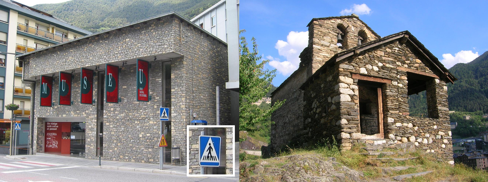
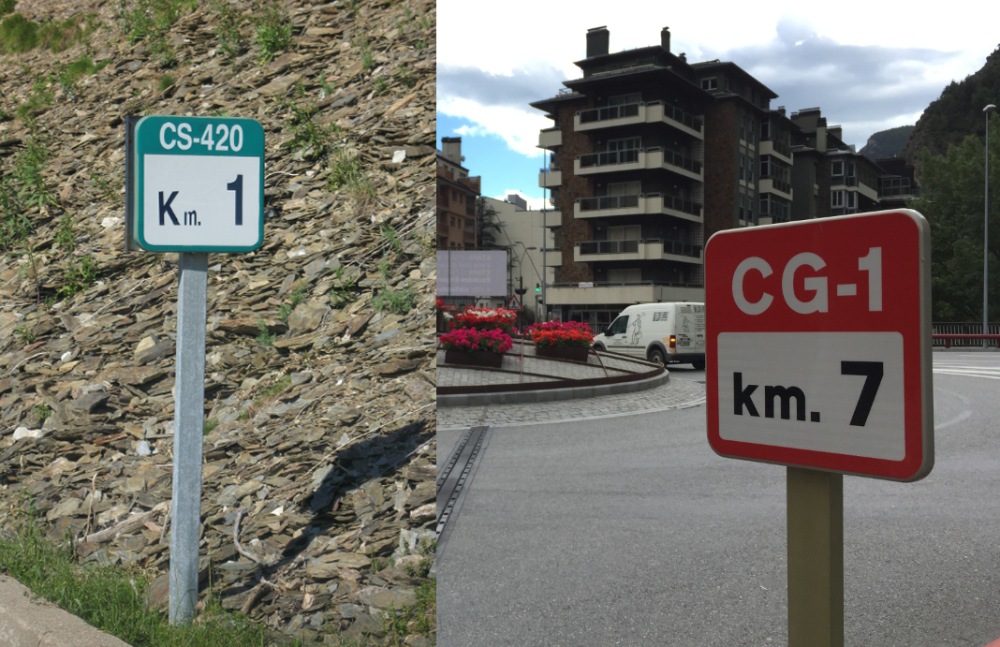
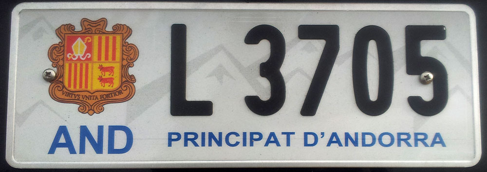

    <h2 class="section-title">{}</h2>
    <ul class="rule-list">
        <li>Domain menggunakan.ad</li>
        <li>Terdapat bollard berwarnahijau di tengah jalan atau di pinggir jalan</li>
        <li>Plat nomor dengan sisi kiri berwarnakuning</li>
        <li>Banyak gedung dengan dinding batu berpolakan pegunungan di sekitarnya</li>
        <li>Tiang salju yang mungkin berupa tiang salju terpasang sepanjang jalan</li>
        <li>Tiang tanda zebra memiliki 8 batang yang mirip dengan yang ada di{}, perlu diperhatikan</li>
        <li>Sering kali terlihat sedang bermain ski{}</li>
    </ul>
    {}

{}
{}

{}
Di sekitarnya banyak bangunan dengan pola batu yang menampilkan tema pegunungan{}. Meskipun berada di tengah kota, sering terlihat lereng gunung dari celah atau jalan-jalan sempit{}.
{}

{}
Di pegunungan Italia Barat{} dan daerah sekitar Andorra di Spanyol{} banyak ditemukan bangunan serupa, jadi harap berhati-hati agar tidak tertukar.
{}

{}
Tiang salju yang berwarna merah dapat terlihat sepanjang jalan{}.
{}

{}
Nomor jalan dengan kode "CS" atau "CG"{}
{}

{}
Plat nomor dengan sisi kiri berwarnakuning{}. Namun, banyak kendaraan dengan plat biru UE juga ditemukan.
{}

<iframe src="https://www.google.com/maps/embed?pb=!4v1682728451969!6m8!1m7!1sr4xRNB7a7XWyDDU4OugpXA!2m2!1d42.51030774674885!2d1.532758286313359!3f195.26953968399744!4f-25.806117153738768!5f3.2892781648653573" width="395" height="295" style="border:0;" allowfullscreen="" loading="lazy" referrerpolicy="no-referrer-when-downgrade"></iframe>

{}

By Lalpino - Own work, <a href="https://creativecommons.org/licenses/by-sa/4.0/deed.ja">CC BY-SA 4.0</a>, <a href="https://commons.wikimedia.org/w/index.php?curid=36942968">Link - Wikimedia Commons</a>
{}

{}
{}

{}
Terdapat bollard berwarnahijau di tengah jalan atau di pinggir jalan. Bollard yang serupa juga dapat ditemukan di{} atau{}, tetapi plat nomor kendaraan berbeda sehingga bisa dibedakan.
{}

<iframe src="https://www.google.com/maps/embed?pb=!4v1682727790100!6m8!1m7!1sNq0XruSiR_PXPSAhgA-Kug!2m2!1d42.53517362834788!2d1.581372641366805!3f110.57199857848678!4f-23.872131066662078!5f3.325193203789971" width="295" height="295" style="border:0;" allowfullscreen="" loading="lazy" referrerpolicy="no-referrer-when-downgrade"></iframe>
<iframe src="https://www.google.com/maps/embed?pb=!4v1682727919095!6m8!1m7!1sBeKKxSvTdvqqxqiCKtusiw!2m2!1d42.55073839781397!2d1.695846565481723!3f165.21716310853563!4f-4.172480745179101!5f3.314171391291496" width="295" height="295" style="border:0;" allowfullscreen="" loading="lazy" referrerpolicy="no-referrer-when-downgrade"></iframe>

{}
Bollard biasa
{}

<iframe src="https://www.google.com/maps/embed?pb=!4v1691299293827!6m8!1m7!1sObJnpf64z1Imw_ocs2e6aw!2m2!1d42.55798467643363!2d1.588847768975983!3f219.53496910417147!4f-10.763485870289799!5f3.253823129479834" width="295" height="295" style="border:0;" allowfullscreen="" loading="lazy" referrerpolicy="no-referrer-when-downgrade"></iframe>

{}
{}
