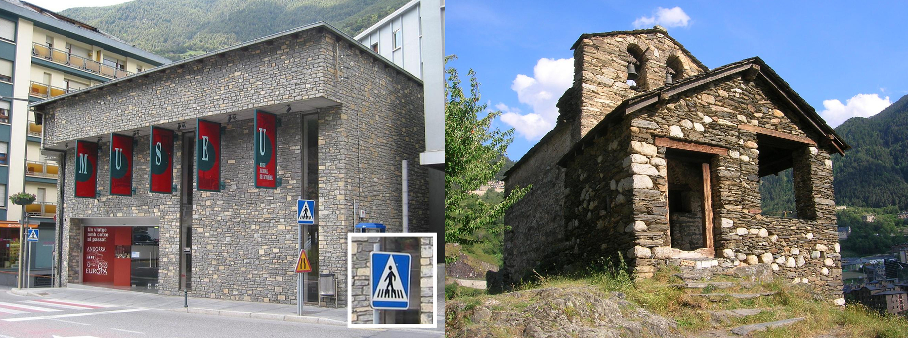
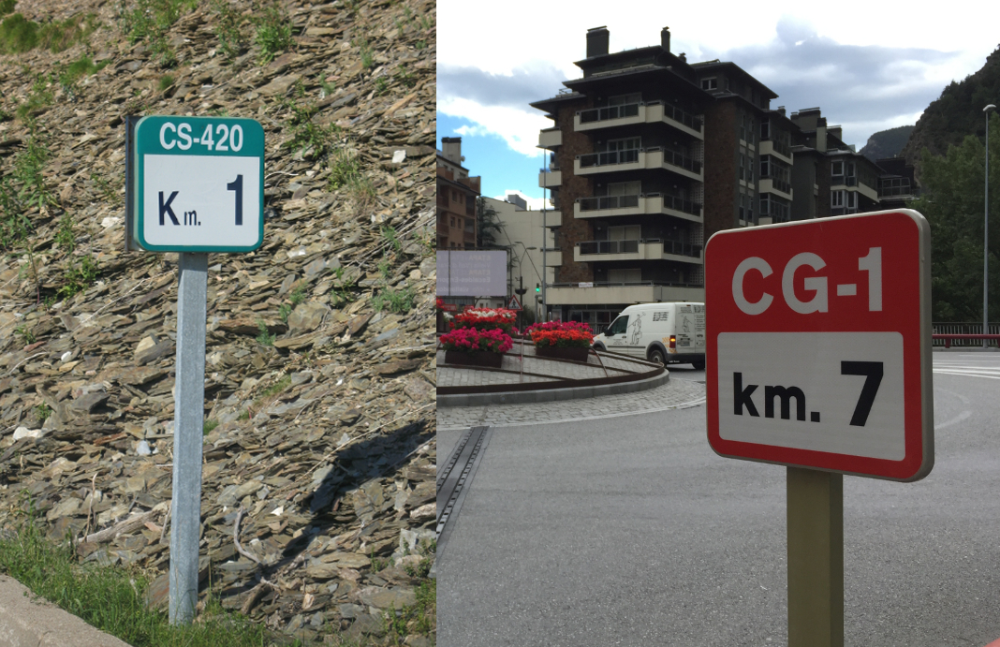

    <h2 class="section-title">{}</h2>
    <ul class="rule-list">
        <li>ドメインは.ad</li>
        <li>道の真ん中や道路際に緑色のボラードがある</li>
        <li>左側が黄色くなっているナンバープレート</li>
        <li>周りが山がちで石壁の模様の壁のアパート・マンションが多い</li>
        <li>スノーポールと思われる棒が道沿いに並んでいる</li>
        <li>横断歩道の標識の棒が{}と同じ8本である点だけ注意</li>
        <li>スキーをしていることが多い{}</li>
    </ul>
    {}

{}
{}

{}
周りが山がちで石壁の模様の建物が多い{}。街中であったとしても建物の隙間や通りから山の斜面が見える{}。
{}

{}
イタリア西部の山の中{}やアンドラ周辺のスペイン領{}でも似た建物が多いので間違えないように注意する。
{}

{}
上が赤いスノーポールと思われる棒が道沿いに並んでいることがある{}。
{}

{}
「CS」や「CG」の道路番号{}
{}

{}
左側が黄色くなっているナンバープレート{}。ただしEUの青いプレートの車も多い。
{}

<iframe src="https://www.google.com/maps/embed?pb=!4v1682728451969!6m8!1m7!1sr4xRNB7a7XWyDDU4OugpXA!2m2!1d42.51030774674885!2d1.532758286313359!3f195.26953968399744!4f-25.806117153738768!5f3.2892781648653573" width="395" height="295" style="border:0;" allowfullscreen="" loading="lazy" referrerpolicy="no-referrer-when-downgrade"></iframe>

{}

By Lalpino - Own work, <a href="https://creativecommons.org/licenses/by-sa/4.0/deed.ja">CC BY-SA 4.0</a>, <a href="https://commons.wikimedia.org/w/index.php?curid=36942968">Link - Wikimedia Commons</a>
{}

{}
{}

{}
道の真ん中や道路際に緑色のボラードがある。同じものが{}や{}にもあるがナンバープレートが違うので判別がつくはず。
{}

<iframe src="https://www.google.com/maps/embed?pb=!4v1682727790100!6m8!1m7!1sNq0XruSiR_PXPSAhgA-Kug!2m2!1d42.53517362834788!2d1.581372641366805!3f110.57199857848678!4f-23.872131066662078!5f3.325193203789971" width="295" height="295" style="border:0;" allowfullscreen="" loading="lazy" referrerpolicy="no-referrer-when-downgrade"></iframe>
<iframe src="https://www.google.com/maps/embed?pb=!4v1682727919095!6m8!1m7!1sBeKKxSvTdvqqxqiCKtusiw!2m2!1d42.55073839781397!2d1.695846565481723!3f165.21716310853563!4f-4.172480745179101!5f3.314171391291496" width="295" height="295" style="border:0;" allowfullscreen="" loading="lazy" referrerpolicy="no-referrer-when-downgrade"></iframe>

{}
普通のボラード
{}

<iframe src="https://www.google.com/maps/embed?pb=!4v1691299293827!6m8!1m7!1sObJnpf64z1Imw_ocs2e6aw!2m2!1d42.55798467643363!2d1.588847768975983!3f219.53496910417147!4f-10.763485870289799!5f3.253823129479834"width="295" height="295" style="border:0;" allowfullscreen="" loading="lazy" referrerpolicy="no-referrer-when-downgrade"></iframe>

{}
{}