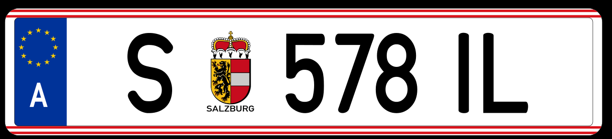

    <h2 class="section-title">{}</h2>
    <ul class="rule-list">
        <li>Domain menggunakan.at</li>
        <li>BahasaJerman adalah bahasa resmi</li>
        <li>Pemakaian tanda jalan satu arah menggunakanEINBAHN</li>
        <li>Pohon tanda kadang-kadang dicat dengan warna merah dan putih</li>
        <li>Tanda sering menggunakan latar belakang atau bingkaiberwarna biru</li>
    </ul>
    {}

{}
{}
{}
Tanda jalan satu arah dengan tulisanEINBAHN adalah perbedaan yang jelas antara {} dan Austria{}. Pada beberapa tiang tanda, terdapat cat berwarna merah dan putih. Tanda dengan tulisan ANFANG atau ENDE juga sering ditemui{}.
{}

{}
Bagian hitam di atas bollard berbeda dengan bollard lainnya{}{}. Bollard dengan bentuk yang serupa juga dapat ditemukan di {} dan {}.
{}

{}
Seperti di {}, Austria juga menggunakan huruf-huruf yang khas dalam bahasa Jerman seperti ö, ü, ä, dan ß{}. Selain itu, terdapat tanda Haltestelle (halte) pada pemberhentian tram, yang juga sering ditemukan di Jerman{}.
{}

{}
Di {} dan {}, papan tanda perbatasan kota atau desa sering berwarna kuning, sementara di Austria berwarna biru. Ini bisa menjadi petunjuk saat kebingungannya muncul antara Austria dan negara lain. Papan tanda di atas adalah milik {} dan di bawah adalah milik {}.
{}

{}
Sering terlihat bahwa tanda atau papan jalan digantung dengan sesuatu seperti klip{}? Belum ada konfirmasi.
{}

{}
{}
{}

CC Attribution-ShareAlike 3.0, Plat nomor Uni Eropa. (2022, 19 November). Di Wikipedia. https://ja.wikipedia.org/wiki/%E6%AC%A7%E5%B7%9E%E9%80%A3%E5%90%88%E3%81%AE%E3%83%8A%E3%83%B3%E3%83%90%E3%83%BC%E3%83%97%E3%83%AC%E3%83%BC%E3%82%AF. Dibuka pada 20 Mei 2023.

{}

{}
{}

{}

* Tanda jalan satu arah (EINBAHN)  
* Papan tanda awal dan akhir  
* Bollard dengan warna merah putih  

{}

{}
{}

    <h2 class="section-title">{}</h2>
    <ul class="rule-list">
        <li>Di Wina (Wien), Anda dapat mempersempit pencarian lebih lanjut berdasarkan distrik</li>
    </ul>

{}
{}

By <a href="//commons.wikimedia.org/wiki/User:TUBS" title="User:TUBS">TUBS</a>  - <a href="//commons.wikimedia.org/wiki/File:Austria_Vienna_location_map.svg" title="File:Austria Vienna location map.svg">Austria Vienna location map.svg</a> by <a href="//commons.wikimedia.org/wiki/User:Rosso_Robot" title="User:Rosso Robot">Rosso Robot</a>, <a href="https://creativecommons.org/licenses/by-sa/3.0" title="Creative Commons Attribution-Share Alike 3.0">CC BY-SA 3.0</a>, <a href="https://commons.wikimedia.org/w/index.php?curid=14738296">Link</a>

{}
Cobalah menuju ke lokasi dengan angka yang tertera di depan tanda. Jika di kiri, coba nomor 22; jika di kanan, coba nomor 1. Jika angkanya lebih kecil, coba arah tengah.
{}

{}
{}
