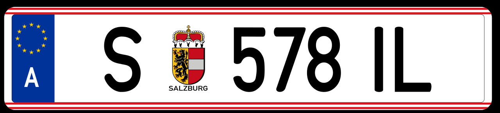

    <h2 class="section-title">{}</h2>
    <ul class="rule-list">
        <li>ドメインは.at</li>
        <li>一方通行はEINBAHN</li>
    </ul>

{}
{}
{}
EINBAHNなどの標識
{}

<iframe src="https://www.google.com/maps/embed?pb=!4v1680775964600!6m8!1m7!1syoCvv9BpJ9Czz68JcdAEzQ!2m2!1d47.81087658514463!2d13.04039569934649!3f43.58011647142097!4f-0.1349558094340182!5f2.9078842684879733" width="295" height="295" style="border:0;" allowfullscreen="" loading="lazy" referrerpolicy="no-referrer-when-downgrade"></iframe>
<iframe src="https://www.google.com/maps/embed?pb=!4v1681157746176!6m8!1m7!1smM2gvwT8Z5ib397dxz_0tg!2m2!1d47.81170494457491!2d13.04180991648901!3f156.54386919456383!4f-5.792545475644886!5f3.325193203789971" width="295" height="295" style="border:0;" allowfullscreen="" loading="lazy" referrerpolicy="no-referrer-when-downgrade"></iframe>

{}
ボラードのてっぺんの黒い部分が他と違う {}
{}

<iframe src="https://www.google.com/maps/embed?pb=!4v1681158229108!6m8!1m7!1s7bvE-BvQyNUuEQpMjNzdiA!2m2!1d47.55036127886682!2d14.93573644850267!3f14.20263664834302!4f-21.935997945926587!5f3.227515404800811" width="295" height="295" style="border:0;" allowfullscreen="" loading="lazy" referrerpolicy="no-referrer-when-downgrade"></iframe>

{}
{}
{}

CC 表示-継承 3.0, 欧州連合のナンバープレート. (2022, November 19). In Wikipedia. https://ja.wikipedia.org/wiki/%E6%AC%A7%E5%B7%9E%E9%80%A3%E5%90%88%E3%81%AE%E3%83%8A%E3%83%B3%E3%83%90%E3%83%BC%E3%83%97%E3%83%AC%E3%83%BC%E3%83%88
{}
{}
{}

<iframe src="https://www.google.com/maps/embed?pb=!4v1679348331549!6m8!1m7!1syoCvv9BpJ9Czz68JcdAEzQ!2m2!1d47.81087658514463!2d13.04039569934649!3f61.99143518934463!4f4.631820064219227!5f3.325193203789971" width="295" height="295" style="border:0;" allowfullscreen="" loading="lazy" referrerpolicy="no-referrer-when-downgrade"></iframe>
<iframe src="https://www.google.com/maps/embed?pb=!4v1680775964600!6m8!1m7!1syoCvv9BpJ9Czz68JcdAEzQ!2m2!1d47.81087658514463!2d13.04039569934649!3f43.58011647142097!4f-0.1349558094340182!5f2.9078842684879733" width="295" height="295" style="border:0;" allowfullscreen="" loading="lazy" referrerpolicy="no-referrer-when-downgrade"></iframe>
<iframe src="https://www.google.com/maps/embed?pb=!4v1681158036021!6m8!1m7!1s91xtxpikuxur_NyQ6dw5HA!2m2!1d47.89811051788531!2d16.24695956535073!3f114.56769570513492!4f-15.239991071294483!5f3.325193203789971" width="295" height="295" style="border:0;" allowfullscreen="" loading="lazy" referrerpolicy="no-referrer-when-downgrade"></iframe>
<iframe src="https://www.google.com/maps/embed?pb=!4v1681158108556!6m8!1m7!1sER4P9pBiaRkkR3Qu9pi9ZA!2m2!1d47.89363239551392!2d16.25148431975187!3f236.3365576952949!4f-0.429246383636567!5f3.239634774221064" width="295" height="295" style="border:0;" allowfullscreen="" loading="lazy" referrerpolicy="no-referrer-when-downgrade"></iframe>
<iframe src="https://www.google.com/maps/embed?pb=!4v1681158132077!6m8!1m7!1skYAcidW5UeHd3ZTv74HJEg!2m2!1d48.1522758245809!2d16.36759006014776!3f247.02015305632165!4f-12.741577782447749!5f3.325193203789971" width="295" height="295" style="border:0;" allowfullscreen="" loading="lazy" referrerpolicy="no-referrer-when-downgrade"></iframe>

{}
{}