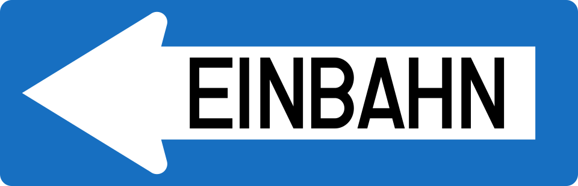
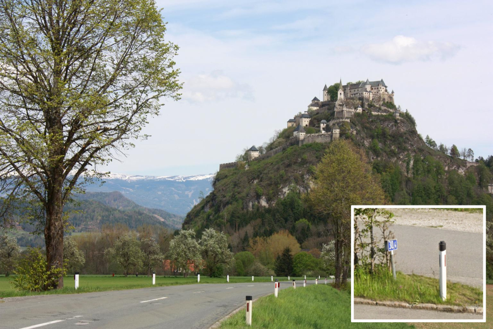
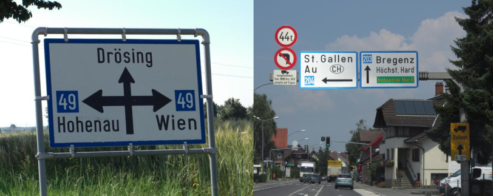
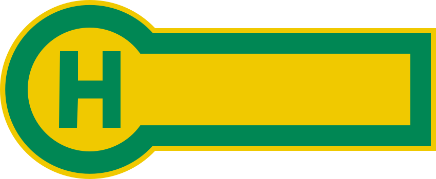
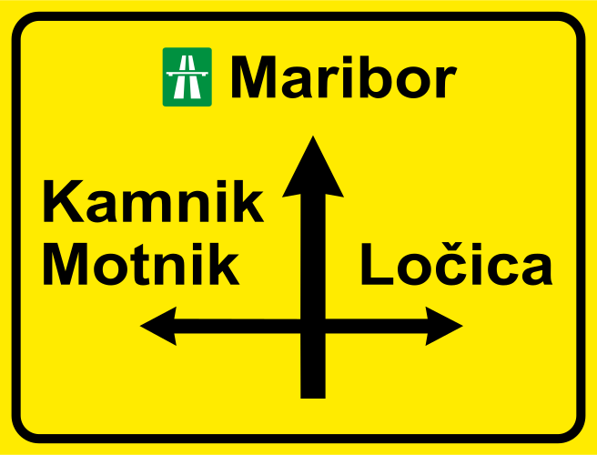
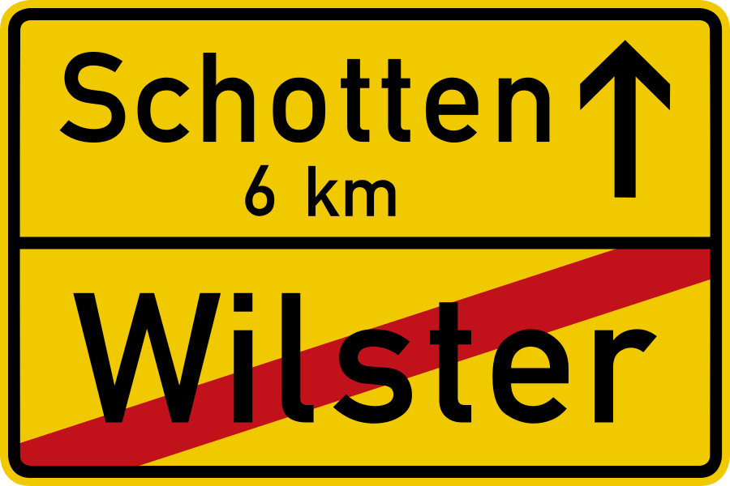
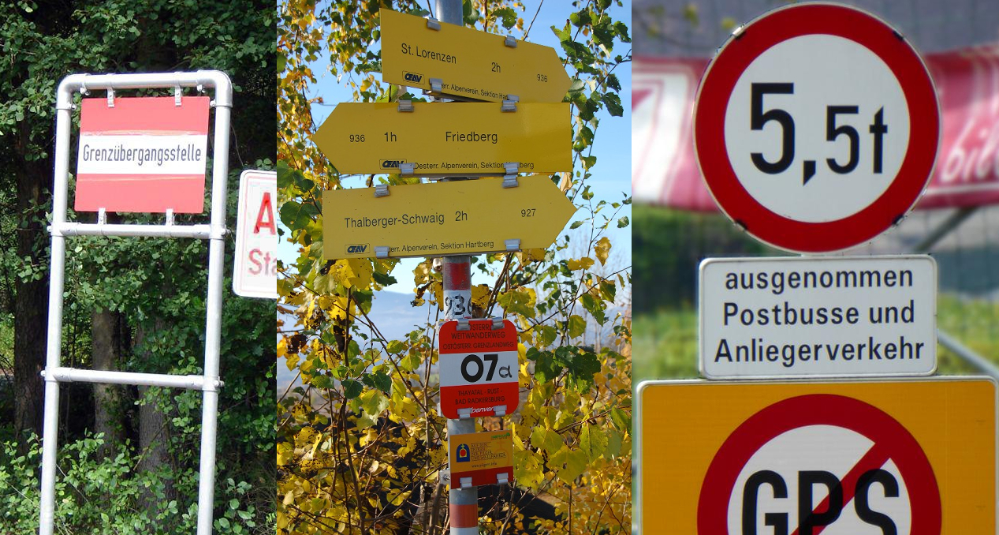

    <h2 class="section-title">{}</h2>
    <ul class="rule-list">
        <li>ドメインは.at</li>
        <li>ドイツ語が公用語になっている</li>
        <li>一方通行はEINBAHNの標識がある</li>
        <li>標識のポールに赤と白のペイントがされていることがある</li>
        <li>縁や背景が青色の看板を使うことが多い</li>
    </ul>
    {}

{}
{}
{}
EINBAHNの標識がある点が{}と明確に違う{}。ポールに赤と白のペイントがされていることがある。またANFANGやENDEと書かれた看板がある{}。
{}

{}
ボラードのてっぺんの黒い部分が他と違う{}{}。{}や{}にもこの形のボラードが見つかる。
{}

{}
同じドイツ語圏である{}と共通点が多く、ö・üやä・ßのようなドイツ語に見られる文字がある{}。また下のようなHaltestelleの看板が路面電車などの停留所にある{}のもドイツと共通している。
{}

{}
{}や{}は町や村の境界で黄色い看板を使うけれどオーストリアは青色。オーストリアと他の国で迷っている時にヒントになるかも。上が{}、下が{}。
{}

{}
看板や標識をクリップのような何かで留めがち{}？確証なし。
{}

{}
{}
{}

CC 表示-継承 3.0, 欧州連合のナンバープレート. (2022, November 19). In Wikipedia. https://ja.wikipedia.org/wiki/%E6%AC%A7%E5%B7%9E%E9%80%A3%E5%90%88%E3%81%AE%E3%83%8A%E3%83%B3%E3%83%90%E3%83%BC%E3%83%97%E3%83%AC%E3%83%BC%E3%83%88
{}
{}
{}

<iframe src="https://www.google.com/maps/embed?pb=!4v1679348331549!6m8!1m7!1syoCvv9BpJ9Czz68JcdAEzQ!2m2!1d47.81087658514463!2d13.04039569934649!3f61.99143518934463!4f4.631820064219227!5f3.325193203789971" width="295" height="295" style="border:0;" allowfullscreen="" loading="lazy" referrerpolicy="no-referrer-when-downgrade"></iframe>
<iframe src="https://www.google.com/maps/embed?pb=!4v1680775964600!6m8!1m7!1syoCvv9BpJ9Czz68JcdAEzQ!2m2!1d47.81087658514463!2d13.04039569934649!3f43.58011647142097!4f-0.1349558094340182!5f2.9078842684879733" width="295" height="295" style="border:0;" allowfullscreen="" loading="lazy" referrerpolicy="no-referrer-when-downgrade"></iframe>
<iframe src="https://www.google.com/maps/embed?pb=!4v1681158036021!6m8!1m7!1s91xtxpikuxur_NyQ6dw5HA!2m2!1d47.89811051788531!2d16.24695956535073!3f114.56769570513492!4f-15.239991071294483!5f3.325193203789971" width="295" height="295" style="border:0;" allowfullscreen="" loading="lazy" referrerpolicy="no-referrer-when-downgrade"></iframe>
<iframe src="https://www.google.com/maps/embed?pb=!4v1681158108556!6m8!1m7!1sER4P9pBiaRkkR3Qu9pi9ZA!2m2!1d47.89363239551392!2d16.25148431975187!3f236.3365576952949!4f-0.429246383636567!5f3.239634774221064" width="295" height="295" style="border:0;" allowfullscreen="" loading="lazy" referrerpolicy="no-referrer-when-downgrade"></iframe>
<iframe src="https://www.google.com/maps/embed?pb=!4v1681158132077!6m8!1m7!1skYAcidW5UeHd3ZTv74HJEg!2m2!1d48.1522758245809!2d16.36759006014776!3f247.02015305632165!4f-12.741577782447749!5f3.325193203789971" width="295" height="295" style="border:0;" allowfullscreen="" loading="lazy" referrerpolicy="no-referrer-when-downgrade"></iframe>

{}
{}

    <h2 class="section-title">{}</h2>
    <ul class="rule-list">
        <li>ウィーン（Wien）ならば区画からさらに絞り込める</li>
    </ul>

{}
{}

By <a href="//commons.wikimedia.org/wiki/User:TUBS" title="User:TUBS">TUBS</a>  - <a href="//commons.wikimedia.org/wiki/File:Austria_Vienna_location_map.svg" title="File:Austria Vienna location map.svg">Austria Vienna location map.svg</a> by <a href="//commons.wikimedia.org/wiki/User:Rosso_Robot" title="User:Rosso Robot">Rosso Robot</a>, <a href="https://creativecommons.org/licenses/by-sa/3.0" title="Creative Commons Attribution-Share Alike 3.0">CC BY-SA 3.0</a>, <a href="https://commons.wikimedia.org/w/index.php?curid=14738296">Link</a>

{}
標識の先頭にある数字の場所に飛んでみる。左なら22、右なら1。数字が小さいなら真ん中へ行ってみる。
{}

{}
{}