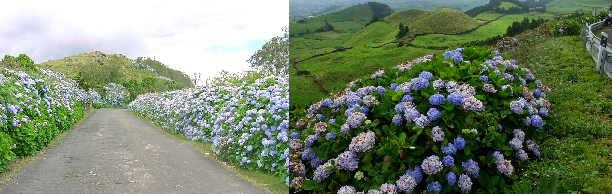
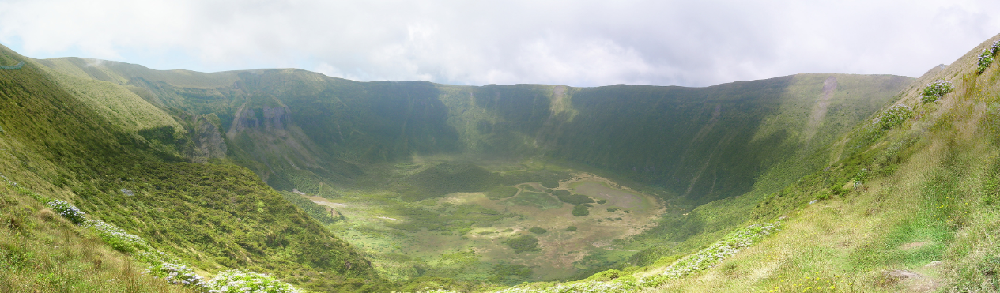

    <h2 class="section-title">{}</h2>
    <ul class="rule-list">
        <li>ポルトガル領の離島でナンバープレート・標識・電柱はポルトガルと共通している</li>
        <li>テルセイラ島とサンミゲル島にストリートビューが多い</li>
        <li>石壁とアジサイのような花がたくさん見られる</li>
        <li class="no-evidence">標識の棒が色付きのストライプの時がある{}</li>
    </ul>

{}
{}
{}
ポルトガル領の離島でナンバープレート・標識・電柱はポルトガルと共通している
{}

{}

<a href="//commons.wikimedia.org/wiki/User:Willtron" title="User:Willtron">by Willtron</a>, <a href="https://creativecommons.org/licenses/by-sa/3.0" title="Creative Commons Attribution-Share Alike 3.0">CC 表示-継承 3.0</a> <a href="https://commons.wikimedia.org/w/index.php?curid=4614860">Wikimedia Commons(link)</a>
{}

{}
白い壁の低い家・パステルカラーの家が多い気がする{}。住宅街には高い建物はほとんどなく平屋も多い。また、アゾレス諸島と{}は濃い緑色のドアや窓の家が多いように思う。
{}

<iframe src="https://www.google.com/maps/embed?pb=!4v1683963487643!6m8!1m7!1sFiDnAseZnm6Ui_6e3EPVrw!2m2!1d38.66517976348365!2d-27.21827223146803!3f108.13412709709209!4f-2.405475486478096!5f0.7820865974627469" width="295" height="295"style="border:0;" allowfullscreen="" loading="lazy" referrerpolicy="no-referrer-when-downgrade"></iframe>
<iframe src="https://www.google.com/maps/embed?pb=!4v1683963780675!6m8!1m7!1sremIfuDbmWalGIKBTjKivA!2m2!1d38.67007298609807!2d-27.25227159930157!3f356.2550419252415!4f-4.228255989906202!5f0.7820865974627469" width="295" height="295"style="border:0;" allowfullscreen="" loading="lazy" referrerpolicy="no-referrer-when-downgrade"></iframe>

By <a href="//commons.wikimedia.org/w/index.php?title=User:Goooncalo&amp;amp;action=edit&amp;amp;redlink=1" class="new" title="User:Goooncalo (page does not exist)">Gonçalo Torres</a> - Own work, <a href="https://creativecommons.org/licenses/by-sa/4.0" title="Creative Commons Attribution-Share Alike 4.0">CC BY-SA 4.0</a>, <a href="https://commons.wikimedia.org/w/index.php?curid=107232536">Link</a>

{}
石壁とアジサイのような花がたくさん見られる{}
{}

{}
ファイアル島はカルデア周辺にのみ少しだけストリートビューがある{}{{% ref "https://ja.wikipedia.org/wiki/%E3%83%95%E3%82%A1%E3%82%A4%E3%82%A2%E3%83%AB%E5%B3%B6" "ファイアル島" %}}。
{}

<!-- 画像ソース：Public Domain https://en.wikipedia.org/wiki/Faial_Island#/media/File:Caldeira_faial.jpg -->

{}
{}