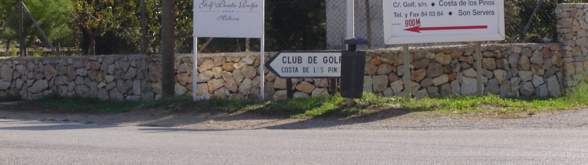
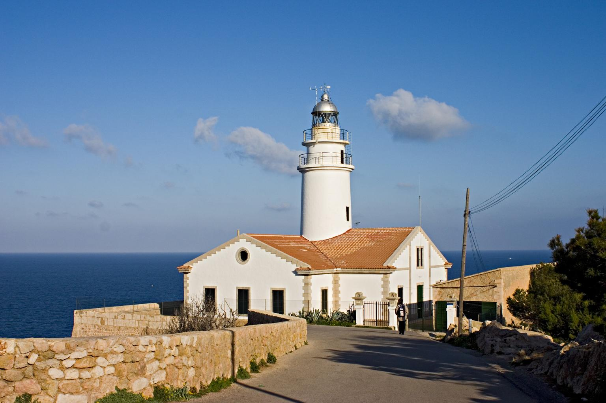
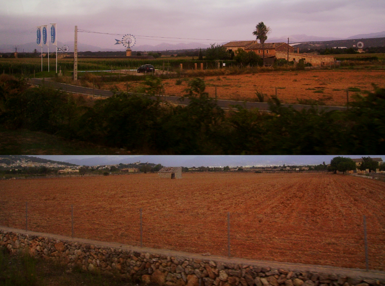
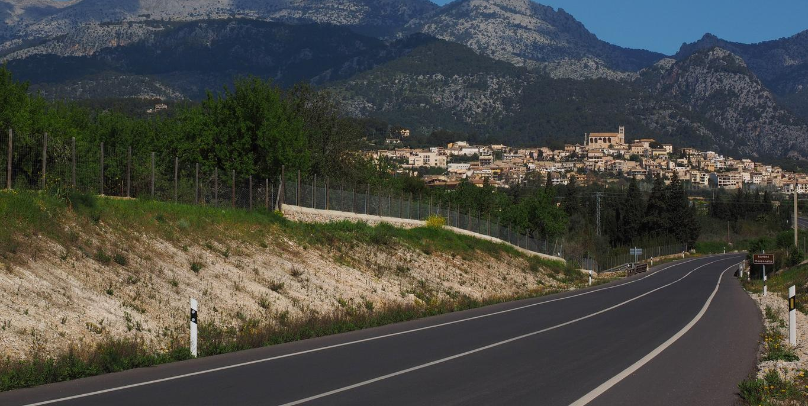

    <h2 class="section-title">{}</h2>
    <ul class="rule-list">
        <li>Mobil berjalan di sisi kanan jalan</li>
        <li>Domain menggunakan .es</li>
        <li>Sering ditemukan dinding batu rendah di satu sisi atau kedua sisi jalan</li>
        <li>Bahasa Katalan dan Kastilia adalah bahasa resmi</li>
    </ul>

{}
{}
{}
Sering ditemukan dinding batu rendah di satu sisi atau kedua sisi jalan {}.
{}

{}
Tanah yang cenderung berwarna merah.
{}

{}
Merupakan wilayah di bawah {}, dan memiliki tiang listrik, bollard, tanda jalan, dan chevron yang sama dengan daratan Spanyol {}.
{}

{}
{}
