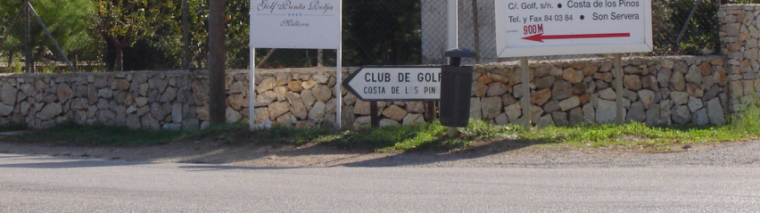
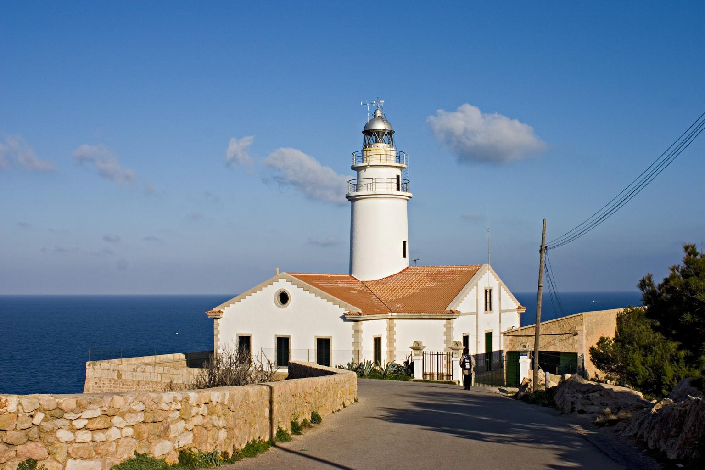
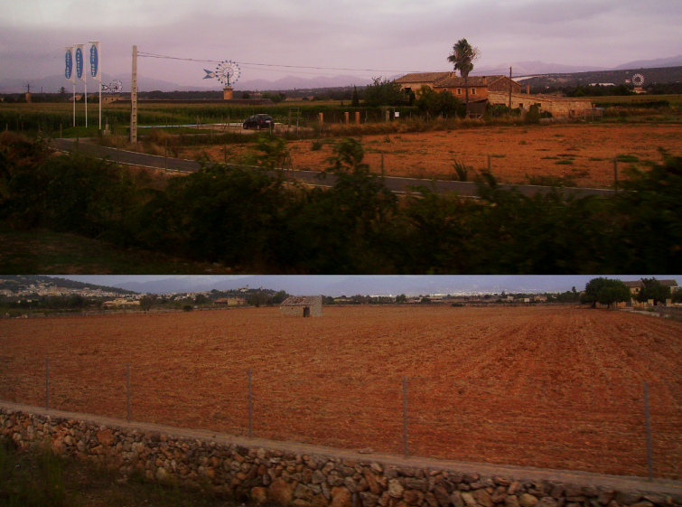
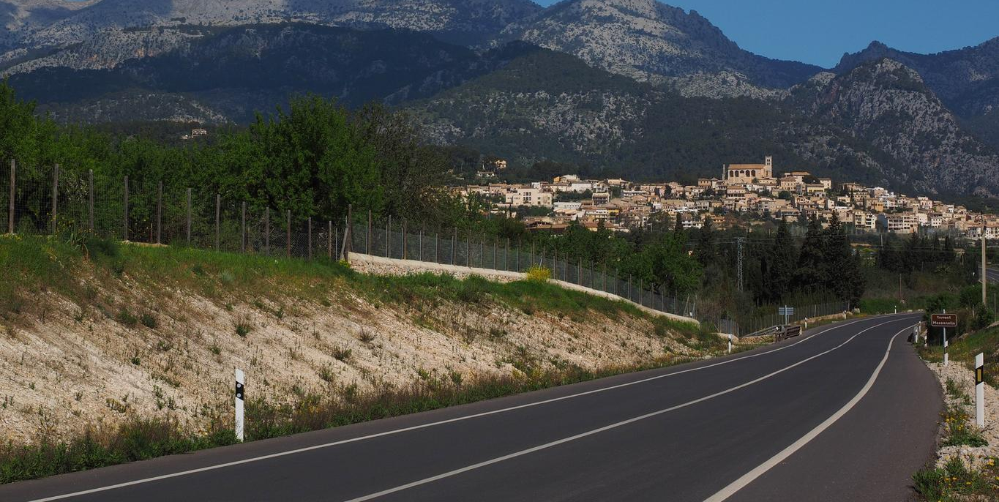

    <h2 class="section-title">{}</h2>
    <ul class="rule-list">
        <li>車は右側通行</li>
        <li>ドメインは.es</li>
        <li>道の片側・両側に低い石壁があることが多い</li>
        <li>カタルーニャ語とカスティーリャ語の二言語が公用語となっている</li>
    </ul>

{}
{}
{}
道の片側・両側に低い石壁があることが多い{}。
{}

{}
赤っぽい土が多い。
{}

{}
{}領であり、スペイン本土と同じ電柱・ボラード・標識・シェブロンが見られる{}。
{}

{}
{}