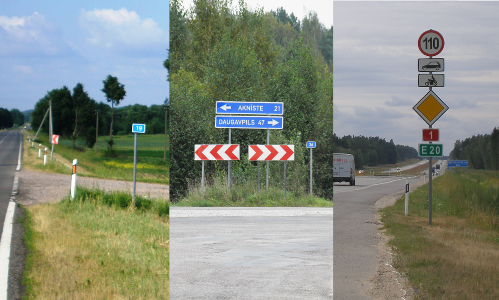

## Cara Membedakan

<blockquote class="twitter-tweet">
Ingin membedakan negara-negara Baltik hanya dengan satu gambar. <a href="https://twitter.com/hashtag/GeoGuessr?src=hash&amp;ref_src=twsrc%5Etfw">#GeoGuessr</a> <a href="https://t.co/1PMt0dzJtx">pic.twitter.com/1PMt0dzJtx</a>
&mdash; Μείνε (@meine_geo) <a href="https://twitter.com/meine_geo/status/1638018731753496577?ref_src=twsrc%5Etfw">21 Maret 2023</a></blockquote>

    <h4>Dari kiri: Lituania, Latvia, Estonia</h4>
    <ul class="rule-list">
        <li>Lituania: Bollard oranye, tanda jarak miring, chevron dengan tepi</li>
        <li>Latvia: Chevron tanpa tepi, tanda jarak sejajar dengan jalan, huruf "ī"</li>
        <li>Estonia: Tanda batas kecepatan tanpa tepi</li>
    </ul>

 

## Kesamaan di Semua Negara

{}
Bunga kecil berwarna putih
{}

{}
Di setiap negara, terutama di Estonia, terdapat locker berwarna oranye dari Omniva (Pos Estonia, Eesti Post) yang terlihat di jalan-jalan kota.
{}

<iframe src="https://www.google.com/maps/embed?pb=!4v1685698752676!6m8!1m7!1sVnxbUkw9G3aAwbUSxMrf1g!2m2!1d58.38034342209625!2d24.527033027147!3f189.1577153812799!4f0.019966513992827117!5f3.325193203789971" width="500" height="320" style="border:0;" allowfullscreen="" loading="lazy" referrerpolicy="no-referrer-when-downgrade"></iframe>

