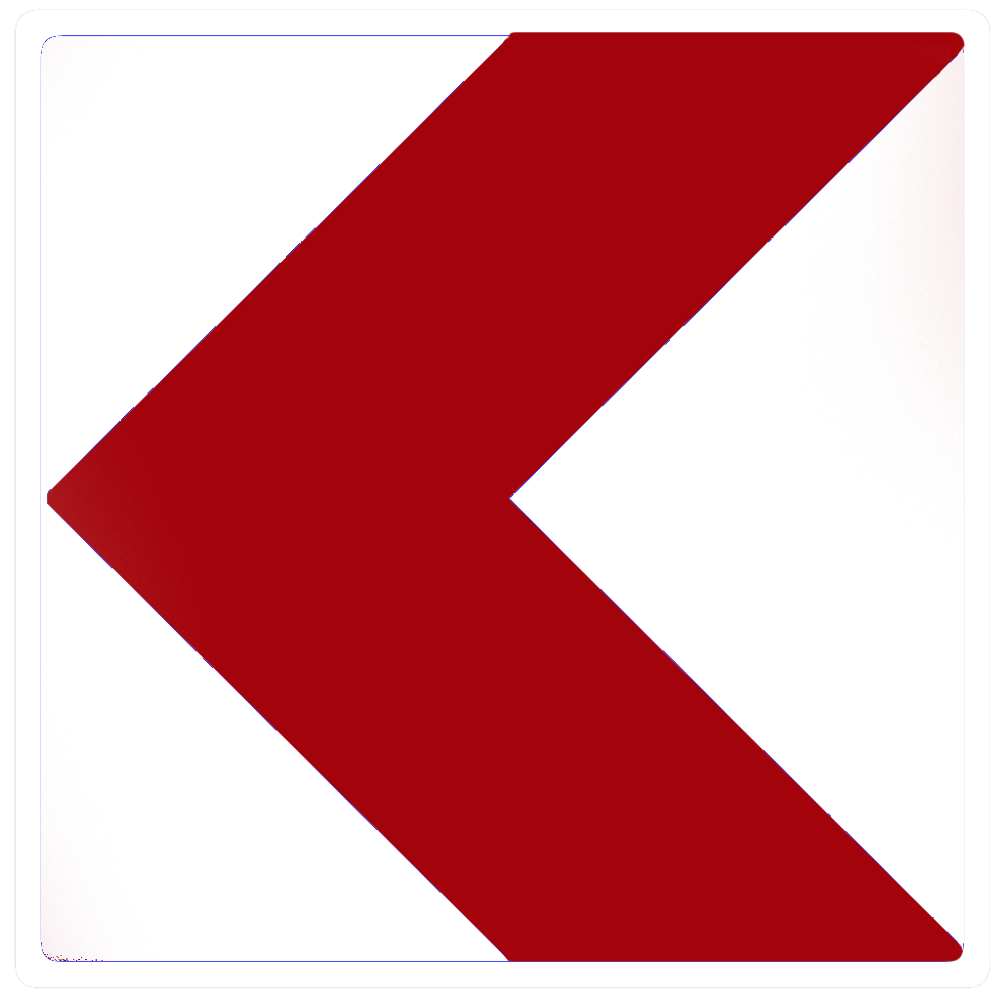

    <h2 class="section-title">{}</h2>
    <ul class="rule-list">
        <li>ドメインは.ee</li>
        <li>横断歩道は３本</li>
        <li>バスの窓が４つ</li>
        <li>標識に縁がない</li>
        <li>通り名の看板に「～tee」と書いてある</li>
        <li>数字が書かれた標識が道路に対して垂直</li>
        <li>ボラードを真上から見ると丸い</li>
        <li>ZONAの表記がエストニアのみALA</li>
        <li>{}</li>
    </ul>
    {}

{}
{}
{}
数字が書かれた標識が道路に対して垂直で数字が見やすい。ボラードを真上から見ると丸いがラトビア・リトアニアは丸くない。
{}

<iframe src="https://www.google.com/maps/embed?pb=!4v1684548865123!6m8!1m7!1ss2eRa4sqGznaQedLsvXiMQ!2m2!1d59.37685549321069!2d27.89913102016457!3f105.52049170390629!4f-7.112191365266568!5f3.325193203789971" width="295" height="295" style="border:0;" allowfullscreen="" loading="lazy" referrerpolicy="no-referrer-when-downgrade"></iframe>
<iframe src="https://www.google.com/maps/embed?pb=!4v1684548910900!6m8!1m7!1sbf96ov07ReZpD0SKEheWeA!2m2!1d59.37684172767825!2d27.89843847287929!3f166.20028344309202!4f-22.312461237142173!5f3.325193203789971" width="295" height="295" style="border:0;" allowfullscreen="" loading="lazy" referrerpolicy="no-referrer-when-downgrade"></iframe>

{}
電柱の形が特徴的。
{}

<iframe src="https://www.google.com/maps/embed?pb=!4v1684549021500!6m8!1m7!1stbZuP6koBaeDo8e3cl_DkA!2m2!1d58.93504701494305!2d23.54464915487738!3f201.21315628958942!4f12.229153390006445!5f3.325193203789971" width="295" height="295" style="border:0;" allowfullscreen="" loading="lazy" referrerpolicy="no-referrer-when-downgrade"></iframe>
<iframe src="https://www.google.com/maps/embed?pb=!4v1684549789125!6m8!1m7!1sUK09eoFtGbyzqxhEKnzbMA!2m2!1d58.82859579738559!2d22.77281356132972!3f222.06544992607115!4f35.6061724790744!5f3.325193203789971" width="295" height="295" style="border:0;" allowfullscreen="" loading="lazy" referrerpolicy="no-referrer-when-downgrade"></iframe>

{}
横断歩道は３本で標識に縁がない。斜めから見ると外側の厚みが縁にも見えるので注意する。縁だけ比較した下の図は左からエストニア・ラトビア・リトアニア。
{}

<iframe src="https://www.google.com/maps/embed?pb=!4v1684549238949!6m8!1m7!1s4W9cFaQMc_ek9GGig9Phcw!2m2!1d58.35948426936434!2d24.57032239016301!3f166.07829051421828!4f6.553574384305179!5f3.325193203789971" width="295" height="295" style="border:0;" allowfullscreen="" loading="lazy" referrerpolicy="no-referrer-when-downgrade"></iframe>
<iframe src="https://www.google.com/maps/embed?pb=!4v1684549427861!6m8!1m7!1sZQzayB7wC0UbW2V1waLYSg!2m2!1d58.38554624317938!2d26.7243602941676!3f49.48841726999512!4f0.30752187369996875!5f3.0892742262860935" width="295" height="295" style="border:0;" allowfullscreen="" loading="lazy" referrerpolicy="no-referrer-when-downgrade"></iframe>

{}
オレンジ色の「EESTI POST（現Omniva社）」と書かれたポストがある。ロッカータイプはバルト三国全体にあるけれどポストは他の国に少ない気がする。参考として右はラトビアの郵便会社のポスト。
{}

{}
シェブロンが赤色の背景なのはバルト三国ではエストニアだけ{}。右ふたつはラトビアとリトアニア。
{}

{}
{}
{}
エストニア発のユニコーン、BOLTの車を見かけるかもしれない。ただしBoltの車はラトビアなどでも見かける。
{}

<iframe src="https://www.google.com/maps/embed?pb=!4v1685192555626!6m8!1m7!1sBhGvr1FQ-BFtvlK7Z0QBXA!2m2!1d59.43305375768256!2d24.74544828658941!3f185.63236484192078!4f-6.356764414259473!5f3.325193203789971" width="400" height="250" style="border:0;" allowfullscreen="" loading="lazy" referrerpolicy="no-referrer-when-downgrade"></iframe>

{}
{}
