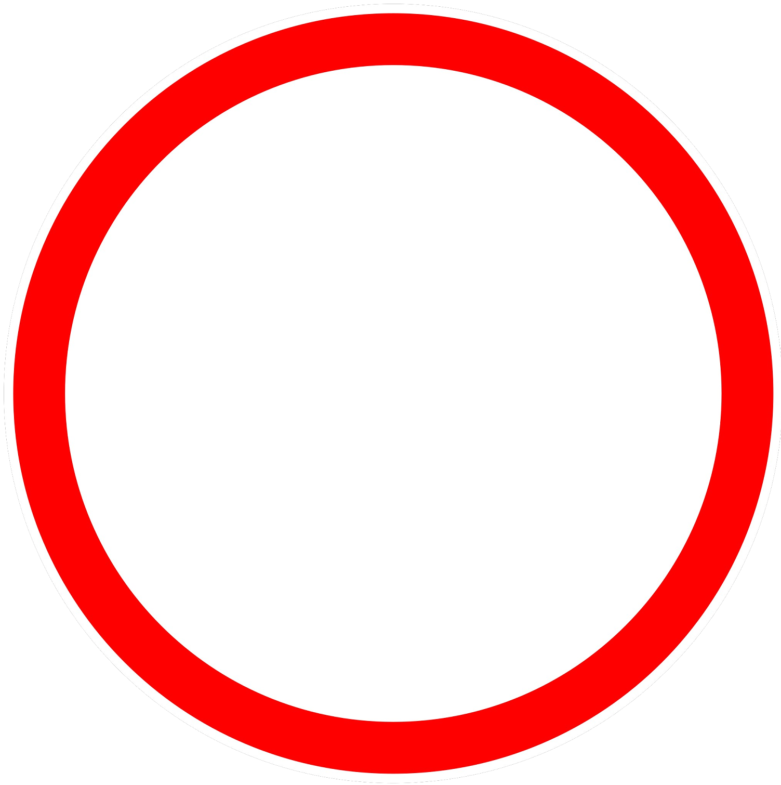

    <h2 class="section-title">{}</h2>
    <ul class="rule-list">
        <li>ドメインは.ee</li>
        <li>横断歩道は３本</li>
        <li>バスの窓が４つ</li>
        <li>標識に縁がない</li>
        <li>通り名の看板に「～tee」と書いてある</li>
        <li>数字が書かれた標識が道路に対して垂直</li>
        <li>ボラードを真上から見ると丸い</li>
        <li>ZONAの表記がエストニアのみALA</li>
        <li>{}</li>
    </ul>
    {}

{}
{}
{}
数字が書かれた標識が道路に対して垂直で数字が見やすい。ボラードを真上から見ると丸いがラトビア・リトアニアは丸くない。
{}

<iframe src="https://www.google.com/maps/embed?pb=!4v1684548865123!6m8!1m7!1ss2eRa4sqGznaQedLsvXiMQ!2m2!1d59.37685549321069!2d27.89913102016457!3f105.52049170390629!4f-7.112191365266568!5f3.325193203789971" width="295" height="295" style="border:0;" allowfullscreen="" loading="lazy" referrerpolicy="no-referrer-when-downgrade"></iframe>
<iframe src="https://www.google.com/maps/embed?pb=!4v1689164219918!6m8!1m7!1sDjT-SaPbfiSX9J-KU32QvA!2m2!1d58.90230248324077!2d22.78975689759678!3f0.49609568359306877!4f-3.5385327151698647!5f3.325193203789971"width="295" height="295" style="border:0;" allowfullscreen="" loading="lazy" referrerpolicy="no-referrer-when-downgrade"></iframe>

{}
横断歩道は３本で標識に縁がない。ZONEの表記は『ALA』。縁だけ比較した下の図は左からエストニア・ラトビア・リトアニア。
{}

{}
オレンジ色の「EESTI POST（現Omniva社）」と書かれたポストがある。
{}

{}
シェブロンが赤色の背景なのはバルト三国ではエストニアだけ{}。右ふたつはラトビアとリトアニア。
{}

{}
{}
{}
電柱の形が特徴的。
{}

<iframe src="https://www.google.com/maps/embed?pb=!4v1684549021500!6m8!1m7!1stbZuP6koBaeDo8e3cl_DkA!2m2!1d58.93504701494305!2d23.54464915487738!3f201.21315628958942!4f12.229153390006445!5f3.325193203789971" width="295" height="295" style="border:0;" allowfullscreen="" loading="lazy" referrerpolicy="no-referrer-when-downgrade"></iframe>
<iframe src="https://www.google.com/maps/embed?pb=!4v1684549789125!6m8!1m7!1sUK09eoFtGbyzqxhEKnzbMA!2m2!1d58.82859579738559!2d22.77281356132972!3f222.06544992607115!4f35.6061724790744!5f3.325193203789971" width="295" height="295" style="border:0;" allowfullscreen="" loading="lazy" referrerpolicy="no-referrer-when-downgrade"></iframe>

{}
{}
{}
エストニア発のユニコーン、BOLTの車を見かけるかもしれない。ただしBoltの車はラトビアなどでも見かける。
{}

<iframe src="https://www.google.com/maps/embed?pb=!4v1685192555626!6m8!1m7!1sBhGvr1FQ-BFtvlK7Z0QBXA!2m2!1d59.43305375768256!2d24.74544828658941!3f185.63236484192078!4f-6.356764414259473!5f3.325193203789971" width="400" height="250" style="border:0;" allowfullscreen="" loading="lazy" referrerpolicy="no-referrer-when-downgrade"></iframe>

{}
{}
