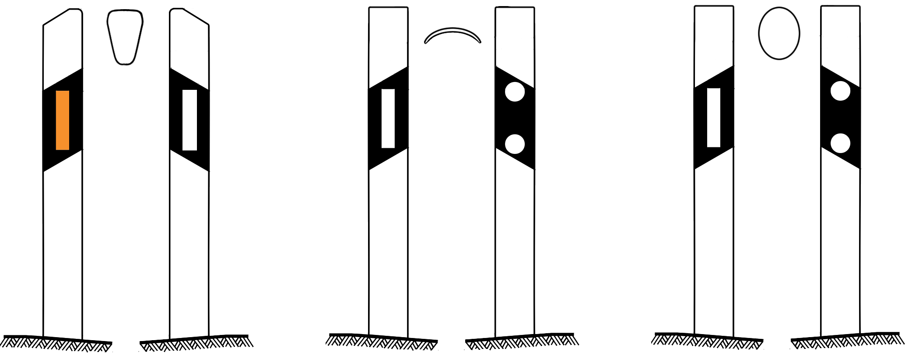

    <h2 class="section-title">{}</h2>
    <ul class="rule-list">
        <li>ドメインは.lv</li>
        <li>横断歩道は５本</li>
        <li>バスの窓が５つ</li>
        <li>標識に縁がある</li>
        <li>通り名の看板に「～iela」と書いてある</li>
        <li>数字が書かれた標識が道路に対して平行</li>
        <li>ボラードを真上から見ると）の形</li>
        <li>リトアニアと速度上限の標識などを比較したとき赤い線が太い</li>
        <li>言語に特徴がある
            <ul>
                <li>Ļ・ļの文字が特徴的 </li>
                <li>「Rīga」の「<b>ī</b>」のように母音に￣の記号が付いている </li>
                <li>Ł・łならば{}かも</li>
                <li>Ș・șならば{}かも</li>
            </ul>
        </li>
        <li>{}</li>
    </ul>
    {}
    

        
Priority road：By <a href="//commons.wikimedia.org/wiki/User:%E0%B8%A1%E0%B8%AD%E0%B8%87%E0%B9%82%E0%B8%81%E0%B9%80%E0%B8%A5%E0%B8%B5%E0%B8%A2%E0%B9%94%E0%B9%94" title="User:มองโกเลีย๔๔">มองโกเลีย๔๔</a> - Own work, <a href="https://creativecommons.org/licenses/by-sa/4.0" title="Creative Commons Attribution-Share Alike 4.0">CC BY-SA 4.0</a>, <a href="https://commons.wikimedia.org/w/index.php?curid=77591741">Link</a>

        
速度制限：By <a href="//commons.wikimedia.org/wiki/User:%E0%B8%A1%E0%B8%AD%E0%B8%87%E0%B9%82%E0%B8%81%E0%B9%80%E0%B8%A5%E0%B8%B5%E0%B8%A2%E0%B9%94%E0%B9%94" title="User:มองโกเลีย๔๔">มองโกเลีย๔๔</a> - Own work, <a href="https://creativecommons.org/licenses/by-sa/4.0" title="Creative Commons Attribution-Share Alike 4.0">CC BY-SA 4.0</a>, <a href="https://commons.wikimedia.org/w/index.php?curid=74819786">Link</a>

    

{}
{}
{}
電柱が丸いものが多く電柱の上の部分にフックみたいな形のものがついている。似たような形の電柱は{}にもある。
{}

<iframe src="https://www.google.com/maps/embed?pb=!4v1682139088680!6m8!1m7!1syCfEh53FuZQYpvPLLAM-Ig!2m2!1d56.17473944650655!2d27.20834289119661!3f356.9160279563701!4f21.77269451337706!5f3.325193203789971" width="295" height="295" style="border:0;" allowfullscreen="" loading="lazy" referrerpolicy="no-referrer-when-downgrade"></iframe>
<iframe src="https://www.google.com/maps/embed?pb=!4v1684548569834!6m8!1m7!1sGVYvMAUOXswk7Y2KshL-3g!2m2!1d57.67250500176147!2d22.32489573780233!3f326.8197589765102!4f24.038563745982486!5f3.3139613063297606" width="295" height="295" style="border:0;" allowfullscreen="" loading="lazy" referrerpolicy="no-referrer-when-downgrade"></iframe>

{}
バルト三国の中ではラトビアのみ横断歩道の線の数が５本でバスの窓も５個。そして道路の横の標識の向きが道路に平行。
{}

<iframe src="https://www.google.com/maps/embed?pb=!4v1682139835613!6m8!1m7!1sRhVGCShQ3Nh9Myo-WYpXOA!2m2!1d56.87767937065944!2d23.95010806710927!3f51.45830234076903!4f-4.1330615800655295!5f3.325193203789971" width="295" height="295" style="border:0;" allowfullscreen="" loading="lazy" referrerpolicy="no-referrer-when-downgrade"></iframe>
<iframe src="https://www.google.com/maps/embed?pb=!4v1684548682141!6m8!1m7!1sE2olbUf_MX8Dtd80USAUuw!2m2!1d57.2426324834745!2d22.58205771468572!3f47.6898017674211!4f-1.0838543320001008!5f3.293292491503678" width="295" height="295" style="border:0;" allowfullscreen="" loading="lazy" referrerpolicy="no-referrer-when-downgrade"></iframe>

{}
リトアニアと速度上限の標識などを比較したとき赤い線が太い。縁だけ比較した下の図は左からエストニア・ラトビア・リトアニア。
{}

{}
ボラードは文字が書いてあることもある。上から見ると『）』の形をしている{}。下の図は左からリトアニア・ラトビア・エストニア{}。
{}

{}
シェブロンの色や枠がバルト三国で異なる。下の図は左からエストニア・ラトビア・リトアニア{}。
{}

{}
{}
{}
<a href="https://stud.epsilon.slu.se/826/1/eriksson_a_k_100209.pdf">Phosphorus in agricultural soils around the Baltic Sea(pdf)</a>などによるとリガ周辺は川の堆積物由来、他は氷河由来？ただ色の違いは正直まだ分かっていない。
{}

<iframe src="https://www.google.com/maps/embed?pb=!4v1682140190678!6m8!1m7!1sRSoFeV2Rnih4YSbR0M4XiA!2m2!1d56.98014406078664!2d22.01722296846708!3f114.11392236176043!4f-35.11825020941185!5f3.325193203789971" width="295" height="295" style="border:0;" allowfullscreen="" loading="lazy" referrerpolicy="no-referrer-when-downgrade"></iframe>
<iframe src="https://www.google.com/maps/embed?pb=!4v1682140215518!6m8!1m7!1svV9dBp8bKeRPwCd4szCs7Q!2m2!1d57.13383281884317!2d26.67867746543939!3f150.89754495881073!4f-16.989752447124374!5f3.325193203789971" width="295" height="295" style="border:0;" allowfullscreen="" loading="lazy" referrerpolicy="no-referrer-when-downgrade"></iframe>

{}
{}