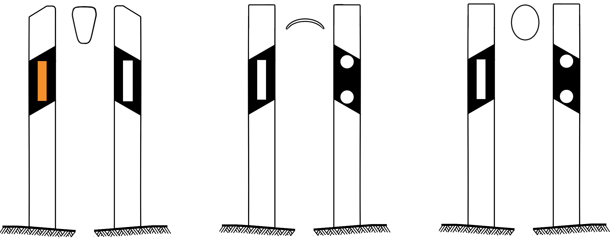
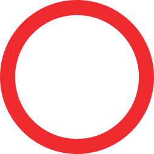
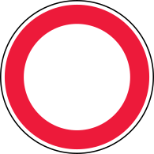
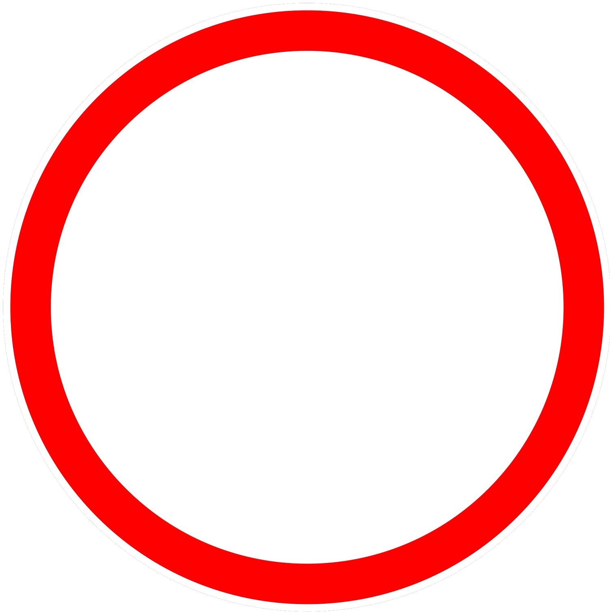
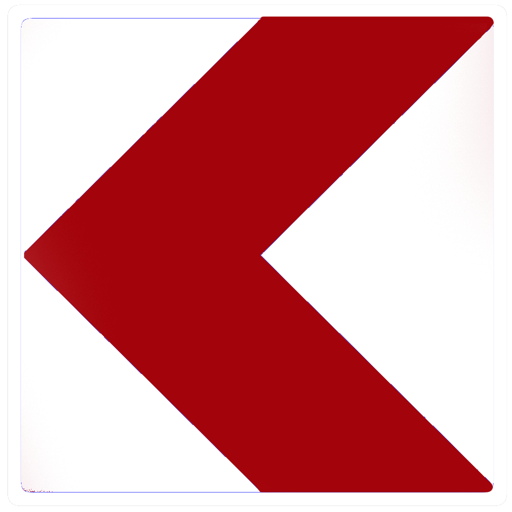
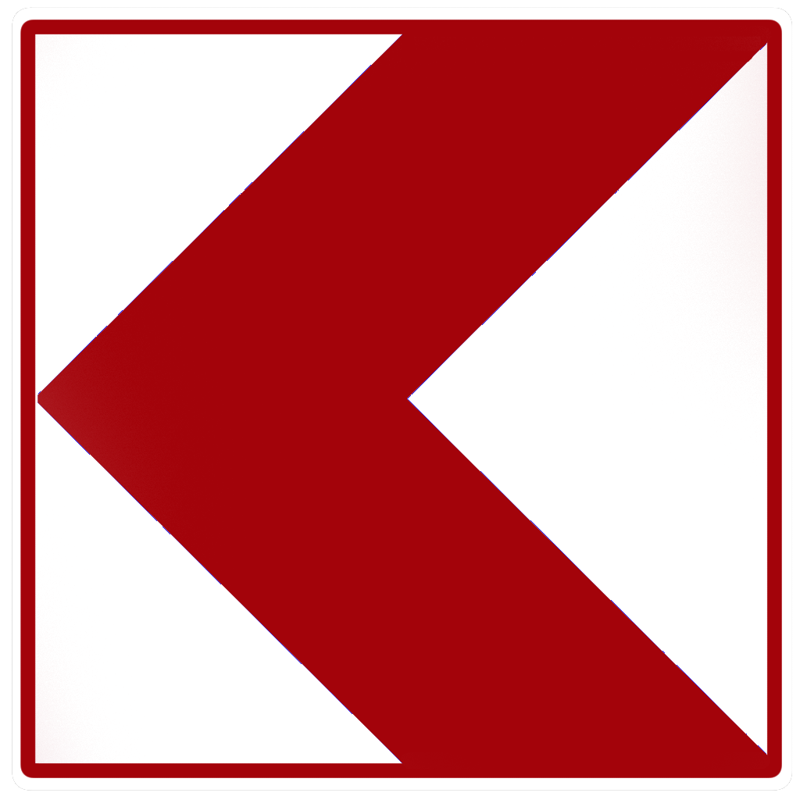

    <h2 class="section-title">{}</h2>
    <ul class="rule-list">
        <li>ドメインは.lt</li>
        <li>横断歩道は３本</li>
        <li>バスの窓が４つ</li>
        <li>標識に縁がある</li>
        <li>通り名の看板に「～g.・～tak.」と書いてある</li>
        <li>数字が書かれた標識が道路に対して斜め</li>
        <li>ボラードを真上から見るとすこし厚みがある、
        反射板がオレンジ色のものが多い</li>
        <li>ラトビアと速度上限の標識などを比較したとき赤い線が細い</li>
        <li>「Ė・ė」の文字はリトアニアの可能性が高い{{% ref "https://ja.wikipedia.org/wiki/%C4%96" "Ė" %}}</li>
        <li>{}</li>
    </ul>
    {}
    

        
速度表記：By <a href="//commons.wikimedia.org/w/index.php?title=User:Gigillo83&amp;amp;action=edit&amp;amp;redlink=1" class="new" title="User:Gigillo83 (page does not exist)">Gigillo83</a> - Own work, <a href="https://creativecommons.org/licenses/by-sa/4.0" title="Creative Commons Attribution-Share Alike 4.0">CC BY-SA 4.0</a>, <a href="https://commons.wikimedia.org/w/index.php?curid=41042874">Link</a>

        
青看板：By <a href="//commons.wikimedia.org/w/index.php?title=User:Gigillo83&amp;amp;action=edit&amp;amp;redlink=1" class="new" title="User:Gigillo83 (page does not exist)">Gigillo83</a> - Own work, <a href="https://creativecommons.org/licenses/by-sa/4.0" title="Creative Commons Attribution-Share Alike 4.0">CC BY-SA 4.0</a>, <a href="https://commons.wikimedia.org/w/index.php?curid=41564249">Link</a>

        
Priority road：By <a href="//commons.wikimedia.org/wiki/User:%D0%AE%D0%BA%D0%B0%D1%82%D0%B0%D0%BD" title="User:Юкатан">Юкатан</a> - Own work, <a href="https://creativecommons.org/licenses/by-sa/3.0" title="Creative Commons Attribution-Share Alike 3.0">CC BY-SA 3.0</a>, <a href="https://commons.wikimedia.org/w/index.php?curid=11013848">Link</a>

        
ZONA：By <a href="//commons.wikimedia.org/w/index.php?title=User:Gigillo83&amp;amp;action=edit&amp;amp;redlink=1" class="new" title="User:Gigillo83 (page does not exist)">Gigillo83</a> - Own work, <a href="https://creativecommons.org/licenses/by-sa/4.0" title="Creative Commons Attribution-Share Alike 4.0">CC BY-SA 4.0</a>, <a href="https://commons.wikimedia.org/w/index.php?curid=41046382">Link</a>

    

{}
{}

{}
ボラードにオレンジ色の反射板がある。他の国であっても色が付いた反射板が付いていることもあるが棒の形は国ごとに違う。下の図は左からリトアニア・ラトビア・エストニア{}。
{}

{}
数字が書かれた標識が道路に対して斜めになっている。横断歩道は３本で赤い標識に白色の縁があることがわかる。そして{}と比較すると赤い線が細い感じ。縁だけ比較した下の図は左からエストニア・ラトビア・リトアニア。
{}

<iframe src="https://www.google.com/maps/embed?pb=!4v1684548111398!6m8!1m7!1sX2--3B2x0ypd6wvHxwlAEw!2m2!1d55.07419832374426!2d23.88806601016458!3f269.9736975604096!4f-11.313811105808895!5f3.325193203789971" width="295" height="295" style="border:0;" allowfullscreen="" loading="lazy" referrerpolicy="no-referrer-when-downgrade"></iframe>
<iframe src="https://www.google.com/maps/embed?pb=!4v1684548291091!6m8!1m7!1sNK597vnzr5_GRD56IJm5Rw!2m2!1d55.88786437731212!2d21.23447715248939!3f4.833360311408367!4f4.567423297826153!5f3.325193203789971" width="295" height="295" style="border:0;" allowfullscreen="" loading="lazy" referrerpolicy="no-referrer-when-downgrade"></iframe>

{}
シェブロンの色や枠がバルト三国で異なる。下の図は左からエストニア・ラトビア・リトアニア{}。
{}

{}
{}
{}
電柱の形。上に鳥が巣を作れるような網が付いているタイプもある。
{}

<iframe src="https://www.google.com/maps/embed?pb=!4v1682138253548!6m8!1m7!1sNHOzDYUUQiKWwkHJ9xSQbQ!2m2!1d55.58854106587684!2d26.5763660164371!3f196.77812147844165!4f25.487494572591473!5f3.325193203789971" width="295" height="295" style="border:0;" allowfullscreen="" loading="lazy" referrerpolicy="no-referrer-when-downgrade"></iframe>
<iframe src="https://www.google.com/maps/embed?pb=!4v1682138686422!6m8!1m7!1sbpVYm1v6Af9ERWZb9qUH2Q!2m2!1d54.46618619488959!2d22.91992489201201!3f292.5696348997516!4f20.75041524949897!5f3.325193203789971" width="295" height="295" style="border:0;" allowfullscreen="" loading="lazy" referrerpolicy="no-referrer-when-downgrade"></iframe>

{}
{}

<iframe src="https://www.google.com/maps/embed?pb=!4v1682140331838!6m8!1m7!1svDkCs20AWkVEfkE9y4un6g!2m2!1d55.50626695039859!2d25.22691908450422!3f118.40489426637932!4f-13.139729046963566!5f3.095282139969689" width="295" height="295" style="border:0;" allowfullscreen="" loading="lazy" referrerpolicy="no-referrer-when-downgrade"></iframe>
<iframe src="https://www.google.com/maps/embed?pb=!4v1682140352662!6m8!1m7!1sa61trZ-I7rEfoiBvjOW7Nw!2m2!1d55.50683638407781!2d25.22743708769995!3f140.63699076018267!4f-13.755207448658382!5f3.212890433629492" width="295" height="295" style="border:0;" allowfullscreen="" loading="lazy" referrerpolicy="no-referrer-when-downgrade"></iframe>

{}
{}

