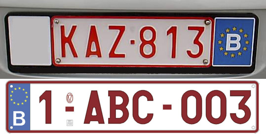

    <h2 class="section-title">{}</h2>
    <ul class="rule-list">
        <li>El dominio de nivel superior es .be</li>
        <li>Abundan los edificios de ladrillo</li>
        <li>Las matrículas usan caracteres en rojo oscuro {}</li>
        <li>Las barreras metálicas combinan bases blancas con reflectores negros rectangulares</li>
    </ul>
    {}

{}
{}

{}
La arquitectura de ladrillo es omnipresente. {} Las fotos muestran Brujas y las cuevas de Schmerling, célebres por el hallazgo de fósiles neandertales. {}
{}

{}
Las señales de paso de peatones muestran líneas discontinuas.
{}

Por <a href="//commons.wikimedia.org/wiki/User:Jeanhousen" title="User:Jeanhousen">Jean Housen</a> - Obra propia, <a href="https://creativecommons.org/licenses/by-sa/4.0" title="Creative Commons Attribution-Share Alike 4.0">CC BY-SA 4.0</a>, <a href="https://commons.wikimedia.org/w/index.php?curid=60350131">Link</a>

{}
Las matrículas belgas llevan letras rojas. {}{} A veces la borrosidad de Street View dificulta distinguirlas.
{}

{}

<a href="https://creativecommons.org/licenses/by-sa/3.0/">CC BY-SA 3.0</a>, “Matrículas de la Unión Europea” (19 de noviembre de 2022). Wikipedia en japonés.
{}

{}
Los rótulos cuadrados pequeños con esquinas redondeadas son casi exclusivos de Bélgica. {} Encontrarás también señales compactas con pictogramas de bicicletas y normas locales poco vistas fuera del país. {} En conjunto, la señalización vial belga tiene un estilo propio.
{}

{}
Los paneles suplementarios suelen ser azules. {}{{% ref "https://ja.wikipedia.org/wiki/%E6%97%A5%E6%9C%AC%E3%81%AE%E9%81%93%E8%B7%AF%E6%A8%99%E8%AD%98#%E8%A3%9C%E5%8A%A9%E6%A8%99%E8%AD%98" "Señales suplementarias (japonés)" %}}
{}

{}
Es habitual que las barreras tengan base blanca y reflector negro rectangular. {} A veces tanto la barrera como el reflector son blancos. {} Los ojos de gato aparecen en varios colores. {}
{}

{}
Muchos municipios colocan escudos en las señales de calle. {} El escudo te orienta sobre si estás en la zona neerlandófona, francófona o germanófona.
{}

{}
Se aprecian diferencias norte-sur: en Flandes predominan tejados claros y fachadas al estilo neerlandés; el sur se parece más a {} o al oeste de {} con cubiertas oscuras.
    <ul>
        <li>Sur {}</li>
        <li>Zona centro-norte {}</li>
    </ul>
{}

{}
{}

{}
{}
{}
El rojo representa Flandes (neerlandés), el gallo identifica la zona de habla francesa y el borde oriental marca el ámbito alemán.
{}

<a href="//commons.wikimedia.org/wiki/User:Lordsutch" title="User:Lordsutch">Lordsutch</a>, basado en la versión griega de <a href="//commons.wikimedia.org/wiki/User:Wikibelgiaan" title="User:Wikibelgiaan">Wikibelgiaan</a> - <a href="//commons.wikimedia.org/wiki/File:Provinces_of_Belgium_with_CoA-el.svg">File:Provinces_of_Belgium_with_CoA-el.svg</a>, 

<a href="https://creativecommons.org/licenses/by-sa/4.0" title="Creative Commons Attribution-Share Alike 4.0">CC BY-SA 4.0</a>, <a href="https://commons.wikimedia.org/w/index.php?curid=60005619">Link</a>

{}
{}
{}
Ejemplo de viviendas en el sur del país. {}
{}

 

{}
Ejemplo de viviendas en la franja central.
{}

{}
{}

    <h2 class="section-title">{}</h2>
    <ul class="rule-list">
        <li>Los rótulos de calles y plazas suelen incluir el nombre del municipio. {}</li>
    </ul>

{}
{}
{}
Los escudos son diminutos pero valiosos. En la imagen izquierda, el gallo y el texto en francés apuntan a Valonia; si identificas “Martelange” {} habrás acotado aún más la localización.
{}

{}
{}
