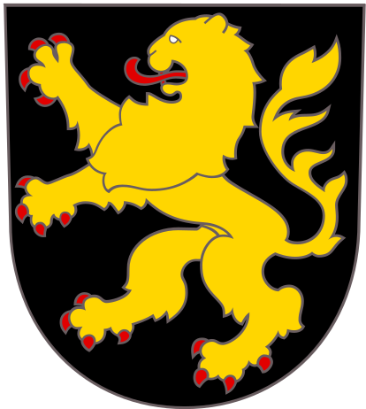
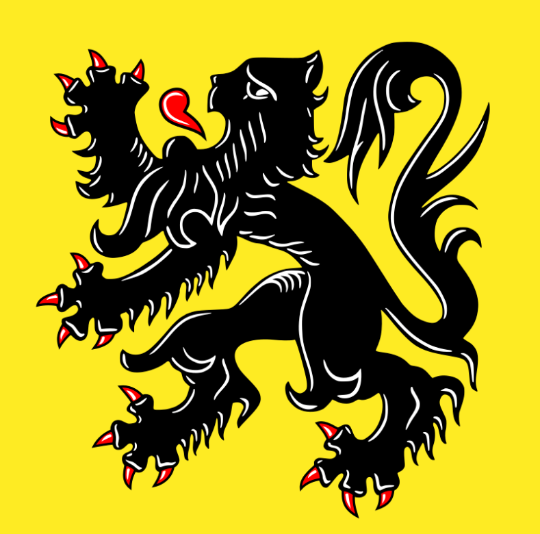

    <h2 class="section-title">{}</h2>
    <ul class="rule-list">
        <li>ドメインは.be</li>
        <li>ナンバーの文字が赤い{}</li>
    </ul>
    {}

{}
{}
{}
ナンバーの文字が赤い{}
{}

<iframe src="https://www.google.com/maps/embed?pb=!4v1680256225624!6m8!1m7!1sOcPKaqC6v7JRBmDKxtTrRA!2m2!1d49.79434639013381!2d5.648667141433947!3f54.353382109476904!4f-9.389960731050238!5f3.2156589644055837" width="295" height="295" style="border:0;" allowfullscreen="" loading="lazy" referrerpolicy="no-referrer-when-downgrade"></iframe>

{}

<a href="https://creativecommons.org/licenses/by-sa/3.0/">CC 表示-継承 3.0</a>, 欧州連合のナンバープレート. (2022, November 19). In Wikipedia. <a href="https://ja.wikipedia.org/wiki/%E6%AC%A7%E5%B7%9E%E9%80%A3%E5%90%88%E3%81%AE%E3%83%8A%E3%83%B3%E3%83%90%E3%83%BC%E3%83%97%E3%83%AC%E3%83%BC%E3%83%88">(Link)</a>
{}

{}
通り名の看板にブラバント公の紋章に似たロゴが看板に書かれているときがある{{% goto "https://ja.wikipedia.org/wiki/%E3%83%99%E3%83%AB%E3%82%AE%E3%83%BC%E3%81%AE%E5%9C%B0%E6%96%B9%E8%A1%8C%E6%94%BF%E5%8C%BA%E5%88%86" "ベルギーの地方行政区分" %}}。
{}

{}
{}

<iframe src="https://www.google.com/maps/embed?pb=!4v1680256124993!6m8!1m7!1svmqvhSd9HLrB6r6PA7Xqog!2m2!1d49.79044773689347!2d5.654705606384032!3f3.863604725031859!4f-15.345660451459963!5f3.2988817020866525" width="295" height="295" style="border:0;" allowfullscreen="" loading="lazy" referrerpolicy="no-referrer-when-downgrade"></iframe>
<iframe src="https://www.google.com/maps/embed?pb=!4v1680256143550!6m8!1m7!1sW3sCgWwt0xlody6IHlxSUA!2m2!1d49.79015602444174!2d5.654865722355849!3f183.24356725830805!4f-16.439950515467615!5f3.325193203789971" width="295" height="295" style="border:0;" allowfullscreen="" loading="lazy" referrerpolicy="no-referrer-when-downgrade"></iframe>

{}
{}

<iframe src="https://www.google.com/maps/embed?pb=!4v1680256190360!6m8!1m7!1sBrzsbaS47qe-iYiScsR5kA!2m2!1d49.79542153759303!2d5.649031676532882!3f142.52182699555263!4f-25.823480803518507!5f3.325193203789971" width="295" height="295" style="border:0;" allowfullscreen="" loading="lazy" referrerpolicy="no-referrer-when-downgrade"></iframe>

{}
{}