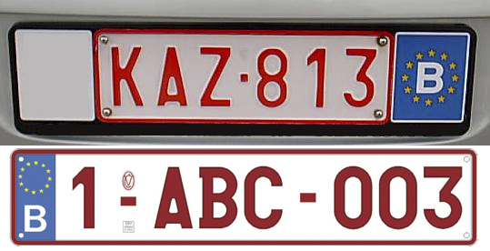

    <h2 class="section-title">{}</h2>
    <ul class="rule-list">
        <li>ドメインは.be</li>
        <li>ナンバーの文字が赤い{}</li>
        <li>白い棒に黄色の長方形の反射板があるボラード</li>
    </ul>
    {}

{}
{}
{}
ナンバーの文字が赤い{}ものがある。周りの国のナンバーも見られる。
{}

<iframe src="https://www.google.com/maps/embed?pb=!4v1686781763883!6m8!1m7!1sjGQoSMncdFmLv_X-mMRDtg!2m2!1d50.00212844820196!2d5.717291282505589!3f259.8504663401784!4f-3.2784055178747877!5f1.8828745806696512" width="500" height="250" style="border:0;" allowfullscreen="" loading="lazy" referrerpolicy="no-referrer-when-downgrade"></iframe>

{}

<a href="https://creativecommons.org/licenses/by-sa/3.0/">CC 表示-継承 3.0</a>, 欧州連合のナンバープレート. (2022, November 19). In Wikipedia. <a href="https://ja.wikipedia.org/wiki/%E6%AC%A7%E5%B7%9E%E9%80%A3%E5%90%88%E3%81%AE%E3%83%8A%E3%83%B3%E3%83%90%E3%83%BC%E3%83%97%E3%83%AC%E3%83%BC%E3%83%88">(Link)</a>
{}

{}
通り名の看板にブラバント公の紋章に似たロゴが看板に書かれているときがある{{% ref "https://ja.wikipedia.org/wiki/%E3%83%99%E3%83%AB%E3%82%AE%E3%83%BC%E3%81%AE%E5%9C%B0%E6%96%B9%E8%A1%8C%E6%94%BF%E5%8C%BA%E5%88%86" "ベルギーの地方行政区分" %}}。
{}

{}
{}
{}
白い棒に黄色の長方形の反射板があるボラード
{}

<iframe src="https://www.google.com/maps/embed?pb=!4v1680256124993!6m8!1m7!1svmqvhSd9HLrB6r6PA7Xqog!2m2!1d49.79044773689347!2d5.654705606384032!3f3.863604725031859!4f-15.345660451459963!5f3.2988817020866525" width="295" height="295" style="border:0;" allowfullscreen="" loading="lazy" referrerpolicy="no-referrer-when-downgrade"></iframe>
<iframe src="https://www.google.com/maps/embed?pb=!4v1680256143550!6m8!1m7!1sW3sCgWwt0xlody6IHlxSUA!2m2!1d49.79015602444174!2d5.654865722355849!3f183.24356725830805!4f-16.439950515467615!5f3.325193203789971" width="295" height="295" style="border:0;" allowfullscreen="" loading="lazy" referrerpolicy="no-referrer-when-downgrade"></iframe>

{}
{}

<iframe src="https://www.google.com/maps/embed?pb=!4v1680256190360!6m8!1m7!1sBrzsbaS47qe-iYiScsR5kA!2m2!1d49.79542153759303!2d5.649031676532882!3f142.52182699555263!4f-25.823480803518507!5f3.325193203789971" width="295" height="295" style="border:0;" allowfullscreen="" loading="lazy" referrerpolicy="no-referrer-when-downgrade"></iframe>

{}
{}

    <h2 class="section-title">{}</h2>
    <ul class="rule-list">
        <li>通り名や町の境界にある看板のロゴ・使われている言語を見たら地域がわかることがある
            <ul>
                <li>北のフラマン語共同体はオランダ語を使い、ロゴにブラバント公の紋章がある</li>
                <li>南のフランス語共同体はフランス語を使い、ロゴに雄鶏の紋章がある</li>
                <li>図にはないがLiègeの最も東の地域にあるドイツ語共同体はリプアーリ語を使う{{% ref "https://ja.wikipedia.org/wiki/%E3%83%AA%E3%83%97%E3%82%A2%E3%83%BC%E3%83%AA%E8%AA%9E" "リプアーリ語" %}}</li>
                <li>{{% ref "https://ja.wikipedia.org/wiki/%E3%83%99%E3%83%AB%E3%82%AE%E3%83%BC%E3%81%AE%E5%9C%B0%E6%96%B9%E8%A1%8C%E6%94%BF%E5%8C%BA%E5%88%86" "ベルギーの地方行政区分" %}}</li>
            </ul>
        </li>
    </ul>

{}
{}
{}
オランダ語が使われていたら北へ、雄鶏が描かれたロゴがあったりフランス語が使われていたら南へ行ってみる。ドイツ語なら東の端へ。
{}

<a href="//commons.wikimedia.org/wiki/User:Lordsutch" title="User:Lordsutch">Lordsutch</a>, based on Greek version by <a href="//commons.wikimedia.org/wiki/User:Wikibelgiaan" title="User:Wikibelgiaan">Wikibelgiaan</a> - <a href="//commons.wikimedia.org/wiki/File:Provinces_of_Belgium_with_CoA-el.svg" title="File:Provinces of Belgium with CoA-el.svg">File:Provinces_of_Belgium_with_CoA-el.svg</a>, 

<a href="https://creativecommons.org/licenses/by-sa/4.0" title="Creative Commons Attribution-Share Alike 4.0">CC 表示-継承 4.0</a>, <a href="https://commons.wikimedia.org/w/index.php?curid=60005619">（Link）</a>

{}
{}